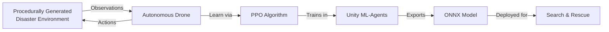
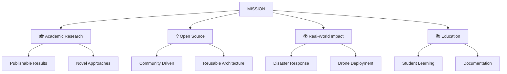
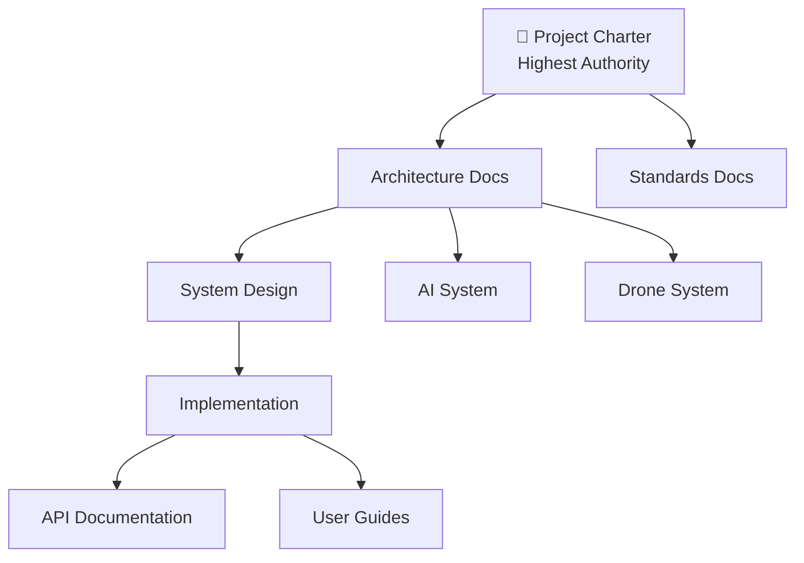
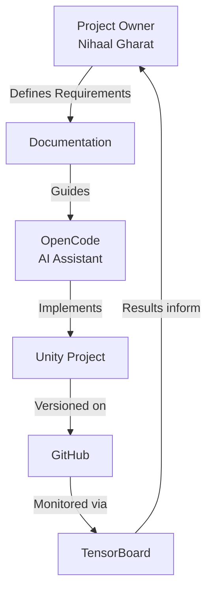

# 📜 ADRL-Rescue — Master Project Charter

> **The supreme governing document for all architectural, implementation, and documentation decisions within the ADRL-Rescue project.**

---

| Field | Value |
|:------|:------|
| **Document ID** | `DOC-000` |
| **Version** | `1.0.0` |
| **Status** | `ACTIVE` |
| **Author** | Nihaal Gharat |
| **Effective Date** | 2026-07-20 |
| **Review Cycle** | Every major release |
| **Authority Level** | HIGHEST — No document may contradict this charter |

> ⚠️ **Authority Notice**
> This charter is the single source of truth for the ADRL-Rescue project. Every future implementation, architectural decision, documentation update, and development session must conform to this document. If any future document conflicts with this charter, **this charter takes precedence** unless formally amended through the amendment process defined in Section 23.

---

## Table of Contents

| Section | Title | Page |
|:--------|:------|:-----|
| 1 | [Project Identity](#1-project-identity) | 1 |
| 2 | [Executive Summary](#2-executive-summary) | 2 |
| 3 | [Problem Statement](#3-problem-statement) | 3 |
| 4 | [Mission](#4-mission) | 4 |
| 5 | [Vision](#5-vision) | 4 |
| 6 | [Project Objectives](#6-project-objectives) | 5 |
| 7 | [Project Scope](#7-project-scope) | 6 |
| 8 | [Technology Stack](#8-technology-stack) | 7 |
| 9 | [System Overview](#9-system-overview) | 9 |
| 10 | [Complete Software Architecture](#10-complete-software-architecture) | 10 |
| 11 | [Drone Architecture](#11-drone-architecture) | 12 |
| 12 | [Environment Architecture](#12-environment-architecture) | 14 |
| 13 | [Sensor Architecture](#13-sensor-architecture) | 15 |
| 14 | [AI Architecture](#14-ai-architecture) | 17 |
| 15 | [Training Pipeline](#15-training-pipeline) | 19 |
| 16 | [Folder Structure](#16-folder-structure) | 20 |
| 17 | [Documentation Standards](#17-documentation-standards) | 22 |
| 18 | [Coding Standards](#18-coding-standards) | 23 |
| 19 | [Unity Standards](#19-unity-standards) | 25 |
| 20 | [AI Development Standards](#20-ai-development-standards) | 26 |
| 21 | [Git Standards](#21-git-standards) | 27 |
| 22 | [Development Workflow](#22-development-workflow) | 28 |
| 23 | [Repository Rules](#23-repository-rules) | 29 |
| 24 | [Repository Audit Checklist](#24-repository-audit-checklist) | 30 |
| 25 | [Quality Assurance](#25-quality-assurance) | 31 |
| 26 | [Versioning Strategy](#26-versioning-strategy) | 32 |
| 28 | [Engineering Principles](#28-engineering-principles) | 34 |
| 29 | [Golden Rules](#29-golden-rules) | 35 |
| 30 | [Project Philosophy](#30-project-philosophy) | 36 |

---

# 1. Project Identity

## 1.1 Identity Table

| Property | Value |
|:---------|:------|
| **Project Name** | ADRL-Rescue |
| **Full Name** | Adaptive Autonomous Disaster Response Drone using Reinforcement Learning |
| **Tagline** | *The drone does not follow paths. It learns to find them.* |
| **Repository** | [github.com/NihaalGharat/ADRL-Rescue](https://github.com/NihaalGharat/ADRL-Rescue) |
| **Author** | Nihaal Gharat (Project Founder), Bhavya Damani (Co-Developer) |
| **Current Version** | `0.2.0` |
| **Project Status** | 🟡 Unity Foundation (v0.2.0) |
| **License** | MIT License |
| **Intended Audience** | AI researchers, robotics students, Unity developers, RL practitioners |

## 1.2 Status Definitions

| Status | Icon | Meaning |
|:-------|:-----|:--------|
| Foundation | 🟡 | Core architecture and documentation being established |
| Active Development | 🔵 | Features are being implemented |
| Training Phase | 🟣 | AI model training and evaluation |
| Release Candidate | 🟢 | Preparing for public release |
| Stable Release | ✅ | Production-ready release published |

---

# 2. Executive Summary

## 2.1 What Is ADRL-Rescue?

ADRL-Rescue is an **artificial intelligence research project** that builds an autonomous rescue drone capable of performing Search and Rescue (SAR) operations inside simulated disaster environments.

The drone does **not** follow pre-programmed paths. Instead, it **learns** how to navigate, avoid obstacles, detect victims, and complete rescue missions entirely through **Reinforcement Learning** — a type of machine learning where an agent learns by trial and error.

## 2.2 Why Does This Project Exist?

During natural disasters, rescue teams face life-threatening conditions. Time is critical. Every minute saved can mean lives rescued. Autonomous drones can:

- Reach areas too dangerous for humans
- Search continuously without fatigue
- Operate in zero-visibility conditions using thermal sensors
- Assist first responders with real-time intelligence

This project simulates such an intelligent system, training the drone inside a virtual environment before it could ever be deployed in the real world.

## 2.3 Key Differentiator

> **This is NOT a pathfinding project.**
> This is a **Reinforcement Learning** project.

The drone does not use A*, Dijkstra, or any traditional pathfinding algorithm. It discovers strategies entirely through interaction with its environment, guided by reward signals.

## 2.4 Project Summary Diagram



---

# 3. Problem Statement

## 3.1 The Real-World Problem

Natural disasters — earthquakes, floods, landslides, building collapses — cause devastating loss of life. The critical factor in survival is **time**. Victims trapped under rubble or stranded in flooded areas have a narrow window for rescue.

## 3.2 Why Current Methods Are Insufficient

| Challenge | Current Approach | Limitation |
|:----------|:-----------------|:-----------|
| Inaccessible terrain | Send human rescuers | Risk to human life |
| Time pressure | Manual searching | Too slow |
| Limited visibility | Flashlights, headlamps | Ineffective in smoke/dust |
| Exhaustion | Rotate teams | Continuous fatigue |
| Scale | More personnel | Logistical bottleneck |

## 3.3 Why Autonomous Drones?

Autonomous drones can address these challenges by operating without human pilots in dangerous zones, searching systematically with sensor arrays, working continuously without fatigue, and providing real-time intelligence to command centers.

## 3.4 Why Simulation First?

Deploying an untrained drone in a real disaster would be dangerous and irresponsible. Simulation allows the AI to:

- Train for millions of episodes without risk
- Experience scenarios that are expensive or impossible to recreate physically
- Fail safely and learn from mistakes
- Validate behavior before real-world deployment

## 3.5 Problem Statement Summary

> How can we build an autonomous drone that learns to navigate procedurally generated disaster environments, detect victims using onboard sensors, and complete search-and-rescue missions — all without pre-programmed paths — using Reinforcement Learning?

---

# 4. Mission

> **To develop an autonomous rescue drone that learns intelligent search-and-rescue behavior through Reinforcement Learning inside procedurally generated disaster environments, creating a foundation for real-world disaster response applications.**

### Mission Pillars



---

# 5. Vision

> **A future where autonomous drones can be rapidly deployed to any disaster zone, navigating unknown terrain, locating survivors, and guiding rescue teams — all powered by AI that learns rather than being programmed.**

### Vision Milestones

| Milestone | Description | Timeline |
|:----------|:------------|:---------|
| Core AI | Drone navigates single disaster type | v1.0 |
| Multi-Environment | Works across all four disaster types | v1.0 |
| Swarm Intelligence | Multiple drones collaborate | v2.0 |
| Real-World Bridge | Sim-to-real transfer capability | v3.0 |
| Field Deployment | Real drone in controlled environment | v4.0 |

---

# 6. Project Objectives

## 6.1 Technical Objectives

| ID | Objective | Success Criteria | Priority |
|:---|:----------|:-----------------|:---------|
| T1 | Implement modular drone system | All 5 subsystems operational | 🔴 High |
| T2 | Build procedural generation engine | 4 disaster types generate correctly | 🔴 High |
| T3 | Implement sensor suite | Ray, thermal, vision, collision sensors work | 🔴 High |
| T4 | Integrate ML-Agents | Agent receives observations, returns actions | 🔴 High |
| T5 | Design reward system | Agent learns within 1M steps | 🔴 High |
| T6 | Train PPO model | Model achieves >80% victim detection | 🟡 Medium |
| T7 | Export ONNX model | Model runs in inference mode | 🟡 Medium |
| T8 | Achieve 30+ FPS | Smooth simulation performance | 🟡 Medium |

## 6.2 Academic Objectives

| ID | Objective | Deliverable |
|:---|:----------|:------------|
| A1 | Document architecture professionally | Architecture documentation |
| A2 | Publishable research quality | Paper-ready results |
| A3 | Reproducible experiments | Clear training pipeline |
| A4 | Educational resource | Beginner-friendly documentation |

## 6.3 Research Objectives

| ID | Objective | Metric |
|:---|:----------|:-------|
| R1 | Generalization across environments | >70% success rate on unseen maps |
| R2 | Sample efficiency | Convergence within 2M steps |
| R3 | Reward shaping effectiveness | Monotonic improvement curve |
| R4 | Curriculum learning validation | Faster convergence vs. no curriculum |

## 6.4 Future Objectives

| ID | Objective | Target Version |
|:---|:----------|:---------------|
| F1 | Multi-agent swarm | v2.0 |
| F2 | Battery simulation | v1.1 |
| F3 | Weather effects | v1.2 |
| F4 | ROS integration | v3.0 |
| F5 | Computer vision (YOLO) | v2.1 |

---

# 7. Project Scope

## 7.1 Version 1.0 Features (In Scope)

```
┌─────────────────────────────────────────────────────────┐
│                    VERSION 1.0 SCOPE                    │
├─────────────────────────────────────────────────────────┤
│                                                         │
│  ✅  Procedural terrain generation                      │
│  ✅  Four disaster environments                         │
│  ✅  Modular drone with 5 subsystems                    │
│  ✅  Ray sensors (13 rays)                              │
│  ✅  Thermal sensor                                     │
│  ✅  Vision sensor                                      │
│  ✅  Collision detection                                │
│  ✅  PPO training via ML-Agents                         │
│  ✅  Reward system                                      │
│  ✅  ONNX model export                                  │
│  ✅  TensorBoard integration                            │
│  ✅  Basic HUD                                          │
│  ✅  Professional documentation                         │
│                                                         │
└─────────────────────────────────────────────────────────┘
```

## 7.2 Out of Scope (Not in Version 1.0)

| Feature | Reason Excluded | Target Version |
|:--------|:----------------|:---------------|
| Multi-agent swarm | Requires stable single agent first | v2.0 |
| Battery simulation | Adds complexity beyond core scope | v1.1 |
| Weather effects | Not essential for core AI training | v1.2 |
| Wind physics | Adds noise without core benefit | v1.2 |
| GPS errors | Realistic but not essential | v2.0 |
| Camera vision (YOLO) | Requires separate ML pipeline | v2.1 |
| Google Maps terrain | External API dependency | v3.0 |
| ROS integration | Requires real hardware focus | v3.0 |
| Real drone deployment | Safety and hardware requirements | v4.0 |

## 7.3 Future Features (Documented Only)

> ⚠️ These features are documented in [16_FUTURE_SCOPE.md](16_FUTURE_SCOPE.md) for reference. **Do not implement them** until the core project reaches v1.0.

---

# 8. Technology Stack

## 8.1 Complete Technology Matrix

| Technology | Version | Purpose | Selection Reason |
|:-----------|:--------|:--------|:-----------------|
| **Unity** | 2022.3 LTS | Simulation engine | Industry standard, ML-Agents support, long-term support |
| **C#** | 10.0 | Game logic | Unity's native language, strong typing, clean syntax |
| **ML-Agents** | 1.0+ | RL framework | Official Unity ML toolkit, PPO built-in |
| **Python** | 3.8+ | Model training | ML ecosystem, PyTorch integration |
| **PPO** | — | RL algorithm | Stable, sample-efficient, continuous actions |
| **ONNX** | — | Model format | Cross-platform, optimized inference |
| **TensorBoard** | 2.10+ | Visualization | Real-time training metrics |
| **Git** | 2.x | Version control | Industry standard |
| **GitHub** | — | Repository hosting | Collaboration, CI/CD, community |
| **Markdown** | GFM | Documentation | Universal, GitHub-native |
| **Mermaid** | — | Diagrams | Text-based, version-controllable diagrams |

## 8.2 Technology Deep Dive

### Unity 2022.3 LTS

Unity is the simulation engine that provides physics, rendering, and scene management. The **Long Term Support (LTS)** version ensures stability and bug fixes for 2+ years.

**Why Unity over alternatives:**
- Native ML-Agents integration
- C# scripting (type-safe)
- Rich physics engine (PhysX)
- Cross-platform export
- Large community and resources

### Unity ML-Agents

ML-Agents is Unity's official machine learning toolkit. It provides:

- Python API for training
- Built-in PPO implementation
- ONNX export capability
- Environment stepping and reset
- Parallel training support

### PPO (Proximal Policy Optimization)

PPO is the reinforcement learning algorithm chosen for this project. It strikes a balance between:

- **Stability** — Prevents destructive large updates
- **Sample efficiency** — Learns from relatively few interactions
- **Simplicity** — Easier to tune than alternatives

```
PPO vs Other Algorithms:
─────────────────────────
PPO     → Stable, simple, good default ✅
TRPO    → Stable but complex
SAC     → Better exploration, harder to tune
DQN     → Discrete only (not suitable)
A2C     → Less stable than PPO
```

### ONNX (Open Neural Network Exchange)

ONNX is an open format for machine learning models. ML-Agents exports trained models as `.onnx` files that can be loaded in Unity for inference without Python.

### TensorBoard

TensorBoard provides real-time visualization of training metrics including episode rewards, losses, policy entropy, and value estimates.

---

# 9. System Overview

The ADRL-Rescue system is decomposed into five subsystems: Game Manager, Environment System, Drone System, Training System, and UI System. Each subsystem has a single responsibility and communicates through defined interfaces.

For the complete architecture, subsystem responsibilities, and inter-system communication diagrams, see [02_PROJECT_ARCHITECTURE.md](02_PROJECT_ARCHITECTURE.md).

---

# 10. Complete Software Architecture

The software architecture follows an event-driven, modular design with clear separation of concerns across five subsystems. Each subsystem is independently testable and loosely coupled through the EventBus and ServiceLocator patterns.

For detailed architecture diagrams, system states, and component relationships, see [02_PROJECT_ARCHITECTURE.md](02_PROJECT_ARCHITECTURE.md).

---

# 11. Drone Architecture

The drone system is a modular, component-based architecture composed of a DroneController that orchestrates state management, motor control, health, and energy subsystems. The drone follows an interface-first design with IMotor, INavigationSystem, and INavigationTarget abstractions.

For the complete drone architecture, component specifications, and navigation system, see [07_DRONE_SYSTEM.md](07_DRONE_SYSTEM.md).

---

# 12. Environment Architecture

The environment system manages procedurally generated disaster environments through EnvironmentManager, world objects (victims, hazards, obstacles), procedural generation rules, and scenario profiles. All environment components follow IEnvironmentObject and IWorldObject interfaces.

For the complete environment architecture, disaster types, and generation rules, see [08_ENVIRONMENT_SYSTEM.md](08_ENVIRONMENT_SYSTEM.md).

---

# 13. Sensor Architecture

> **Core Rule:** The drone only knows what its sensors detect. It never has access to ground truth.

The sensor system provides the drone with environmental perception through ray, thermal, vision, and collision sensors. Sensor data is fused into an observation vector for the AI system. Sensors are not yet implemented (pending v0.4.0).

For the complete sensor specifications, observation vector layout, and implementation details, see [09_SENSOR_SYSTEM.md](09_SENSOR_SYSTEM.md).

---

# 14. AI Architecture

The AI system uses PPO (Proximal Policy Optimization) for training. The agent receives observations from the sensor system and outputs continuous movement actions. Reward signals guide the agent toward victim discovery and rescue.

For the complete AI architecture, observation/action spaces, reward system, and PPO configuration, see [06_AI_SYSTEM.md](06_AI_SYSTEM.md) and [10_REWARD_SYSTEM.md](10_REWARD_SYSTEM.md).

---

# 15. Training Pipeline

The training pipeline connects the Unity environment through ML-Agents to a Python training script running PPO. Trained models are exported to ONNX for inference.

For the complete training pipeline, configuration, commands, and evaluation procedures, see [11_TRAINING_PIPELINE.md](11_TRAINING_PIPELINE.md).

---

# 16. Folder Structure

The repository structure is defined in [05_FOLDER_STRUCTURE.md](05_FOLDER_STRUCTURE.md).

---

# 17. Documentation Standards

## 17.1 Documentation Philosophy

> **Documentation is not secondary to code. Documentation is the foundation upon which code is built.**

Every feature begins with documentation. Architecture is defined before implementation. Design decisions are recorded before code is written.

## 17.2 Documentation Hierarchy



## 17.3 Documentation Rules

| Rule | Description |
|:-----|:------------|
| Beginner-friendly | Assume reader is an undergrad student |
| Use diagrams | Mermaid diagrams for visual explanations |
| Use tables | Structured data in table format |
| Internal links | All documents link to related documents |
| Version dated | Every document has "Last updated" |
| No jargon without definition | Define all technical terms |

## 17.4 Documentation Evolution

Documentation evolves with the project:
1. **Before implementation:** Write design docs
2. **During implementation:** Update docs as needed
3. **After implementation:** Finalize and review
4. **Each release:** Comprehensive documentation review

---

# 18. Coding Standards

All contributors must follow the project coding standards. Standards are mandatory and cover SOLID principles, naming conventions, commenting rules, and code formatting.

For the complete coding standards, see [13_CODING_STANDARDS.md](13_CODING_STANDARDS.md).

---

# 19. Unity Standards

## 19.1 Unity Version

| Property | Value |
|:---------|:------|
| Version | 2022.3 LTS |
| Render Pipeline | Built-in (default) |
| Physics Engine | PhysX |

## 19.2 Folder Structure

Follow Unity conventions:
- `Assets/Scripts/` for C# code
- `Assets/Prefabs/` for reusable GameObjects
- `Assets/Scenes/` for Unity scenes
- `Assets/Materials/` for physics materials

## 19.3 Scene Organization

| Scene | Purpose |
|:------|:--------|
| `MainMenu.unity` | Entry point |
| `TrainingScene.unity` | ML-Agents training |
| `TestScene.unity` | Manual testing |
| `DebugScene.unity` | Debug and profiling |

## 19.4 Prefab Naming

| Pattern | Example |
|:--------|:--------|
| `Drone_[Variant]` | `Drone_Primary` |
| `Environment_[Type]` | `Environment_Earthquake` |
| `Obstacle_[Type]` | `Obstacle_Rock` |
| `Victim_[State]` | `Victim_Alive` |

## 19.5 Package Dependencies

| Package | Purpose |
|:--------|:--------|
| com.unity.ml-agents | RL framework |
| com.unity.inputsystem | Modern input handling |
| com.unity.textmeshpro | UI text rendering |

---

# 20. AI Development Standards

## 20.1 The AI Must Never Cheat

> ⚠️ **Fundamental Rule:** The AI only knows what its sensors detect. It never has access to ground truth information.

| Allowed | Not Allowed |
|:--------|:------------|
| Sensor readings | Exact victim positions |
| Own position and velocity | Full environment map |
| Memory of past observations | Future obstacle positions |
| Thermal signatures | Complete building layouts |

## 20.2 No Hardcoded Paths

The drone must not follow pre-programmed waypoints or paths. All navigation behavior must be learned through reinforcement learning.

## 20.3 Procedural Environments Only

Training must occur on procedurally generated environments to prevent memorization. The AI must learn general navigation strategies, not specific map layouts.

## 20.4 Generalization First

The primary goal is generalization. A model that performs well on one specific map but fails on others is considered a failure.

---

# 21. Git Standards

All contributors must follow the project Git workflow. Pull requests are required for all changes. `main` branch is protected — only stable releases. All development happens on `develop` or feature branches and requires review before merging.

For the complete Git workflow, branching strategy, and commit conventions, see [14_GITHUB_WORKFLOW.md](14_GITHUB_WORKFLOW.md).

---

# 22. Development Workflow

## 22.1 Workflow Diagram



## 22.2 Role Responsibilities

| Role | Responsibility |
|:-----|:---------------|
| **Project Owner** | Define requirements, review output, make decisions |
| **OpenCode** | Generate documentation, implement code, run analysis |
| **GitHub** | Version control, issue tracking, releases |
| **Unity** | Simulation environment, testing, builds |
| **Python** | Training scripts, model export |

## 22.3 Development Cycle

1. **Plan:** Project owner defines feature requirements
2. **Document:** Write design documentation first
3. **Implement:** Generate or write code following documentation
4. **Test:** Verify in Unity, run training
5. **Review:** Check against charter and standards
6. **Commit:** Version control with proper messages
7. **Repeat:** Move to next feature

---

# 23. Repository Rules

## 23.1 Absolute Rules

These rules may **never** be broken:

| Rule | Description |
|:-----|:------------|
| R1 | Never delete files unnecessarily |
| R2 | Documentation first, code second |
| R3 | Keep repository always buildable |
| R4 | Professional commit messages only |
| R5 | One feature per phase |
| R6 | Never commit secrets or credentials |
| R7 | This charter is the highest authority |

## 23.2 Development Rules

| Rule | Description |
|:-----|:------------|
| R8 | Follow SOLID principles |
| R9 | One responsibility per class |
| R10 | No hardcoded paths or values |
| R11 | All environments must be procedural |
| R12 | Test before committing |
| R13 | Update documentation with code changes |
| R14 | Use semantic versioning |

## 23.3 Documentation Rules

| Rule | Description |
|:-----|:------------|
| R15 | Every document must have internal links |
| R16 | Use Mermaid diagrams for architecture |
| R17 | Use tables for structured data |
| R18 | Date every document |
| R19 | Cross-reference related documents |
| R20 | Keep language beginner-friendly |

## 23.4 Amendment Process

To amend this charter:
1. Submit a proposal as a GitHub Issue
2. Document the rationale
3. Project owner reviews
4. If approved, update charter with version bump
5. Record change in CHANGELOG

---

# 24. Repository Audit Checklist

## 24.1 Documentation Audit

| Check | Status |
|:------|:-------|
| All markdown files render correctly | ☐ |
| All internal links work | ☐ |
| All Mermaid diagrams render | ☐ |
| No duplicate documentation | ☐ |
| All documents are dated | ☐ |
| Cross-references are correct | ☐ |

## 24.2 Structure Audit

| Check | Status |
|:------|:-------|
| Folder structure matches documentation | ☐ |
| All folders have .gitkeep if empty | ☐ |
| No orphaned files | ☐ |
| Naming conventions followed | ☐ |

## 24.3 Content Audit

| Check | Status |
|:------|:-------|
| README is complete and accurate | ☐ |
| CHANGELOG is up to date | ☐ |
| CONTRIBUTING is complete | ☐ |
| LICENSE is present and correct | ☐ |
| CITATION.cff is present | ☐ |
| SECURITY.md is present | ☐ |
| CODE_OF_CONDUCT.md is present | ☐ |
| .gitignore is comprehensive | ☐ |

## 24.4 Quality Audit

| Check | Status |
|:------|:-------|
| No broken references | ☐ |
| No placeholder text remaining | ☐ |
| Consistent formatting | ☐ |
| Professional tone throughout | ☐ |
| Beginner-friendly language | ☐ |

---

# 25. Quality Assurance

## 25.1 Testing Philosophy

> **Every feature must be testable. Every test must be documented. Every documentation must be verifiable.**

## 25.2 Test Types

| Type | When | How |
|:-----|:-----|:----|
| Unit Tests | During development | NUnit in Unity |
| Integration Tests | After feature completion | System interaction tests |
| Manual Tests | Before commits | Unity Play Mode |
| Performance Tests | Before releases | Unity Profiler |

## 25.3 Definition of Done

A feature is considered **done** when:

- [ ] Code follows all coding standards
- [ ] Unit tests are written and passing
- [ ] Documentation is updated
- [ ] No regression in existing features
- [ ] Performance meets targets
- [ ] Code review completed
- [ ] Commit follows convention
- [ ] Charter compliance verified

---

# 26. Versioning Strategy

**Current Version:** v0.2.0 (Unity Foundation)

For the full version history, completed releases, and planned milestones, see [CHANGELOG.md](../CHANGELOG.md). CHANGELOG is the single source of truth for all releases.

---

# 28. Engineering Principles

## ADRL Engineering Principles

These principles guide every architectural and implementation decision in the project.

| # | Principle | Description |
|:--|:----------|:------------|
| 1 | **The AI Never Cheats** | The drone only knows what its sensors detect. No ground truth. No作弊. |
| 2 | **Everything Is Modular** | Each system is independent. Changes to one system don't break others. |
| 3 | **One Responsibility Per Class** | Each class does exactly one thing and does it well. |
| 4 | **Documentation First** | Design before implementation. Document before code. |
| 5 | **Architecture Before Implementation** | Define the system before building it. |
| 6 | **Never Sacrifice Maintainability** | Clean code is more important than clever code. |
| 7 | **Prefer Simplicity** | The simplest solution that works is the best solution. |
| 8 | **Procedural Over Handcrafted** | Generate environments, don't manually create them. |
| 9 | **Generalization Over Memorization** | The AI must work everywhere, not just one map. |
| 10 | **Reproducibility Matters** | Any experiment must be reproducible by others. |
| 11 | **Security By Design** | Never commit secrets. Always use .gitignore. |
| 12 | **Community First** | Build for others to contribute and learn. |

---

# 29. Golden Rules

> **The 10 Golden Rules of ADRL-Rescue**
> These rules are inviolable. Every contributor, every session, every decision must honor them.

```
╔══════════════════════════════════════════════════════════════╗
║                    🏆 THE GOLDEN RULES 🏆                    ║
╠══════════════════════════════════════════════════════════════╣
║                                                              ║
║  1.  Documentation is the foundation, not an afterthought.   ║
║                                                              ║
║  2.  The AI learns. It is never programmed to rescue.        ║
║                                                              ║
║  3.  Every environment must be procedurally generated.       ║
║                                                              ║
║  4.  The drone only knows what its sensors tell it.          ║
║                                                              ║
║  5.  One class, one responsibility. Always.                  ║
║                                                              ║
║  6.  If it's not documented, it doesn't exist.               ║
║                                                              ║
║  7.  Simplicity beats cleverness. Every time.                ║
║                                                              ║
║  8.  The repository must always be in a buildable state.     ║
║                                                              ║
║  9.  Never commit secrets. Never.                            ║
║                                                              ║
║  10. This charter is the law. No exceptions.                 ║
║                                                              ║
╚══════════════════════════════════════════════════════════════╝
```

---

# 30. Project Philosophy

## The ADRL Philosophy

> **We do not build drones that follow instructions.**
> **We build systems that learn to make decisions.**
>
> **We do not program rescue behavior.**
> **We create conditions where rescue behavior emerges.**
>
> **We do not handcraft environments.**
> **We generate worlds that challenge intelligence.**
>
> **The drone that learns to navigate rubble is more valuable than the drone that memorizes a map.**
> **The system that generalizes is more powerful than the system that specializes.**
> **The architecture that endures is more important than the code that works today.**

## Our Creed

```
┌────────────────────────────────────────────────────────────┐
│                                                            │
│   "The drone should not be programmed to rescue people.    │
│                                                            │
│    It should learn how to rescue people.                   │
│                                                            │
│    And when it does, it will teach us something            │
│    about intelligence itself."                             │
│                                                            │
│                        — ADRL-Rescue Project Philosophy    │
│                                                            │
└────────────────────────────────────────────────────────────┘
```

---

## Document Control

| Property | Value |
|:---------|:------|
| Document ID | DOC-000 |
| Version | 1.0.0 |
| Author | Nihaal Gharat (Project Founder), Bhavya Damani (Co-Developer) |
| Created | 2026-07-20 |
| Last Modified | 2026-07-20 |
| Next Review | v1.0.0 Release |
| Status | ✅ ACTIVE |

---

## 29. Documentation Freeze Policy

### Documentation Freeze

| Field | Value |
|:------|:-------|
| **Version** | v0.2.0 |
| **Status** | Frozen |
| **Effective Date** | 2026-07-23 |

The ADRL-Rescue documentation suite has been fully synchronized and is considered internally consistent.

From this version onward:

- Repository-wide documentation synchronization is complete.
- Structural documentation refactoring is no longer permitted as part of normal development.
- Each document is the sole authority for its assigned topic.
- Future documentation updates must accompany implementation work and be limited to the authoritative document for the affected topic.
- Cross-document consistency must be preserved through references rather than duplicated content.
- Repository-wide synchronization should only be performed after a significant architectural migration or governance revision.
- CHANGELOG.md remains the authoritative source for release history.
- 00_PROJECT_CHARTER.md remains the authoritative governance document.
- All future documentation changes must comply with Constitution v4.1.

*This policy establishes the documentation baseline for all development beginning with v0.2.0.*

---

## Navigation

| Document | Description | Link |
|:---------|:------------|:-----|
| README | Project landing page | [README.md](../README.md) |
| Project Vision | Goals and vision | [01_PROJECT_VISION.md](01_PROJECT_VISION.md) |
| Architecture | System architecture | [02_PROJECT_ARCHITECTURE.md](02_PROJECT_ARCHITECTURE.md) |
| System Design | Detailed design | [03_SYSTEM_DESIGN.md](03_SYSTEM_DESIGN.md) |
| Development Roadmap | Timeline | [04_DEVELOPMENT_ROADMAP.md](04_DEVELOPMENT_ROADMAP.md) |
| Folder Structure | Repository organization | [05_FOLDER_STRUCTURE.md](05_FOLDER_STRUCTURE.md) |
| AI System | AI details | [06_AI_SYSTEM.md](06_AI_SYSTEM.md) |
| Drone System | Drone details | [07_DRONE_SYSTEM.md](07_DRONE_SYSTEM.md) |
| Environment System | Environment details | [08_ENVIRONMENT_SYSTEM.md](08_ENVIRONMENT_SYSTEM.md) |
| Sensor System | Sensor specs | [09_SENSOR_SYSTEM.md](09_SENSOR_SYSTEM.md) |
| Reward System | Reward design | [10_REWARD_SYSTEM.md](10_REWARD_SYSTEM.md) |
| Training Pipeline | Training workflow | [11_TRAINING_PIPELINE.md](11_TRAINING_PIPELINE.md) |
| Data Flow | Data flow diagrams | [12_DATA_FLOW.md](12_DATA_FLOW.md) |
| Coding Standards | Code conventions | [13_CODING_STANDARDS.md](13_CODING_STANDARDS.md) |
| GitHub Workflow | Git workflow | [14_GITHUB_WORKFLOW.md](14_GITHUB_WORKFLOW.md) |
| Testing Guide | Testing procedures | [15_TESTING_GUIDE.md](15_TESTING_GUIDE.md) |
| Future Scope | Future features | [16_FUTURE_SCOPE.md](16_FUTURE_SCOPE.md) |
| Glossary | Terminology | [PROJECT_GLOSSARY.md](PROJECT_GLOSSARY.md) |

---

*This charter was established on 2026-07-20 and is effective immediately.*
*All future project decisions must conform to this document.*
*Amendments require formal approval through the process defined in Section 23.4.*
