# 📜 ADRL-Rescue — Master Project Charter

> **The supreme governing document for all architectural, implementation, and documentation decisions within the ADRL-Rescue project.**

---

| Field | Value |
|:------|:------|
| **Document ID** | `DOC-000` |
| **Version** | `1.0.0` |
| **Status** | `ACTIVE` |
| **Author** | Nihaal Gharat |
| **Effective Date** | 2026-07-20 |
| **Review Cycle** | Every major release |
| **Authority Level** | HIGHEST — No document may contradict this charter |

> ⚠️ **Authority Notice**
> This charter is the single source of truth for the ADRL-Rescue project. Every future implementation, architectural decision, documentation update, and development session must conform to this document. If any future document conflicts with this charter, **this charter takes precedence** unless formally amended through the amendment process defined in Section 23.

---

## Table of Contents

| Section | Title | Page |
|:--------|:------|:-----|
| 1 | [Project Identity](#1-project-identity) | 1 |
| 2 | [Executive Summary](#2-executive-summary) | 2 |
| 3 | [Problem Statement](#3-problem-statement) | 3 |
| 4 | [Mission](#4-mission) | 4 |
| 5 | [Vision](#5-vision) | 4 |
| 6 | [Project Objectives](#6-project-objectives) | 5 |
| 7 | [Project Scope](#7-project-scope) | 6 |
| 8 | [Technology Stack](#8-technology-stack) | 7 |
| 9 | [System Overview](#9-system-overview) | 9 |
| 10 | [Complete Software Architecture](#10-complete-software-architecture) | 10 |
| 11 | [Drone Architecture](#11-drone-architecture) | 12 |
| 12 | [Environment Architecture](#12-environment-architecture) | 14 |
| 13 | [Sensor Architecture](#13-sensor-architecture) | 15 |
| 14 | [AI Architecture](#14-ai-architecture) | 17 |
| 15 | [Training Pipeline](#15-training-pipeline) | 19 |
| 16 | [Folder Structure](#16-folder-structure) | 20 |
| 17 | [Documentation Standards](#17-documentation-standards) | 22 |
| 18 | [Coding Standards](#18-coding-standards) | 23 |
| 19 | [Unity Standards](#19-unity-standards) | 25 |
| 20 | [AI Development Standards](#20-ai-development-standards) | 26 |
| 21 | [Git Standards](#21-git-standards) | 27 |
| 22 | [Development Workflow](#22-development-workflow) | 28 |
| 23 | [Repository Rules](#23-repository-rules) | 29 |
| 24 | [Repository Audit Checklist](#24-repository-audit-checklist) | 30 |
| 25 | [Quality Assurance](#25-quality-assurance) | 31 |
| 26 | [Versioning Strategy](#26-versioning-strategy) | 32 |
| 27 | [Future Roadmap](#27-future-roadmap) | 33 |
| 28 | [Engineering Principles](#28-engineering-principles) | 34 |
| 29 | [Golden Rules](#29-golden-rules) | 35 |
| 30 | [Project Philosophy](#30-project-philosophy) | 36 |

---

# 1. Project Identity

## 1.1 Identity Table

| Property | Value |
|:---------|:------|
| **Project Name** | ADRL-Rescue |
| **Full Name** | Adaptive Autonomous Disaster Response Drone using Reinforcement Learning |
| **Tagline** | *The drone does not follow paths. It learns to find them.* |
| **Repository** | [github.com/NihaalGharat/ADRL-Rescue](https://github.com/NihaalGharat/ADRL-Rescue) |
| **Author** | Nihaal Gharat |
| **Current Version** | `0.1.0` |
| **Project Status** | 🟡 Foundation Phase |
| **License** | MIT License |
| **Intended Audience** | AI researchers, robotics students, Unity developers, RL practitioners |

## 1.2 Status Definitions

| Status | Icon | Meaning |
|:-------|:-----|:--------|
| Foundation | 🟡 | Core architecture and documentation being established |
| Active Development | 🔵 | Features are being implemented |
| Training Phase | 🟣 | AI model training and evaluation |
| Release Candidate | 🟢 | Preparing for public release |
| Stable Release | ✅ | Production-ready release published |

---

# 2. Executive Summary

## 2.1 What Is ADRL-Rescue?

ADRL-Rescue is an **artificial intelligence research project** that builds an autonomous rescue drone capable of performing Search and Rescue (SAR) operations inside simulated disaster environments.

The drone does **not** follow pre-programmed paths. Instead, it **learns** how to navigate, avoid obstacles, detect victims, and complete rescue missions entirely through **Reinforcement Learning** — a type of machine learning where an agent learns by trial and error.

## 2.2 Why Does This Project Exist?

During natural disasters, rescue teams face life-threatening conditions. Time is critical. Every minute saved can mean lives rescued. Autonomous drones can:

- Reach areas too dangerous for humans
- Search continuously without fatigue
- Operate in zero-visibility conditions using thermal sensors
- Assist first responders with real-time intelligence

This project simulates such an intelligent system, training the drone inside a virtual environment before it could ever be deployed in the real world.

## 2.3 Key Differentiator

> **This is NOT a pathfinding project.**
> This is a **Reinforcement Learning** project.

The drone does not use A*, Dijkstra, or any traditional pathfinding algorithm. It discovers strategies entirely through interaction with its environment, guided by reward signals.

## 2.4 Project Summary Diagram

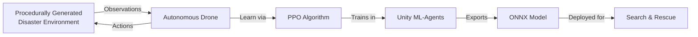

---

# 3. Problem Statement

## 3.1 The Real-World Problem

Natural disasters — earthquakes, floods, landslides, building collapses — cause devastating loss of life. The critical factor in survival is **time**. Victims trapped under rubble or stranded in flooded areas have a narrow window for rescue.

## 3.2 Why Current Methods Are Insufficient

| Challenge | Current Approach | Limitation |
|:----------|:-----------------|:-----------|
| Inaccessible terrain | Send human rescuers | Risk to human life |
| Time pressure | Manual searching | Too slow |
| Limited visibility | Flashlights, headlamps | Ineffective in smoke/dust |
| Exhaustion | Rotate teams | Continuous fatigue |
| Scale | More personnel | Logistical bottleneck |

## 3.3 Why Autonomous Drones?

Autonomous drones can address these challenges by operating without human pilots in dangerous zones, searching systematically with sensor arrays, working continuously without fatigue, and providing real-time intelligence to command centers.

## 3.4 Why Simulation First?

Deploying an untrained drone in a real disaster would be dangerous and irresponsible. Simulation allows the AI to:

- Train for millions of episodes without risk
- Experience scenarios that are expensive or impossible to recreate physically
- Fail safely and learn from mistakes
- Validate behavior before real-world deployment

## 3.5 Problem Statement Summary

> How can we build an autonomous drone that learns to navigate procedurally generated disaster environments, detect victims using onboard sensors, and complete search-and-rescue missions — all without pre-programmed paths — using Reinforcement Learning?

---

# 4. Mission

> **To develop an autonomous rescue drone that learns intelligent search-and-rescue behavior through Reinforcement Learning inside procedurally generated disaster environments, creating a foundation for real-world disaster response applications.**

### Mission Pillars

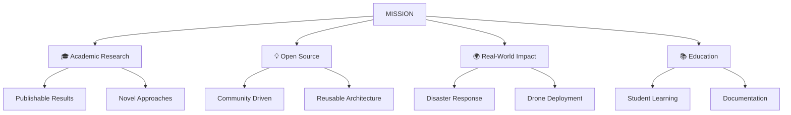

---

# 5. Vision

> **A future where autonomous drones can be rapidly deployed to any disaster zone, navigating unknown terrain, locating survivors, and guiding rescue teams — all powered by AI that learns rather than being programmed.**

### Vision Milestones

| Milestone | Description | Timeline |
|:----------|:------------|:---------|
| Core AI | Drone navigates single disaster type | v1.0 |
| Multi-Environment | Works across all four disaster types | v1.0 |
| Swarm Intelligence | Multiple drones collaborate | v2.0 |
| Real-World Bridge | Sim-to-real transfer capability | v3.0 |
| Field Deployment | Real drone in controlled environment | v4.0 |

---

# 6. Project Objectives

## 6.1 Technical Objectives

| ID | Objective | Success Criteria | Priority |
|:---|:----------|:-----------------|:---------|
| T1 | Implement modular drone system | All 5 subsystems operational | 🔴 High |
| T2 | Build procedural generation engine | 4 disaster types generate correctly | 🔴 High |
| T3 | Implement sensor suite | Ray, thermal, vision, collision sensors work | 🔴 High |
| T4 | Integrate ML-Agents | Agent receives observations, returns actions | 🔴 High |
| T5 | Design reward system | Agent learns within 1M steps | 🔴 High |
| T6 | Train PPO model | Model achieves >80% victim detection | 🟡 Medium |
| T7 | Export ONNX model | Model runs in inference mode | 🟡 Medium |
| T8 | Achieve 30+ FPS | Smooth simulation performance | 🟡 Medium |

## 6.2 Academic Objectives

| ID | Objective | Deliverable |
|:---|:----------|:------------|
| A1 | Document architecture professionally | Architecture documentation |
| A2 | Publishable research quality | Paper-ready results |
| A3 | Reproducible experiments | Clear training pipeline |
| A4 | Educational resource | Beginner-friendly documentation |

## 6.3 Research Objectives

| ID | Objective | Metric |
|:---|:----------|:-------|
| R1 | Generalization across environments | >70% success rate on unseen maps |
| R2 | Sample efficiency | Convergence within 2M steps |
| R3 | Reward shaping effectiveness | Monotonic improvement curve |
| R4 | Curriculum learning validation | Faster convergence vs. no curriculum |

## 6.4 Future Objectives

| ID | Objective | Target Version |
|:---|:----------|:---------------|
| F1 | Multi-agent swarm | v2.0 |
| F2 | Battery simulation | v1.1 |
| F3 | Weather effects | v1.2 |
| F4 | ROS integration | v3.0 |
| F5 | Computer vision (YOLO) | v2.1 |

---

# 7. Project Scope

## 7.1 Version 1.0 Features (In Scope)

```
┌─────────────────────────────────────────────────────────┐
│                    VERSION 1.0 SCOPE                    │
├─────────────────────────────────────────────────────────┤
│                                                         │
│  ✅  Procedural terrain generation                      │
│  ✅  Four disaster environments                         │
│  ✅  Modular drone with 5 subsystems                    │
│  ✅  Ray sensors (13 rays)                              │
│  ✅  Thermal sensor                                     │
│  ✅  Vision sensor                                      │
│  ✅  Collision detection                                │
│  ✅  PPO training via ML-Agents                         │
│  ✅  Reward system                                      │
│  ✅  ONNX model export                                  │
│  ✅  TensorBoard integration                            │
│  ✅  Basic HUD                                          │
│  ✅  Professional documentation                         │
│                                                         │
└─────────────────────────────────────────────────────────┘
```

## 7.2 Out of Scope (Not in Version 1.0)

| Feature | Reason Excluded | Target Version |
|:--------|:----------------|:---------------|
| Multi-agent swarm | Requires stable single agent first | v2.0 |
| Battery simulation | Adds complexity beyond core scope | v1.1 |
| Weather effects | Not essential for core AI training | v1.2 |
| Wind physics | Adds noise without core benefit | v1.2 |
| GPS errors | Realistic but not essential | v2.0 |
| Camera vision (YOLO) | Requires separate ML pipeline | v2.1 |
| Google Maps terrain | External API dependency | v3.0 |
| ROS integration | Requires real hardware focus | v3.0 |
| Real drone deployment | Safety and hardware requirements | v4.0 |

## 7.3 Future Features (Documented Only)

> ⚠️ These features are documented in [16_FUTURE_SCOPE.md](16_FUTURE_SCOPE.md) for reference. **Do not implement them** until the core project reaches v1.0.

---

# 8. Technology Stack

## 8.1 Complete Technology Matrix

| Technology | Version | Purpose | Selection Reason |
|:-----------|:--------|:--------|:-----------------|
| **Unity** | 2022.3 LTS | Simulation engine | Industry standard, ML-Agents support, long-term support |
| **C#** | 10.0 | Game logic | Unity's native language, strong typing, clean syntax |
| **ML-Agents** | 1.0+ | RL framework | Official Unity ML toolkit, PPO built-in |
| **Python** | 3.8+ | Model training | ML ecosystem, PyTorch integration |
| **PPO** | — | RL algorithm | Stable, sample-efficient, continuous actions |
| **ONNX** | — | Model format | Cross-platform, optimized inference |
| **TensorBoard** | 2.10+ | Visualization | Real-time training metrics |
| **Git** | 2.x | Version control | Industry standard |
| **GitHub** | — | Repository hosting | Collaboration, CI/CD, community |
| **Markdown** | GFM | Documentation | Universal, GitHub-native |
| **Mermaid** | — | Diagrams | Text-based, version-controllable diagrams |

## 8.2 Technology Deep Dive

### Unity 2022.3 LTS

Unity is the simulation engine that provides physics, rendering, and scene management. The **Long Term Support (LTS)** version ensures stability and bug fixes for 2+ years.

**Why Unity over alternatives:**
- Native ML-Agents integration
- C# scripting (type-safe)
- Rich physics engine (PhysX)
- Cross-platform export
- Large community and resources

### Unity ML-Agents

ML-Agents is Unity's official machine learning toolkit. It provides:

- Python API for training
- Built-in PPO implementation
- ONNX export capability
- Environment stepping and reset
- Parallel training support

### PPO (Proximal Policy Optimization)

PPO is the reinforcement learning algorithm chosen for this project. It strikes a balance between:

- **Stability** — Prevents destructive large updates
- **Sample efficiency** — Learns from relatively few interactions
- **Simplicity** — Easier to tune than alternatives

```
PPO vs Other Algorithms:
─────────────────────────
PPO     → Stable, simple, good default ✅
TRPO    → Stable but complex
SAC     → Better exploration, harder to tune
DQN     → Discrete only (not suitable)
A2C     → Less stable than PPO
```

### ONNX (Open Neural Network Exchange)

ONNX is an open format for machine learning models. ML-Agents exports trained models as `.onnx` files that can be loaded in Unity for inference without Python.

### TensorBoard

TensorBoard provides real-time visualization of training metrics including episode rewards, losses, policy entropy, and value estimates.

---

# 9. System Overview

## 9.1 Top-Level System Decomposition

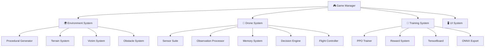

## 9.2 System Responsibilities

| System | Responsibility | Key Components |
|:-------|:---------------|:---------------|
| Game Manager | Orchestrate simulation lifecycle | Episode control, state tracking |
| Environment System | Generate and manage disaster worlds | Terrain, buildings, victims, obstacles |
| Drone System | Autonomous agent behavior | Sensors, memory, decisions, flight |
| Training System | RL training pipeline | PPO, rewards, logging, export |
| UI System | User interface and debugging | HUD, debug overlay, controls |

## 9.3 Inter-System Communication

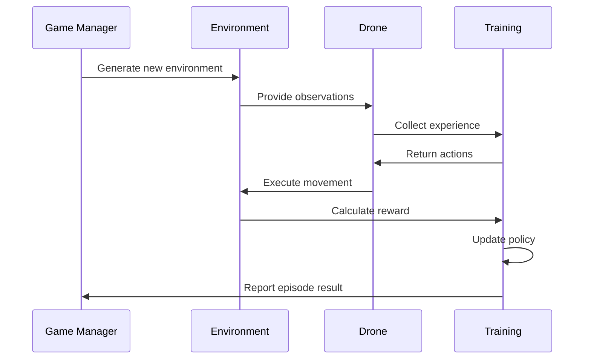

---

# 10. Complete Software Architecture

## 10.1 Game Manager

The Game Manager is the central orchestrator. It controls the simulation lifecycle.

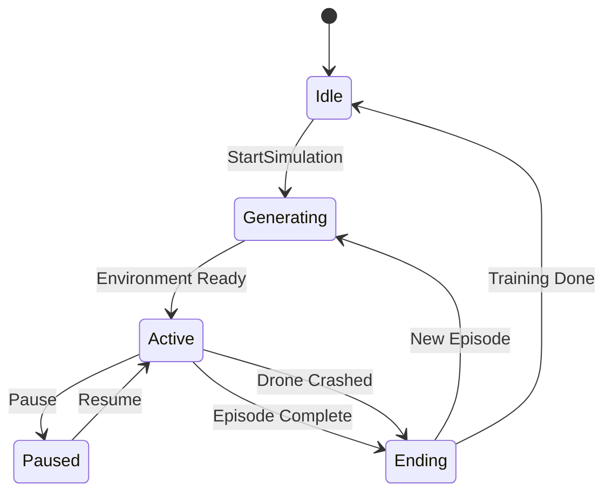

**Responsibilities:**
- Initialize and start episodes
- Track global simulation state
- Coordinate between systems
- Handle episode termination
- Manage reset and respawn

## 10.2 Environment System

Responsible for generating procedurally created disaster environments.

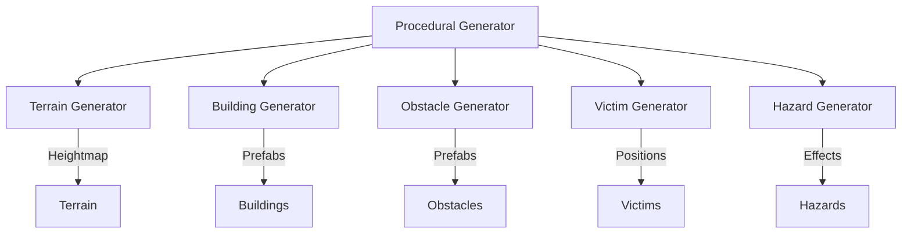

## 10.3 Drone System

The autonomous agent composed of modular subsystems.

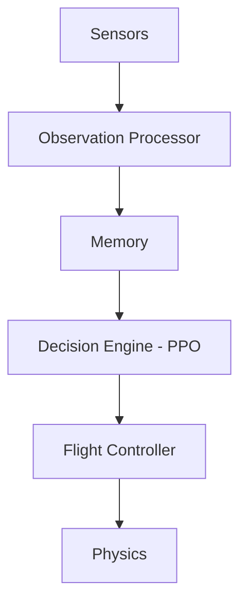

## 10.4 Training System

Manages the RL training pipeline.

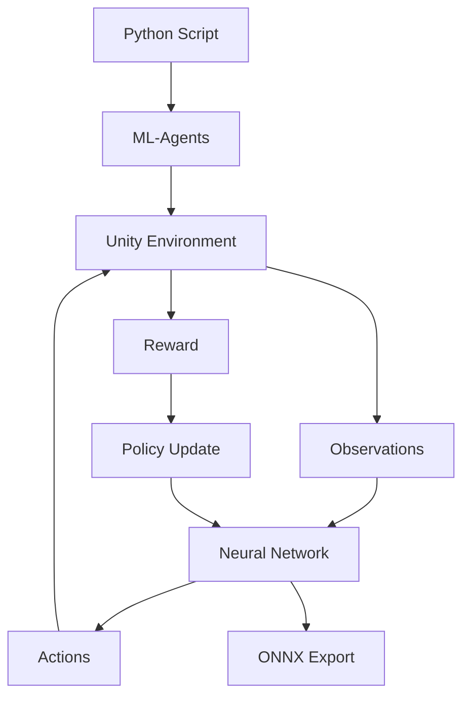

---

# 11. Drone Architecture

## 11.1 Subsystem Decomposition

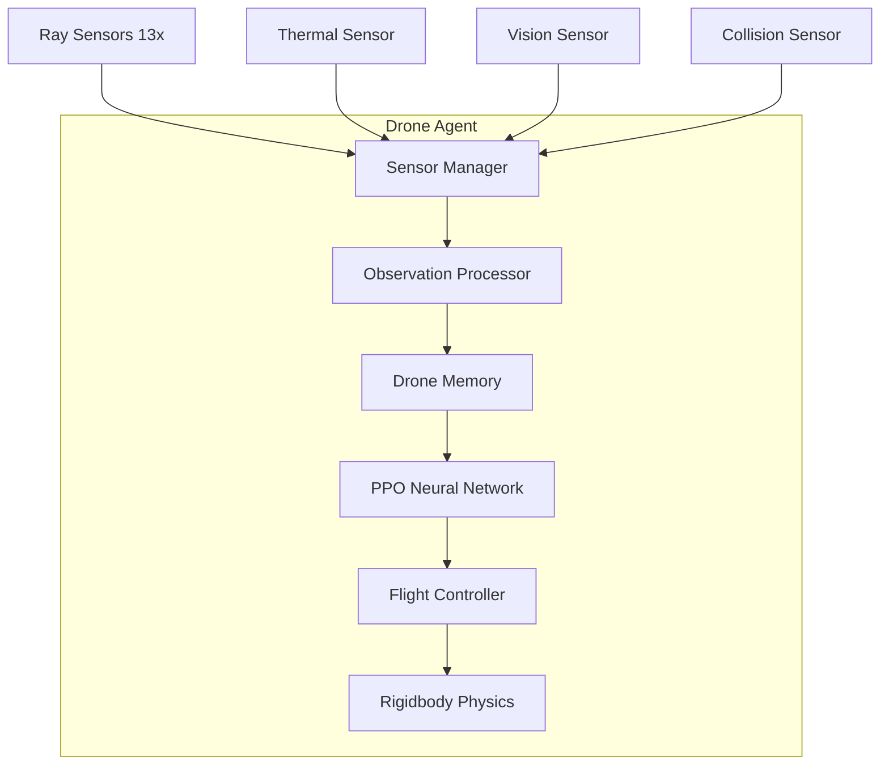

## 11.2 Flight Controller

| Property | Value | Description |
|:---------|:------|:------------|
| Mass | 2.0 kg | Lightweight for agility |
| Drag | 3.0 | Air resistance coefficient |
| Angular Drag | 5.0 | Rotation damping |
| Max Speed | 10 m/s | Velocity limit |
| Max Rotation Speed | 90°/s | Turn rate limit |

**Action Space (Continuous):**

| Action | Range | Axis | Description |
|:-------|:------|:-----|:------------|
| MoveX | [-1, 1] | X | Left/Right strafe |
| MoveY | [-1, 1] | Y | Ascend/Descend |
| MoveZ | [-1, 1] | Z | Forward/Back |
| RotateY | [-1, 1] | Y | Yaw rotation |

## 11.3 Sensor Manager

Collects and aggregates data from all onboard sensors each physics frame.

## 11.4 Observation Processor

Transforms raw sensor data into a normalized vector the neural network can process.

## 11.5 Drone Memory

Stores environmental knowledge over time:
- Visited positions
- Obstacle locations
- Victim detections
- Exploration map

## 11.6 Decision Engine

The PPO neural network that maps observations to actions.

**Network Architecture:**

| Layer | Size | Activation | Purpose |
|:------|:-----|:-----------|:--------|
| Input | 44 neurons | — | Observation vector |
| Hidden 1 | 256 neurons | ReLU | Feature extraction |
| Hidden 2 | 256 neurons | ReLU | Feature extraction |
| Output | 4 neurons | Tanh | Action commands |

## 11.7 Navigation

The drone uses its memory to track explored areas and identify unexplored regions, guiding intelligent exploration without hardcoded waypoints.

---

# 12. Environment Architecture

## 12.1 Terrain System

Procedurally generates terrain using Perlin noise with disaster-specific modifications.

| Disaster Type | Terrain Characteristics |
|:--------------|:------------------------|
| Earthquake | Uneven, cracked surface, sinkholes |
| Flood | Flat with water bodies, muddy areas |
| Landslide | Steep slopes, loose debris |
| Building Collapse | Urban terrain, rubble piles |

## 12.2 Disaster Generator

Each disaster type has unique environmental features:

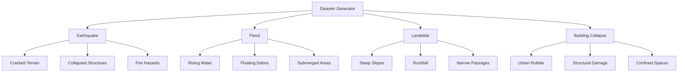

## 12.3 Victim Generator

Places victims at random valid positions within the environment.

| Property | Range | Description |
|:---------|:------|:------------|
| Health | 50–100 | Victim health points |
| Thermal Signature | 0.7–1.0 | Heat emission strength |
| Detection Radius | 10m | Sensor detection range |
| Rescue Radius | 2m | Distance required for rescue |

## 12.4 Obstacle Generator

Randomly places obstacles ensuring drone navigation is possible.

| Obstacle Type | Size | Hazard Level |
|:--------------|:-----|:-------------|
| Rocks | Small–Large | Medium |
| Trees | Medium | Low |
| Debris | Small–Medium | High |
| Rubble | Medium–Large | High |
| Vehicles | Medium | Medium |

## 12.5 Procedural Generation

Every episode creates a unique world by randomizing:
- Terrain heightmap
- Building positions and orientations
- Obstacle placement
- Victim locations
- Drone spawn point
- Hazard positions

## 12.6 Domain Randomization

Ensures the AI generalizes by varying:
- Environment size
- Obstacle density
- Victim count
- Hazard frequency
- Lighting conditions

---

# 13. Sensor Architecture

## 13.1 Sensor Overview

> **Core Rule:** The drone only knows what its sensors detect. It never has access to ground truth.

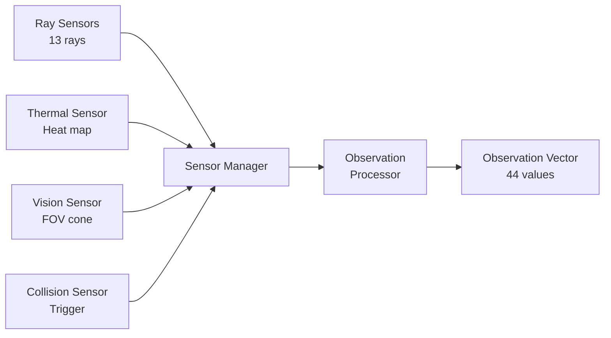

## 13.2 Ray Sensors

**Purpose:** Detect nearby obstacles and map the immediate environment.

| Property | Value |
|:---------|:------|
| Number of Rays | 13 |
| Max Distance | 10m |
| Spread Angle | 180° (forward hemisphere) |
| Layer Mask | Obstacles only |

**Ray Layout:**

```
          Ray 0 (90° Left)
           ╲
            ╲
             ╲
  Ray 3 ── Ray 6 ── Ray 9
  (45° L)  (Center)  (45° R)
             ╱
            ╱
           ╱
          Ray 12 (90° Right)
```

## 13.3 Thermal Sensor

**Purpose:** Detect body heat from victims.

| Property | Value |
|:---------|:------|
| Range | 15m |
| Field of View | 120° |
| Sensitivity | 0.7 |
| Update Frequency | 10 Hz |

**Output:** Float [0.0, 1.0] indicating thermal signature strength.

## 13.4 Vision Sensor

**Purpose:** Confirm victim presence within field of view.

| Property | Value |
|:---------|:------|
| Range | 20m |
| Field of View | 90° |
| Update Frequency | 10 Hz |

**Output:** Binary [0.0, 1.0] — victim is either in view or not.

## 13.5 Collision Detection

**Purpose:** Detect impacts with obstacles for negative reward signals.

| Property | Value |
|:---------|:------|
| Detection Radius | 0.5m |
| Trigger Mode | Yes |
| Layer Mask | Obstacles |

## 13.6 Sensor Fusion

All sensor data is combined into a single 44-element observation vector:

| Index Range | Count | Source | Description |
|:------------|:------|:-------|:------------|
| 0–2 | 3 | Position | World position (x, y, z) |
| 3–5 | 3 | Velocity | Current velocity (x, y, z) |
| 6–8 | 3 | Transform | Forward direction vector |
| 9–11 | 3 | Transform | Up direction vector |
| 12–24 | 13 | Ray Sensors | Distance to obstacles |
| 25–37 | 13 | Ray Sensors | Hit type encoding |
| 38 | 1 | Thermal | Heat signature strength |
| 39 | 1 | Vision | Victim in view |
| 40 | 1 | Physics | Current speed |
| 41–43 | 3 | Memory | Direction to nearest victim |

## 13.7 Future: Camera Vision

> ⚠️ **Not in scope for v1.0.** Future versions may integrate YOLO-based computer vision for visual victim detection and damage assessment.

---

# 14. AI Architecture

## 14.1 Observation Space

The neural network receives a 44-element float vector representing the drone's perception of the world.

**Normalization:**

| Observation | Raw Range | Normalized Range | Method |
|:------------|:----------|:-----------------|:-------|
| Position | [-50, 50] | [-1, 1] | Linear |
| Velocity | [-10, 10] | [-1, 1] | Linear |
| Ray Distance | [0, 10] | [0, 1] | Linear |
| Thermal | [0, 1] | [0, 1] | As-is |
| Vision | [0, 1] | [0, 1] | As-is |
| Speed | [0, 10] | [0, 1] | Linear |

## 14.2 Action Space

The agent outputs 4 continuous actions:

| Action | Range | Description |
|:-------|:------|:------------|
| MoveX | [-1, 1] | Left/Right strafe |
| MoveY | [-1, 1] | Ascend/Descend |
| MoveZ | [-1, 1] | Forward/Back |
| RotateY | [-1, 1] | Yaw rotation |

## 14.3 Reward System

### Positive Rewards

| Event | Reward | Purpose |
|:------|:-------|:--------|
| Victim found | +10.0 | Primary objective |
| Victim rescued | +25.0 | Mission completion |
| New area explored | +0.5 | Exploration incentive |
| Forward progress | +0.1 | Efficient movement |
| Sensor detection | +1.0 | Multi-sensor agreement |

### Negative Rewards

| Event | Reward | Purpose |
|:------|:-------|:--------|
| Collision | -5.0 | Safety |
| Out of bounds | -10.0 | Boundary respect |
| Time penalty | -0.01/step | Efficiency |
| Stuck penalty | -2.0 | Prevent stagnation |
| Repeated path | -0.5 | Efficient exploration |
| Falling | -3.0 | Altitude maintenance |

## 14.4 PPO Configuration

```yaml
trainer_type: ppo
hyperparameters:
  batch_size: 1024
  buffer_size: 10240
  learning_rate: 0.0003
  beta: 0.005
  epsilon: 0.2
  lambd: 0.95
  num_epoch: 3
  learning_rate_schedule: linear

network_settings:
  normalize: true
  hidden_units: 256
  num_layers: 2

reward_signals:
  extrinsic:
    gamma: 0.99
    strength: 1.0

max_steps: 5000000
time_horizon: 64
summary_freq: 10000
```

## 14.5 Training vs. Inference

| Mode | Input | Output | Purpose |
|:-----|:------|:-------|:--------|
| Training | Observations | Actions + Rewards | Learn policy |
| Inference | Observations | Actions only | Deploy model |

## 14.6 ONNX Export

After training completes, the model is exported as an `.onnx` file for inference in Unity without Python.

## 14.7 Generalization

The AI must generalize across:
- Different disaster types
- Randomly generated layouts
- Varying victim positions
- Different obstacle configurations

**The AI must NOT memorize specific maps.** Every episode must present a unique challenge.

---

# 15. Training Pipeline

## 15.1 End-to-End Pipeline

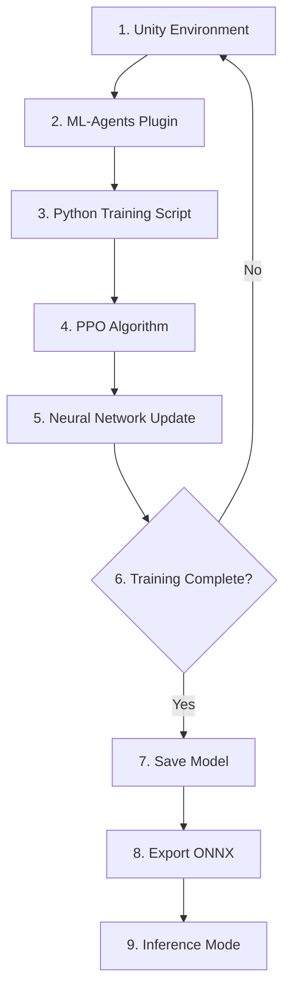

## 15.2 Pipeline Stages

| Stage | Component | Description |
|:------|:----------|:------------|
| 1 | Unity Environment | Simulation runs, generates experience |
| 2 | ML-Agents Plugin | Bridges Unity and Python |
| 3 | Python Script | Orchestrates training loop |
| 4 | PPO Algorithm | Computes policy updates |
| 5 | Network Update | Adjusts neural network weights |
| 6 | Completion Check | Evaluates if training goals met |
| 7 | Model Save | Checkpoints trained model |
| 8 | ONNX Export | Converts to deployment format |
| 9 | Inference Mode | Uses trained model without Python |

## 15.3 Training Commands

```bash
# Start training
mlagents-learn config/drone_training.yaml --run-id=drone_v1

# With Unity environment
mlagents-learn config.yaml --run-id=drone_v1 --env=./build/ADRL-Rescue

# Headless mode
mlagents-learn config.yaml --run-id=drone_v1 --no-graphics

# Monitor with TensorBoard
tensorboard --logdir=results
```

---

# 16. Folder Structure

## 16.1 Complete Repository Structure

```
ADRL-Rescue/
│
├── 📂 UnityProject/          # Unity game project
│   ├── 📂 Assets/
│   │   ├── 📂 Scripts/       # C# source code
│   │   │   ├── 📂 Core/      # Game manager, utilities
│   │   │   ├── 📂 AI/        # ML-Agents, decision making
│   │   │   ├── 📂 Drone/     # Drone behavior, flight
│   │   │   ├── 📂 Environment/ # Procedural generation
│   │   │   ├── 📂 Sensors/   # Sensor implementations
│   │   │   ├── 📂 Training/  # Reward system
│   │   │   ├── 📂 Utilities/ # Helper functions
│   │   │   └── 📂 UI/        # User interface
│   │   ├── 📂 Prefabs/       # Reusable GameObjects
│   │   ├── 📂 Materials/     # Physics materials
│   │   ├── 📂 Textures/      # Texture assets
│   │   ├── 📂 Models/        # 3D models
│   │   ├── 📂 Animations/    # Animation controllers
│   │   ├── 📂 Scenes/        # Unity scenes
│   │   ├── 📂 Settings/      # Quality settings
│   │   └── 📂 Plugins/       # Third-party plugins
│   ├── 📂 ProjectSettings/   # Unity project config
│   └── 📂 Packages/          # Package manifest
│
├── 📂 Python/                # Training scripts
│   ├── 📂 configs/           # YAML configurations
│   ├── 📂 scripts/           # Python scripts
│   ├── 📂 results/           # Training results
│   ├── 📂 logs/              # TensorBoard logs
│   └── 📂 models/            # Exported ONNX models
│
├── 📂 Documentation/         # Project documentation
│   ├── 00_PROJECT_CHARTER.md # This file
│   ├── 01_PROJECT_VISION.md
│   ├── 02_PROJECT_ARCHITECTURE.md
│   ├── 03_SYSTEM_DESIGN.md
│   └── ... (17 documentation files)
│
├── 📂 Assets/                # Static assets (icons, banners)
├── 📂 Media/                 # Screenshots, videos, GIFs
├── 📂 Research/              # Papers, notes, references
│
├── 📄 README.md              # Project landing page
├── 📄 CHANGELOG.md           # Version history
├── 📄 CONTRIBUTING.md        # Contribution guidelines
├── 📄 CODE_OF_CONDUCT.md     # Community standards
├── 📄 SECURITY.md            # Security policy
├── 📄 LICENSE                # MIT License
├── 📄 CITATION.cff           # Citation metadata
└── 📄 .gitignore             # Git ignore rules
```

## 16.2 Folder Purpose Table

| Folder | Purpose | Why It Exists |
|:-------|:--------|:--------------|
| `UnityProject/` | Main Unity project | Contains all game logic and assets |
| `Python/` | Training infrastructure | ML-Agents training runs here |
| `Documentation/` | All documentation | Single source of truth for project knowledge |
| `Assets/` | Static assets | Icons, banners for README |
| `Media/` | Visual media | Screenshots and videos for documentation |
| `Research/` | Research materials | Academic papers and notes |

---

# 17. Documentation Standards

## 17.1 Documentation Philosophy

> **Documentation is not secondary to code. Documentation is the foundation upon which code is built.**

Every feature begins with documentation. Architecture is defined before implementation. Design decisions are recorded before code is written.

## 17.2 Documentation Hierarchy

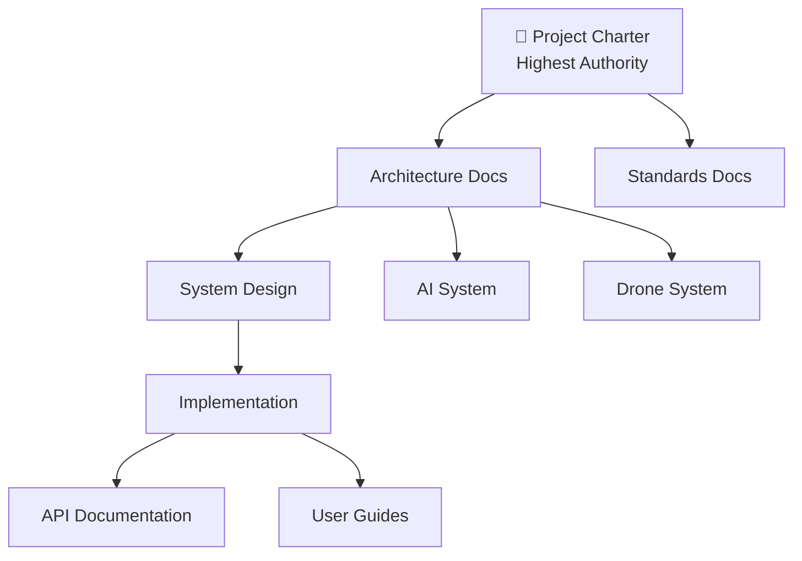

## 17.3 Documentation Rules

| Rule | Description |
|:-----|:------------|
| Beginner-friendly | Assume reader is an undergrad student |
| Use diagrams | Mermaid diagrams for visual explanations |
| Use tables | Structured data in table format |
| Internal links | All documents link to related documents |
| Version dated | Every document has "Last updated" |
| No jargon without definition | Define all technical terms |

## 17.4 Documentation Evolution

Documentation evolves with the project:
1. **Before implementation:** Write design docs
2. **During implementation:** Update docs as needed
3. **After implementation:** Finalize and review
4. **Each release:** Comprehensive documentation review

---

# 18. Coding Standards

## 18.1 Core Principles

### SOLID Principles

| Principle | Description | Example |
|:----------|:------------|:--------|
| **S**ingle Responsibility | One class, one job | `RaySensor.cs` only handles ray casting |
| **O**pen/Closed | Open for extension, closed for modification | Use interfaces for sensor types |
| **L**iskov Substitution | Subtypes must be substitutable | Any sensor implements `ISensor` |
| **I**nterface Segregation | Many specific interfaces | Separate `IDetectable` and `ICollidable` |
| **D**ependency Inversion | Depend on abstractions | Drone depends on `ISensor`, not `RaySensor` |

### DRY (Don't Repeat Yourself)

Every piece of knowledge should have a single, authoritative representation.

### KISS (Keep It Simple, Stupid)

Simple solutions are preferred over complex ones. If it's hard to explain, it's too complex.

### YAGNI (You Aren't Gonna Need It)

Don't build functionality until it's actually needed.

## 18.2 Naming Conventions

### C# Conventions

| Element | Convention | Example |
|:--------|:-----------|:--------|
| Classes | PascalCase | `DroneAgent` |
| Interfaces | I + PascalCase | `ISensor` |
| Public methods | PascalCase | `CollectObservations()` |
| Private methods | PascalCase | `ApplyStabilization()` |
| Public fields | PascalCase | `float Speed` |
| Private fields | _camelCase | `float _speed` |
| Local variables | camelCase | `float currentSpeed` |
| Parameters | camelCase | `float targetSpeed` |
| Constants | UPPER_SNAKE | `MAX_SPEED` |
| Enums | PascalCase | `DisasterType` |

### Python Conventions

| Element | Convention | Example |
|:--------|:-----------|:--------|
| Functions | snake_case | `calculate_reward()` |
| Variables | snake_case | `current_step` |
| Classes | PascalCase | `DroneTrainer` |
| Constants | UPPER_SNAKE | `MAX_EPISODES` |

## 18.3 Commenting Rules

| Situation | Action |
|:----------|:-------|
| Complex algorithm | Add explanation |
| Non-obvious logic | Add clarification |
| Public API | Add XML documentation |
| Magic numbers | Replace with named constants |
| Obvious code | Don't comment |

## 18.4 Code Formatting

- Use 4 spaces for C# indentation
- Use 4 spaces for Python indentation
- Maximum line length: 120 characters
- Use blank lines between methods
- Use regions for logical grouping in C#

---

# 19. Unity Standards

## 19.1 Unity Version

| Property | Value |
|:---------|:------|
| Version | 2022.3 LTS |
| Render Pipeline | Built-in (default) |
| Physics Engine | PhysX |

## 19.2 Folder Structure

Follow Unity conventions:
- `Assets/Scripts/` for C# code
- `Assets/Prefabs/` for reusable GameObjects
- `Assets/Scenes/` for Unity scenes
- `Assets/Materials/` for physics materials

## 19.3 Scene Organization

| Scene | Purpose |
|:------|:--------|
| `MainMenu.unity` | Entry point |
| `TrainingScene.unity` | ML-Agents training |
| `TestScene.unity` | Manual testing |
| `DebugScene.unity` | Debug and profiling |

## 19.4 Prefab Naming

| Pattern | Example |
|:--------|:--------|
| `Drone_[Variant]` | `Drone_Primary` |
| `Environment_[Type]` | `Environment_Earthquake` |
| `Obstacle_[Type]` | `Obstacle_Rock` |
| `Victim_[State]` | `Victim_Alive` |

## 19.5 Package Dependencies

| Package | Purpose |
|:--------|:--------|
| com.unity.ml-agents | RL framework |
| com.unity.inputsystem | Modern input handling |
| com.unity.textmeshpro | UI text rendering |

---

# 20. AI Development Standards

## 20.1 The AI Must Never Cheat

> ⚠️ **Fundamental Rule:** The AI only knows what its sensors detect. It never has access to ground truth information.

| Allowed | Not Allowed |
|:--------|:------------|
| Sensor readings | Exact victim positions |
| Own position and velocity | Full environment map |
| Memory of past observations | Future obstacle positions |
| Thermal signatures | Complete building layouts |

## 20.2 No Hardcoded Paths

The drone must not follow pre-programmed waypoints or paths. All navigation behavior must be learned through reinforcement learning.

## 20.3 Procedural Environments Only

Training must occur on procedurally generated environments to prevent memorization. The AI must learn general navigation strategies, not specific map layouts.

## 20.4 Generalization First

The primary goal is generalization. A model that performs well on one specific map but fails on others is considered a failure.

---

# 21. Git Standards

## 21.1 Semantic Versioning

```
MAJOR.MINOR.PATCH

MAJOR: Breaking changes
MINOR: New features (backward compatible)
PATCH: Bug fixes
```

## 21.2 Branch Strategy

```mermaid
gitgraph
    commit id: "init"
    branch develop
    checkout develop
    commit id: "drone-physics"
    branch feature/ray-sensor
    checkout feature/ray-sensor
    commit id: "ray-sensor"
    checkout develop
    merge feature/ray-sensor
    checkout main
    merge develop tag: "v0.2.0"
```

| Branch | Purpose |
|:-------|:--------|
| `main` | Stable releases only |
| `develop` | Integration branch |
| `feature/*` | New features |
| `fix/*` | Bug fixes |
| `docs/*` | Documentation |

## 21.3 Commit Message Convention

```
<type>(<scope>): <subject>

Examples:
feat(drone): add flight controller
fix(sensors): correct thermal range
docs: update README
refactor(ai): extract observation logic
```

## 21.4 Release Tags

All releases are tagged with semantic versions:
```
v0.1.0  →  Foundation
v0.2.0  →  Core Systems
v0.3.0  →  Environment
v0.4.0  →  Training
v1.0.0  →  Full Release
```

---

# 22. Development Workflow

## 22.1 Workflow Diagram

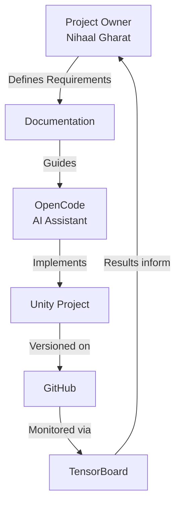

## 22.2 Role Responsibilities

| Role | Responsibility |
|:-----|:---------------|
| **Project Owner** | Define requirements, review output, make decisions |
| **OpenCode** | Generate documentation, implement code, run analysis |
| **GitHub** | Version control, issue tracking, releases |
| **Unity** | Simulation environment, testing, builds |
| **Python** | Training scripts, model export |

## 22.3 Development Cycle

1. **Plan:** Project owner defines feature requirements
2. **Document:** Write design documentation first
3. **Implement:** Generate or write code following documentation
4. **Test:** Verify in Unity, run training
5. **Review:** Check against charter and standards
6. **Commit:** Version control with proper messages
7. **Repeat:** Move to next feature

---

# 23. Repository Rules

## 23.1 Absolute Rules

These rules may **never** be broken:

| Rule | Description |
|:-----|:------------|
| R1 | Never delete files unnecessarily |
| R2 | Documentation first, code second |
| R3 | Keep repository always buildable |
| R4 | Professional commit messages only |
| R5 | One feature per phase |
| R6 | Never commit secrets or credentials |
| R7 | This charter is the highest authority |

## 23.2 Development Rules

| Rule | Description |
|:-----|:------------|
| R8 | Follow SOLID principles |
| R9 | One responsibility per class |
| R10 | No hardcoded paths or values |
| R11 | All environments must be procedural |
| R12 | Test before committing |
| R13 | Update documentation with code changes |
| R14 | Use semantic versioning |

## 23.3 Documentation Rules

| Rule | Description |
|:-----|:------------|
| R15 | Every document must have internal links |
| R16 | Use Mermaid diagrams for architecture |
| R17 | Use tables for structured data |
| R18 | Date every document |
| R19 | Cross-reference related documents |
| R20 | Keep language beginner-friendly |

## 23.4 Amendment Process

To amend this charter:
1. Submit a proposal as a GitHub Issue
2. Document the rationale
3. Project owner reviews
4. If approved, update charter with version bump
5. Record change in CHANGELOG

---

# 24. Repository Audit Checklist

## 24.1 Documentation Audit

| Check | Status |
|:------|:-------|
| All markdown files render correctly | ☐ |
| All internal links work | ☐ |
| All Mermaid diagrams render | ☐ |
| No duplicate documentation | ☐ |
| All documents are dated | ☐ |
| Cross-references are correct | ☐ |

## 24.2 Structure Audit

| Check | Status |
|:------|:-------|
| Folder structure matches documentation | ☐ |
| All folders have .gitkeep if empty | ☐ |
| No orphaned files | ☐ |
| Naming conventions followed | ☐ |

## 24.3 Content Audit

| Check | Status |
|:------|:-------|
| README is complete and accurate | ☐ |
| CHANGELOG is up to date | ☐ |
| CONTRIBUTING is complete | ☐ |
| LICENSE is present and correct | ☐ |
| CITATION.cff is present | ☐ |
| SECURITY.md is present | ☐ |
| CODE_OF_CONDUCT.md is present | ☐ |
| .gitignore is comprehensive | ☐ |

## 24.4 Quality Audit

| Check | Status |
|:------|:-------|
| No broken references | ☐ |
| No placeholder text remaining | ☐ |
| Consistent formatting | ☐ |
| Professional tone throughout | ☐ |
| Beginner-friendly language | ☐ |

---

# 25. Quality Assurance

## 25.1 Testing Philosophy

> **Every feature must be testable. Every test must be documented. Every documentation must be verifiable.**

## 25.2 Test Types

| Type | When | How |
|:-----|:-----|:----|
| Unit Tests | During development | NUnit in Unity |
| Integration Tests | After feature completion | System interaction tests |
| Manual Tests | Before commits | Unity Play Mode |
| Performance Tests | Before releases | Unity Profiler |

## 25.3 Definition of Done

A feature is considered **done** when:

- [ ] Code follows all coding standards
- [ ] Unit tests are written and passing
- [ ] Documentation is updated
- [ ] No regression in existing features
- [ ] Performance meets targets
- [ ] Code review completed
- [ ] Commit follows convention
- [ ] Charter compliance verified

---

# 26. Versioning Strategy

## 26.1 Version Roadmap

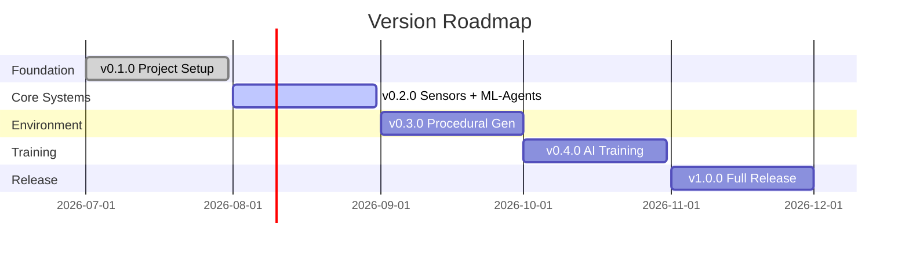

## 26.2 Version Details

| Version | Phase | Key Features |
|:--------|:------|:-------------|
| `v0.1.0` | Foundation | Project structure, documentation, basic setup |
| `v0.2.0` | Core Systems | Sensors, ML-Agents integration, flight control |
| `v0.3.0` | Environment | Procedural generation, disaster types, victims |
| `v0.4.0` | Training | Reward system, PPO training, ONNX export |
| `v1.0.0` | Release | Full feature set, polished documentation |

---

# 27. Future Roadmap

## 27.1 Post v1.0 Features

| Version | Feature | Description |
|:--------|:--------|:------------|
| v1.1 | Battery System | Simulate realistic battery constraints |
| v1.2 | Weather Effects | Rain, fog, wind simulation |
| v2.0 | Swarm Intelligence | Multiple drones collaborating |
| v2.1 | Computer Vision | YOLO-based victim detection |
| v3.0 | ROS Integration | Robot Operating System compatibility |
| v3.1 | Google Maps Terrain | Real-world terrain import |
| v4.0 | Real Drone | Sim-to-real transfer deployment |

## 27.2 Research Directions

- Advanced RL algorithms (SAC, TD3, HER)
- Transfer learning between disaster types
- Curriculum learning optimization
- Meta-learning for rapid adaptation

---

# 28. Engineering Principles

## ADRL Engineering Principles

These principles guide every architectural and implementation decision in the project.

| # | Principle | Description |
|:--|:----------|:------------|
| 1 | **The AI Never Cheats** | The drone only knows what its sensors detect. No ground truth. No作弊. |
| 2 | **Everything Is Modular** | Each system is independent. Changes to one system don't break others. |
| 3 | **One Responsibility Per Class** | Each class does exactly one thing and does it well. |
| 4 | **Documentation First** | Design before implementation. Document before code. |
| 5 | **Architecture Before Implementation** | Define the system before building it. |
| 6 | **Never Sacrifice Maintainability** | Clean code is more important than clever code. |
| 7 | **Prefer Simplicity** | The simplest solution that works is the best solution. |
| 8 | **Procedural Over Handcrafted** | Generate environments, don't manually create them. |
| 9 | **Generalization Over Memorization** | The AI must work everywhere, not just one map. |
| 10 | **Reproducibility Matters** | Any experiment must be reproducible by others. |
| 11 | **Security By Design** | Never commit secrets. Always use .gitignore. |
| 12 | **Community First** | Build for others to contribute and learn. |

---

# 29. Golden Rules

> **The 10 Golden Rules of ADRL-Rescue**
> These rules are inviolable. Every contributor, every session, every decision must honor them.

```
╔══════════════════════════════════════════════════════════════╗
║                    🏆 THE GOLDEN RULES 🏆                    ║
╠══════════════════════════════════════════════════════════════╣
║                                                              ║
║  1.  Documentation is the foundation, not an afterthought.   ║
║                                                              ║
║  2.  The AI learns. It is never programmed to rescue.        ║
║                                                              ║
║  3.  Every environment must be procedurally generated.       ║
║                                                              ║
║  4.  The drone only knows what its sensors tell it.          ║
║                                                              ║
║  5.  One class, one responsibility. Always.                  ║
║                                                              ║
║  6.  If it's not documented, it doesn't exist.               ║
║                                                              ║
║  7.  Simplicity beats cleverness. Every time.                ║
║                                                              ║
║  8.  The repository must always be in a buildable state.     ║
║                                                              ║
║  9.  Never commit secrets. Never.                            ║
║                                                              ║
║  10. This charter is the law. No exceptions.                 ║
║                                                              ║
╚══════════════════════════════════════════════════════════════╝
```

---

# 30. Project Philosophy

## The ADRL Philosophy

> **We do not build drones that follow instructions.**
> **We build systems that learn to make decisions.**
>
> **We do not program rescue behavior.**
> **We create conditions where rescue behavior emerges.**
>
> **We do not handcraft environments.**
> **We generate worlds that challenge intelligence.**
>
> **The drone that learns to navigate rubble is more valuable than the drone that memorizes a map.**
> **The system that generalizes is more powerful than the system that specializes.**
> **The architecture that endures is more important than the code that works today.**

## Our Creed

```
┌────────────────────────────────────────────────────────────┐
│                                                            │
│   "The drone should not be programmed to rescue people.    │
│                                                            │
│    It should learn how to rescue people.                   │
│                                                            │
│    And when it does, it will teach us something            │
│    about intelligence itself."                             │
│                                                            │
│                        — ADRL-Rescue Project Philosophy    │
│                                                            │
└────────────────────────────────────────────────────────────┘
```

---

## Document Control

| Property | Value |
|:---------|:------|
| Document ID | DOC-000 |
| Version | 1.0.0 |
| Author | Nihaal Gharat |
| Created | 2026-07-20 |
| Last Modified | 2026-07-20 |
| Next Review | v1.0.0 Release |
| Status | ✅ ACTIVE |

---

## Navigation

| Document | Description | Link |
|:---------|:------------|:-----|
| README | Project landing page | [README.md](../README.md) |
| Project Vision | Goals and vision | [01_PROJECT_VISION.md](01_PROJECT_VISION.md) |
| Architecture | System architecture | [02_PROJECT_ARCHITECTURE.md](02_PROJECT_ARCHITECTURE.md) |
| System Design | Detailed design | [03_SYSTEM_DESIGN.md](03_SYSTEM_DESIGN.md) |
| Development Roadmap | Timeline | [04_DEVELOPMENT_ROADMAP.md](04_DEVELOPMENT_ROADMAP.md) |
| Folder Structure | Repository organization | [05_FOLDER_STRUCTURE.md](05_FOLDER_STRUCTURE.md) |
| AI System | AI details | [06_AI_SYSTEM.md](06_AI_SYSTEM.md) |
| Drone System | Drone details | [07_DRONE_SYSTEM.md](07_DRONE_SYSTEM.md) |
| Environment System | Environment details | [08_ENVIRONMENT_SYSTEM.md](08_ENVIRONMENT_SYSTEM.md) |
| Sensor System | Sensor specs | [09_SENSOR_SYSTEM.md](09_SENSOR_SYSTEM.md) |
| Reward System | Reward design | [10_REWARD_SYSTEM.md](10_REWARD_SYSTEM.md) |
| Training Pipeline | Training workflow | [11_TRAINING_PIPELINE.md](11_TRAINING_PIPELINE.md) |
| Data Flow | Data flow diagrams | [12_DATA_FLOW.md](12_DATA_FLOW.md) |
| Coding Standards | Code conventions | [13_CODING_STANDARDS.md](13_CODING_STANDARDS.md) |
| GitHub Workflow | Git workflow | [14_GITHUB_WORKFLOW.md](14_GITHUB_WORKFLOW.md) |
| Testing Guide | Testing procedures | [15_TESTING_GUIDE.md](15_TESTING_GUIDE.md) |
| Future Scope | Future features | [16_FUTURE_SCOPE.md](16_FUTURE_SCOPE.md) |
| Glossary | Terminology | [PROJECT_GLOSSARY.md](PROJECT_GLOSSARY.md) |

---

*This charter was established on 2026-07-20 and is effective immediately.*
*All future project decisions must conform to this document.*
*Amendments require formal approval through the process defined in Section 23.4.*
