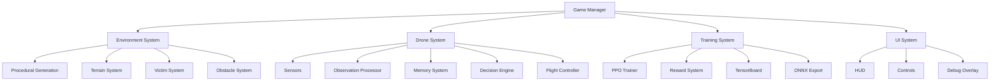
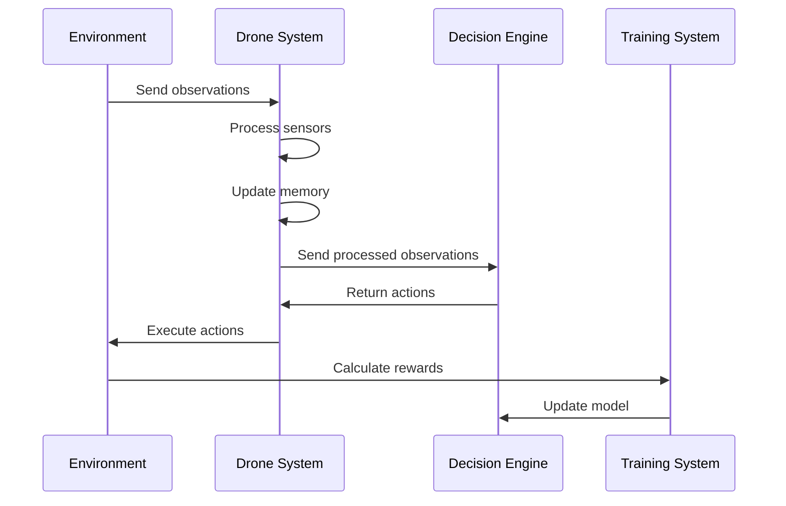

# 02 - Project Architecture

---

## High-Level Architecture

The project follows a **modular, system-based architecture** where each component has a single responsibility.

---

## Core Systems

### 1. Game Manager

The central controller that orchestrates the simulation.

**Responsibilities:**
- Initialize and start episodes
- Track global state
- Coordinate system interactions
- Handle episode termination
- Manage reset procedures

### 2. Environment System

Generates and manages the disaster environment.

**Responsibilities:**
- Procedural terrain generation
- Building and obstacle placement
- Victim spawning
- Environmental hazards (fire, water, debris)
- Episode randomization

### 3. Drone System

The autonomous agent with modular subsystems.

**Responsibilities:**
- Sensor data collection
- Observation processing
- Memory management
- Decision making (via PPO)
- Flight control execution

### 4. Training System

Manages the reinforcement learning pipeline.

**Responsibilities:**
- PPO algorithm implementation
- Reward calculation
- Model training and evaluation
- TensorBoard logging
- ONNX model export

### 5. UI System

Provides user interface for interaction and debugging.

**Responsibilities:**
- HUD display
- Debug information overlay
- Training progress visualization
- Camera controls

---

## Data Flow

---

## Technology Stack

| Layer | Technology | Purpose |
|-------|-----------|---------|
| Simulation | Unity 2022.3 LTS | Environment rendering and physics |
| Programming | C# | Game logic and behavior |
| ML Framework | Unity ML-Agents | RL integration |
| Algorithm | PPO | Decision learning |
| Training | Python | Model training |
| Model Format | ONNX | Trained model deployment |
| Monitoring | TensorBoard | Training visualization |
| Version Control | Git/GitHub | Code management |

---

## Design Principles

1. **Single Responsibility** — Each class does one thing well
2. **Loose Coupling** — Systems communicate through interfaces
3. **High Cohesion** — Related functionality stays together
4. **Open/Closed** — Open for extension, closed for modification
5. **Dependency Inversion** — Depend on abstractions, not implementations

---

## Navigation

| Document | Description |
|----------|-------------|
| [01_PROJECT_VISION](01_PROJECT_VISION.md) | Project goals and vision |
| [03_SYSTEM_DESIGN](03_SYSTEM_DESIGN.md) | Detailed system specifications |
| [05_FOLDER_STRUCTURE](05_FOLDER_STRUCTURE.md) | Repository organization |
| [12_DATA_FLOW](12_DATA_FLOW.md) | Detailed data flow |

---

*Last updated: July 2026*
