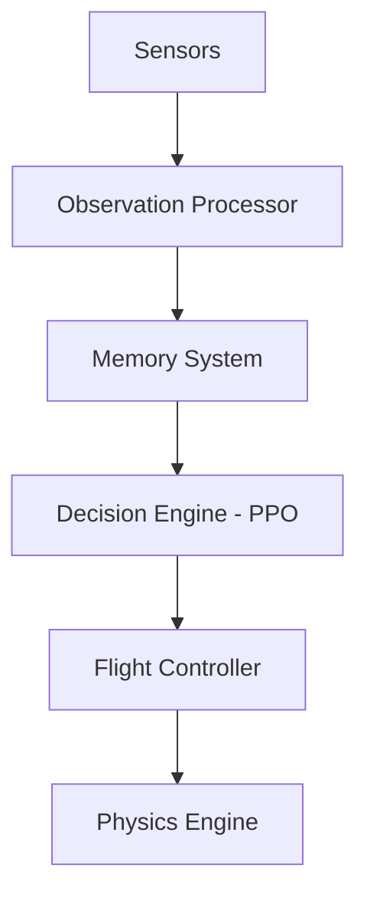
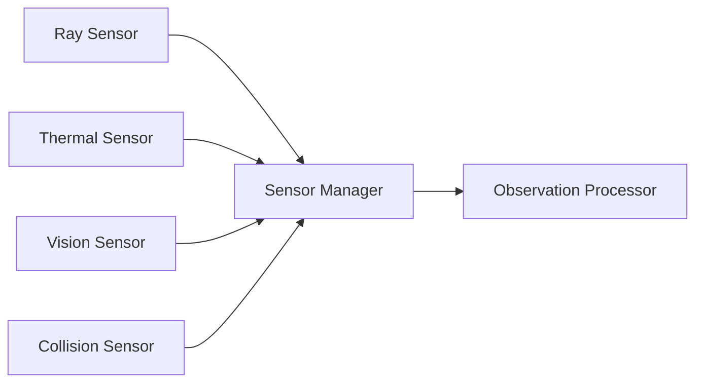

# 03 - System Design

---

## System Overview

This document details the internal design of each major system in ADRL-Rescue.

---

## 1. Game Manager

```
┌─────────────────────────────────────┐
│           Game Manager              │
├─────────────────────────────────────┤
│ - episodeManager: EpisodeManager    │
│ - environmentSystem: Environment    │
│ - droneSystem: DroneSystem          │
│ - trainingSystem: TrainingSystem    │
├─────────────────────────────────────┤
│ + StartSimulation()                 │
│ + EndEpisode()                      │
│ + ResetEnvironment()                │
│ + GetGameState()                    │
│ + OnEpisodeBegin()                  │
│ + OnEpisodeEnd()                    │
└─────────────────────────────────────┘
```

**Flow:**
```
StartSimulation()
    → InitializeEnvironment()
    → SpawnDrone()
    → BeginEpisode()

OnEpisodeEnd()
    → LogResults()
    → ResetEnvironment()
    → RespawnDrone()
    → BeginEpisode()
```

---

## 2. Environment System

### 2.1 Procedural Generation Manager

```
┌─────────────────────────────────────┐
│     ProceduralGenerationManager     │
├─────────────────────────────────────┤
│ - seed: int                         │
│ - difficultyLevel: float            │
│ - disasterType: DisasterType        │
├─────────────────────────────────────┤
│ + GenerateEnvironment()             │
│ + GenerateTerrain()                 │
│ + PlaceObstacles()                  │
│ + SpawnVictims()                    │
│ + AddHazards()                      │
│ + RandomizeParameters()             │
└─────────────────────────────────────┘
```

### 2.2 Disaster Types

| Type | Terrain | Obstacles | Hazards |
|------|---------|-----------|---------|
| Earthquake | Uneven, cracked | Rubble, collapsed walls | Fire, gas leaks |
| Flood | Waterlogged, muddy | Floating debris | Rising water |
| Landslide | Steep, unstable | Rocks, mud | Unstable ground |
| Building Collapse | Urban, flat | Debris, dust | Structural instability |

### 2.3 Victim System

```
Victim
├── position: Vector3
├── health: float (0-100)
├── isAlive: bool
├── isRescued: bool
├── thermalSignature: float
└── detectionRadius: float
```

---

## 3. Drone System

### 3.1 Architecture Overview



### 3.2 Drone Agent

```
┌─────────────────────────────────────┐
│           DroneAgent                │
├─────────────────────────────────────┤
│ - sensorManager: SensorManager      │
│ - observationProcessor: Observation │
│ - memorySystem: DroneMemory         │
│ - flightController: FlightController│
│ - rewardSystem: RewardSystem        │
├─────────────────────────────────────┤
│ + CollectObservations()             │
│ + OnActionReceived()                │
│ + OnEpisodeBegin()                  │
│ + OnEpisodeEnd()                    │
│ + Heuristic()                       │
└─────────────────────────────────────┘
```

### 3.3 Flight Controller

**Actions Output (Continuous):**
| Action | Range | Description |
|--------|-------|-------------|
| MoveX | [-1, 1] | Left/Right movement |
| MoveY | [-1, 1] | Up/Down movement |
| MoveZ | [-1, 1] | Forward/Back movement |
| RotateY | [-1, 1] | Yaw rotation |

---

## 4. Sensor System

### 4.1 Sensor Architecture



### 4.2 Sensor Specifications

| Sensor | Type | Range | Purpose |
|--------|------|-------|---------|
| Ray Sensor | 3D Array | 10m | Obstacle detection |
| Thermal Sensor | Heat Map | 15m | Victim detection |
| Vision Sensor | Cone | 20m | Victim confirmation |
| Collision Sensor | Trigger | 0.5m | Impact detection |

---

## 5. Memory System

```
┌─────────────────────────────────────┐
│          DroneMemory                │
├─────────────────────────────────────┤
│ - visitedPositions: List<Vector3>   │
│ - obstacleMap: Dictionary           │
│ - victimLocations: List<Vector3>    │
│ - exploredAreas: HashSet            │
│ - memoryCapacity: int               │
├─────────────────────────────────────┤
│ + RecordPosition()                  │
│ + RecordObstacle()                  │
│ + RecordVictim()                    │
│ + IsExplored()                      │
│ + GetNearestUnexplored()            │
│ + ClearMemory()                     │
└─────────────────────────────────────┘
```

---

## 6. Training System

### 6.1 PPO Configuration

```yaml
trainer_type: ppo
hyperparameters:
  batch_size: 1024
  buffer_size: 10240
  learning_rate: 3.0e-4
  beta: 5.0e-3
  epsilon: 0.2
  lambd: 0.95
  num_epoch: 3
  learning_rate_schedule: linear

network_settings:
  normalize: true
  hidden_units: 256
  num_layers: 2

reward_signals:
  extrinsic:
    gamma: 0.99
    strength: 1.0

max_steps: 5000000
time_horizon: 64
summary_freq: 10000
```

### 6.2 Reward Structure

| Event | Reward | Description |
|-------|--------|-------------|
| Victim found | +10.0 | Successfully detected a victim |
| Victim rescued | +25.0 | Completed rescue operation |
| New area explored | +0.5 | Discovered previously unvisited area |
| Efficient movement | +0.1 | Moving toward unexplored areas |
| Collision | -5.0 | Hit an obstacle |
| Out of bounds | -10.0 | Left the environment |
| Time penalty | -0.01 | Per step penalty |
| Stuck penalty | -2.0 | Not moving for multiple steps |

---

## Navigation

| Document | Description |
|----------|-------------|
| [02_PROJECT_ARCHITECTURE](02_PROJECT_ARCHITECTURE.md) | High-level architecture |
| [06_AI_SYSTEM](06_AI_SYSTEM.md) | AI system details |
| [07_DRONE_SYSTEM](07_DRONE_SYSTEM.md) | Drone system details |
| [08_ENVIRONMENT_SYSTEM](08_ENVIRONMENT_SYSTEM.md) | Environment details |
| [09_SENSOR_SYSTEM](09_SENSOR_SYSTEM.md) | Sensor details |
| [10_REWARD_SYSTEM](10_REWARD_SYSTEM.md) | Reward system details |

---

*Last updated: July 2026*
