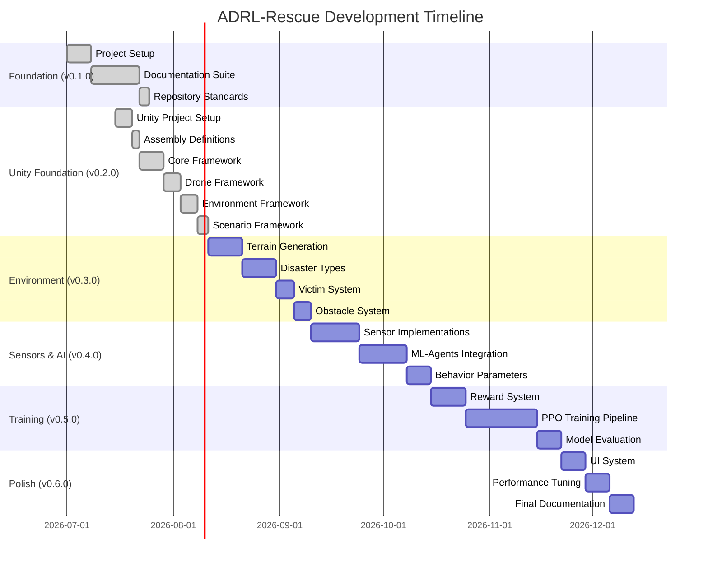

# 04 - Development Roadmap

---

## Overview

This document outlines the phased development plan for ADRL-Rescue. Each phase builds upon the previous one, ensuring incremental progress and testable milestones.

Phase names and releases follow [CHANGELOG.md](../CHANGELOG.md) as the single source of truth.

---

## Phase Overview

---

## Phase 1: Foundation (v0.1.0) ✅ Complete

**Goal:** Establish repository structure, documentation framework, and project standards.

### Tasks

| Task | Description | Status |
|------|-------------|--------|
| 1.1 | Unity project structure with .gitkeep placeholders | ✅ Complete |
| 1.2 | Python project structure with .gitkeep placeholders | ✅ Complete |
| 1.3 | Git repository initialization with remote origin | ✅ Complete |
| 1.4 | Full documentation suite (21 documents) | ✅ Complete |
| 1.5 | Repository standards (LICENSE, .gitignore, CONTRIBUTING, etc.) | ✅ Complete |

### Milestone
- Complete software architecture documented
- Full technical documentation suite
- Repository standards and conventions established

---

## Phase 2: Unity Foundation (v0.2.0) ✅ Complete

**Goal:** Implement core Unity framework, resource management, and drone foundation.

### Tasks

| Task | Description | Status |
|------|-------------|--------|
| 2.1 | Unity project initialization (2022.3 LTS, packages, settings) | ✅ Complete |
| 2.2 | Assembly definitions (8 assemblies, clean dependency tree) | ✅ Complete |
| 2.3 | Core framework (Bootstrap, Configuration, Events, Services, Simulation) | ✅ Complete |
| 2.4 | Resource management (ConfigRegistry, PrefabRegistry, AssetCache, AssetProvider) | ✅ Complete |
| 2.5 | Modular drone framework (DroneController, state machine, motor, health, energy) | ✅ Complete |
| 2.6 | Environment framework (EnvironmentManager, victims, hazards, spawn points) | ✅ Complete |
| 2.7 | Obstacle and world object framework | ✅ Complete |
| 2.8 | Procedural generation foundation and concrete rules | ✅ Complete |
| 2.9 | Scenario and mission profile framework | ✅ Complete |
| 2.10 | Project stabilization (warning resolution, editor validation) | ✅ Complete |

### Milestone
- Clean 8-assembly architecture with no circular dependencies
- Bootstrap pipeline initializes all systems
- Config-driven architecture via ScriptableObjects
- Drone can be controlled and respond to state changes
- Environments can be procedurally generated
- Scenarios can be loaded with config overrides

---

## Phase 3: Environment (v0.3.0) 🔲 Pending

**Goal:** Extend procedural generation with terrain, disaster types, and advanced environment features.

### Tasks

| Task | Description | Status |
|------|-------------|--------|
| 3.1 | Terrain generation system | 🔲 Pending |
| 3.2 | Disaster type definitions and behaviors | 🔲 Pending |
| 3.3 | Victim system expansion | 🔲 Pending |
| 3.4 | Obstacle system expansion | 🔲 Pending |
| 3.5 | Environment visual polish | 🔲 Pending |

### Milestone
- Environments generate with varied terrain
- Multiple disaster types playable
- Victims and obstacles placed procedurally

---

## Phase 4: Sensors & AI (v0.4.0) 🔲 Pending

**Goal:** Implement sensor systems and integrate ML-Agents for AI-driven drone control.

### Tasks

| Task | Description | Status |
|------|-------------|--------|
| 4.1 | Ray sensor implementation | 🔲 Pending |
| 4.2 | Thermal sensor implementation | 🔲 Pending |
| 4.3 | Vision sensor implementation | 🔲 Pending |
| 4.4 | Sensor fusion system | 🔲 Pending |
| 4.5 | ML-Agents agent setup | 🔲 Pending |
| 4.6 | Observation collection | 🔲 Pending |
| 4.7 | Action space definition | 🔲 Pending |
| 4.8 | Behavior parameter configuration | 🔲 Pending |
| 4.9 | Heuristic mode for testing | 🔲 Pending |

### Milestone
- Drone senses environment through multiple sensor types
- ML-Agents receives observations from sensor data
- Agent can be controlled heuristically for testing

---

## Phase 5: Training (v0.5.0) 🔲 Pending

**Goal:** Implement reward system and train the PPO model.

### Tasks

| Task | Description | Status |
|------|-------------|--------|
| 5.1 | Reward function implementation | 🔲 Pending |
| 5.2 | TensorBoard integration | 🔲 Pending |
| 5.3 | Training configuration | 🔲 Pending |
| 5.4 | Initial training run | 🔲 Pending |
| 5.5 | Hyperparameter tuning | 🔲 Pending |
| 5.6 | Model evaluation metrics | 🔲 Pending |
| 5.7 | ONNX export pipeline | 🔲 Pending |
| 5.8 | Inference testing | 🔲 Pending |

### Milestone
- Model trains without crashing
- TensorBoard shows learning progress
- Model demonstrates basic navigation
- Victim detection improves over episodes

---

## Phase 6: Polish (v0.6.0) 🔲 Pending

**Goal:** Refine the experience and prepare for release.

### Tasks

| Task | Description | Status |
|------|-------------|--------|
| 6.1 | HUD implementation | 🔲 Pending |
| 6.2 | Training progress display | 🔲 Pending |
| 6.3 | Debug overlay | 🔲 Pending |
| 6.4 | Performance optimization | 🔲 Pending |
| 6.5 | Memory optimization | 🔲 Pending |
| 6.6 | Final documentation | 🔲 Pending |
| 6.7 | Screenshot/video capture | 🔲 Pending |
| 6.8 | GitHub release preparation | 🔲 Pending |

### Milestone
- Polished user interface
- Stable performance
- Complete documentation
- Public release ready

---

## Version Milestones

| Version | Phase | Features |
|---------|-------|----------|
| v0.1.0 | Foundation | Repository architecture and documentation |
| v0.2.0 | Unity Foundation | Core framework, resource management, drone framework, environment framework, procedural generation, scenario systems |
| v0.3.0 | Environment | Terrain generation, disaster types, expanded procedural generation |
| v0.4.0 | Sensors & AI | Sensor implementations, ML-Agents integration, agent setup |
| v0.5.0 | Training | Reward system, PPO training pipeline, model evaluation |
| v0.6.0 | Polish | UI, performance optimization, final documentation |
| v1.0.0 | Release | Full stable release |

---

## Risk Assessment

| Risk | Impact | Mitigation |
|------|--------|------------|
| Training instability | High | Start simple, incrementally add complexity |
| Performance issues | Medium | Profile early, optimize incrementally |
| Scope creep | Medium | Strict phase boundaries |
| Unity version issues | Low | Use LTS version |

---

## Navigation

| Document | Description |
|----------|-------------|
| [01_PROJECT_VISION](01_PROJECT_VISION.md) | Project goals |
| [02_PROJECT_ARCHITECTURE](02_PROJECT_ARCHITECTURE.md) | System architecture |
| [13_CODING_STANDARDS](13_CODING_STANDARDS.md) | Development standards |
| [14_GITHUB_WORKFLOW](14_GITHUB_WORKFLOW.md) | Git workflow |

---

*This roadmap is synchronized with [CHANGELOG.md](../CHANGELOG.md). CHANGELOG is the single source of truth for all releases.*
