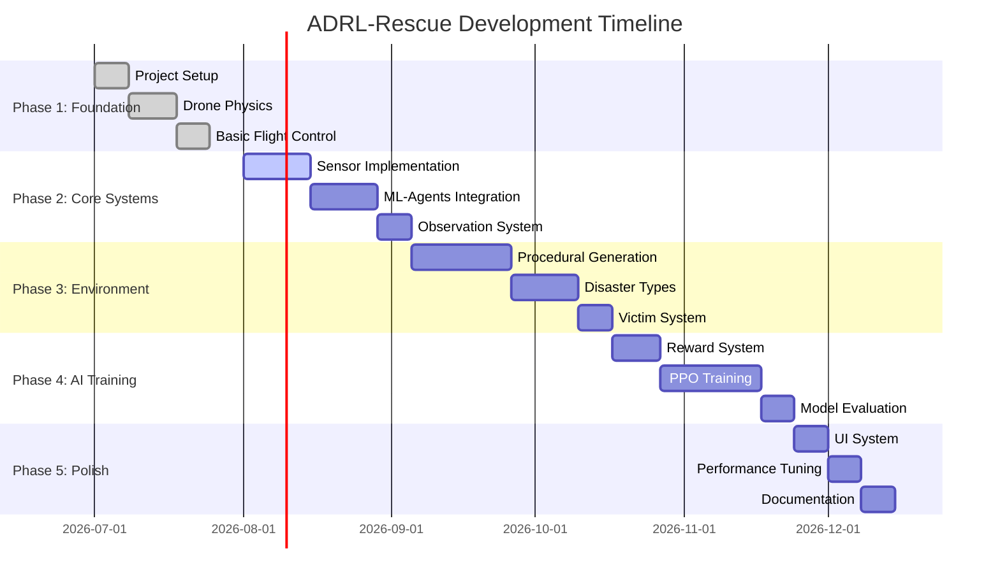

# 04 - Development Roadmap

---

## Overview

This document outlines the phased development plan for ADRL-Rescue. Each phase builds upon the previous one, ensuring incremental progress and testable milestones.

---

## Phase Overview

---

## Phase 1: Foundation

**Goal:** Establish the core project structure and basic drone physics.

### Tasks

| Task | Description | Status |
|------|-------------|--------|
| 1.1 | Unity project setup with ML-Agents | ✅ Complete |
| 1.2 | Basic drone physics (rigidbody, forces) | ✅ Complete |
| 1.3 | Flight controller (hover, move, rotate) | ✅ Complete |
| 1.4 | Git repository initialization | ✅ Complete |
| 1.5 | Documentation framework | ✅ Complete |

### Milestone
- Drone can hover and respond to manual controls
- Basic physics feel realistic

---

## Phase 2: Core Systems

**Goal:** Implement sensors and ML-Agents integration.

### Tasks

| Task | Description | Status |
|------|-------------|--------|
| 2.1 | Ray sensor implementation | 🔲 Pending |
| 2.2 | Thermal sensor implementation | 🔲 Pending |
| 2.3 | Vision sensor implementation | 🔲 Pending |
| 2.4 | Collision detection system | 🔲 Pending |
| 2.5 | ML-Agents agent setup | 🔲 Pending |
| 2.6 | Observation collection | 🔲 Pending |
| 2.7 | Action space definition | 🔲 Pending |
| 2.8 | Heuristic mode for testing | 🔲 Pending |

### Milestone
- Drone collects sensor data
- ML-Agents receives observations
- Heuristic mode allows manual testing

---

## Phase 3: Environment

**Goal:** Build procedurally generated disaster environments.

### Tasks

| Task | Description | Status |
|------|-------------|--------|
| 3.1 | Terrain generation system | 🔲 Pending |
| 3.2 | Building placement algorithm | 🔲 Pending |
| 3.3 | Obstacle spawning system | 🔲 Pending |
| 3.4 | Water body generation (flood) | 🔲 Pending |
| 3.5 | Fire/debris placement | 🔲 Pending |
| 3.6 | Victim spawning system | 🔲 Pending |
| 3.7 | Earthquake environment | 🔲 Pending |
| 3.8 | Flood environment | 🔲 Pending |
| 3.9 | Landslide environment | 🔲 Pending |
| 3.10 | Building collapse environment | 🔲 Pending |

### Milestone
- Environments generate randomly each episode
- All four disaster types are playable
- Victims appear in random locations

---

## Phase 4: AI Training

**Goal:** Implement reward system and train the PPO model.

### Tasks

| Task | Description | Status |
|------|-------------|--------|
| 4.1 | Reward function implementation | 🔲 Pending |
| 4.2 | TensorBoard integration | 🔲 Pending |
| 4.3 | Training configuration | 🔲 Pending |
| 4.4 | Initial training run | 🔲 Pending |
| 4.5 | Hyperparameter tuning | 🔲 Pending |
| 4.6 | Model evaluation metrics | 🔲 Pending |
| 4.7 | ONNX export pipeline | 🔲 Pending |
| 4.8 | Inference testing | 🔲 Pending |

### Milestone
- Model trains without crashing
- TensorBoard shows learning progress
- Model demonstrates basic navigation
- Victim detection improves over episodes

---

## Phase 5: Polish

**Goal:** Refine the experience and prepare for release.

### Tasks

| Task | Description | Status |
|------|-------------|--------|
| 5.1 | HUD implementation | 🔲 Pending |
| 5.2 | Training progress display | 🔲 Pending |
| 5.3 | Debug overlay | 🔲 Pending |
| 5.4 | Performance optimization | 🔲 Pending |
| 5.5 | Memory optimization | 🔲 Pending |
| 5.6 | Final documentation | 🔲 Pending |
| 5.7 | Screenshot/video capture | 🔲 Pending |
| 5.8 | GitHub release preparation | 🔲 Pending |

### Milestone
- Polished user interface
- Stable performance
- Complete documentation
- Public release ready

---

## Version Milestones

| Version | Phase | Features |
|---------|-------|----------|
| v0.1.0 | Phase 1 | Basic drone flight |
| v0.2.0 | Phase 2 | Sensors + ML-Agents |
| v0.3.0 | Phase 3 | Procedural environments |
| v0.4.0 | Phase 4 | AI training working |
| v1.0.0 | Phase 5 | Full release |

---

## Risk Assessment

| Risk | Impact | Mitigation |
|------|--------|------------|
| Training instability | High | Start simple, incrementally add complexity |
| Performance issues | Medium | Profile early, optimize incrementally |
| Scope creep | Medium | Strict phase boundaries |
| Unity version issues | Low | Use LTS version |

---

## Navigation

| Document | Description |
|----------|-------------|
| [01_PROJECT_VISION](01_PROJECT_VISION.md) | Project goals |
| [02_PROJECT_ARCHITECTURE](02_PROJECT_ARCHITECTURE.md) | System architecture |
| [13_CODING_STANDARDS](13_CODING_STANDARDS.md) | Development standards |
| [14_GITHUB_WORKFLOW](14_GITHUB_WORKFLOW.md) | Git workflow |

---

*Last updated: July 2026*
