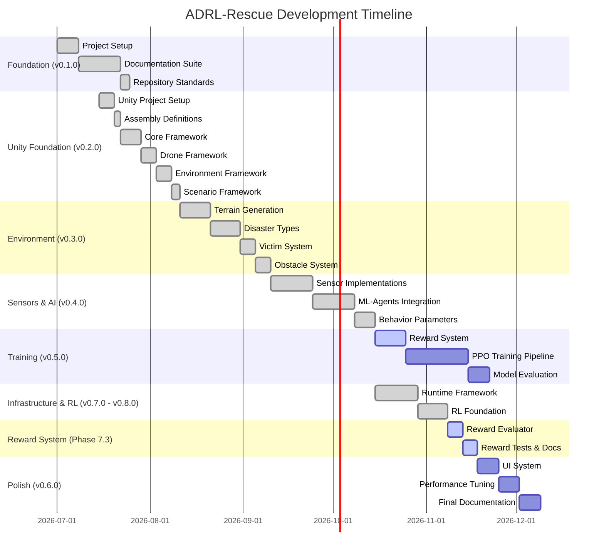

# 04 - Development Roadmap

---

## Overview

This document outlines the phased development plan for ADRL-Rescue. Each phase builds upon the previous one, ensuring incremental progress and testable milestones.

Phase names and releases follow [CHANGELOG.md](../CHANGELOG.md) as the single source of truth.

---

## Phase Overview

```mermaid
gantt
    title ADRL-Rescue Development Timeline
    dateFormat  YYYY-MM-DD
    
    section Foundation (v0.1.0)
    Project Setup           :done, p1a, 2026-07-01, 7d
    Documentation Suite     :done, p1b, after p1a, 14d
    Repository Standards    :done, p1c, after p1b, 3d
    
    section Unity Foundation (v0.2.0)
    Unity Project Setup     :done, p2a, 2026-07-15, 5d
    Assembly Definitions    :done, p2b, after p2a, 2d
    Core Framework          :done, p2c, after p2b, 7d
    Drone Framework         :done, p2d, after p2c, 5d
    Environment Framework   :done, p2e, after p2d, 5d
    Scenario Framework      :done, p2f, after p2e, 3d
    
    section Environment (v0.3.0)
    Terrain Generation      :done, p3a, after p2f, 10d
    Disaster Types          :done, p3b, after p3a, 10d
    Victim System           :done, p3c, after p3b, 5d
    Obstacle System         :done, p3d, after p3c, 5d
    
    section Sensors & AI (v0.4.0)
    Sensor Implementations  :done, p4a, after p3d, 14d
    ML-Agents Integration   :done, p4b, after p4a, 14d
    Behavior Parameters     :done, p4c, after p4b, 7d
    
    section Training (v0.5.0)
    Reward System           :active, p5a, after p4c, 10d
    PPO Training Pipeline   :p5b, after p5a, 21d
    Model Evaluation        :p5c, after p5b, 7d
    
    section Infrastructure & RL (v0.7.0 - v0.8.0)
    Runtime Framework       :done, p7a, after p4c, 14d
    RL Foundation           :done, p7b, after p7a, 10d
    
    section Reward System (Phase 7.3)
    Reward Evaluator        :active, p73, after p7b, 5d
    Reward Tests & Docs     :active, p74, after p73, 5d
    
    section Polish (v0.6.0)
    UI System               :p6a, after p74, 7d
    Performance Tuning      :p6b, after p6a, 7d
    Final Documentation     :p6c, after p6b, 7d
```

---

## Phase 1: Foundation (v0.1.0) ✅ Complete

**Goal:** Establish repository structure, documentation framework, and project standards.

### Tasks

| Task | Description | Status |
|------|-------------|--------|
| 1.1 | Unity project structure with .gitkeep placeholders | ✅ Complete |
| 1.2 | Python project structure with .gitkeep placeholders | ✅ Complete |
| 1.3 | Git repository initialization with remote origin | ✅ Complete |
| 1.4 | Full documentation suite (21 documents) | ✅ Complete |
| 1.5 | Repository standards (LICENSE, .gitignore, CONTRIBUTING, etc.) | ✅ Complete |

### Milestone
- Complete software architecture documented
- Full technical documentation suite
- Repository standards and conventions established

---

## Phase 2: Unity Foundation (v0.2.0) ✅ Complete

**Goal:** Implement core Unity framework, resource management, and drone foundation.

### Tasks

| Task | Description | Status |
|------|-------------|--------|
| 2.1 | Unity project initialization (2022.3 LTS, packages, settings) | ✅ Complete |
| 2.2 | Assembly definitions (8 assemblies, clean dependency tree) | ✅ Complete |
| 2.3 | Core framework (Bootstrap, Configuration, Events, Services, Simulation) | ✅ Complete |
| 2.4 | Resource management (ConfigRegistry, PrefabRegistry, AssetCache, AssetProvider) | ✅ Complete |
| 2.5 | Modular drone framework (DroneController, state machine, motor, health, energy) | ✅ Complete |
| 2.6 | Environment framework (EnvironmentManager, victims, hazards, spawn points) | ✅ Complete |
| 2.7 | Obstacle and world object framework | ✅ Complete |
| 2.8 | Procedural generation foundation and concrete rules | ✅ Complete |
| 2.9 | Scenario and mission profile framework | ✅ Complete |
| 2.10 | Project stabilization (warning resolution, editor validation) | ✅ Complete |

### Milestone
- Clean 8-assembly architecture with no circular dependencies
- Bootstrap pipeline initializes all systems
- Config-driven architecture via ScriptableObjects
- Drone can be controlled and respond to state changes
- Environments can be procedurally generated
- Scenarios can be loaded with config overrides

---

## Phase 3: Environment (v0.3.0) ✅ Complete

**Goal:** Extend procedural generation with terrain, disaster types, and advanced environment features.

### Tasks

| Task | Description | Status |
|------|-------------|--------|
| 3.1 | Terrain generation system | ✅ Complete |
| 3.2 | Disaster type definitions and behaviors | ✅ Complete |
| 3.3 | Victim system expansion | ✅ Complete |
| 3.4 | Obstacle system expansion | ✅ Complete |
| 3.5 | Environment visual polish | 🔲 Pending |

### Milestone
- Environments generate with varied terrain
- Multiple disaster types playable
- Victims and obstacles placed procedurally

---

## Phase 4: Sensors & AI (v0.4.0) ✅ Complete

**Goal:** Implement sensor systems and integrate ML-Agents for AI-driven drone control.

### Tasks

| Task | Description | Status |
|------|-------------|--------|
| 4.1 | Ray sensor implementation | ✅ Complete |
| 4.2 | Thermal sensor implementation | ✅ Complete |
| 4.3 | Vision sensor implementation | 🔲 Pending |
| 4.4 | Sensor fusion system | ✅ Complete |
| 4.5 | ML-Agents agent setup | ✅ Complete |
| 4.6 | Observation collection | ✅ Complete |
| 4.7 | Action space definition | ✅ Complete |
| 4.8 | Behavior parameter configuration | ✅ Complete |
| 4.9 | Heuristic mode for testing | ✅ Complete |

### Milestone
- Drone senses environment through multiple sensor types
- ML-Agents receives observations from sensor data
- Agent can be controlled heuristically for testing

---

## Phase 5: Training (v0.5.0) ⏳ In Progress

**Goal:** Implement reward system and train the PPO model.

### Tasks

| Task | Description | Status |
|------|-------------|--------|
| 5.1 | Reward function implementation | ✅ Complete |
| 5.2 | TensorBoard integration | 🔲 Pending |
| 5.3 | Training configuration | 🔲 Pending |
| 5.4 | Initial training run | 🔲 Pending |
| 5.5 | Hyperparameter tuning | 🔲 Pending |
| 5.6 | Model evaluation metrics | 🔲 Pending |
| 5.7 | ONNX export pipeline | 🔲 Pending |
| 5.8 | Inference testing | 🔲 Pending |

### Milestone
- Model trains without crashing
- TensorBoard shows learning progress
- Model demonstrates basic navigation
- Victim detection improves over episodes

---

## Phase 6: Polish (v0.6.0) 🔲 Pending

**Goal:** Refine the experience and prepare for release.

### Tasks

| Task | Description | Status |
|------|-------------|--------|
| 6.1 | HUD implementation | 🔲 Pending |
| 6.2 | Training progress display | 🔲 Pending |
| 6.3 | Debug overlay | ✅ Complete |
| 6.4 | Performance optimization | ⏳ In Progress |
| 6.5 | Memory optimization | 🔲 Pending |
| 6.6 | Final documentation | ⏳ In Progress |
| 6.7 | Screenshot/video capture | 🔲 Pending |
| 6.8 | GitHub release preparation | 🔲 Pending |

### Milestone
- Polished user interface
- Stable performance
- Complete documentation
- Public release ready

---

## Phase 7: Infrastructure, Environment & RL Foundation (v0.7.0 - v0.8.0) ✅ Complete

**Goal:** Complete runtime infrastructure and activate the RL foundation (sensors, agent, rewards).

### Tasks

| Task | Description | Status |
|------|-------------|--------|
| 7.1 | Runtime framework — object pooling, spawn pipeline, diagnostics, runtime integration | ✅ Complete |
| 7.2 | RL foundation — sensors, AI agent, observation collection, runtime activation | ✅ Complete |

### Milestone
- Deterministic spawn pipeline and runtime object pooling integrated
- Live diagnostics and runtime persistence/recovery
- DroneAgent with 28-float observation vector (24 ray + 2 thermal + energy + health) and 4 continuous actions
- Sensor layer (DroneRaySensor, DroneThermalSensor, SensorFusionProvider) activated at runtime
- Batch smoke test passes in under 20 seconds (zero compile errors, exit code 0)

---

## Phase 7.3: Reward System (In Progress)

**Goal:** Replace the placeholder reward design with a verified, event-driven reward evaluator.

### Tasks

| Task | Description | Status |
|------|-------------|--------|
| 7.3.1 | `RewardEvaluator` — per-step continuous + event-driven terminal rewards | ✅ Complete |
| 7.3.2 | `RewardBreakdown` — per-category diagnostics and event counters | ✅ Complete |
| 7.3.3 | `IRewardSink` decoupling from ML-Agents | ✅ Complete |
| 7.3.4 | Reward evaluation tests (41/41 passing) | ✅ Complete |
| 7.3.5 | Documentation synchronization | ⏳ In Progress |

### Milestone
- Reward mathematics verified against implementation (time, novelty, shaping, stuck/oscillation, terminal events)
- Sum invariant validated by smoke test
- Documentation aligned with implementation as single source of truth

---

## Version Milestones

| Version | Phase | Features |
|---------|-------|----------|
| v0.1.0 | Foundation | Repository architecture and documentation |
| v0.2.0 | Unity Foundation | Core framework, resource management, drone framework, environment framework, procedural generation, scenario systems |
| v0.3.0 | Environment | Terrain generation, disaster types, expanded procedural generation |
| v0.4.0 | Drone Runtime | Drone framework, runtime lifecycle, fleet management |
| v0.5.0 | Runtime Infrastructure | Subsystem wiring, persistence, recovery, validation |
| v0.6.0 | Runtime Completion | Diagnostics, spawn pipeline, object pooling |
| v0.7.0 | Infrastructure & Environment | Drone entity foundation, spawn pipeline, runtime integration |
| v0.8.0 | RL Foundation | Sensors, AI agent, runtime activation (Phases 7.1/7.2) |
| v1.0.0 | Release | Full stable release |

---

## Risk Assessment

| Risk | Impact | Mitigation |
|------|--------|------------|
| Training instability | High | Start simple, incrementally add complexity |
| Performance issues | Medium | Profile early, optimize incrementally |
| Scope creep | Medium | Strict phase boundaries |
| Unity version issues | Low | Use LTS version |

---

## Navigation

| Document | Description |
|----------|-------------|
| [01_PROJECT_VISION](01_PROJECT_VISION.md) | Project goals |
| [02_PROJECT_ARCHITECTURE](02_PROJECT_ARCHITECTURE.md) | System architecture |
| [13_CODING_STANDARDS](13_CODING_STANDARDS.md) | Development standards |
| [14_GITHUB_WORKFLOW](14_GITHUB_WORKFLOW.md) | Git workflow |

---

*This roadmap is synchronized with [CHANGELOG.md](../CHANGELOG.md). CHANGELOG is the single source of truth for all releases.*
