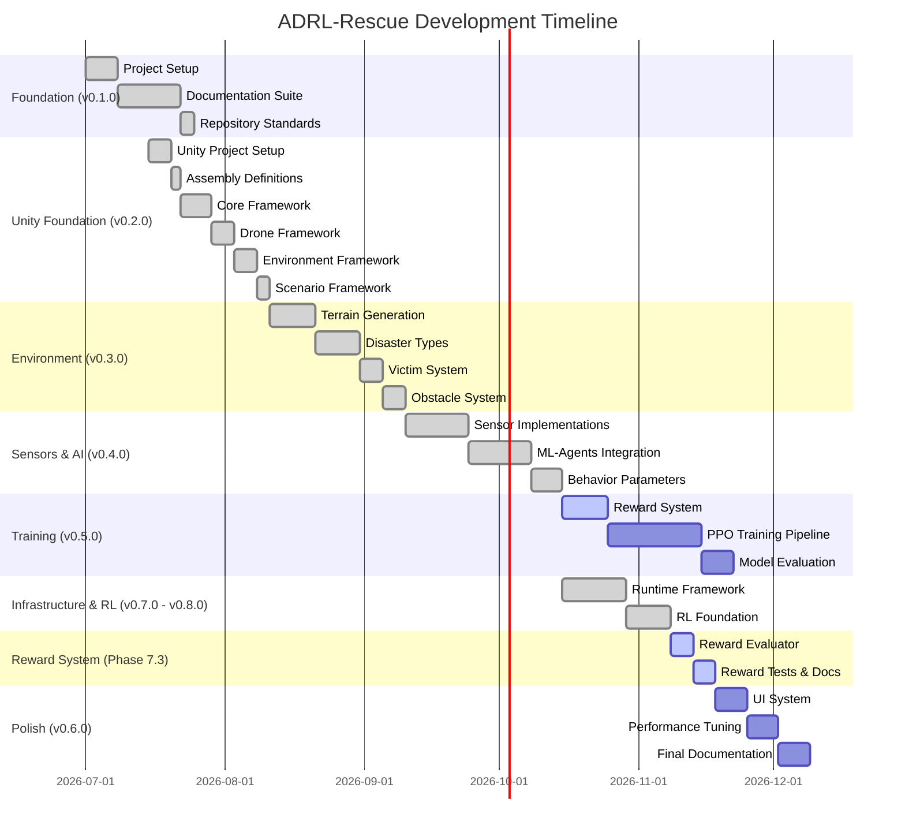

# 04 - Development Roadmap

---

## Overview

This document outlines the phased development plan for ADRL-Rescue. Each phase builds upon the previous one, ensuring incremental progress and testable milestones.

Phase names and releases follow [CHANGELOG.md](../CHANGELOG.md) as the single source of truth.

---

## Phase Overview

```mermaid
gantt
    title ADRL-Rescue Development Timeline
    dateFormat  YYYY-MM-DD
    
    section Foundation (v0.1.0)
    Project Setup           :done, p1a, 2026-07-01, 7d
    Documentation Suite     :done, p1b, after p1a, 14d
    Repository Standards    :done, p1c, after p1b, 3d
    
    section Unity Foundation (v0.2.0)
    Unity Project Setup     :done, p2a, 2026-07-15, 5d
    Assembly Definitions    :done, p2b, after p2a, 2d
    Core Framework          :done, p2c, after p2b, 7d
    Drone Framework         :done, p2d, after p2c, 5d
    Environment Framework   :done, p2e, after p2d, 5d
    Scenario Framework      :done, p2f, after p2e, 3d
    
    section Environment (v0.3.0)
    Terrain Generation      :done, p3a, after p2f, 10d
    Disaster Types          :done, p3b, after p3a, 10d
    Victim System           :done, p3c, after p3b, 5d
    Obstacle System         :done, p3d, after p3c, 5d
    
    section Sensors & AI (v0.4.0)
    Sensor Implementations  :done, p4a, after p3d, 14d
    ML-Agents Integration   :done, p4b, after p4a, 14d
    Behavior Parameters     :done, p4c, after p4b, 7d
    
    section Training (v0.5.0)
    Reward System           :active, p5a, after p4c, 10d
    PPO Training Pipeline   :p5b, after p5a, 21d
    Model Evaluation        :p5c, after p5b, 7d
    
    section Infrastructure & RL (v0.7.0 - v0.8.0)
    Runtime Framework       :done, p7a, after p4c, 14d
    RL Foundation           :done, p7b, after p7a, 10d
    
    section Reward System (Phase 7.3)
    Reward Evaluator        :active, p73, after p7b, 5d
    Reward Tests & Docs     :active, p74, after p73, 5d
    
    section Polish (v0.6.0)
    UI System               :p6a, after p74, 7d
    Performance Tuning      :p6b, after p6a, 7d
    Final Documentation     :p6c, after p6b, 7d
```

---

## Phase 1: Foundation (v0.1.0) ✅ Complete

**Goal:** Establish repository structure, documentation framework, and project standards.

### Tasks

| Task | Description | Status |
|------|-------------|--------|
| 1.1 | Unity project structure with .gitkeep placeholders | ✅ Complete |
| 1.2 | Python project structure with .gitkeep placeholders | ✅ Complete |
| 1.3 | Git repository initialization with remote origin | ✅ Complete |
| 1.4 | Full documentation suite (21 documents) | ✅ Complete |
| 1.5 | Repository standards (LICENSE, .gitignore, CONTRIBUTING, etc.) | ✅ Complete |

### Milestone
- Complete software architecture documented
- Full technical documentation suite
- Repository standards and conventions established

---

## Phase 2: Unity Foundation (v0.2.0) ✅ Complete

**Goal:** Implement core Unity framework, resource management, and drone foundation.

### Tasks

| Task | Description | Status |
|------|-------------|--------|
| 2.1 | Unity project initialization (2022.3 LTS, packages, settings) | ✅ Complete |
| 2.2 | Assembly definitions (8 assemblies, clean dependency tree) | ✅ Complete |
| 2.3 | Core framework (Bootstrap, Configuration, Events, Services, Simulation) | ✅ Complete |
| 2.4 | Resource management (ConfigRegistry, PrefabRegistry, AssetCache, AssetProvider) | ✅ Complete |
| 2.5 | Modular drone framework (DroneController, state machine, motor, health, energy) | ✅ Complete |
| 2.6 | Environment framework (EnvironmentManager, victims, hazards, spawn points) | ✅ Complete |
| 2.7 | Obstacle and world object framework | ✅ Complete |
| 2.8 | Procedural generation foundation and concrete rules | ✅ Complete |
| 2.9 | Scenario and mission profile framework | ✅ Complete |
| 2.10 | Project stabilization (warning resolution, editor validation) | ✅ Complete |

### Milestone
- Clean 8-assembly architecture with no circular dependencies
- Bootstrap pipeline initializes all systems
- Config-driven architecture via ScriptableObjects
- Drone can be controlled and respond to state changes
- Environments can be procedurally generated
- Scenarios can be loaded with config overrides

---

## Phase 3: Environment (v0.3.0) ✅ Complete

**Goal:** Extend procedural generation with terrain, disaster types, and advanced environment features.

### Tasks

| Task | Description | Status |
|------|-------------|--------|
| 3.1 | Terrain generation system | ✅ Complete |
| 3.2 | Disaster type definitions and behaviors | ✅ Complete |
| 3.3 | Victim system expansion | ✅ Complete |
| 3.4 | Obstacle system expansion | ✅ Complete |
| 3.5 | Environment visual polish | 🔲 Pending |

### Milestone
- Environments generate with varied terrain
- Multiple disaster types playable
- Victims and obstacles placed procedurally

---

## Phase 4: Sensors & AI (v0.4.0) ✅ Complete

**Goal:** Implement sensor systems and integrate ML-Agents for AI-driven drone control.

### Tasks

| Task | Description | Status |
|------|-------------|--------|
| 4.1 | Ray sensor implementation | ✅ Complete |
| 4.2 | Thermal sensor implementation | ✅ Complete |
| 4.3 | Vision sensor implementation | 🔲 Pending |
| 4.4 | Sensor fusion system | ✅ Complete |
| 4.5 | ML-Agents agent setup | ✅ Complete |
| 4.6 | Observation collection | ✅ Complete |
| 4.7 | Action space definition | ✅ Complete |
| 4.8 | Behavior parameter configuration | ✅ Complete |
| 4.9 | Heuristic mode for testing | ✅ Complete |

### Milestone
- Drone senses environment through multiple sensor types
- ML-Agents receives observations from sensor data
- Agent can be controlled heuristically for testing

---

## Phase 5: Training (v0.5.0) ⏳ In Progress

**Goal:** Implement reward system and train the PPO model.

### Tasks

| Task | Description | Status |
|------|-------------|--------|
| 5.1 | Reward function implementation | ✅ Complete |
| 5.2 | TensorBoard integration | 🔲 Pending |
| 5.3 | Training configuration | 🔲 Pending |
| 5.4 | Initial training run | 🔲 Pending |
| 5.5 | Hyperparameter tuning | 🔲 Pending |
| 5.6 | Model evaluation metrics | 🔲 Pending |
| 5.7 | ONNX export pipeline | 🔲 Pending |
| 5.8 | Inference testing | 🔲 Pending |

### Milestone
- Model trains without crashing
- TensorBoard shows learning progress
- Model demonstrates basic navigation
- Victim detection improves over episodes

---

## Phase 6: Polish (v0.6.0) 🔲 Pending

**Goal:** Refine the experience and prepare for release.

### Tasks

| Task | Description | Status |
|------|-------------|--------|
| 6.1 | HUD implementation | 🔲 Pending |
| 6.2 | Training progress display | 🔲 Pending |
| 6.3 | Debug overlay | ✅ Complete |
| 6.4 | Performance optimization | ⏳ In Progress |
| 6.5 | Memory optimization | 🔲 Pending |
| 6.6 | Final documentation | ⏳ In Progress |
| 6.7 | Screenshot/video capture | 🔲 Pending |
| 6.8 | GitHub release preparation | 🔲 Pending |

### Milestone
- Polished user interface
- Stable performance
- Complete documentation
- Public release ready

---

## Phase 7: Infrastructure, Environment & RL Foundation (v0.7.0 - v0.8.0) ✅ Complete

**Goal:** Complete runtime infrastructure and activate the RL foundation (sensors, agent, rewards).

### Tasks

| Task | Description | Status |
|------|-------------|--------|
| 7.1 | Runtime framework — object pooling, spawn pipeline, diagnostics, runtime integration | ✅ Complete |
| 7.2 | RL foundation — sensors, AI agent, observation collection, runtime activation | ✅ Complete |

### Milestone
- Deterministic spawn pipeline and runtime object pooling integrated
- Live diagnostics and runtime persistence/recovery
- DroneAgent with 28-float observation vector (24 ray + 2 thermal + energy + health) and 4 continuous actions
- Sensor layer (DroneRaySensor, DroneThermalSensor, SensorFusionProvider) activated at runtime
- Batch smoke test passes in under 20 seconds (zero compile errors, exit code 0)

---

## Phase 7.3: Reward System (Complete)

**Goal:** Replace the placeholder reward design with a verified, event-driven reward evaluator.

### Tasks

| Task | Description | Status |
|------|-------------|--------|
| 7.3.1 | `RewardEvaluator` — per-step continuous + event-driven terminal rewards | ✅ Complete |
| 7.3.2 | `RewardBreakdown` — per-category diagnostics and event counters | ✅ Complete |
| 7.3.3 | `IRewardSink` decoupling from ML-Agents | ✅ Complete |
| 7.3.4 | Reward evaluation tests (42/42 passing) | ✅ Complete |
| 7.3.5 | Documentation synchronization | ✅ Complete |

### Milestone
- Reward mathematics verified against implementation (time, novelty, shaping, stuck/oscillation, terminal events)
- Sum invariant validated by smoke test
- Documentation aligned with implementation as single source of truth

---

## Phase 8.1: Runtime Event Integration — Mission & Interaction Pipeline (In Progress)

**Goal:** Complete the runtime event wiring so victim discovery/rescue and collisions flow through the `EventBus` to mission completion and episode termination.

### Tasks

| Task | Description | Status |
|------|-------------|--------|
| 8.1.1 | Collision & victim pipeline foundation — `DroneCollisionDetector`, `Victim` exactly-once events, `MissionProgressTracker`, `SimulationManager` mission-completion finalization, `DroneVictimInteraction` | ✅ Complete |
| 8.1.2 | Mission-episode success reward wiring (`Success +50` on `MissionCompletedEvent`) and rescue/detection reward attribution | ✅ Complete |
| 8.1.3 | Victim prefab integration and scene wiring of registered victims into `EnvironmentManager` | ✅ Complete |

### Milestone
- Collision, victim-found, victim-rescued, and mission-completed events verified on the `EventBus` (66/66 EditMode tests)
- Drone prefab wired (kinematic rigidbody, trigger capsule, detector, interaction) with zero physics-response drift
- Batch smoke test unaffected by the trigger-collider change (PASSED, reward 0.148)
- Mission success reward wired into `RewardEvaluator` via `MissionCompletedEvent` (+50, exactly once per episode)
- Victim prefab created and registered at runtime before environment boot; procedural generation spawns victims into `EnvironmentManager` (`victims=N` in smoke log, previously `0`)

---

## Phase 8.2: Autonomous Decision Framework (Complete)

**Goal:** Introduce a deterministic decision layer that separates situation assessment, decision context, behaviour selection, and decision execution — providing the foundation for autonomous behaviour before RL policy optimisation. The framework owns *decision making only*; movement, physics, rewards, simulation, mission, environment, and episode lifecycle remain owned by their existing systems.

### Tasks

| Task | Description | Status |
|------|-------------|--------|
| 8.2.1 | `ADRL.AI.Decision` namespace — `SituationSnapshot`, `DecisionContext`, `BehaviourState`, `DecisionResult`, `DecisionDiagnostics` | ✅ Complete |
| 8.2.2 | Situation assessment — `ISituationAssessor` / `FogOfWarSituationAssessor` consuming the fused `ISensorReading` layer | ✅ Complete |
| 8.2.3 | Behaviour selection — `IBehaviourSelector` / `BehaviourSelector` deterministic priority policy (Avoid > Approach > Search > Idle) | ✅ Complete |
| 8.2.4 | `DecisionEngine` — composition point producing a `DroneCommand` on the existing actuator contract | ✅ Complete |
| 8.2.5 | Integration boundary (reuse, no replacement) — consumes `ISensorReading`, produces `DroneCommand`; existing runtime systems untouched | ✅ Complete |

### Milestone
- New `ADRL.AI.Decision` framework, deterministic and decoupled from sensors/actuators (83/83 EditMode tests, 11 new)
- Behaviour selection precedence verified: imminent obstacle → Avoid; detected target → Approach; else Search; invalid → Idle
- `DecisionEngine.Decide(ISensorReading) → DecisionResult(BehaviourState, DroneCommand, SituationSnapshot)` through the existing actuator contract
- Runtime smoke test unaffected (PASSED, exit 0, reward sum invariant true) — no existing behaviour changed

---

## Phase 8.3: Decision Engine Runtime Integration (Complete)

**Goal:** Make the Phase 8.2 Decision Framework the runtime decision authority inside `DroneAgent` without violating any existing ownership boundary. The DecisionEngine now produces the DroneCommand every step from the fused sensor reading; the `DroneActionResolver` is retained as the actuator translator reserved for the future reinforcement-learning policy.

### Tasks

| Task | Description | Status |
|------|-------------|--------|
| 8.3.1 | Wire `DroneAgent.OnActionReceived` to `DecisionEngine.Decide(fused)` as the sole command authority; expose `Decision` / `LastDecision`; reset engine per episode | ✅ Complete |
| 8.3.2 | Retain `DroneActionResolver` as the reserved actuator/language translation layer (still used by `ConfigureBrain` / `Heuristic`); no bridges, mode switches, or config flags | ✅ Complete |
| 8.3.3 | Repurpose `DroneSmokeTest` to validate the DecisionEngine path with a deterministic probe; preserve movement, rewards, determinism, and the sum invariant | ✅ Complete |
| 8.3.4 | Add `DecisionRuntimeIntegrationTests` (single-command authority, invalid-reading idle, determinism) | ✅ Complete |

### Milestone
- DecisionEngine is the sole high-level command producer at runtime; single ownership preserved; no duplicate decision system, no circular dependencies, no hidden state
- `DecisionRuntimeIntegrationTests` added (4); full EditMode suite **87/87 passing**, exit 0, zero compiler warnings
- Runtime batch smoke test PASSED, exit 0: movement 1.10m, reward finite, **sumInvariant=True**, `decisionSeen=True`, last behaviour Avoid
- `DroneActionResolver` and its `DroneCommand` contract retained as the future RL actuator-translator layer

---

## Phase 8.4: Autonomous Behaviour Execution Framework (Complete)

**Goal:** Introduce a dedicated Behaviour Execution layer so movement generation is owned by behaviour-specific executors rather than `DecisionEngine` itself. `DecisionEngine` remains the single runtime decision authority; executors become the single owners of behaviour-specific movement generation. An architectural refactoring and extension of the Phase 8.3 runtime — not a redesign.

### Tasks

| Task | Description | Status |
|------|-------------|--------|
| 8.4.1 | `ADRL.AI.Decision.Execution` namespace — `IBehaviourExecutor`, `IdleExecutor`, `SearchExecutor`, `ApproachExecutor`, `AvoidExecutor`, `BehaviourExecutorFactory` in the existing `ADRL.AI` assembly (no new asmdef) | ✅ Complete |
| 8.4.2 | `IdleExecutor` — generates `DroneCommand.Idle` only | ✅ Complete |
| 8.4.3 | `SearchExecutor` — deterministic forward exploration with smooth yaw sweep; no oscillation, no random numbers, configurable constants | ✅ Complete |
| 8.4.4 | `ApproachExecutor` — steer toward detected victim, reduced yaw jitter, smooth forward motion, configurable gains, deterministic | ✅ Complete |
| 8.4.5 | `AvoidExecutor` — deterministic avoidance side, smooth turn, heading recovery, no left/right oscillation, configurable parameters | ✅ Complete |
| 8.4.6 | `BehaviourExecutorFactory` — returns the correct executor for Idle/Search/Approach/Avoid; no switch duplication elsewhere | ✅ Complete |
| 8.4.7 | `DecisionEngine` — performs assessment, selects behaviour, obtains executor, requests `DroneCommand`, returns `DecisionResult`; no behaviour-specific movement logic remains | ✅ Complete |

### Milestone
- `DecisionEngine` retains sole decision authority; movement generation delegated to behaviour executors via `BehaviourExecutorFactory` (single mapping, no duplicate command generation, stable executor instances)
- `DecisionBehaviourExecutionTests` added (11); full EditMode suite **98/98 passing** (87 prior + 11 new), exit 0, zero compiler warnings
- Runtime batch smoke test PASSED, exit 0: movement 1.14m, reward finite, **sumInvariant=True**, `decisionSeen=True`, last behaviour Avoid
- Executors are pure, stateless functions of the assessed situation (identical snapshot → identical command); no circular dependencies, no hidden state

---

## Phase 8.6: Autonomous Mission Task Coordination Framework (Complete)

**Goal:** Introduce a deterministic Mission Task Coordination Framework that determines WHAT objective the drone should currently pursue, sitting between behaviour memory and behaviour selection. The `MissionCoordinator` owns the current mission task, its transitions, priority, continuity and state; the `DecisionEngine` remains the only runtime decision authority and answers "how" (behaviour). An architectural extension of the Phase 8.5 runtime — not path planning, mapping, SLAM, or reinforcement learning.

### Tasks

| Task | Description | Status |
|------|-------------|--------|
| 8.6.1 | `ADRL.AI.Decision.Mission` namespace — `MissionTaskState.cs`, `MissionTask.cs`, `MissionPolicy.cs`, `MissionTransitionRules.cs`, `MissionCoordinator.cs` in the existing `ADRL.AI` assembly (no new asmdef) | ✅ Complete |
| 8.6.2 | `MissionTaskState` — deterministic tasks: `Idle`, `SearchArea`, `InvestigateTarget`, `RescueVictim`, `AvoidHazard`, `ResumeSearch` | ✅ Complete |
| 8.6.3 | `MissionTask` — immutable objective snapshot (`State`, `EntryStep`, `PreviousState`, `IsValid`); never mutated in place | ✅ Complete |
| 8.6.4 | `MissionPolicy` — owns all mission constants (`ResumeTimeout`, `TransitionCooldown`, `HazardProximityThreshold`, `VictimConfirmationProximity`, `HazardPriority`, `VictimPriority`, `ConfidenceThreshold`); no magic numbers elsewhere | ✅ Complete |
| 8.6.5 | `MissionTransitionRules` — pure deterministic transitions; current perception always overrides; SearchArea→Investigate→Rescue→Resume→SearchArea cycle; ANY state→AvoidHazard; AvoidHazard→previous task after cooldown | ✅ Complete |
| 8.6.6 | `MissionCoordinator` — single owner of the current mission task, transitions, priority, continuity and state; deterministic step clock, no `Time` dependency, no hidden mutable state | ✅ Complete |
| 8.6.7 | `DecisionEngine` — advances the mission coordinator between memory and selection; mission-aware `Select(assessment, mission)` overload; backward-compatible optional `MissionPolicy` constructor; `Reset()` resets the mission | ✅ Complete |

### Milestone
- `DecisionEngine` retains sole decision authority; the mission coordinator owns WHAT, behaviour selection owns HOW, executors own movement; no duplicate decision system, no circular dependencies, no hidden state
- `MissionCoordinatorTests` added (12); full EditMode suite **121/121 passing** (109 prior + 12 new), exit 0, zero compiler warnings
- Runtime batch smoke test PASSED, exit 0: movement preserved, reward finite, **sumInvariant=True**, `decisionSeen=True`, mission task observed (AvoidHazard), behaviour follows the mission task
- Mission is fully deterministic (step-clock timeouts/cooldowns, immutable task snapshots), configuration-owned, holds the current objective on invalid assessments (no fabrication), and carries no circular dependencies

---

## Phase 8.7: Autonomous Task Prioritization Framework (Complete)

**Goal:** Introduce deterministic objective arbitration: when multiple valid objectives exist simultaneously, the `TaskPrioritizer` decides which the drone should pursue. It sits between the mission coordinator and behaviour selection; the coordinator still owns continuity/transitions/cooldowns/resume, the prioritizer owns task scoring, objective comparison and winner selection, and the `DecisionEngine` remains the only runtime decision authority. An architectural extension of the Phase 8.6 runtime — not path planning, navigation, SLAM, reinforcement learning, or swarm coordination.

### Tasks

| Task | Description | Status |
|------|-------------|--------|
| 8.7.1 | `ADRL.AI.Decision.Prioritization` namespace — `TaskPriority.cs`, `PriorityPolicy.cs`, `IPriorityEvaluator.cs`, `PriorityEvaluator.cs`, `TaskPrioritizer.cs` in the existing `ADRL.AI` assembly (no new asmdef) | ✅ Complete |
| 8.7.2 | `TaskPriority` — immutable scored candidate (`MissionTask`, `PriorityScore`, `Confidence`, `IsValid`); never mutated in place | ✅ Complete |
| 8.7.3 | `PriorityPolicy` — owns all scoring weights (`VictimPriority`, `HazardPriority`, `SearchPriority`, `ResumePriority`, `IdlePriority`, `MemoryBonus`, `ConfidenceBonus`, `DistancePenalty`, `CooldownPenalty`, `PriorityTieTolerance`); no magic numbers elsewhere | ✅ Complete |
| 8.7.4 | `PriorityEvaluator` — pure, stateless scoring: derives valid candidates from current perception, behaviour memory and the mission task; scores `Base + Confidence/Memory bonus - Distance penalty - Cooldown penalty`; deterministic order, no randomness, no Utility AI, no fuzzy logic | ✅ Complete |
| 8.7.5 | `TaskPrioritizer` — single runtime owner of arbitration: evaluates candidates, compares scores, returns the highest-priority winner; no transitions, no movement, no memory ownership, no hidden state | ✅ Complete |
| 8.7.6 | `DecisionEngine` — runs `Assessment → Memory → MissionCoordinator → TaskPrioritizer → MissionTask → BehaviourSelector → Executor → DroneCommand`; winning task feeds selection; backward-compatible optional `PriorityPolicy` constructor; `Reset()` clears the winner | ✅ Complete |
| 8.7.7 | `DecisionDiagnostics` — exposes the winning objective (`LastWinning`) and winning priority score (`WinningPriorityScore`) synchronized every step; smoke test logs the winning task and score | ✅ Complete |

### Milestone
- `DecisionEngine` retains sole decision authority; the prioritizer owns WHAT to pursue among competing objectives, the coordinator owns the mission narrative, behaviour selection owns HOW, executors own movement; no duplicate arbitration system, no circular dependencies, no hidden state
- `TaskPrioritizerTests` added (15); full EditMode suite **136/136 passing** (121 prior + 15 new), exit 0, zero compiler warnings
- Runtime batch smoke test PASSED, exit 0: winning task observed (AvoidHazard) with a deterministic priority score, behaviour follows the winning task, movement preserved, reward finite, **sumInvariant=True**
- Prioritization is fully deterministic (fixed candidate order, tolerance-based tie-breaking, immutable snapshots, no `Time` dependency), fully configurable through `PriorityPolicy`, and the winner always agrees with the coordinator's continuity objective

---

## Phase 8.7.1: Candidate Generation Separation & Extended Decision Diagnostics (Complete)

**Goal:** An architectural refinement of Phase 8.7 — no redesign, no runtime-behaviour, scoring, ordering or determinism change. Split the single `PriorityEvaluator` responsibility (which both created AND scored candidates) into three single-responsibility owners, and extend the runtime diagnostics to expose the complete decision chain so a step can be replayed. `DecisionEngine` remains the only runtime decision authority.

### Tasks

| Task | Description | Status |
|------|-------------|--------|
| 8.7.1.1 | `TaskCandidate` — immutable snapshot coupling a candidate `MissionTask` with its `CandidateOrigin` plus the deterministic evidence (`Proximity`, `Confidence`) the scorer consumes; the contract between generator and scorer | ✅ Complete |
| 8.7.1.2 | `CandidateOrigin` — why a candidate is available (`CurrentPerception` / `Continuity`); determined solely by the generator | ✅ Complete |
| 8.7.1.3 | `TaskCandidateGenerator` — the single owner of candidate availability: pure, stateless, deterministic; derives valid objective states from perception, memory and the coordinator's task in a fixed order with no duplicates; never scores, compares, chooses winners or modifies runtime state; invalid assessment → no candidates | ✅ Complete |
| 8.7.1.4 | `PriorityEvaluator` responsibility reduced to scoring only (`TaskCandidate[] → TaskPriority[]`); `IPriorityEvaluator` contract updated; no scoring formula changed | ✅ Complete |
| 8.7.1.5 | `TaskPrioritizer` reduced to pure arbitration (`Select(TaskPriority[])`); legacy assessment/memory/mission overload retained for backward compatibility, delegating to generation + scoring | ✅ Complete |
| 8.7.1.6 | `DecisionEngine` runs the explicit `TaskCandidateGenerator → PriorityEvaluator → TaskPrioritizer` chain; `DecisionEngine` remains the only runtime authority | ✅ Complete |
| 8.7.1.7 | `DecisionDiagnostics` extended with `SelectedExecutor`, `LastCommand`, `DecisionTimestamp`, `CandidateCount` for complete runtime replay; optional constructor parameters (backward compatible); smoke test logs the new fields | ✅ Complete |

### Milestone
- Final ownership becomes `TaskCandidateGenerator` (availability) → `PriorityEvaluator` (scoring) → `TaskPrioritizer` (winner); no duplicated responsibility, no new assemblies, no new asmdefs, no circular dependencies
- `TaskCandidateGeneratorTests` added (11) + `TaskPrioritizerTests` extended (4 diagnostics tests); full EditMode suite **151/151 passing** (136 prior + 15 new), exit 0, zero compiler warnings
- Runtime batch smoke test PASSED, exit 0: winning task observed (AvoidHazard), selected executor observed (`AvoidExecutor`), candidate count + decision timestamp surfaced, behaviour follows the winning task, movement preserved, reward finite, **sumInvariant=True**
- No runtime behaviour, scoring, priority ordering, reward or determinism changes; all Phase 8.7 semantics preserved

---

## Phase 9.0: Autonomous World Knowledge Framework (Complete)

**Goal:** Introduce a deterministic knowledge layer that persistently stores discovered information about the environment, answering "what does the drone currently know about the world?" Knowledge is read-only for consumers and write-only through the `KnowledgeUpdater`. No RL, no path planning, no navigation, no SLAM, no mapping, no multi-agent communication, and no behaviour decisions.

### Tasks

| Task | Description | Status |
|------|-------------|--------|
| 9.0.1 | `ADRL.AI.Decision.Knowledge` namespace — `KnowledgeType.cs`, `WorldKnowledgeRecord.cs`, `KnowledgePolicy.cs`, `WorldKnowledgeStore.cs`, `IKnowledgeQuery.cs`, `KnowledgeQuery.cs`, `KnowledgeUpdater.cs` in the existing `ADRL.AI` assembly (no new asmdef) | ✅ Complete |
| 9.0.2 | `KnowledgeType` — immutable enum: `Unknown`, `Victim`, `Obstacle`, `Hazard`, `ExploredRegion`, `SafeRegion` | ✅ Complete |
| 9.0.3 | `WorldKnowledgeRecord` — immutable snapshot (`Type`, `Position`, `Confidence`, `Timestamp`, `Age`, `Source`, `IsValid`); no mutable state | ✅ Complete |
| 9.0.4 | `KnowledgePolicy` — single configuration owner (`MaximumRecords`, per-type lifetimes, `MergeDistance`, `MinimumConfidence`, `ConfidenceDecay`, projection geometry, hazard threshold, corroboration window/boost); configuration only | ✅ Complete |
| 9.0.5 | `WorldKnowledgeStore` — single owner of persistent storage: `Store`/`Update`/`Remove`/`Expire`/`Clear`/`QueryNearest`/`QueryAll`/`Contains`/`Count`; never performs decisions, scores or selects | ✅ Complete |
| 9.0.6 | `IKnowledgeQuery` + `KnowledgeQuery` — pure, stateless retrieval only (`NearestVictim`, `NearestHazard`, `NearestObstacle`, `KnownVictims`, `KnownHazards`, `KnownObstacles`, `KnownRegions`); never updates the store | ✅ Complete |
| 9.0.7 | `KnowledgeUpdater` — single owner of writes: insert, refresh, merge (within `MergeDistance`), expire, confidence update; corroborates records through fresh short-term memory when the assessment is occluded | ✅ Complete |
| 9.0.8 | `DecisionEngine` — runs `KnowledgeUpdater.Update` after assessment, before memory/mission; embeds the store into the snapshot; exposes `KnowledgeStore`; backward compatible (optional `knowledgePolicy` ctor parameter); `Reset` clears knowledge | ✅ Complete |
| 9.0.9 | `DecisionContextSnapshot` — new `Knowledge` store field + `WithKnowledge`; snapshot complete (Assessment → Knowledge → Memory → Mission → Candidates → Winning → Behaviour → Optimization → Command → Diagnostics); 9- and 10-arg constructors preserved | ✅ Complete |
| 9.0.10 | `DecisionRuntimeState` — `KnowledgeRecordCount`, `KnownVictims`, `KnownHazards`, `KnownObstacles`, `KnowledgeTimestamp`; 8- and 12-arg constructors preserved | ✅ Complete |
| 9.0.11 | `DecisionDiagnostics` — `KnowledgeRecordCount`, `NearestVictimDistance`, `NearestHazardDistance`, `KnowledgeTimestamp`; `From` gains a store overload; legacy `From` preserved | ✅ Complete |
| 9.0.12 | `DroneSmokeTest` — observes the world-knowledge store; `knowledgeObserved` / `knowledgeRecords` / `knownVictims` / `knownHazards` / `knownObstacles` / `nearestVictimDistance` / `nearestHazardDistance` / `knowledgeTimestamp` logged; gated into PASS | ✅ Complete |

### Milestone
- `WorldKnowledgeStore` is the sole owner of storage, `KnowledgeUpdater` is the sole writer, `KnowledgeQuery` is the sole reader; mission, prioritizer, selector, optimizer and executors are untouched
- No duplicate storage, no hidden mutable state, no circular dependencies, no new Assembly Definitions; immutable records; deterministic ordering, tie-breaks and eviction
- `WorldKnowledgeTests` added (20); full EditMode suite **201/201 passing** (181 prior + 20 new), exit 0, zero compiler warnings
- Runtime batch smoke test PASSED, exit 0: finite reward, **sumInvariant=True**, decision/context/optimization observed, **world knowledge observed**
- No RL, path planning, navigation, SLAM, mapping or swarm logic introduced; knowledge is recorded and queried only, never used to alter decisions (read-only for consumers)

---

## Phase 8.9: Autonomous Behaviour Optimization Framework (Complete)

**Goal:** Introduce a deterministic optimization layer that refines *how* the already-selected behaviour executes, using the current runtime context. It answers "we already know WHAT behaviour should execute; how should it execute most efficiently?" without changing mission logic or priority decisions. No learning, no planning, no RL — the last deterministic optimization phase before Phase 9.x.

### Tasks

| Task | Description | Status |
|------|-------------|--------|
| 8.9.1 | `ADRL.AI.Decision.Optimization` namespace — `BehaviourExecutionProfile.cs`, `OptimizationPolicy.cs`, `IBehaviourOptimizer.cs`, `BehaviourOptimizer.cs`, `OptimizationValidator.cs` in the existing `ADRL.AI` assembly (no new asmdef) | ✅ Complete |
| 8.9.2 | `BehaviourExecutionProfile` — immutable execution profile (speed/turn multipliers, caution, preferred distance, smoothing, execution confidence); readonly; `Empty` = neutral no-op | ✅ Complete |
| 8.9.3 | `OptimizationPolicy` — single configuration owner (search/approach/avoid/rescue speeds, max/min turn rates, obstacle caution, victim approach distance, confidence scaling, smoothing factor); configuration only | ✅ Complete |
| 8.9.4 | `IBehaviourOptimizer` + `BehaviourOptimizer` — `Optimize(behaviour, snapshot)`; adjusts speed, turn rate, caution, smoothing and execution confidence from mission, priority score/confidence, memory confidence and current proximity; never changes mission/priority/behaviour/command | ✅ Complete |
| 8.9.5 | `OptimizationValidator` — valid profile, confidence/speed/turn/caution in range, deterministic outputs; multiplier bounds are the single source of truth | ✅ Complete |
| 8.9.6 | `DecisionEngine` — builds the current context after selection, runs the optimizer, hands the profile to the executor; snapshot carries the profile; backward compatible (optional `optimizationPolicy` ctor parameter) | ✅ Complete |
| 8.9.7 | `DecisionContextSnapshot` — `ExecutionProfile` field + `WithExecutionProfile`; snapshot complete; 9-arg constructor and builder unchanged | ✅ Complete |
| 8.9.8 | `DecisionRuntimeState` — diagnostic extension: `ExecutionSpeedMultiplier`, `ExecutionTurnRate`, `ExecutionConfidence`, `OptimizationTimestamp`; 8-arg constructor unchanged | ✅ Complete |
| 8.9.9 | Executors — `Resolve(assessment, profile)` added; base movement scaled by the profile only (movement decisions identical); legacy `Resolve(assessment)` path byte-identical | ✅ Complete |
| 8.9.10 | `DroneSmokeTest` — observes the optimized execution profile; `optimizationObserved` / `execConfidence` / `speedMult` / `turnRateMult` / `optimizationTimestamp` logged; gated into PASS | ✅ Complete |

### Milestone
- The optimizer owns only optimization; the selector, the prioritizer, the generator and the evaluator are untouched; the executors execute only; the engine remains the sole decision authority
- No duplicate optimization logic, no circular assembly dependencies, no new asmdefs; immutable execution profile; deterministic outputs
- `BehaviourOptimizerTests` added (15); full EditMode suite **181/181 passing** (166 prior + 15 new), exit 0, zero compiler warnings
- Runtime batch smoke test PASSED, exit 0: finite reward, **sumInvariant=True**, decision/mission/winning-task/behaviour/command observed, context snapshot observed, optimized execution profile observed
- Mission decisions, behaviour selection, prioritization and determinism unchanged; only execution parameters improved; movement remains deterministic

---

## Phase 8.8: Autonomous Decision Context Framework (Complete)

**Goal:** Introduce a Decision Context Framework that unifies every subsystem into a single immutable runtime context. Instead of each component exchanging different objects, the entire decision pipeline is captured as one consistent immutable `DecisionContextSnapshot` per step - the foundation for every future phase. Pure runtime context composition; no decision logic, no scoring, no transitions, no behaviour, reward or decision changes. `DecisionEngine` remains the only runtime decision authority.

### Tasks

| Task | Description | Status |
|------|-------------|--------|
| 8.8.1 | `ADRL.AI.Decision.Context` namespace — `DecisionContextSnapshot.cs`, `DecisionRuntimeState.cs`, `IDecisionContextBuilder.cs`, `DecisionContextBuilder.cs`, `DecisionContextValidator.cs` in the existing `ADRL.AI` assembly (no new asmdef) | ✅ Complete |
| 8.8.2 | `DecisionContextSnapshot` — immutable runtime snapshot containing `Assessment`, `Memory`, `Mission`, `TaskCandidate[]`, `Winning`, `BehaviourState`, `DroneCommand`, synchronized `DecisionDiagnostics` and `RuntimeState`; no mutable fields; `Empty` canonical pre-step snapshot | ✅ Complete |
| 8.8.3 | `DecisionRuntimeState` — pure runtime metadata: `DecisionStep`, `EpisodeStep`, `DecisionTimestamp`, `CurrentBehaviour`, `CurrentMission`, `LastCommand`, `CurrentExecutor`, `CurrentWinner` | ✅ Complete |
| 8.8.4 | `DecisionContextBuilder` — single owner of snapshot composition; pure, stateless, deterministic, null-safe, defensively copies the candidate array; no decision logic, no scoring, no transitions | ✅ Complete |
| 8.8.5 | `DecisionContextValidator` — pure validation utilities: snapshot complete, no null references, behaviour matches winner, mission valid, diagnostics synchronized, candidate count valid, command valid; no runtime mutation | ✅ Complete |
| 8.8.6 | `DecisionEngine` — captures the whole decision chain as a `DecisionContextSnapshot` per step via the builder, exposes `LastSnapshot`, derives `GetDiagnostics()` from the built snapshot (single source of truth); redundant `_last*` bookkeeping removed; ctor, `Decide`, `Reset` backward compatible | ✅ Complete |
| 8.8.7 | `DecisionDiagnostics` — `From(runtimeState, assessment, candidateCount)` projection so diagnostics are synchronized with the runtime state and candidate array by construction; `Empty` and the constructor contract unchanged | ✅ Complete |
| 8.8.8 | `DroneSmokeTest` — observes the built context snapshot and logs `contextObserved` / `contextStep`; context snapshot observation gated into the smoke PASS criteria | ✅ Complete |

### Milestone
- `DecisionEngine` retains sole decision authority; the `DecisionContextBuilder` is the single owner of context composition, the snapshot is the single consistent context per step, diagnostics is a projection of the runtime state - no duplicate bookkeeping, no new assemblies, no new asmdefs, no circular dependencies, no hidden state
- `DecisionContextTests` added (15); full EditMode suite **166/166 passing** (151 prior + 15 new), exit 0, zero compiler warnings
- Runtime batch smoke test PASSED, exit 0: finite reward, **sumInvariant=True**, movement preserved, decision/mission/winning-task/behaviour/command observed, context snapshot observed
- The context snapshot is deterministic (same inputs → same snapshot), immutable (readonly fields, owned candidate copy), and complete (every subsystem output of the step is captured); no runtime behaviour, scoring, ordering, reward or determinism changes

---

## Phase 8.5: Autonomous Behaviour Memory & Coordination Framework (Complete)

**Goal:** Introduce short-term autonomous behaviour memory so the drone can remember recently perceived information and make more intelligent decisions across consecutive frames. An architectural extension of the Phase 8.4 Behaviour Execution runtime — not path planning, mapping, SLAM, or reinforcement learning. `DecisionEngine` remains the only runtime decision authority; `BehaviourMemory` never generates commands and never selects behaviours — it only stores and retrieves runtime context.

### Tasks

| Task | Description | Status |
|------|-------------|--------|
| 8.5.1 | `ADRL.AI.Decision.Memory` namespace — `BehaviourMemory.cs`, `MemoryRecord.cs`, `MemoryPolicy.cs`, `BehaviourMemoryService.cs` in the existing `ADRL.AI` assembly (no new asmdef) | ✅ Complete |
| 8.5.2 | `MemoryRecord` — immutable runtime memory (`BehaviourState`, `Timestamp`, `Age`, `Confidence`, `IsValid`); no mutable public fields | ✅ Complete |
| 8.5.3 | `BehaviourMemory` — maintains `LastVictimSeen`, `LastObstacleSeen`, `LastBehaviour`; `Store`/`Retrieve`/`Clear`/`Expire`; bounded, never grows indefinitely | ✅ Complete |
| 8.5.4 | `MemoryPolicy` — owns all memory timing/configuration constants (`VictimMemoryDuration`, `ObstacleMemoryDuration`, `ConfidenceDecay`, `RefreshThreshold`, `MaxRecords`); no magic numbers elsewhere | ✅ Complete |
| 8.5.5 | `BehaviourMemoryService` — single owner of all runtime updates: refresh existing memory, expire stale memory, update confidence, clear invalid records | ✅ Complete |
| 8.5.6 | `DecisionEngine` — receives `SituationSnapshot` AND `BehaviourMemory`; still owns assessment, behaviour selection, executor selection, `DecisionResult`; memory influences selection but never replaces current perception | ✅ Complete |
| 8.5.7 | Behaviour continuity — victim seen recently continues Approach until memory expires; obstacle avoided prevents immediate oscillation then resumes Search after timeout; no random behaviour, fully deterministic | ✅ Complete |

### Milestone
- `DecisionEngine` retains sole decision authority; memory consumed read-only by the memory-aware selector overload (legacy single-argument selector preserved for backward compatibility)
- `BehaviourMemoryTests` added (11); full EditMode suite **109/109 passing** (98 prior + 11 new), exit 0, zero compiler warnings
- Runtime batch smoke test PASSED, exit 0: movement 1.07m, reward finite, **sumInvariant=True**, `decisionSeen=True`, last behaviour Avoid (memory continuity reaches a second victim reward deterministically)
- Memory is bounded (fixed capacity), allocation-light, deterministic (step-clock timestamps, no `Time` dependency), automatically expires stale records, and carries no circular dependencies; main-thread only, matching framework assumptions

---

## Version Milestones

| Version | Phase | Features |
|---------|-------|----------|
| v0.1.0 | Foundation | Repository architecture and documentation |
| v0.2.0 | Unity Foundation | Core framework, resource management, drone framework, environment framework, procedural generation, scenario systems |
| v0.3.0 | Environment | Terrain generation, disaster types, expanded procedural generation |
| v0.4.0 | Drone Runtime | Drone framework, runtime lifecycle, fleet management |
| v0.5.0 | Runtime Infrastructure | Subsystem wiring, persistence, recovery, validation |
| v0.6.0 | Runtime Completion | Diagnostics, spawn pipeline, object pooling |
| v0.7.0 | Infrastructure & Environment | Drone entity foundation, spawn pipeline, runtime integration |
| v0.8.0 | RL Foundation | Sensors, AI agent, runtime activation (Phases 7.1/7.2) |
| v0.8.1 | Reward System | Event-driven reward evaluator, reward diagnostics (Phase 7.3) |
| v0.8.2 | Runtime Event Integration | Collision & victim pipeline, mission-completed episode finalization (Phase 8.1) |
| v0.8.3 | Decision Runtime | DecisionEngine as the runtime decision authority, smoke-test + integration validation (Phase 8.3) |
| v0.8.4 | Behaviour Execution | Behaviour executor layer, factory-based command generation, smoke + integration validation (Phase 8.4) |
| v0.8.5 | Behaviour Memory | Short-term behaviour memory, continuity-based selection, smoke + integration validation (Phase 8.5) |
| v0.8.6 | Mission Coordination | Mission task coordinator, deterministic transitions, smoke + integration validation (Phase 8.6) |
| v0.8.7 | Task Prioritization | Objective arbitration, deterministic priority scoring, smoke + integration validation (Phase 8.7) |
| v0.8.8 | Architectural Refinement | Candidate generation separation, extended decision diagnostics, smoke + integration validation (Phase 8.7.1) |
| v0.8.9 | Decision Context | Unified immutable per-step context snapshot, synchronized diagnostics, validator, smoke + integration validation (Phase 8.8) |
| v0.9.0 | Behaviour Optimization | Deterministic execution optimization layer: immutable execution profile, optimizer + validator, profile-aware executors, smoke + integration validation (Phase 8.9) |
| v0.10.0 | World Knowledge | Persistent world-knowledge layer: store + updater + query, snapshot integration, synchronized diagnostics, smoke + integration validation (Phase 9.0) |
| v1.0.0 | Release | Full stable release |

---

## Risk Assessment

| Risk | Impact | Mitigation |
|------|--------|------------|
| Training instability | High | Start simple, incrementally add complexity |
| Performance issues | Medium | Profile early, optimize incrementally |
| Scope creep | Medium | Strict phase boundaries |
| Unity version issues | Low | Use LTS version |

---

## Navigation

| Document | Description |
|----------|-------------|
| [01_PROJECT_VISION](01_PROJECT_VISION.md) | Project goals |
| [02_PROJECT_ARCHITECTURE](02_PROJECT_ARCHITECTURE.md) | System architecture |
| [13_CODING_STANDARDS](13_CODING_STANDARDS.md) | Development standards |
| [14_GITHUB_WORKFLOW](14_GITHUB_WORKFLOW.md) | Git workflow |

---

*This roadmap is synchronized with [CHANGELOG.md](../CHANGELOG.md). CHANGELOG is the single source of truth for all releases.*
