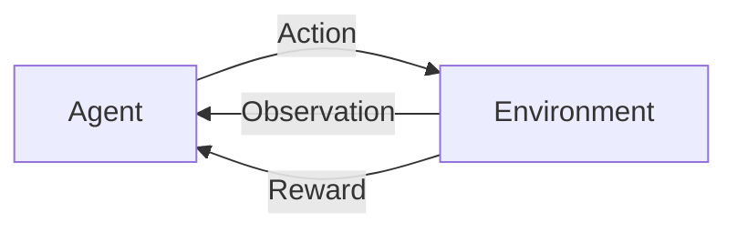
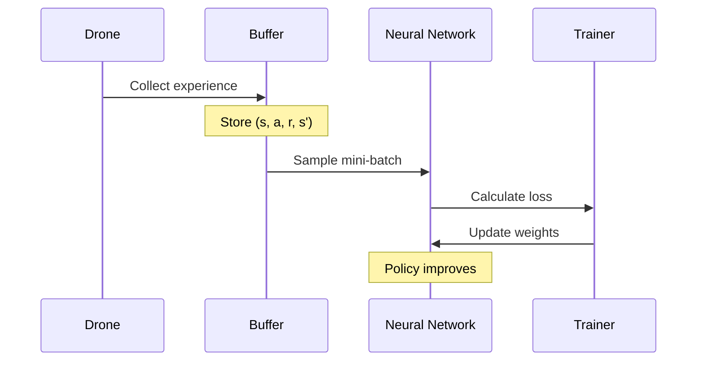
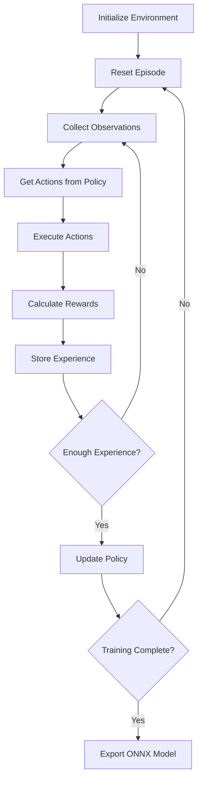

# 06 - AI System

---

## Overview

The AI system is the core intelligence of ADRL-Rescue. It uses **Proximal Policy Optimization (PPO)** — a state-of-the-art Reinforcement Learning algorithm — to learn autonomous navigation and victim detection.

---

## Reinforcement Learning Basics

### What is RL?

Reinforcement Learning is a type of machine learning where an agent learns to make decisions by interacting with an environment.



### Key Concepts

| Concept | Description |
|---------|-------------|
| **Agent** | The drone (DroneAgent) |
| **Environment** | The disaster scene |
| **State** | What the drone observes (sensors, position, etc.) |
| **Action** | Movement commands (move, rotate, ascend, descend) |
| **Reward** | Feedback signal (positive for good, negative for bad) |
| **Policy** | The neural network that maps states to actions |
| **Episode** | One complete run from start to finish |

---

## PPO Algorithm

### Why PPO?

- Stable training (prevents large policy updates)
- Sample efficient (learns from fewer interactions)
- Works well with continuous action spaces
- Supported by Unity ML-Agents

### How PPO Works



### PPO Configuration

```yaml
trainer_type: ppo

hyperparameters:
  batch_size: 1024
  buffer_size: 10240
  learning_rate: 0.0003
  beta: 0.005
  epsilon: 0.2
  lambd: 0.95
  num_epoch: 3

network_settings:
  normalize: true
  hidden_units: 256
  num_layers: 2

reward_signals:
  extrinsic:
    gamma: 0.99
    strength: 1.0
```

---

## Observation Space

The agent receives observations from multiple sources:

### Observation Vector

| Index | Observation | Range | Description |
|-------|-------------|-------|-------------|
| 0-2 | Position | [-50, 50] | Drone world position |
| 3-5 | Velocity | [-10, 10] | Current velocity |
| 6-8 | Forward | [-1, 1] | Forward direction vector |
| 9-11 | Up | [-1, 1] | Up direction vector |
| 12-24 | Ray Sensors | [0, 10] | 13 ray distances |
| 25-37 | Ray Hits | [0, 1] | 13 ray hit types |
| 38 | Thermal | [0, 1] | Thermal sensor strength |
| 39 | Vision | [0, 1] | Vision sensor detection |
| 40 | Speed | [0, 10] | Current speed |
| 41-43 | Target Dir | [-1, 1] | Direction to nearest victim |

**Total: 44 observations**

---

## Action Space

The agent outputs continuous actions:

| Action | Range | Description |
|--------|-------|-------------|
| MoveX | [-1, 1] | Left/Right strafe |
| MoveY | [-1, 1] | Ascend/Descend |
| MoveZ | [-1, 1] | Forward/Back |
| RotateY | [-1, 1] | Yaw rotation |

**Total: 4 continuous actions**

---

## Neural Network

### Architecture

```
Input Layer (44 neurons)
    ↓
Hidden Layer 1 (256 neurons, ReLU)
    ↓
Hidden Layer 2 (256 neurons, ReLU)
    ↓
Output Layer (4 neurons, tanh)
```

### Design Choices

| Choice | Value | Reason |
|--------|-------|--------|
| Hidden units | 256 | Balance of capacity and speed |
| Layers | 2 | Sufficient for this complexity |
| Activation | ReLU | Standard, fast |
| Normalization | True | Stabilizes training |

---

## Training Process



---

## Model Export

Trained models are exported as **ONNX** (Open Neural Network Exchange) format.

### Why ONNX?

- Platform independent
- Optimized for inference
- Works with Unity ML-Agents
- Industry standard format

### Export Process

```bash
# Training completes
mlagents-learn config.yaml --run-id=drone_v1

# Export to ONNX
# ML-Agents automatically saves to:
# results/drone_v1/Drone.onnx
```

---

## Navigation

| Document | Description |
|----------|-------------|
| [03_SYSTEM_DESIGN](03_SYSTEM_DESIGN.md) | System design overview |
| [10_REWARD_SYSTEM](10_REWARD_SYSTEM.md) | Reward function details |
| [11_TRAINING_PIPELINE](11_TRAINING_PIPELINE.md) | Training workflow |
| [12_DATA_FLOW](12_DATA_FLOW.md) | Data flow diagrams |

---

*Last updated: July 2026*
