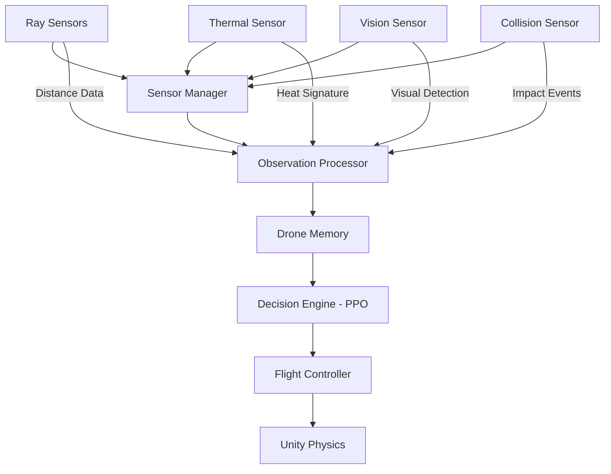
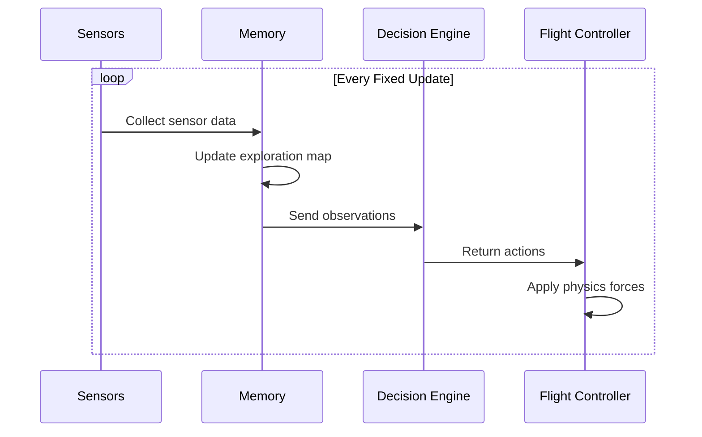

# 07 - Drone System

---

## Overview

The drone is the autonomous agent in ADRL-Rescue. It is designed as a modular system where each component has a single responsibility.

---

## System Architecture



---

## Components

### 1. Sensor Manager

Collects data from all onboard sensors.

**Responsibilities:**
- Initialize and configure sensors
- Collect sensor readings each frame
- Aggregate sensor data
- Handle sensor failures

### 2. Observation Processor

Transforms raw sensor data into a format the AI can understand.

**Responsibilities:**
- Normalize sensor values
- Combine observations into a single vector
- Handle missing data
- Apply preprocessing

### 3. Drone Memory

Stores information about the environment over time.

**Responsibilities:**
- Track visited positions
- Record obstacle locations
- Remember victim detections
- Maintain exploration map
- Limit memory usage

### 4. Decision Engine (PPO)

The neural network that decides what actions to take.

**Responsibilities:**
- Receive processed observations
- Output action commands
- Balance exploration vs exploitation
- Learn from rewards

### 5. Flight Controller

Translates AI decisions into physics-based movement.

**Responsibilities:**
- Apply forces to rigidbody
- Handle rotation
- Maintain stability
- Enforce movement limits
- Smooth actions

---

## Drone Specifications

### Physical Properties

| Property | Value | Description |
|----------|-------|-------------|
| Mass | 2.0 kg | Lightweight for agility |
| Drag | 3.0 | Air resistance |
| Angular Drag | 5.0 | Rotation damping |
| Max Speed | 10 m/s | Velocity limit |
| Max Rotation | 90°/s | Turn rate limit |

### Movement Axes

```
        Y (Up)
        │
        │
        │
        └──────── X (Right)
       /
      /
     Z (Forward)
```

| Axis | Movement | Input |
|------|----------|-------|
| X | Left/Right strafe | MoveX |
| Y | Ascend/Descend | MoveY |
| Z | Forward/Back | MoveZ |
| Y | Yaw rotation | RotateY |

---

## Drone Behavior Flow



---

## Stability System

The drone includes a stabilization system to maintain level flight:

```
Stabilization Forces:
├── Upright Torque (corrects tilt)
├── Vertical Damping (prevents oscillation)
└── Speed Limiting (prevents overspeed)
```

### Stabilization Parameters

| Parameter | Value | Description |
|-----------|-------|-------------|
| Stabilization Force | 50.0 | Strength of upright correction |
| Vertical Damping | 2.0 | Vertical movement damping |
| Max Tilt Angle | 45° | Maximum allowed tilt |

---

## Spawn System

Drone spawning considers:

| Factor | Description |
|--------|-------------|
| Safe Position | Not inside obstacles |
| Random Location | Different each episode |
| Valid Height | Above ground, below ceiling |
| Orientation | Facing random direction |

---

## Navigation

| Document | Description |
|----------|-------------|
| [03_SYSTEM_DESIGN](03_SYSTEM_DESIGN.md) | System design overview |
| [06_AI_SYSTEM](06_AI_SYSTEM.md) | AI system details |
| [09_SENSOR_SYSTEM](09_SENSOR_SYSTEM.md) | Sensor specifications |
| [10_REWARD_SYSTEM](10_REWARD_SYSTEM.md) | Reward system |

---

*Last updated: July 2026*
