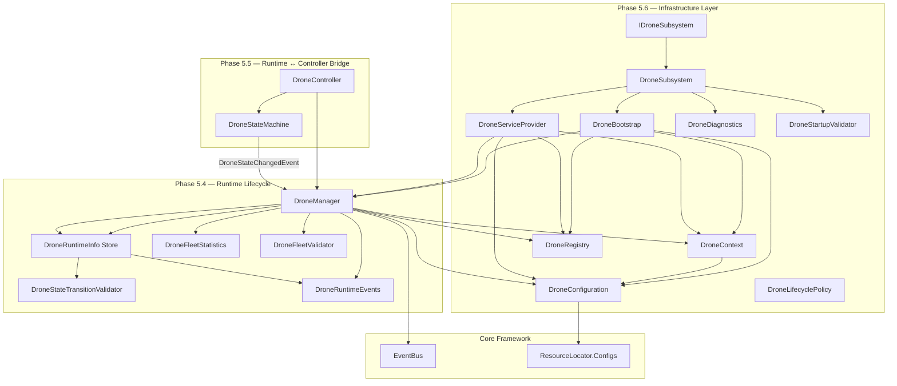
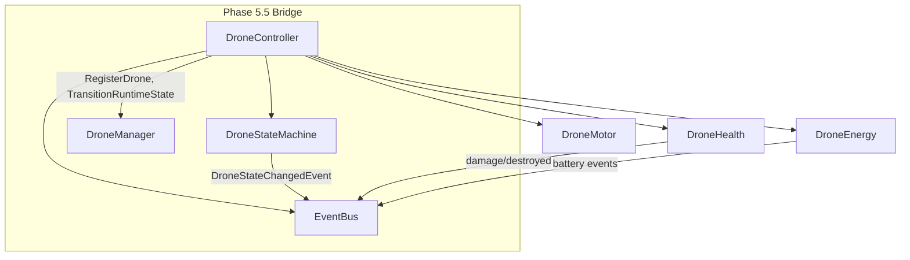
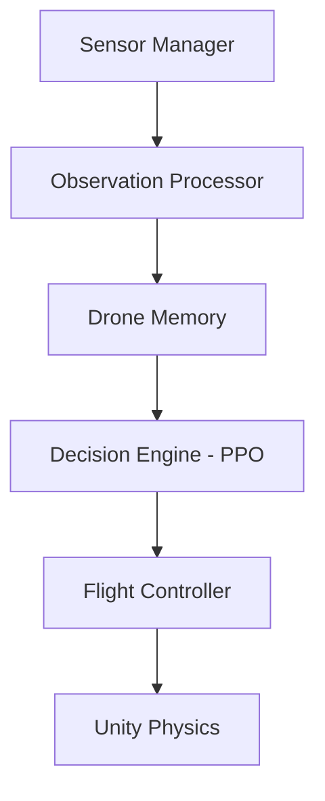
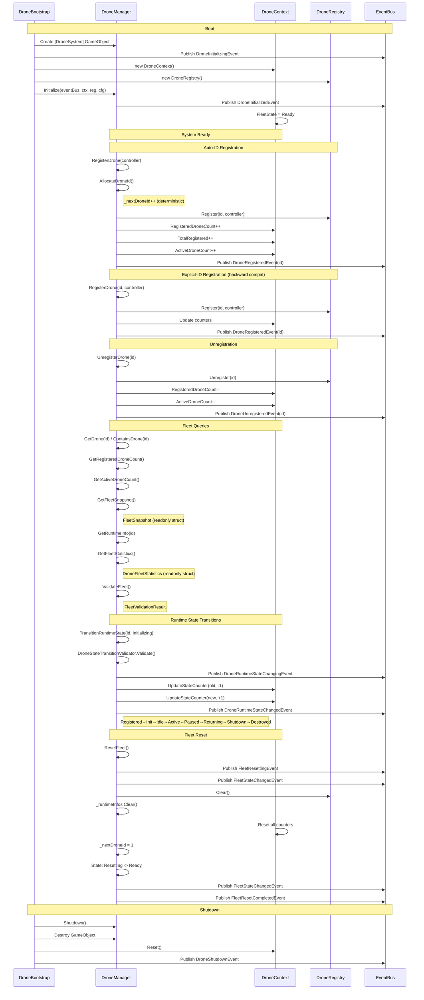
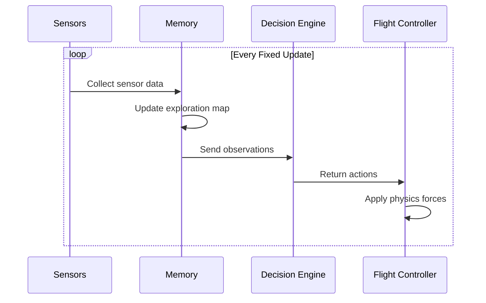

# 07 - Drone System

---

## Overview

The drone is the autonomous agent in ADRL-Rescue. It is designed as a modular system where each component has a single responsibility.

The Drone subsystem follows the same architectural patterns as the Environment subsystem with a static bootstrap, MonoBehaviour manager, plain C# context, instance-based registry, and event-driven lifecycle.

---

## System Architecture

### Runtime Layer (Phase 5.1 — Phase 5.8)


```mermaid
graph TD
    DB[DroneBootstrap] --> DM[DroneManager]
    DB --> DC[DroneContext]
    DB --> DR[DroneRegistry]
    DB --> DCFG[DroneConfiguration]
    DM --> DC
    DM --> DR
    DM --> DCFG
    DM --> EB[EventBus]
    DC --> DCFG
    
    subgraph "Phase 5.4 — Runtime Lifecycle"
        RI[DroneRuntimeInfo Store] --> DV[DroneStateTransitionValidator]
        DM --> RI
        DM --> FS[DroneFleetStatistics]
        DM --> FV[DroneFleetValidator]
        DM --> RE[DroneRuntimeEvents]
        RI --> RE
    end
    
    subgraph "Phase 5.5 — Runtime ↔ Controller Bridge"
        DCTRL[DroneController] --> DM
        DCTRL --> SM[DroneStateMachine]
        SM -->|DroneStateChangedEvent| DM
        DM --> RI
    end
    
    subgraph "Phase 5.6 — Infrastructure Layer"
        IDS[IDroneSubsystem] --> DS[DroneSubsystem]
        DS --> DB
        DS --> DSP[DroneServiceProvider]
        DSP --> DM
        DSP --> DR
        DSP --> DC
        DSP --> DCFG
        DS --> DD[DroneDiagnostics]
        DS --> DSV[DroneStartupValidator]
        DLP[DroneLifecyclePolicy]
    end
    
    subgraph "Core Framework"
        EB
        RC[ResourceLocator.Configs]
    end
    
    DCFG --> RC
```

### Component Layer (Phase 5.5 — Runtime Bridge added)


```mermaid
graph TD
    DCTRL[DroneController] --> SM[DroneStateMachine]
    DCTRL --> M[DroneMotor]
    DCTRL --> H[DroneHealth]
    DCTRL --> E[DroneEnergy]
    DCTRL --> EB[EventBus]
    
    subgraph "Phase 5.5 Bridge"
        DCTRL -->|RegisterDrone, TransitionRuntimeState| DMNG[DroneManager]
        SM -->|DroneStateChangedEvent| EB
    end
    
    H -->|damage/destroyed| EB
    E -->|battery events| EB
```

### Future AI Pipeline (Deferred)


```mermaid
graph TD
    SM[Sensor Manager] --> OP[Observation Processor]
    OP --> M[Drone Memory]
    M --> DE[Decision Engine - PPO]
    DE --> FC[Flight Controller]
    FC --> P[Unity Physics]
```

---

## Runtime Framework

### DroneBootstrap

Static class in `ADRL.Drone.Core`.

| Method | Description |
|--------|-------------|
| `Boot(EventBus)` | Creates `[DroneSystem]` GameObject, attaches DroneManager, creates context/registry/config, publishes lifecycle events |
| `Shutdown(EventBus)` | Invokes Manager.Shutdown(), destroys GameObject, resets context, publishes shutdown event |
| `IsInitialized` | Guard against double initialization |

**Boot Sequence:**
1. Guard: if initialized, return
2. Create `[DroneSystem]` GameObject, `DontDestroyOnLoad`
3. Add DroneManager component
4. Publish `DroneInitializingEvent`
5. Create DroneContext (FleetState = Initializing)
6. Create DroneConfiguration (system-level defaults)
7. Create DroneRegistry (pure storage)
8. DroneManager.Initialize(eventBus, context, registry, config)
9. Set context FleetState = Ready
10. Mark initialized

### DroneManager

MonoBehaviour in `ADRL.Drone.Core`. Owns subsystem lifecycle without touching per-drive logic.

**Owns:** DroneRegistry, DroneContext, DroneConfiguration, EventBus reference

**Public API:**

| Method | Description |
|--------|-------------|
| `Initialize(EventBus, DroneContext, DroneRegistry, DroneConfiguration)` | Method injection; stores references, sets state to Ready, publishes `FleetStateChangedEvent` + `DroneInitializedEvent` |
| `Shutdown()` | Clears registry, runtime info store, resets context, nulls references, state → Uninitialized |
| `AllocateDroneId()` | Returns current `_nextDroneId`, advances by 1; throws `InvalidOperationException` if state is not Ready/Running |
| `RegisterDrone(DroneController)` | Auto-allocates ID via `AllocateDroneId()`, creates `DroneRuntimeInfo(Registered)`, delegates to `RegisterDrone(int, DroneController)` |
| `RegisterDrone(int, DroneController)` | Stores in registry + runtime store, increments `TotalRegistered`, syncs `NextAvailableId`, publishes `DroneRuntimeStateChangedEvent` + `DroneRegisteredEvent` |
| `UnregisterDrone(int)` | Decrements correct state counter via `UpdateStateCounter`, removes from registry + runtime store, publishes `DroneUnregisteredEvent` |
| `TransitionRuntimeState(int, DroneRuntimeState)` | Validates via `DroneStateTransitionValidator`, updates runtime info, syncs context counters via `UpdateStateCounter`, publishes `DroneRuntimeStateChangingEvent` + `DroneRuntimeStateChangedEvent` |
| `GetRuntimeInfo(int)` | Returns `DroneRuntimeInfo` for a drone (or null) |
| `GetFleetStatistics()` | Computes `DroneFleetStatistics` from runtime store |
| `ValidateFleet()` | Delegates to `DroneFleetValidator`, returns `FleetValidationResult` |
| `ResetFleet()` | Guards on Ready/Running; publishes `FleetResettingEvent` + `FleetStateChangedEvent(→Resetting)`; clears registry + runtime store; resets all counters; publishes `FleetStateChangedEvent(→Ready)` + `FleetResetCompletedEvent` |
| `GetDrone(int)` | Wraps `Registry.Get(int)` — lookup by ID (returns null if not found) |
| `ContainsDrone(int)` | Wraps `Registry.Contains(int)` — existence check |
| `GetRegisteredDroneCount()` | Returns `Registry.Count` |
| `GetActiveDroneCount()` | Returns `Context.ActiveDroneCount` |
| `GetInactiveDroneCount()` | Returns `Context.InactiveCount` |
| `GetFleetSnapshot()` | Returns `FleetSnapshot` struct with full runtime lifecycle breakdown |
| `CreateSnapshot()` | Builds `DroneRuntimeSnapshot` from `_runtimeInfos` — per-drone entries + counters + fleet statistics + version + timestamp |
| `RestoreSnapshot(DroneRuntimeSnapshot)` | Validates state (Ready/Running); clears runtime store + registry; restores entries (null controller); restores all counters; returns success |
| `ResetRuntime()` | Clears runtime store + context counters; keeps system state unchanged (Ready) |
| `ClearRuntime()` | Extends `ResetRuntime()` — also resets `_nextDroneId`, `NextAvailableId`, `EpisodeNumber` |
| `Context`, `Registry`, `Configuration`, `State` | Read-only property access to owned subsystems |

**Spawning, hierarchy creation, and environment integration are deferred to Phase 6.0+.**

### DroneContext

Plain C# class in `ADRL.Drone.Core`. Holds runtime references and state counters.

| Property | Type | Description |
|----------|------|-------------|
| `FleetState` | DroneSystemState | Current system state |
| `EpisodeNumber` | int | Current episode counter |
| `DroneRoot` | Transform | Root transform for drone hierarchy |
| `CurrentConfiguration` | DroneConfiguration | Active fleet configuration |
| `RegisteredDroneCount` | int | Number of drones currently in registry (synced by Manager) |
| `ActiveDroneCount` | int | Number of drones in Active runtime state (managed via TransitionRuntimeState) |
| `TotalRegistered` | int | Cumulative count of all registrations (reset on fleet reset) |
| `InactiveCount` | int | Drones in Idle/Paused/Returning/Shutdown/Initializing/Registered states (managed via UpdateStateCounter) |
| `DestroyedCount` | int | Drones in Destroyed runtime state (managed via TransitionRuntimeState) |
| `NextAvailableId` | int | Next ID that will be allocated (synced by Manager) |

`Reset()` clears all fields to defaults.

### DroneRegistry

Plain C# class in `ADRL.Drone.Core`. Instance-based, no singleton. Pure storage — caller provides the drone ID.

| Method | Description |
|--------|-------------|
| `Register(int, DroneController)` | Store by caller-provided ID |
| `Unregister(int droneId)` | Remove by ID, returns success |
| `Contains(int droneId)` | Existence check |
| `Get(int droneId)` | Lookup by ID (returns null if not found) |
| `GetAll()` | Enumerate all registered controllers as `IReadOnlyCollection<DroneController>` |
| `Clear()` | Remove all entries |
| `Count` | Current registration count |

### DroneConfiguration

Plain C# class in `ADRL.Drone.Core`. System-level configuration only, no duplicated DroneConfig fields.

| Property | Default | Description |
|----------|---------|-------------|
| `MaxFleetSize` | 10 | Maximum allowed drones |
| `DefaultSpawnCount` | 3 | Default drones per episode |
| `EnableEnergyManagement` | true | Toggle energy system |

Per-drive physics parameters (speed, health, energy) are read from `DroneConfig` in `ADRL.Core.Configuration`.

### DroneSystemState

Enum in `ADRL.Drone.Core`. Mirrors EnvironmentState pattern.

```csharp
public enum DroneSystemState
{
    Uninitialized,
    Initializing,
    Ready,
    Running,
    Resetting,
    Completed,
    Failed
}
```

### Controllers (Phase 5.5 — Runtime Bridge)

#### DroneController

MonoBehaviour in `ADRL.Drone.Controllers`. Owns per-drive behaviour: components, state machine, motor, health, energy. Does NOT own IDs, runtime lifecycle, or fleet state.

**Modified in Phase 5.5** — `Initialize()` now takes a `DroneManager` parameter and delegates ID allocation to the manager.

| Method | Description |
|--------|-------------|
| `Initialize(EventBus, DroneConfig, IMotor, DroneManager)` | Method injection; calls `DroneManager.RegisterDrone(this)` for ID allocation + registration; creates components; transitions state machine (Uninitialized→Initializing→Idle); publishes `DroneSpawnedEvent` for backward compatibility |
| `Activate()` | Transitions behaviour state to Active; calls `DroneManager.TransitionRuntimeState(Active)`; publishes `DroneActivatedEvent` |
| `Deactivate()` | Stops motor; transitions behaviour to Idle; calls `DroneManager.TransitionRuntimeState(Idle)` |
| `Pause()` | Transitions behaviour to Paused; calls `DroneManager.TransitionRuntimeState(Paused)` |
| `Resume()` | Transitions behaviour to Active; calls `DroneManager.TransitionRuntimeState(Active)` |
| `EmergencyStop()` | Emergency stops motor; transitions behaviour to Emergency (no runtime equivalent); publishes `EmergencyStopEvent` |
| `DestroyDrone()` | Emergency stops motor; transitions behaviour to Destroyed; calls `DroneManager.TransitionRuntimeState(Destroyed)` |
| `Disable()` | Emergency stops motor; transitions behaviour to Disabled (no runtime equivalent — soft behaviour shutdown) |

#### DroneState → DroneRuntimeState Mapping

| DroneState | DroneRuntimeState | Trigger |
|-----------|-------------------|---------|
| Initializing | Initializing | Initialize() |
| Idle | Idle | Initialize() / Deactivate() |
| Active | Active | Activate() / Resume() |
| Paused | Paused | Pause() |
| Destroyed | Destroyed | DestroyDrone() |
| Emergency | (no mapping) | EmergencyStop() |
| Disabled | (no mapping) | Disable() |

#### Ownership Boundaries

| Layer | Owns | Never Owns |
|-------|------|------------|
| Runtime (Manager) | IDs, RuntimeState, Statistics, Validation, Runtime Events | Behaviour, Components, Motor, Health, Energy |
| Controller | Behaviour, DroneState, Components, Motor, Health, Energy | IDs, RuntimeState, Fleet Statistics, Fleet Validation |

#### Registration Flow (Phase 5.5)

```
DroneController.Initialize()
    ↓
DroneManager.RegisterDrone(this)
    ↓
AllocateDroneId() → droneId
    ↓
RegisterDrone(droneId, controller)
    ↓
Registry.Register(droneId, controller)
    ↓
Create DroneRuntimeInfo(droneId, Registered, ...)
    ↓
Publish DroneRuntimeStateChangedEvent(Uninitialized → Registered)
Publish DroneRegisteredEvent(droneId)
    ↓
stateMachine: Uninitialized → Initializing → Idle
    ↓
TransitionRuntimeState(Initializing)
TransitionRuntimeState(Idle)
    ↓
Publish DroneSpawnedEvent (backward compat)
```

### System Events (Phase 5.1)

| Event | Payload | When Published |
|-------|---------|----------------|
| `DroneInitializingEvent` | — | Start of Boot() |
| `DroneInitializedEvent` | — | End of Initialize() |
| `DroneShutdownEvent` | — | End of Shutdown() |
| `DroneRegisteredEvent` | `int DroneId` | After successful registration |
| `DroneUnregisteredEvent` | `int DroneId` | After successful unregistration |

All events are `readonly struct` implementing `IEvent` in `ADRL.Drone.Events`.

---

### FleetSnapshot

`readonly struct` in `ADRL.Drone.Core` (defined in `DroneManager.cs`). Lightweight runtime metadata snapshot — no mutable internals, no transforms, no physics, no AI.

| Property | Type | Description |
|----------|------|-------------|
| `RegisteredCount` | int | Current number of drones in registry |
| `TotalRegistered` | int | Cumulative registrations since last fleet reset |
| `ActiveCount` | int | Drones currently in Active state |
| `InactiveCount` | int | Drones currently in inactive state |
| `DestroyedCount` | int | Drones marked as destroyed |
| `NextAvailableId` | int | Next sequential ID that will be allocated |
| `SystemState` | DroneSystemState | Current subsystem lifecycle state |
| `IdleCount` | int | Drones in Idle runtime state |
| `PausedCount` | int | Drones in Paused runtime state |
| `ReturningCount` | int | Drones in Returning runtime state |
| `InitializingCount` | int | Drones in Initializing runtime state |
| `ShutdownCount` | int | Drones in Shutdown runtime state |

Created via `DroneManager.GetFleetSnapshot()`. Contains only runtime metadata — no references to `DroneController`, `Transform`, or `GameObject`.

---

### DroneRuntimeState (New — Phase 5.4)

Enum in `ADRL.Drone.Core`. Represents the per-drone runtime lifecycle — completely separate from `DroneState` (controller behaviour state in `ADRL.Drone.Controllers`).

```csharp
public enum DroneRuntimeState
{
    Uninitialized,
    Registered,
    Initializing,
    Idle,
    Active,
    Paused,
    Returning,
    Shutdown,
    Destroyed
}
```

Forward lifecycle path:
```
Registered → Initializing → Idle → Active ↔ Paused → Returning → Shutdown → Destroyed
```

Emergency destroy is allowed from Active, Idle, Paused, Returning, and Initializing.

---

### DroneRuntimeInfo (New — Phase 5.4)

Class in `ADRL.Drone.Core`. Per-drone immutable runtime metadata store. Owned by `DroneManager._runtimeInfos` dictionary (parallel to `DroneRegistry`, not inside it).

| Property | Type | Mutable | Description |
|----------|------|---------|-------------|
| `DroneId` | int | Read-only | Drone identifier |
| `RuntimeState` | DroneRuntimeState | Mutable | Current runtime lifecycle state |
| `RegistrationTime` | float | Read-only | `Time.time` at registration |
| `ActivationCount` | int | Mutable | Number of transitions to Active |
| `EpisodeNumber` | int | Read-only | Episode when registered |
| `LastTransitionTime` | float | Mutable | `Time.time` of last state transition |
| `RuntimeFlags` | int | Mutable | Bitfield for future extension |
| `ControllerReference` | DroneController | Read-only | Associated controller (nullable) |

Does NOT store physics, navigation, AI, or sensor data.

---

### DroneFleetStatistics (New — Phase 5.4)

`readonly struct` in `ADRL.Drone.Core`. Immutable fleet-level computed metrics. Computed on-the-fly by `DroneManager.GetFleetStatistics()`.

| Property | Type | Description |
|----------|------|-------------|
| `Registered` | int | Total drones in runtime store |
| `Active` | int | Drones in Active runtime state |
| `Idle` | int | Drones in Idle runtime state |
| `Paused` | int | Drones in Paused runtime state |
| `Returning` | int | Drones in Returning runtime state |
| `Destroyed` | int | Drones in Destroyed runtime state |
| `Initializing` | int | Drones in Initializing runtime state |
| `TotalRegistered` | int | Cumulative registrations (from context) |

---

### DroneStateTransitionValidator (New — Phase 5.4)

Static class in `ADRL.Drone.Core`. Validates runtime state transitions.

| Method | Description |
|--------|-------------|
| `IsValid(from, to)` | Returns `true` if transition is allowed |
| `Validate(from, to)` | Throws `InvalidOperationException` if transition is invalid |

**Allowed transitions:**

| From | To | Context |
|------|----|---------|
| Registered | Initializing | Lifecycle start |
| Initializing | Idle | Initialization complete |
| Idle | Active | Drone activated |
| Active | Idle | Drone deactivated (Phase 5.5 bridge) |
| Active | Paused | Drone paused |
| Paused | Active | Drone resumed |
| Active | Returning | Drone returning to base |
| Returning | Shutdown | Return complete |
| Shutdown | Destroyed | Final state |
| Active | Destroyed | Emergency destroy |
| Idle | Destroyed | Emergency destroy |
| Paused | Destroyed | Emergency destroy |
| Returning | Destroyed | Emergency destroy |
| Initializing | Destroyed | Emergency destroy |

All other transitions (e.g., `Destroyed → Active`, `Uninitialized → Returning`) are rejected.

---

### DroneRuntimeEvents (New — Phase 5.4)

All events are `readonly struct` implementing `IEvent` in `ADRL.Drone.Events`. Completely separate from `DroneEvents.cs` and `DroneSystemEvents.cs`.

| Event | Payload | When Published |
|-------|---------|----------------|
| `DroneRuntimeStateChangingEvent` | `int DroneId`, `DroneRuntimeState CurrentState`, `DroneRuntimeState NewState` | Before runtime state transition |
| `DroneRuntimeStateChangedEvent` | `int DroneId`, `DroneRuntimeState PreviousState`, `DroneRuntimeState NewState` | After runtime state transition |
| `FleetStateChangedEvent` | `DroneSystemState PreviousState`, `DroneSystemState NewState` | When system lifecycle state changes (Init, Reset) |
| `FleetResettingEvent` | `int EpisodeNumber` | Start of fleet reset |
| `FleetResetCompletedEvent` | `int EpisodeNumber` | End of fleet reset |

---

### DroneFleetValidator (New — Phase 5.4)

Static class in `ADRL.Drone.Utilities`. Validates fleet consistency at runtime. No scene validation.

| Method | Description |
|--------|-------------|
| `Validate(registry, context, runtimeInfos, systemState, nextAvailableId)` | Returns `FleetValidationResult` with IsValid flag and error list |

**Validation checks:**
- Runtime store: stale `Uninitialized` states, key/value ID mismatches
- Registry consistency: runtime info ↔ registry bidirectional completeness
- Context counters: negative values, `ActiveDroneCount`/`DestroyedCount` mismatch with runtime store
- Snapshot consistency: `NextAvailableId` and `FleetState` match between context and manager

**Return type** — `FleetValidationResult` (readonly struct):

| Property | Type | Description |
|----------|------|-------------|
| `IsValid` | bool | True if no errors |
| `Errors` | IReadOnlyList<string> | Validation error messages |

---

## Persistence Layer (Phase 5.8)

The Persistence Layer provides runtime snapshot and recovery capabilities for the drone fleet. All components are pure C# — no file IO, serialization, or Unity objects.

### DroneSnapshotEntry

`readonly struct` in `ADRL.Drone.Core`. Immutable per-drive entry in a runtime snapshot. Pure data — no `DroneController` reference.

| Property | Type | Description |
|----------|------|-------------|
| `DroneId` | int | Drone identifier |
| `RuntimeState` | DroneRuntimeState | Current runtime state |
| `ActivationCount` | int | Number of activations |
| `RegistrationTime` | float | Time.time when registered |
| `LastTransitionTime` | float | Time.time of last state transition |
| `RuntimeFlags` | int | Bitmask for runtime behaviour flags |

### DroneRuntimeSnapshot

`readonly struct` in `ADRL.Drone.Core`. Immutable complete fleet runtime snapshot. Versioned for forward compatibility.

| Property | Type | Description |
|----------|------|-------------|
| `SnapshotVersion` | int | Format version (`CurrentVersion = 1`) |
| `Timestamp` | long | `DateTime.UtcNow.Ticks` at capture |
| `EpisodeNumber` | int | Episode when captured |
| `FleetRuntimeState` | DroneSystemState | System state at capture |
| `RegisteredDroneCount` | int | Drones in registry |
| `TotalRegistered` | int | Cumulative registrations |
| `NextAvailableId` | int | Next ID to allocate |
| `Entries` | IReadOnlyList<DroneSnapshotEntry> | Per-drive snapshot entries |
| `FleetStatistics` | DroneFleetStatistics | Computed fleet metrics |

### DronePersistenceManager

Class in `ADRL.Drone.Core`. Pure C# — no file IO, no serialization. Owns snapshot history (max 100 checkpoints).

| Method | Description |
|--------|-------------|
| `CaptureSnapshot(DroneManager)` | Calls `manager.CreateSnapshot()`, stores in history, returns snapshot |
| `RestoreSnapshot(DroneRuntimeSnapshot, DroneManager)` | Delegates to `manager.RestoreSnapshot(snapshot)`, returns success |
| `ClearSnapshots()` | Clears all stored snapshots |
| `TryGetLatestSnapshot(out DroneRuntimeSnapshot)` | Returns most recent snapshot (or false) |
| `GetSnapshotHistory()` | Returns `IReadOnlyList<DroneRuntimeSnapshot>` of all checkpoints |
| `SnapshotCount` | int — number of stored snapshots |

### DroneRecoveryPolicy

Static class in `ADRL.Drone.Core`. Validates snapshot recoverability before restore.

| Method | Description |
|--------|-------------|
| `ValidateSnapshot(DroneRuntimeSnapshot)` | Returns `RecoveryValidationResult` — checks version, entries, counters |
| `CanRecover(DroneRuntimeSnapshot)` | Shorthand for `ValidateSnapshot().IsRecoverable` |

**Validation checks:**
- Snapshot version matches `CurrentVersion`
- No null entries collection
- All entries have positive `DroneId`
- No entries with `Uninitialized` runtime state
- No duplicate drone IDs
- `RegisteredDroneCount` == `Entries.Count`
- `EpisodeNumber` >= 0, `TotalRegistered` >= 0
- `TotalRegistered` >= `RegisteredDroneCount`
- `NextAvailableId` > 0 and >= `RegisteredDroneCount`

### DroneRecoveryValidator

Class in `ADRL.Drone.Core`. Validates restored runtime after a restore operation. Integrates `DroneFleetValidator` (fleet consistency, counter matching — registry consistency warnings suppressed as expected post-restore) and `DroneStartupValidator` (structural validation).

| Method | Description |
|--------|-------------|
| `Validate()` | Returns `RecoveryValidationResult` — runs fleet + startup validators |

### RecoveryValidationResult

`readonly struct` in `ADRL.Drone.Core`.

| Property | Type | Description |
|----------|------|-------------|
| `IsRecoverable` | bool | True if recoverable (no errors) |
| `Errors` | IReadOnlyList<string> | Validation errors |
| `Warnings` | IReadOnlyList<string> | Validation warnings |

### DronePersistenceEvents

All events are `readonly struct` implementing `IEvent` in `ADRL.Drone.Events`. Published through existing `EventBus`.

| Event | Payload | When Published |
|-------|---------|----------------|
| `RuntimeSnapshotCreatedEvent` | `int SnapshotIndex`, `int EntryCount` | After a snapshot is captured |
| `RuntimeRestoreStartedEvent` | none | Before runtime restore begins |
| `RuntimeRestoreCompletedEvent` | `bool RolledBack` | After restore completes (or rollback completes) |
| `RuntimeRestoreFailedEvent` | `string Reason` | When restore or rollback validation fails |
| `RuntimeSnapshotClearedEvent` | none | When all snapshots are cleared |

---

## Infrastructure Layer (Phase 5.6)

The Infrastructure Layer provides a single public entry point for the drone subsystem, centralized service access, startup validation, diagnostics, lifecycle policy, and service interfaces for decoupled dependency injection.

### IDroneSubsystem

Interface in `ADRL.Drone.Interfaces`. High-level subsystem operations. Future systems depend on this interface — never on `DroneManager` directly.

| Member | Description |
|--------|-------------|
| `Health` | Current `DroneSubsystemHealth` |
| `Boot(EventBus)` | Initialize the subsystem |
| `Shutdown()` | Tear down the subsystem |
| `Reset()` | Reset fleet to initial state |
| `Validate()` | Run startup validation, return `DroneSubsystemValidationReport` |
| `GetDiagnostics()` | Return `DroneDiagnostics` snapshot |

### DroneSubsystem

Class in `ADRL.Drone.Core`. Implements `IDroneSubsystem`. Public subsystem façade that wraps `DroneBootstrap` for Boot/Shutdown and owns the service provider, diagnostics, and validator instances. Stores `EventBus` for lifecycle event publishing. Orchestration only — no runtime logic.

| Member | Description |
|--------|-------------|
| `Health` | Current `DroneSubsystemHealth` (auto-updates) |
| `Services` | Full `DroneServiceProvider` access |
| `Boot(EventBus)` | Full startup pipeline; publishes `SubsystemStartingEvent` → try/catch Boot → post-boot validation → `SubsystemFaultedEvent` (on failure) or `SubsystemReadyEvent` (on success); health: `Shutdown → Initializing → Healthy` (or `Faulted`) |
| `Shutdown()` | Full shutdown pipeline: captures diagnostics + validation → publishes `SubsystemShutdownEvent` → `DroneBootstrap.Shutdown(eventBus)` → null refs → health → `Shutdown`; idempotent |
| `Reset()` | Calls `DroneManager.ResetFleet()` when health is Healthy or Degraded |
| `Validate()` | Combined validation: dependency check (6 components) + health/lifecycle check + `DroneStartupValidator` + `DroneFleetValidator` → unified `DroneSubsystemValidationReport`; publishes `SubsystemValidatedEvent` |
| `GetDiagnostics()` | Returns `DroneDiagnostics` with fleet state counters, `SystemState`, `IsServiceProviderReady`, `LastValidationPassed`, runtime duration, episode |
| `CreateSnapshot()` | Captures entire fleet runtime state into `DroneRuntimeSnapshot`; publishes `RuntimeSnapshotCreatedEvent`; requires Healthy or Degraded health |
| `RestoreSnapshot(DroneRuntimeSnapshot)` | Full recovery pipeline: validates snapshot → pre-snapshot capture (rollback target) → `RuntimeRestoreStartedEvent` → reset → restore → `DroneRecoveryValidator` → success (capture + `RuntimeRestoreCompletedEvent(false)`) or rollback (`RuntimeRestoreFailedEvent` + `RuntimeRestoreCompletedEvent(true)`); requires Healthy or Degraded health |
| `ResetRuntime()` | Clears runtime infos and context counters; delegates to `DroneManager.ResetRuntime()`; requires Healthy or Degraded health |
| `TryGetLatestSnapshot(out DroneRuntimeSnapshot)` | Retrieves most recent persistence checkpoint; null-safe before boot |
| `ClearSnapshots()` | Clears all persisted snapshots; publishes `RuntimeSnapshotClearedEvent`; null-safe before boot |
| `ValidateRestore()` | Validates restored runtime via `DroneRecoveryValidator`; returns `DroneSubsystemValidationReport` |

**Boot Sequence:**
1. Guard: if health ≠ Shutdown, return
2. Store `_eventBus`, set health = `Initializing`
3. Publish `SubsystemStartingEvent`
4. `try { DroneBootstrap.Boot(eventBus) } catch` → health = `Faulted`, publish `SubsystemFaultedEvent`, return
5. Acquire references: Manager, Context, Registry, Configuration
6. Create `DroneDiagnostics` (initial state) + `DroneStartupValidator` → `DroneServiceProvider`
7. Create `DronePersistenceManager` + `DroneRecoveryValidator` (persistence & recovery readiness)
8. Post-boot validation via `DroneStartupValidator.Validate()`
9. On validation failure: `DroneBootstrap.Shutdown(eventBus)`, null refs, health = `Faulted`, publish `SubsystemFaultedEvent` with error details, return
10. Set health = `Healthy`, record boot time
11. Publish `SubsystemReadyEvent`

**Shutdown Sequence:**
1. Guard: if health == Shutdown, return
2. Capture: `GetDiagnostics()` + `Validate()` (for last-known state)
3. Publish `SubsystemShutdownEvent`
4. `DroneBootstrap.Shutdown(eventBus)` — cleans up GameObject and Manager
4. Null all internal references (including `_persistenceManager`, `_recoveryValidator`)

**Restore/Persistence Pipeline:**
1. `CreateSnapshot()` delegates to `DronePersistenceManager.CaptureSnapshot(DroneManager)` → `DroneManager.CreateSnapshot()` reads `_runtimeInfos` → builds `DroneSnapshotEntry` per drone → builds `DroneRuntimeSnapshot` with version, timestamp, counters, fleet statistics → stored in `DronePersistenceManager._snapshots` (max 100)
2. `RestoreSnapshot(snapshot)` validates via `DroneRecoveryPolicy.ValidateSnapshot()` → version compatibility, entry integrity (no Uninitialized states, no duplicate IDs, no negative counts), counter consistency
3. On validation failure: publish `RuntimeRestoreFailedEvent` with error details, return `false`
4. Capture `preSnapshot = CreateSnapshot()` (rollback target)
5. Publish `RuntimeRestoreStartedEvent`
6. `DroneManager.ResetRuntime()` — clears runtime infos and counters
7. `DronePersistenceManager.RestoreSnapshot(snapshot, manager)` → `DroneManager.RestoreSnapshot(snapshot)` → clears and repopulates `_runtimeInfos` (no controller references, null `DroneController`), restores all counters, recalculates state counters
8. `DroneRecoveryValidator.Validate()` — integrates `DroneFleetValidator` (fleet consistency, counter matching) with registry-consistency-warning suppression + `DroneStartupValidator` (structural validation)
9. On success: `CaptureSnapshot()` (post-restore state stored in history) → `RuntimeRestoreCompletedEvent(false)` → return `true`
10. On failure: `DroneManager.RestoreSnapshot(preSnapshot)` (rollback) → `RuntimeRestoreFailedEvent(reason)` → `RuntimeRestoreCompletedEvent(true)` → return `false`

### DroneServiceProvider

Class in `ADRL.Drone.Core`. Centralized service access. Owned by `DroneSubsystem`. No singleton, no static state.

| Property | Type | Description |
|----------|------|-------------|
| `Manager` | `DroneManager` | Concrete manager instance |
| `Registry` | `DroneRegistry` | Concrete registry instance |
| `Context` | `DroneContext` | Concrete context instance |
| `Configuration` | `DroneConfiguration` | Configuration instance |
| `Diagnostics` | `DroneDiagnostics` | Immutable diagnostics instance |
| `Validator` | `DroneStartupValidator` | Startup validator instance |

### DroneSubsystemHealth

Enum in `ADRL.Drone.Core`. Subsystem health lifecycle.

| Value | Description |
|-------|-------------|
| `Healthy` | Subsystem is operational |
| `Initializing` | Subsystem is booting |
| `Degraded` | Subsystem is running but degraded |
| `Faulted` | Subsystem has failed |
| `Shutdown` | Subsystem is shut down (can be re-booted) |

### DroneDiagnostics

Immutable class in `ADRL.Drone.Core`. Implements `IDroneDiagnostics`. Pure runtime information — no Unity objects, no mutable state.

| Property | Type | Description |
|----------|------|-------------|
| `Health` | `DroneSubsystemHealth` | Current subsystem health |
| `CurrentRuntimeState` | `DroneRuntimeState` | Subsystem-level runtime state |
| `RegisteredDroneCount` | `int` | Number of registered drones |
| `FleetStatistics` | `DroneFleetStatistics` | Fleet-level computed metrics |
| `CurrentEpisode` | `int` | Current episode number |
| `InitializationDuration` | `float` | Time taken to boot (seconds) |
| `SubsystemUptime` | `float` | Time since boot (seconds) |
| `LastValidationTime` | `long` | Ticks of last validation call |

### DroneStartupValidator

Class in `ADRL.Drone.Core`. Implements `IDroneValidator`. Validates subsystem startup state — separate from runtime `DroneFleetValidator`. Returns detailed `DroneSubsystemValidationReport`.

| Parameter | Validates |
|-----------|-----------|
| `DroneManager` | Not null, not in Uninitialized state |
| `DroneContext` | Not null, no negative counters |
| `DroneRegistry` | Not null |
| `DroneConfiguration` | Not null, `MaxFleetSize > 0`, `DefaultSpawnCount > 0` |
| `DroneSubsystemHealth` | Not Faulted or Shutdown |
| Dependencies | Structural validation |

### DroneSubsystemValidationReport

`readonly struct` in `ADRL.Drone.Core`. Full validation report — not a simple boolean.

| Property | Type | Description |
|----------|------|-------------|
| `Passed` | `bool` | True if no errors |
| `Warnings` | `IReadOnlyList<string>` | Non-fatal issues |
| `Errors` | `IReadOnlyList<string>` | Fatal validation failures |
| `ExecutionTimeMs` | `double` | Validation execution time in milliseconds |
| `ValidatedComponents` | `IReadOnlyList<string>` | Names of validated components |

### DroneLifecyclePolicy

Static class in `ADRL.Drone.Core`. Encapsulates all `DroneSystemState` lifecycle rules. 14 allowed transitions. Replaces hardcoded lifecycle decisions.

| Method | Description |
|--------|-------------|
| `IsAllowed(from, to)` | Returns `true` if transition is valid |
| `Validate(from, to)` | Throws `InvalidOperationException` if invalid |
| `CanBoot(state)` | Only from `Uninitialized` |
| `CanInitialize(state)` | Only from `Initializing` |
| `CanRun(state)` | Only from `Ready` |
| `CanReset(state)` | From `Ready` or `Running` |
| `CanShutdown(state)` | From any non-`Uninitialized` state |

### Service Interfaces

Interface in `ADRL.Drone.Interfaces`. Example — `IDroneRegistry`:

| Member | Description |
|--------|-------------|
| `Count` | Current registration count |
| `Register(int, DroneController)` | Store by ID |
| `Unregister(int)` | Remove by ID |
| `Contains(int)` | Existence check |
| `Get(int)` | Lookup by ID |
| `GetAll()` | Enumerate all controllers |
| `Clear()` | Remove all entries |

Similar interfaces exist for `IDroneContext`, `IDroneDiagnostics` (implemented by `DroneDiagnostics`), and `IDroneValidator` (implemented by `DroneStartupValidator`). Existing implementations (`DroneRegistry`, `DroneContext`) are kept unchanged. Future systems depend on these interfaces for decoupling.

### Dependency Rule (Phase 5.6)

Future systems MUST depend on `IDroneSubsystem` for subsystem access. Direct dependency on `DroneManager` is deprecated. The infrastructure layer provides the single public entry point.

```
Future System → IDroneSubsystem → DroneSubsystem
    ↓                                    ↓
 IDroneRegistry                  DroneServiceProvider
 IDroneContext                         ↓
 IDroneDiagnostics              DroneManager, Registry, Context, etc.
 IDroneValidator
```

---

## Lifecycle

**Phase 5.7 — Lifecycle Enforcement:** All `DroneSystemState` transitions in `DroneManager` are validated through `DroneLifecyclePolicy`. `Initialize()` transitions `Uninitialized → Initializing → Ready` (both validated). `Shutdown()` validates current → `Uninitialized`. `ResetFleet()` uses `CanReset()` guard. No hardcoded lifecycle rules remain.


```mermaid
sequenceDiagram
    participant DB as DroneBootstrap
    participant DM as DroneManager
    participant CTX as DroneContext
    participant REG as DroneRegistry
    participant EB as EventBus
    
    Note over DB,EB: Boot
    DB->>DM: Create [DroneSystem] GameObject
    DB->>EB: Publish DroneInitializingEvent
    DB->>CTX: new DroneContext()
    DB->>REG: new DroneRegistry()
    DB->>DM: Initialize(eventBus, ctx, reg, cfg)
    DM->>EB: Publish DroneInitializedEvent
    CTX->>CTX: FleetState = Ready
    Note over DM,CTX: System Ready
    
    Note over DM,REG: Auto-ID Registration
    DM->>DM: RegisterDrone(controller)
    DM->>DM: AllocateDroneId()
    Note right of DM: _nextDroneId++ (deterministic)
    DM->>REG: Register(id, controller)
    DM->>CTX: RegisteredDroneCount++
    DM->>CTX: TotalRegistered++
    DM->>CTX: ActiveDroneCount++
    DM->>EB: Publish DroneRegisteredEvent(id)
    
    Note over DM,REG: Explicit-ID Registration (backward compat)
    DM->>DM: RegisterDrone(id, controller)
    DM->>REG: Register(id, controller)
    DM->>CTX: Update counters
    DM->>EB: Publish DroneRegisteredEvent(id)
    
    Note over DM,REG: Unregistration
    DM->>DM: UnregisterDrone(id)
    DM->>REG: Unregister(id)
    DM->>CTX: RegisteredDroneCount--
    DM->>CTX: ActiveDroneCount--
    DM->>EB: Publish DroneUnregisteredEvent(id)
    
    Note over DM,CTX: Fleet Queries
    DM->>DM: GetDrone(id) / ContainsDrone(id)
    DM->>DM: GetRegisteredDroneCount()
    DM->>DM: GetActiveDroneCount()
    DM->>DM: GetFleetSnapshot()
    Note right of DM: FleetSnapshot (readonly struct)
    DM->>DM: GetRuntimeInfo(id)
    DM->>DM: GetFleetStatistics()
    Note right of DM: DroneFleetStatistics (readonly struct)
    DM->>DM: ValidateFleet()
    Note right of DM: FleetValidationResult
    
    Note over DM,CTX: Runtime State Transitions
    DM->>DM: TransitionRuntimeState(id, Initializing)
    DM->>DM: DroneStateTransitionValidator.Validate()
    DM->>EB: Publish DroneRuntimeStateChangingEvent
    DM->>CTX: UpdateStateCounter(old, -1)
    DM->>CTX: UpdateStateCounter(new, +1)
    DM->>EB: Publish DroneRuntimeStateChangedEvent
    Note right of DM: Registered→Init→Idle→Active↔Paused→Returning→Shutdown→Destroyed
    
    Note over DM,CTX: Fleet Reset
    DM->>DM: ResetFleet()
    DM->>EB: Publish FleetResettingEvent
    DM->>EB: Publish FleetStateChangedEvent
    DM->>REG: Clear()
    DM->>DM: _runtimeInfos.Clear()
    CTX->>CTX: Reset all counters
    DM->>DM: _nextDroneId = 1
    DM->>DM: State: Resetting -> Ready
    DM->>EB: Publish FleetStateChangedEvent
    DM->>EB: Publish FleetResetCompletedEvent
    
    Note over DB,EB: Shutdown
    DB->>DM: Shutdown()
    DB->>DM: Destroy GameObject
    DB->>CTX: Reset()
    DB->>EB: Publish DroneShutdownEvent
```

---

## Dependency Rules

| Assembly | References | Notes |
|----------|------------|-------|
| ADRL.Drone | ADRL.Core | No other dependencies |
| ADRL.Core | — | Core framework only |

Drone framework is fully decoupled from Environment, Sensors, AI, Training, and UI.

---

## Components

### 1. Sensor Manager

Collects data from all onboard sensors.

**Responsibilities:**
- Initialize and configure sensors
- Collect sensor readings each frame
- Aggregate sensor data
- Handle sensor failures

### 2. Observation Processor

Transforms raw sensor data into a format the AI can understand.

**Responsibilities:**
- Normalize sensor values
- Combine observations into a single vector
- Handle missing data
- Apply preprocessing

### 3. Drone Memory

Stores information about the environment over time.

**Responsibilities:**
- Track visited positions
- Record obstacle locations
- Remember victim detections
- Maintain exploration map
- Limit memory usage

### 4. Decision Engine (PPO)

The neural network that decides what actions to take.

**Responsibilities:**
- Receive processed observations
- Output action commands
- Balance exploration vs exploitation
- Learn from rewards

### 5. Flight Controller

Translates AI decisions into physics-based movement.

**Responsibilities:**
- Apply forces to rigidbody
- Handle rotation
- Maintain stability
- Enforce movement limits
- Smooth actions

---

## Drone Specifications

### Physical Properties

| Property | Value | Description |
|----------|-------|-------------|
| Mass | 2.0 kg | Lightweight for agility |
| Drag | 3.0 | Air resistance |
| Angular Drag | 5.0 | Rotation damping |
| Max Speed | 10 m/s | Velocity limit |
| Max Rotation | 90°/s | Turn rate limit |

### Movement Axes

```
        Y (Up)
        │
        │
        │
        └──────── X (Right)
       /
      /
     Z (Forward)
```

| Axis | Movement | Input |
|------|----------|-------|
| X | Left/Right strafe | MoveX |
| Y | Ascend/Descend | MoveY |
| Z | Forward/Back | MoveZ |
| Y | Yaw rotation | RotateY |

---

## Drone Behavior Flow


```mermaid
sequenceDiagram
    participant S as Sensors
    participant M as Memory
    participant AI as Decision Engine
    participant F as Flight Controller
    
    loop Every Fixed Update
        S->>M: Collect sensor data
        M->>M: Update exploration map
        M->>AI: Send observations
        AI->>F: Return actions
        F->>F: Apply physics forces
    end
```

---

## Stability System

The drone includes a stabilization system to maintain level flight:

```
Stabilization Forces:
├── Upright Torque (corrects tilt)
├── Vertical Damping (prevents oscillation)
└── Speed Limiting (prevents overspeed)
```

### Stabilization Parameters

| Parameter | Value | Description |
|-----------|-------|-------------|
| Stabilization Force | 50.0 | Strength of upright correction |
| Vertical Damping | 2.0 | Vertical movement damping |
| Max Tilt Angle | 45° | Maximum allowed tilt |

---

## Spawn System

Drone spawning considers:

| Factor | Description |
|--------|-------------|
| Safe Position | Not inside obstacles |
| Random Location | Different each episode |
| Valid Height | Above ground, below ceiling |
| Orientation | Facing random direction |

---

## Navigation

| Document | Description |
|----------|-------------|
| [03_SYSTEM_DESIGN](03_SYSTEM_DESIGN.md) | System design overview |
| [06_AI_SYSTEM](06_AI_SYSTEM.md) | AI system details |
| [09_SENSOR_SYSTEM](09_SENSOR_SYSTEM.md) | Sensor specifications |
| [10_REWARD_SYSTEM](10_REWARD_SYSTEM.md) | Reward system |

---

*Last updated: July 2026 — Phase 5.8 (Runtime Persistence & Recovery)*
