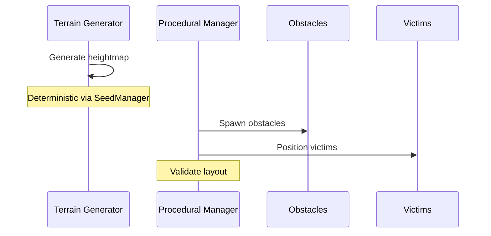
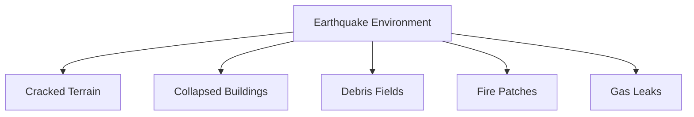
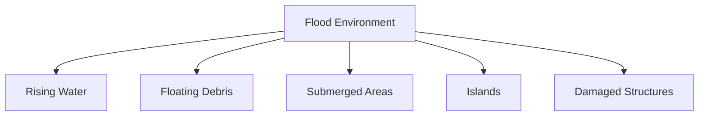
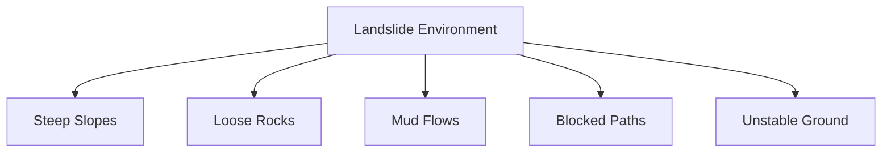
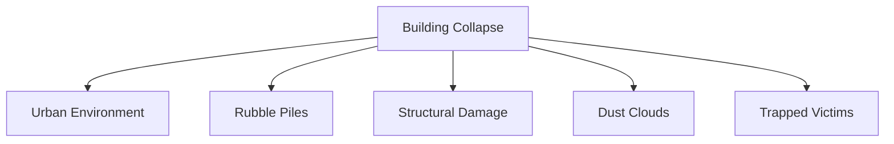
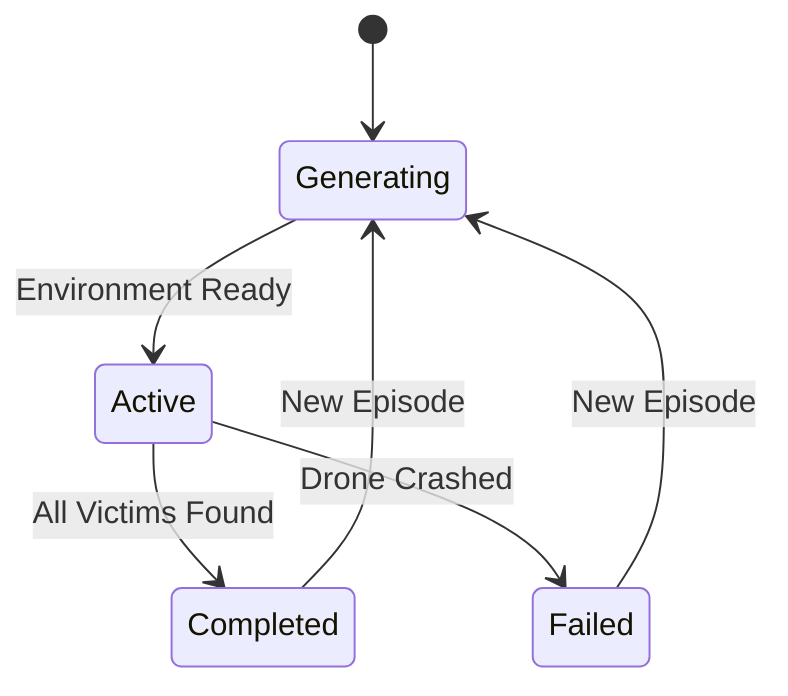

# 08 - Environment System

---

## Overview

The Environment System generates and manages procedurally created disaster environments. Each episode creates a unique world, forcing the AI to generalize rather than memorize.

---

## Foundation Layer

The Environment Foundation provides core infrastructure required by all environment systems.

### EnvironmentBootstrap

Static entry point (`ADRL.Environment.Core`) called during initialization:

```
Boot(WorldSettings, EventBus)  →  Creates [EnvironmentSystem] GameObject
                                   Adds EnvironmentManager component
                                   Publishes EnvironmentInitializingEvent
                                   Creates EnvironmentContext with seed + config
                                   Calls EnvironmentManager.Initialize()
                                   Shutdown(EventBus)  →  Destroys manager, resets context
                                                         Publishes EnvironmentShutdownEvent
```

### EnvironmentContext

Plain C# class holding shared runtime state for the current session:

| Property | Type | Description |
|----------|------|-------------|
| WorldSettings | WorldSettings | Active world configuration |
| ActiveSeed | int | Current deterministic seed |
| RuntimeState | EnvironmentState | Current lifecycle state |
| EpisodeElapsedTime | float | Time elapsed in current episode |
| CurrentEpisode | int | Episode counter |
| GeneratedTerrain | TerrainData | Generated terrain data reference |
| TerrainSize | Vector2 | Terrain dimensions (width, length) |

### WorldSettings

ScriptableObject (`[CreateAssetMenu]`) for world-level configuration:

| Field | Type | Default | Description |
|-------|------|---------|-------------|
| WorldSize | float | 200 | Total world dimension |
| PlayArea | float | 180 | Usable play area |
| SeedMode | SeedMode | Random | Fixed, Random, or TimeBased |
| FixedSeed | int | 0 | Seed when mode is Fixed |
| OverrideGravity | bool | false | Enable gravity override |
| GravityOverride | Vector3 | (0, -9.81, 0) | Custom gravity vector |
| EnableDebugLogs | bool | false | Toggle debug logging |
| ShowGizmos | bool | true | Toggle editor gizmos |
| SkipEnvironmentValidation | bool | false | Bypass validation |

### SeedManager

Static class for deterministic seed generation:

| Method | Description |
|--------|-------------|
| GenerateSeed() | Random seed via Environment.TickCount |
| GenerateSeed(int) | Fixed user-provided seed |
| GenerateSeed(WorldSettings) | Mode-based: Fixed → FixedSeed, TimeBased → UTC seconds, Random → TickCount |
| SetSeed(int) | Manual seed override |
| Reset() | Clear to zero |

Seed modes:
- **Fixed** — Deterministic reproduction with known seed
- **Random** — Unpredictable per-run seeds
- **TimeBased** — Reproducible for runs within same second

---

## Terrain Generation

The Terrain Generation Framework creates the physical ground surface for each environment. It runs before all other generation systems (obstacles, victims, hazards) so they have a surface to place objects on.

### TerrainSettings

ScriptableObject (`[CreateAssetMenu]`) for terrain-level configuration:

| Field | Type | Default | Description |
|-------|------|---------|-------------|
| TerrainWidth | float | 200 | World-space width |
| TerrainLength | float | 200 | World-space length |
| HeightmapResolution | int | 513 | Heightmap resolution (power of 2 + 1) |
| HeightScale | float | 50 | Maximum terrain height |
| NoiseScale | float | 0.02 | Perlin noise frequency |
| SeedOffset | int | 0 | Additional seed displacement |
| Octaves | int | 4 | Number of fBM octaves |
| Persistence | float | 0.5 | Amplitude multiplier per octave |
| Lacunarity | float | 2 | Frequency multiplier per octave |
| HeightMultiplier | float | 1 | Post-generation height scaling factor |
| UseFractalNoise | bool | true | Enable multi-octave fBM (false = single octave) |
| AutoGenerate | bool | true | Generate terrain during initialization |

### IHeightmapGenerator

Interface (`ADRL.Environment.Terrain`) for heightmap generation algorithms:

| Method | Description |
|--------|-------------|
| Generate(TerrainSettings, int seed, int resolution) | Returns normalized float[,] heightmap |

Pure height computation: no Unity Terrain objects, no GameObjects, no events, no lifecycle.

### HeightmapGenerator

Default implementation of IHeightmapGenerator using **fractal Brownian motion (fBM)** via multi-octave Perlin noise:

```
for each octave:
    frequency *= lacunarity
    amplitude *= persistence
    noiseValue += amplitude * PerlinNoise(x * frequency, z * frequency)
```

- Output clamped to [0, 1], then multiplied by HeightMultiplier
- Fully deterministic: identical settings + seed → identical heightmap
- Falls back to single-octave Perlin noise when UseFractalNoise = false
- Stateless: no references, no cleanup required

### TerrainGenerator

Concrete generator class (`ADRL.Environment.Terrain`) with deterministic heightmap generation:

| Member | Description |
|--------|-------------|
| Initialize(TerrainSettings) | Configure generator with settings |
| Generate(int seed, EventBus) | Create Unity Terrain with heightmap; publishes terrain events |
| Reset() | Destroy and release generated terrain |
| HeightmapGenerator (property) | IHeightmapGenerator instance; defaults to HeightmapGenerator if not set |

**Generation pipeline:**

```
EnvironmentBootstrap.Boot()
    ↓
EnvironmentManager.Initialize()
    ↓
InitializeTerrainGenerator()     ← terrain generated before objects
    ↓
TerrainGenerator.Initialize()
    ↓
HeightmapGenerator.Generate()    ← fBM Perlin heightmap (IHeightmapGenerator)
    ↓
TerrainData.SetHeights()
    ↓
Create Terrain GameObject (centered at origin)
    ↓
Publish TerrainGeneratedEvent
    ↓
InitializeProceduralGenerator()  ← objects placed on terrain
```

- Fully deterministic: identical seed + identical settings → identical terrain
- Terrain parented to `[EnvironmentSystem]` GameObject for lifecycle cleanup
- Procedural generation runs after terrain so objects have a surface

### Terrain Events

| Event | Description |
|-------|-------------|
| TerrainGenerationStartedEvent | Fired before heightmap generation begins |
| TerrainGeneratedEvent | Fired after terrain is fully built |
| TerrainGenerationFailedEvent | Fired if generation fails (carries a Reason string) |

---

## System Architecture

```mermaid
graph TD
    TG[Terrain Generator] -->|Heightmap| Terrain
    
    PGM[Procedural Generation Manager] --> O[Obstacle Generator]
    PGM --> V[Victim Spawner]
    PGM --> H[Hazard System]
    
    O -->|Prefabs| Rocks, Trees, Debris
    V -->|Positions| Victims
    H -->|Effects| Fire, Water
```

---

## Procedural Generation

### Why Procedural?

| Problem | Solution |
|---------|----------|
| AI memorizes single map | Random generation each episode |
| Overfitting to specific layouts | Diverse training environments |
| Limited replayability | Infinite environment variations |
| Unrealistic testing | More realistic disaster scenarios |

### Generation Process



---

## Terrain Generation

### Heightmap Algorithm

1. Generate base terrain using Perlin noise
2. Apply disaster-specific modifications
3. Create walkable areas for drone
4. Ensure boundary walls

### Terrain Types

| Disaster | Terrain Characteristics |
|----------|------------------------|
| Earthquake | Uneven, cracked surface, sinkholes |
| Flood | Flat with water bodies, muddy areas |
| Landslide | Steep slopes, loose debris |
| Collapse | Urban terrain, rubble piles |

---

## Building System

### Building Generation Rules

| Rule | Description |
|------|-------------|
| Minimum spacing | Buildings don't overlap |
| Random orientation | Different angles each episode |
| Varying sizes | Small, medium, large structures |
| Partial collapse | Some buildings are damaged |
| Interior access | Some buildings have openings |

### Building Types

- Residential houses
- Commercial buildings
- Warehouses
- Collapsed structures
- Partially damaged buildings

---

## Obstacle System

### Obstacle Types

| Type | Size | Movement | Hazard Level |
|------|------|----------|--------------|
| Rocks | Small-Large | Static | Medium |
| Trees | Medium | Static | Low |
| Debris | Small-Medium | Static | High |
| Rubble | Medium-Large | Static | High |
| Vehicles | Medium | Static | Medium |

### Placement Algorithm

1. Define no-fly zones (spawn, boundaries)
2. Randomly select obstacle positions
3. Check for overlaps
4. Verify drone can navigate around
5. Place obstacles with random rotations

---

## Victim System

### Victim Properties

```yaml
victim:
  position: random
  health: 50-100
  thermalSignature: 0.7-1.0
  detectionRadius: 10.0
  rescueRadius: 2.0
  isAlive: true
```

### Victim Behavior

| State | Behavior |
|-------|----------|
| Before detection | Stationary, emitting heat |
| After detection | Flagged in drone memory |
| During rescue | Requires proximity for duration |
| After rescue | Removed from environment |

---

## Disaster Environments

### 1. Earthquake



**Characteristics:**
- Uneven terrain with cracks
- Partially collapsed structures
- Scattered rubble
- Occasional fire hazards

### 2. Flood



**Characteristics:**
- Water-covered terrain
- Floating obstacles
- Limited flyable altitude
- Water level changes

### 3. Landslide



**Characteristics:**
- Mountainous terrain
- Rockfall hazards
- Narrow passages
- Loose debris

### 4. Building Collapse



**Characteristics:**
- Dense urban setting
- Multiple damaged structures
- Heavy debris
- Confined spaces

---

## Episode Lifecycle



---

## Navigation

| Document | Description |
|----------|-------------|
| [03_SYSTEM_DESIGN](03_SYSTEM_DESIGN.md) | System design overview |
| [09_SENSOR_SYSTEM](09_SENSOR_SYSTEM.md) | How sensors detect environment |
| [10_REWARD_SYSTEM](10_REWARD_SYSTEM.md) | Environmental rewards |

---

*Last updated: July 2026 — Phase 3.3 (Procedural Heightmap Generation)*
