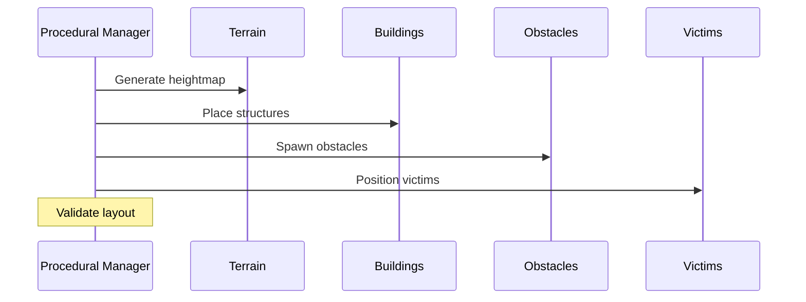
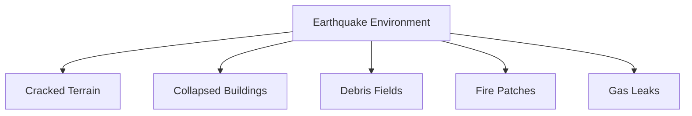
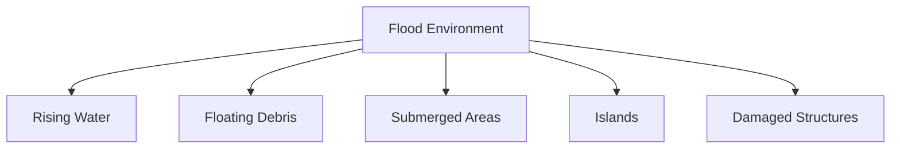
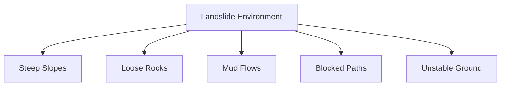
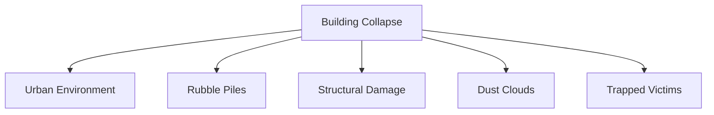
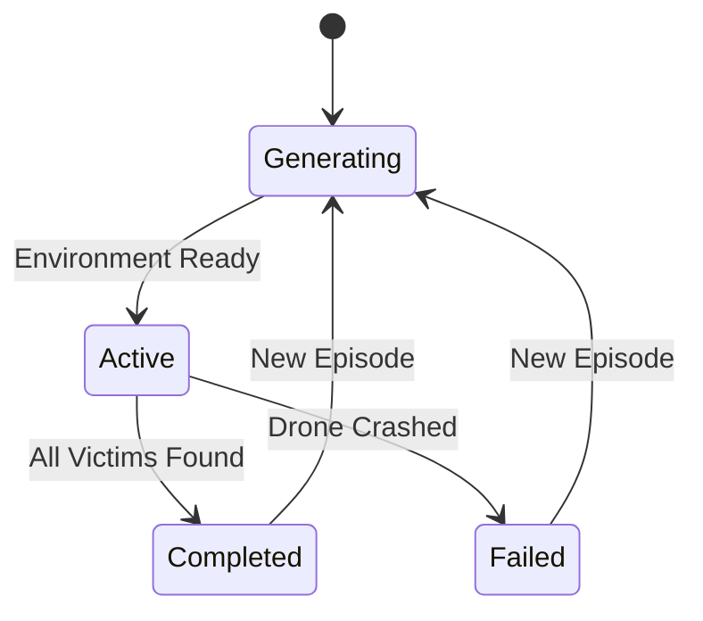

# 08 - Environment System

---

## Overview

The Environment System generates and manages procedurally created disaster environments. Each episode creates a unique world, forcing the AI to generalize rather than memorize.

---

## System Architecture

```mermaid
graph TD
    PGM[Procedural Generation Manager] --> T[Terrain Generator]
    PGM --> B[Building Generator]
    PGM --> O[Obstacle Generator]
    PGM --> V[Victim Spawner]
    PGM --> H[Hazard System]
    
    T -->|Heightmap| Terrain
    B -->|Prefabs| Buildings
    O -->|Prefabs| Rocks, Trees, Debris
    V -->|Positions| Victims
    H -->|Effects| Fire, Water
```

---

## Procedural Generation

### Why Procedural?

| Problem | Solution |
|---------|----------|
| AI memorizes single map | Random generation each episode |
| Overfitting to specific layouts | Diverse training environments |
| Limited replayability | Infinite environment variations |
| Unrealistic testing | More realistic disaster scenarios |

### Generation Process



---

## Terrain Generation

### Heightmap Algorithm

1. Generate base terrain using Perlin noise
2. Apply disaster-specific modifications
3. Create walkable areas for drone
4. Ensure boundary walls

### Terrain Types

| Disaster | Terrain Characteristics |
|----------|------------------------|
| Earthquake | Uneven, cracked surface, sinkholes |
| Flood | Flat with water bodies, muddy areas |
| Landslide | Steep slopes, loose debris |
| Collapse | Urban terrain, rubble piles |

---

## Building System

### Building Generation Rules

| Rule | Description |
|------|-------------|
| Minimum spacing | Buildings don't overlap |
| Random orientation | Different angles each episode |
| Varying sizes | Small, medium, large structures |
| Partial collapse | Some buildings are damaged |
| Interior access | Some buildings have openings |

### Building Types

- Residential houses
- Commercial buildings
- Warehouses
- Collapsed structures
- Partially damaged buildings

---

## Obstacle System

### Obstacle Types

| Type | Size | Movement | Hazard Level |
|------|------|----------|--------------|
| Rocks | Small-Large | Static | Medium |
| Trees | Medium | Static | Low |
| Debris | Small-Medium | Static | High |
| Rubble | Medium-Large | Static | High |
| Vehicles | Medium | Static | Medium |

### Placement Algorithm

1. Define no-fly zones (spawn, boundaries)
2. Randomly select obstacle positions
3. Check for overlaps
4. Verify drone can navigate around
5. Place obstacles with random rotations

---

## Victim System

### Victim Properties

```yaml
victim:
  position: random
  health: 50-100
  thermalSignature: 0.7-1.0
  detectionRadius: 10.0
  rescueRadius: 2.0
  isAlive: true
```

### Victim Behavior

| State | Behavior |
|-------|----------|
| Before detection | Stationary, emitting heat |
| After detection | Flagged in drone memory |
| During rescue | Requires proximity for duration |
| After rescue | Removed from environment |

---

## Disaster Environments

### 1. Earthquake



**Characteristics:**
- Uneven terrain with cracks
- Partially collapsed structures
- Scattered rubble
- Occasional fire hazards

### 2. Flood



**Characteristics:**
- Water-covered terrain
- Floating obstacles
- Limited flyable altitude
- Water level changes

### 3. Landslide



**Characteristics:**
- Mountainous terrain
- Rockfall hazards
- Narrow passages
- Loose debris

### 4. Building Collapse



**Characteristics:**
- Dense urban setting
- Multiple damaged structures
- Heavy debris
- Confined spaces

---

## Episode Lifecycle



---

## Navigation

| Document | Description |
|----------|-------------|
| [03_SYSTEM_DESIGN](03_SYSTEM_DESIGN.md) | System design overview |
| [09_SENSOR_SYSTEM](09_SENSOR_SYSTEM.md) | How sensors detect environment |
| [10_REWARD_SYSTEM](10_REWARD_SYSTEM.md) | Environmental rewards |

---

*Last updated: July 2026*
