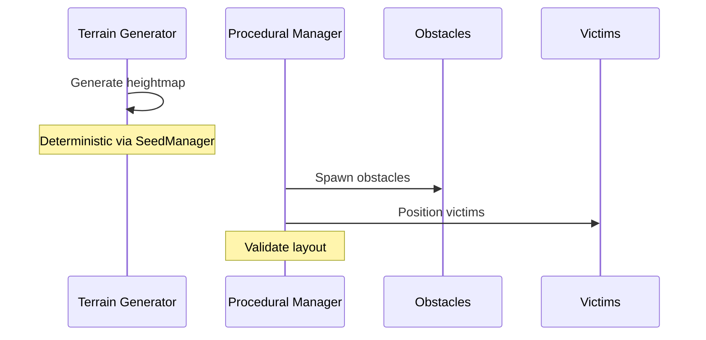
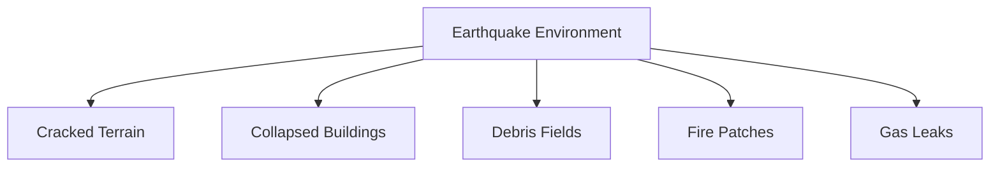
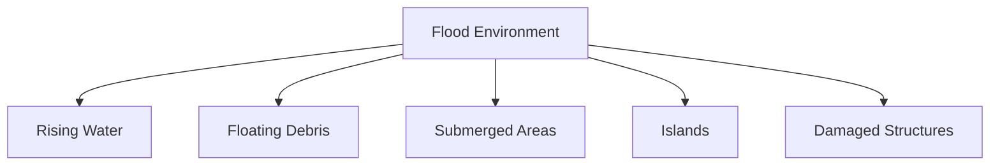
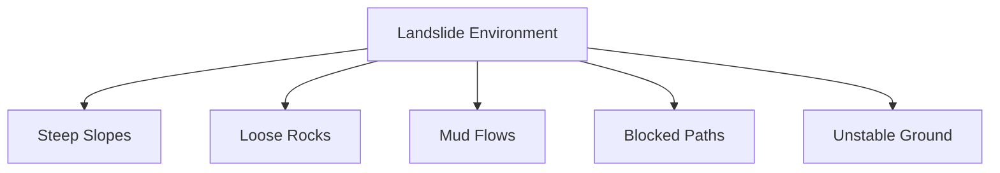
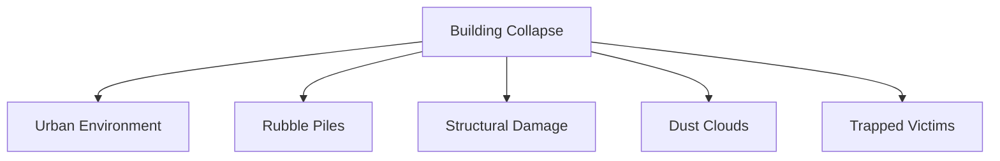
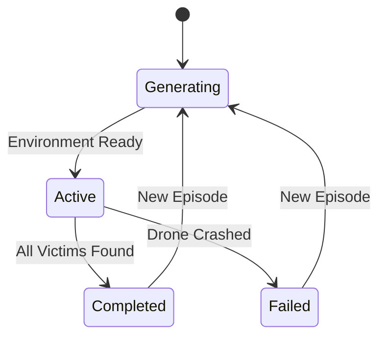

# 08 - Environment System

---

## Overview

The Environment System generates and manages procedurally created disaster environments. Each episode creates a unique world, forcing the AI to generalize rather than memorize.

---

## Foundation Layer

The Environment Foundation provides core infrastructure required by all environment systems.

### EnvironmentBootstrap

Static entry point (`ADRL.Environment.Core`) called during initialization:

```
Boot(WorldSettings, EventBus)  →  Creates [EnvironmentSystem] GameObject
                                   Adds EnvironmentManager component
                                   Publishes EnvironmentInitializingEvent
                                   Creates EnvironmentContext with seed + config
                                   Calls EnvironmentManager.Initialize()
                                   Shutdown(EventBus)  →  Destroys manager, resets context
                                                         Publishes EnvironmentShutdownEvent
```

### EnvironmentContext

Plain C# class holding shared runtime state for the current session:

| Property | Type | Description |
|----------|------|-------------|
| WorldSettings | WorldSettings | Active world configuration |
| ActiveSeed | int | Current deterministic seed |
| RuntimeState | EnvironmentState | Current lifecycle state |
| EpisodeElapsedTime | float | Time elapsed in current episode |
| CurrentEpisode | int | Episode counter |
| GeneratedTerrain | TerrainData | Generated terrain data reference |
| TerrainSize | Vector2 | Terrain dimensions (width, length) |
| RootTransform | Transform | `[EnvironmentSystem]` root transform |
| RuntimeRoot | Transform | Runtime world container |
| SystemsRoot | Transform | Systems container |
| SpawnRoot | Transform | Spawn point container |
| DebugRoot | Transform | Debug container |

### WorldSettings

ScriptableObject (`[CreateAssetMenu]`) for world-level configuration:

| Field | Type | Default | Description |
|-------|------|---------|-------------|
| WorldSize | float | 200 | Total world dimension |
| PlayArea | float | 180 | Usable play area |
| SeedMode | SeedMode | Random | Fixed, Random, or TimeBased |
| FixedSeed | int | 0 | Seed when mode is Fixed |
| OverrideGravity | bool | false | Enable gravity override |
| GravityOverride | Vector3 | (0, -9.81, 0) | Custom gravity vector |
| EnableDebugLogs | bool | false | Toggle debug logging |
| ShowGizmos | bool | true | Toggle editor gizmos |
| SkipEnvironmentValidation | bool | false | Bypass validation |

### SeedManager

Static class for deterministic seed generation:

| Method | Description |
|--------|-------------|
| GenerateSeed() | Random seed via Environment.TickCount |
| GenerateSeed(int) | Fixed user-provided seed |
| GenerateSeed(WorldSettings) | Mode-based: Fixed → FixedSeed, TimeBased → UTC seconds, Random → TickCount |
| SetSeed(int) | Manual seed override |
| Reset() | Clear to zero |

Seed modes:
- **Fixed** — Deterministic reproduction with known seed
- **Random** — Unpredictable per-run seeds
- **TimeBased** — Reproducible for runs within same second

### EnvironmentWorldBuilder

Plain C# class (`ADRL.Environment.Core`) responsible for constructing the runtime world hierarchy:

```
Build(Transform rootTransform)
    Creates child containers: Runtime, Systems, SpawnPoints, Debug
    Registered in EnvironmentContext after successful build
    Exception-safe: partial hierarchy destroyed on failure
```

| Member | Description |
|--------|-------------|
| Build(Transform) | Create 4 named child containers under root; throws on null root or duplicate build |
| Destroy() | Destroy all child containers, clear state |
| RuntimeRoot | Transform for runtime world objects |
| SystemsRoot | Transform for environment systems |
| SpawnRoot | Transform for spawn points |
| DebugRoot | Transform for debug objects |

- Hierarchy names centralized as `public const string` on EnvironmentWorldBuilder
- All containers created with `worldPositionStays: false` (clean local transforms)
- Editor-safe: `Application.isPlaying` guards `Destroy` vs `DestroyImmediate`
- Zero gameplay logic — pure structural hierarchy

**Integrated flow:**

```
EnvironmentManager.Initialize()
    ↓
InitializeTerrainGenerator()
    ↓
BuildWorld()                   ← creates Runtime, Systems, SpawnPoints, Debug containers
    ↓
InitializeProceduralGenerator()
    ↓
Publish EnvironmentInitializedEvent
```

**Exception safety:**

If `BuildWorld()` throws:
1. WorldBuilder.Destroy() tears down partially created hierarchy
2. WorldBuildingFailedEvent is published with the exception message
3. Pipeline continues (terrain and procedural generation unaffected)

**Events:**

| Event | Description |
|-------|-------------|
| WorldBuildingStartedEvent | Fired before hierarchy construction begins |
| WorldBuiltEvent | Fired after hierarchy is fully constructed |
| WorldBuildingFailedEvent | Fired if construction fails (carries a Reason string) |

---

## Terrain Generation

The Terrain Generation Framework creates the physical ground surface for each environment. It runs before all other generation systems (obstacles, victims, hazards) so they have a surface to place objects on.

### TerrainSettings

ScriptableObject (`[CreateAssetMenu]`) for terrain-level configuration:

| Field | Type | Default | Description |
|-------|------|---------|-------------|
| TerrainWidth | float | 200 | World-space width |
| TerrainLength | float | 200 | World-space length |
| HeightmapResolution | int | 513 | Heightmap resolution (power of 2 + 1) |
| HeightScale | float | 50 | Maximum terrain height |
| NoiseScale | float | 0.02 | Perlin noise frequency |
| SeedOffset | int | 0 | Additional seed displacement |
| Octaves | int | 4 | Number of fBM octaves |
| Persistence | float | 0.5 | Amplitude multiplier per octave |
| Lacunarity | float | 2 | Frequency multiplier per octave |
| HeightMultiplier | float | 1 | Post-generation height scaling factor |
| WarpStrength | float | 4 | Domain warp distortion magnitude (unused by FBM/Ridged) |
| WarpScale | float | 0.02 | Domain warp noise field frequency (unused by FBM/Ridged) |
| VoronoiCellSize | float | 8 | Voronoi cell size: larger = fewer cells (unused by FBM/Ridged/DomainWarp) |
| FbmWeight | float | 0.40 | Hybrid blend weight for FBM (unused by non-Hybrid algorithms) |
| RidgedWeight | float | 0.25 | Hybrid blend weight for Ridged (unused by non-Hybrid algorithms) |
| DomainWarpWeight | float | 0.20 | Hybrid blend weight for DomainWarp (unused by non-Hybrid algorithms) |
| VoronoiWeight | float | 0.15 | Hybrid blend weight for Voronoi (unused by non-Hybrid algorithms) |
| TerrainAlgorithm | TerrainAlgorithm | FBM | Algorithm selector (FBM, Ridged, DomainWarp, Voronoi, Hybrid) |
| UseFractalNoise | bool | true | Computed: true when TerrainAlgorithm is FBM (backward compatibility) |
| AutoGenerate | bool | true | Generate terrain during initialization |

### TerrainAlgorithm

Enum (`ADRL.Environment.Terrain`) for selecting the heightmap generation algorithm:

| Value | Implemented | Description |
|-------|-------------|-------------|
| FBM | ✅ | Fractal Brownian Motion via multi-octave Perlin noise |
| Ridged | ✅ | Ridged multi-fractal noise: centered Perlin + ridge transform + sharpened peaks |
| DomainWarp | ✅ | Domain warped noise: Perlin warp field distorts fBM sampling coordinates |
| Voronoi | ✅ | Voronoi (Worley) noise: cellular terrain via seed-hashed feature points |
| Hybrid | ✅ | Composes all 4 algorithms via weighted blend (FBM + Ridged + DomainWarp + Voronoi) |

### IHeightmapGenerator

Interface (`ADRL.Environment.Terrain`) for heightmap generation algorithms:

| Method | Description |
|--------|-------------|
| Generate(TerrainSettings, int seed, int resolution) | Returns normalized float[,] heightmap |

Pure height computation: no Unity Terrain objects, no GameObjects, no events, no lifecycle.

### HeightmapGeneratorFactory

Static factory (`ADRL.Environment.Terrain`) resolving algorithm to implementation:

| Method | Description |
|--------|-------------|
| Create(TerrainAlgorithm) | Returns IHeightmapGenerator for the given algorithm; throws NotSupportedException for unimplemented algorithms |

- Pure factory: no reflection, no singleton, no service locator, no Resources.Load
- Implements: FBM → FBMHeightmapGenerator, Ridged → RidgedHeightmapGenerator, DomainWarp → DomainWarpHeightmapGenerator, Voronoi → VoronoiHeightmapGenerator, Hybrid → HybridHeightmapGenerator
- All 5 TerrainAlgorithm values are now implemented — zero NotSupportedException cases remain

### FBMHeightmapGenerator

Implementation of IHeightmapGenerator using **fractal Brownian motion (fBM)** via multi-octave Perlin noise:

```
for each octave:
    frequency *= lacunarity
    amplitude *= persistence
    noiseValue += amplitude * PerlinNoise(x * frequency, z * frequency)
```

- Output clamped to [0, 1], then multiplied by HeightMultiplier
- Fully deterministic: identical settings + seed → identical heightmap
- Stateless: no references, no cleanup required

### RidgedHeightmapGenerator

Implementation of IHeightmapGenerator using **ridged multi-fractal noise**:

```
for each octave:
    signal = PerlinNoise(nx, nz)          // [0, 1]
    signal = (signal - 0.5) * 2           // center around zero [-1, 1]
    signal = 1 - |signal|                 // ridge transform — peaks at noise = 0.5
    signal = signal²                      // sharpen peaks
    noiseValue += signal * amplitude
    frequency *= lacunarity
    amplitude *= persistence
```

- Output clamped to [0, 1], then multiplied by HeightMultiplier
- Fully deterministic: identical settings + seed → identical heightmap
- Stateless: no references, no cleanup required
- Same fBM frequency/amplitude octave progression as FBMHeightmapGenerator

### DomainWarpHeightmapGenerator

Implementation of IHeightmapGenerator using **domain warped noise**:

```
// Warp field (sampled at WarpScale)
warpX = (PerlinNoise(warpNX, warpNZ) - 0.5) * 2        // [-1, 1]
warpZ = (PerlinNoise(warpNX + 500, warpNZ + 500) - 0.5) * 2  // [-1, 1]

// Warp base coordinates
sampleX = x * NoiseScale + warpX * WarpStrength
sampleZ = z * NoiseScale + warpZ * WarpStrength

// FBM at warped coordinates (same progression as FBMHeightmapGenerator)
for each octave:
    noiseValue += amplitude * PerlinNoise(sampleX * freq, sampleZ * freq)
    frequency *= lacunarity
    amplitude *= persistence
```

- Output clamped to [0, 1], then multiplied by HeightMultiplier
- Fully deterministic: identical settings + seed → identical heightmap
- Stateless: no references, no cleanup required
- Warp offsets use independent Perlin samples (seed-separated from fBM octave samples)
- WarpStrength = 0 produces standard fBM (degenerate case, valid)

### VoronoiHeightmapGenerator

Implementation of IHeightmapGenerator using **Voronoi (Worley) cellular noise**:

```
// For each sample (x, z):
cellX = floor(x / CellSize)
cellZ = floor(z / CellSize)

for each neighbor cell (nx, nz) in 3×3 neighborhood:
    // Feature point within cell (nx, nz), deterministic via cell-coordinate hash
    fx = nx + Hash(nx, nz, seed)
    fz = nz + Hash(nx, nz, seed + 1000)

    dx = (x / CellSize) - fx   // cell-relative distance
    dz = (z / CellSize) - fz
    dist = sqrt(dx² + dz²)
    track minimum distance

normalized = clamp(minDist / sqrt(2), 0, 1)
height = clamp((1 - normalized) * HeightMultiplier, 0, 1)
```

- Feature points at cell-internal random positions (valleys); cell edges form ridges
- Output clamped to [0, 1], then multiplied by HeightMultiplier
- Fully deterministic: identical settings + seed → identical heightmap
- Stateless: no references, no cleanup required
- Hash function: integer-only (no Perlin noise, no Unity Random, no System.Random)
- CellSize = 0.1 produces very dense cells; CellSize = 64 produces ~8 cells across heightmap

### HybridHeightmapGenerator

Implementation of IHeightmapGenerator using **composition** of all 4 existing algorithms:

```
// Generate each heightmap independently (delegates to existing generators)
hFBM     = FBMHeightmapGenerator.Generate(settings, seed, resolution)
hRidged  = RidgedHeightmapGenerator.Generate(settings, seed, resolution)
hWarp    = DomainWarpHeightmapGenerator.Generate(settings, seed, resolution)
hVoronoi = VoronoiHeightmapGenerator.Generate(settings, seed, resolution)

// Normalize weights (user does NOT need to sum to 1)
totalWeight = FbmWeight + RidgedWeight + DomainWarpWeight + VoronoiWeight

// Per-pixel blend
for each pixel:
    blended = (hFBM * FbmWeight + hRidged * RidgedWeight + hWarp * DomainWarpWeight + hVoronoi * VoronoiWeight) / totalWeight
    height = clamp(blended, 0, 1)
```

- Default weights: 40% FBM, 25% Ridged, 20% DomainWarp, 15% Voronoi
- Weight validation rejects negative values and zero total weight at runtime
- All 4 sub-generators are `static readonly` (instantiated once, stateless)
- Fully deterministic: all sub-generators are deterministic
- Each sub-generator receives identical settings, seed, and resolution
- Setting any weight to 0 removes that algorithm from the blend
- Open/Closed Principle validated: adding Hybrid required zero changes to any existing generator or pipeline code

### TerrainGenerator

Concrete generator class (`ADRL.Environment.Terrain`) with deterministic heightmap generation:

| Member | Description |
|--------|-------------|
| Initialize(TerrainSettings) | Configure generator with settings |
| Generate(int seed, EventBus) | Create Unity Terrain with heightmap; publishes terrain events |
| Reset() | Destroy and release generated terrain |
| HeightmapGenerator (property) | IHeightmapGenerator instance; defaults to factory-resolved generator via TerrainSettings.TerrainAlgorithm |

**Generation pipeline:**

```
EnvironmentBootstrap.Boot()
    ↓
EnvironmentManager.Initialize()
    ↓
InitializeTerrainGenerator()     ← terrain generated before objects
    ↓
TerrainGenerator.Initialize()
    ↓
TerrainSettings.TerrainAlgorithm
    ↓
HeightmapGeneratorFactory.Create()
    ↓
    Algorithm-specific Generate()     ← heightmap via IHeightmapGenerator (FBM / Ridged / DomainWarp / Voronoi / Hybrid)
    ↓
TerrainData.SetHeights()
    ↓
Create Terrain GameObject (centered at origin)
    ↓
Publish TerrainGeneratedEvent
    ↓
BuildWorld()                     ← create Runtime, Systems, SpawnPoints, Debug containers
    ↓
InitializeProceduralGenerator()  ← objects placed on terrain
```

- Fully deterministic: identical seed + identical settings → identical terrain
- Terrain parented to `[EnvironmentSystem]` GameObject for lifecycle cleanup
- Procedural generation runs after terrain so objects have a surface

### Terrain Events

| Event | Description |
|-------|-------------|
| TerrainGenerationStartedEvent | Fired before heightmap generation begins |
| TerrainGeneratedEvent | Fired after terrain is fully built |
| TerrainGenerationFailedEvent | Fired if generation fails (carries a Reason string) |

---

## System Architecture

```mermaid
graph TD
    TG[TerrainGenerator] --> F[HeightmapGeneratorFactory]
    F --> FBM[FBMHeightmapGenerator]
    F --> R[ RidgedHeightmapGenerator]
    F --> DW[DomainWarpHeightmapGenerator]
    F --> V[VoronoiHeightmapGenerator]
    F --> H[HybridHeightmapGenerator]
    FBM -->|Heightmap| Terrain
    R -->|Heightmap| Terrain
    DW -->|Heightmap| Terrain
    V -->|Heightmap| Terrain
    H -->|Heightmap| Terrain
    
    PGM[Procedural Generation Manager] --> O[Obstacle Generator]
    PGM --> V[Victim Spawner]
    PGM --> H[Hazard System]
    
    O -->|Prefabs| Rocks, Trees, Debris
    V -->|Positions| Victims
    H -->|Effects| Fire, Water
```

---

## Procedural Generation

### Why Procedural?

| Problem | Solution |
|---------|----------|
| AI memorizes single map | Random generation each episode |
| Overfitting to specific layouts | Diverse training environments |
| Limited replayability | Infinite environment variations |
| Unrealistic testing | More realistic disaster scenarios |

### Generation Process


```mermaid
sequenceDiagram
    participant TG as Terrain Generator
    participant P as Procedural Manager
    participant O as Obstacles
    participant V as Victims
    
    TG->>TG: Generate heightmap
    Note over TG: Deterministic via SeedManager
    
    P->>O: Spawn obstacles
    P->>V: Position victims
    Note over P: Validate layout
```

---

## Terrain Generation

### Heightmap Algorithm

1. Generate base terrain using Perlin noise
2. Apply disaster-specific modifications
3. Create walkable areas for drone
4. Ensure boundary walls

### Terrain Types

| Disaster | Terrain Characteristics |
|----------|------------------------|
| Earthquake | Uneven, cracked surface, sinkholes |
| Flood | Flat with water bodies, muddy areas |
| Landslide | Steep slopes, loose debris |
| Collapse | Urban terrain, rubble piles |

---

## Building System

### Building Generation Rules

| Rule | Description |
|------|-------------|
| Minimum spacing | Buildings don't overlap |
| Random orientation | Different angles each episode |
| Varying sizes | Small, medium, large structures |
| Partial collapse | Some buildings are damaged |
| Interior access | Some buildings have openings |

### Building Types

- Residential houses
- Commercial buildings
- Warehouses
- Collapsed structures
- Partially damaged buildings

---

## Obstacle System

### Obstacle Types

| Type | Size | Movement | Hazard Level |
|------|------|----------|--------------|
| Rocks | Small-Large | Static | Medium |
| Trees | Medium | Static | Low |
| Debris | Small-Medium | Static | High |
| Rubble | Medium-Large | Static | High |
| Vehicles | Medium | Static | Medium |

### Placement Algorithm

1. Define no-fly zones (spawn, boundaries)
2. Randomly select obstacle positions
3. Check for overlaps
4. Verify drone can navigate around
5. Place obstacles with random rotations

---

## Victim System

### Victim Properties

```yaml
victim:
  position: random
  health: 50-100
  thermalSignature: 0.7-1.0
  detectionRadius: 10.0
  rescueRadius: 2.0
  isAlive: true
```

### Victim Behavior

| State | Behavior |
|-------|----------|
| Before detection | Stationary, emitting heat |
| After detection | Flagged in drone memory |
| During rescue | Requires proximity for duration |
| After rescue | Removed from environment |

---

## Disaster Environments

### 1. Earthquake


```mermaid
graph TD
    A[Earthquake Environment] --> B[Cracked Terrain]
    A --> C[Collapsed Buildings]
    A --> D[Debris Fields]
    A --> E[Fire Patches]
    A --> F[Gas Leaks]
```

**Characteristics:**
- Uneven terrain with cracks
- Partially collapsed structures
- Scattered rubble
- Occasional fire hazards

### 2. Flood


```mermaid
graph TD
    A[Flood Environment] --> B[Rising Water]
    A --> C[Floating Debris]
    A --> D[Submerged Areas]
    A --> E[Islands]
    A --> F[Damaged Structures]
```

**Characteristics:**
- Water-covered terrain
- Floating obstacles
- Limited flyable altitude
- Water level changes

### 3. Landslide


```mermaid
graph TD
    A[Landslide Environment] --> B[Steep Slopes]
    A --> C[Loose Rocks]
    A --> D[Mud Flows]
    A --> E[Blocked Paths]
    A --> F[Unstable Ground]
```

**Characteristics:**
- Mountainous terrain
- Rockfall hazards
- Narrow passages
- Loose debris

### 4. Building Collapse


```mermaid
graph TD
    A[Building Collapse] --> B[Urban Environment]
    A --> C[Rubble Piles]
    A --> D[Structural Damage]
    A --> E[Dust Clouds]
    A --> F[Trapped Victims]
```

**Characteristics:**
- Dense urban setting
- Multiple damaged structures
- Heavy debris
- Confined spaces

---

## Episode Lifecycle


```mermaid
stateDiagram-v2
    [*] --> Generating
    Generating --> Active: Environment Ready
    Active --> Completed: All Victims Found
    Active --> Failed: Drone Crashed
    Completed --> Generating: New Episode
    Failed --> Generating: New Episode
```

---

## Navigation

| Document | Description |
|----------|-------------|
| [03_SYSTEM_DESIGN](03_SYSTEM_DESIGN.md) | System design overview |
| [09_SENSOR_SYSTEM](09_SENSOR_SYSTEM.md) | How sensors detect environment |
| [10_REWARD_SYSTEM](10_REWARD_SYSTEM.md) | Environmental rewards |

---

*Last updated: July 2026 — Phase 4.0 (Environment Runtime World Builder)*
