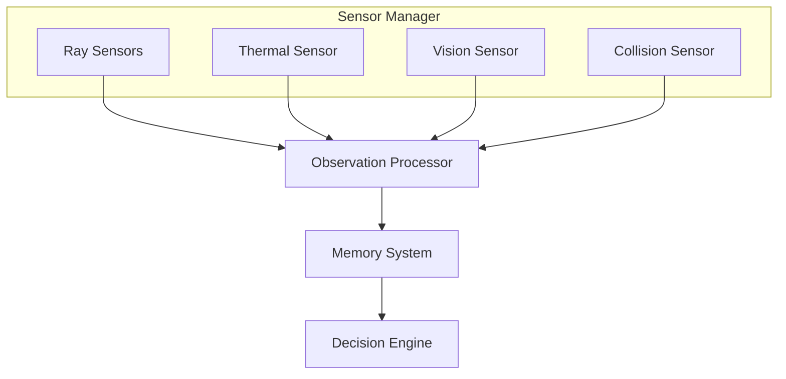
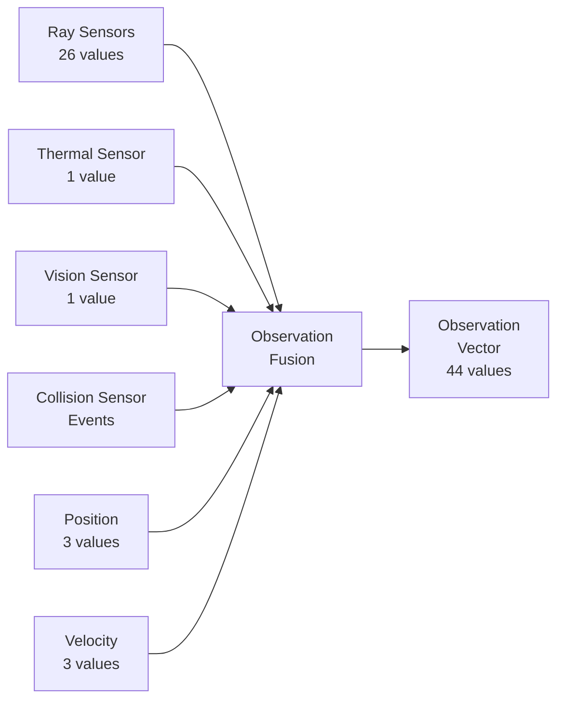

# 09 - Sensor System

---

## Overview

The Sensor System provides the drone with perception capabilities. The drone never "cheats" — it only knows what its sensors detect, just like a real autonomous system.

---

## Sensor Architecture



---

## Sensor Types

### 1. Ray Sensors

**Purpose:** Detect nearby obstacles and map the environment.

**Configuration:**
```yaml
raySensor:
  numRays: 13
  maxDistance: 10.0
  spreadAngle: 180.0
  layerMask: Obstacles
```

**Ray Layout:**
```
        Ray 0 (Left)
         ╲
          ╲
           ╲
    Ray 3 ── Ray 6 (Center) ── Ray 9
           ╱
          ╱
         ╱
        Ray 12 (Right)
```

**Data Output:**
| Ray | Direction | Description |
|-----|-----------|-------------|
| 0 | 90° Left | Far left |
| 1 | 75° Left | Left |
| 2 | 60° Left | Slightly left |
| 3 | 45° Left | Forward-left |
| 4 | 30° Left | Near forward-left |
| 5 | 15° Left | Forward |
| 6 | 0° Center | Dead ahead |
| 7 | 15° Right | Forward |
| 8 | 30° Right | Near forward-right |
| 9 | 45° Right | Forward-right |
| 10 | 60° Right | Slightly right |
| 11 | 75° Right | Right |
| 12 | 90° Right | Far right |

---

### 2. Thermal Sensor

**Purpose:** Detect body heat from victims.

**Configuration:**
```yaml
thermalSensor:
  range: 15.0
  fieldOfView: 120.0
  sensitivity: 0.7
  updateFrequency: 10
```

**Detection Logic:**
```
For each victim in range:
    distance = distance_to_drone(victim)
    strength = 1.0 - (distance / maxRange)
    if strength >= sensitivity:
        return strength
return 0.0
```

**Output:** Float value [0.0, 1.0] indicating thermal signature strength.

---

### 3. Vision Sensor

**Purpose:** Confirm victim presence within field of view.

**Configuration:**
```yaml
visionSensor:
  range: 20.0
  fieldOfView: 90.0
  updateFrequency: 10
```

**Detection Logic:**
```
For each victim in range:
    angle = angle_to_drone(victim)
    if angle <= fieldOfView / 2:
        return 1.0
return 0.0
```

**Output:** Binary [0.0, 1.0] indicating victim is visible.

---

### 4. Collision Sensor

**Purpose:** Detect impacts with obstacles.

**Configuration:**
```yaml
collisionSensor:
  detectionRadius: 0.5
  triggerMode: true
  layerMask: Obstacles
```

**Events:**
| Event | Description |
|-------|-------------|
| OnCollisionEnter | Drone hits obstacle |
| OnCollisionStay | Drone touching obstacle |
| OnCollisionExit | Drone separates from obstacle |

---

## Sensor Fusion

All sensor data is combined into a single observation vector:



---

## Observation Vector Layout

| Index | Count | Source | Description |
|-------|-------|--------|-------------|
| 0-2 | 3 | Position | World position (x, y, z) |
| 3-5 | 3 | Velocity | Current velocity (x, y, z) |
| 6-8 | 3 | Transform | Forward direction |
| 9-11 | 3 | Transform | Up direction |
| 12-24 | 13 | Ray Sensors | Distance to obstacles |
| 25-37 | 13 | Ray Sensors | Hit type encoding |
| 38 | 1 | Thermal | Heat signature strength |
| 39 | 1 | Vision | Victim in view |
| 40 | 1 | Physics | Current speed |
| 41-43 | 3 | Memory | Direction to nearest victim |

---

## Normalization

All observations are normalized to [-1, 1] or [0, 1] range:

| Observation | Raw Range | Normalized Range | Method |
|-------------|-----------|------------------|--------|
| Position | [-50, 50] | [-1, 1] | Linear |
| Velocity | [-10, 10] | [-1, 1] | Linear |
| Ray Distance | [0, 10] | [0, 1] | Linear |
| Thermal | [0, 1] | [0, 1] | As-is |
| Vision | [0, 1] | [0, 1] | As-is |
| Speed | [0, 10] | [0, 1] | Linear |

---

## Navigation

| Document | Description |
|----------|-------------|
| [06_AI_SYSTEM](06_AI_SYSTEM.md) | How AI uses sensor data |
| [07_DRONE_SYSTEM](07_DRONE_SYSTEM.md) | Drone system overview |
| [12_DATA_FLOW](12_DATA_FLOW.md) | Data flow diagrams |

---

*Last updated: July 2026*
