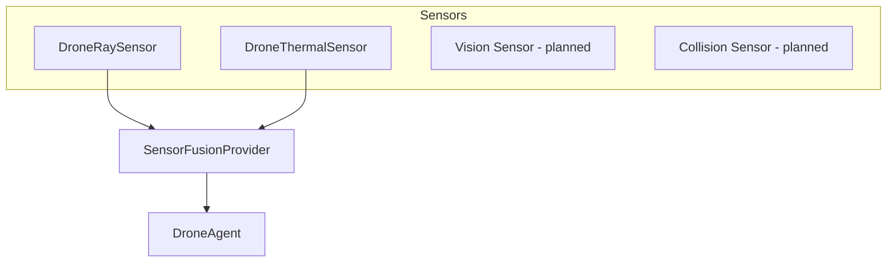
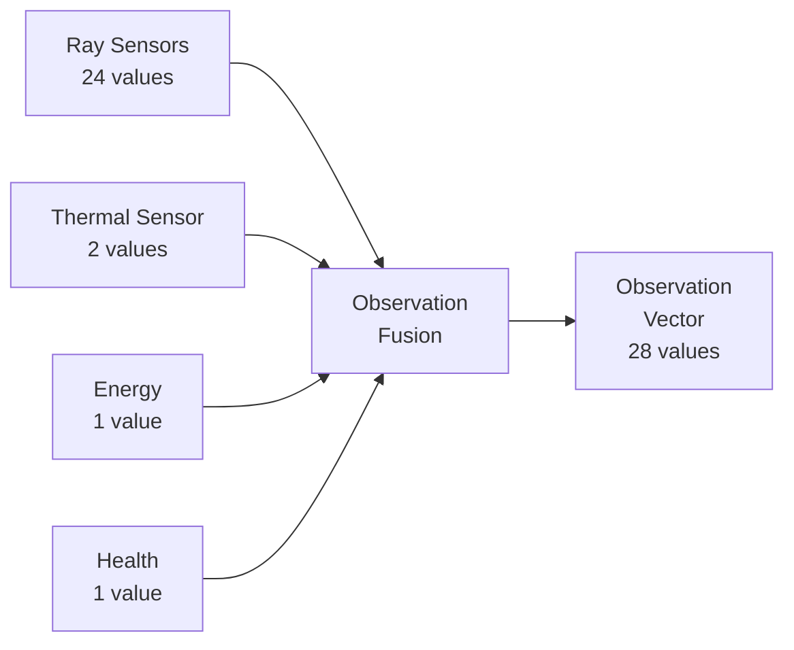

# 09 - Sensor System

---

## Overview

The Sensor System provides the drone with perception capabilities. The drone never "cheats" — it only knows what its sensors detect, just like a real autonomous system.

---

## Sensor Architecture


```mermaid
graph TD
    subgraph "Sensors"
        RS[DroneRaySensor]
        TS[DroneThermalSensor]
        VS[Vision Sensor - planned]
        CS[Collision Sensor - planned]
    end

    RS --> SF[SensorFusionProvider]
    TS --> SF

    SF --> AG[DroneAgent]
```

> The implemented sensor pipeline feeds `DroneRaySensor` and `DroneThermalSensor` readings into `SensorFusionProvider`, which concatenates them into the 28-value observation vector consumed by `DroneAgent`. Vision and Collision sensors remain planned (see [00_PROJECT_CHARTER](00_PROJECT_CHARTER.md)).

---

## Sensor Types

### 1. Ray Sensors

**Purpose:** Detect nearby obstacles and map the environment.

**Configuration:**
```yaml
raySensor:
  numRays: 12
  maxDistance: 50.0
  spreadAngle: 180.0
  layerMask: Obstacles
```

**Ray Layout:**
```
        Ray 0 (90° Left)
         ╲
          ╲
           ╲
    Ray 3 ── Ray 5/6 (Forward) ── Ray 8
           ╱
          ╱
         ╱
        Ray 11 (90° Right)
```

**Data Output:**
| Ray | Direction | Description |
|-----|-----------|-------------|
| 0 | 90° Left | Far left |
| 1 | 74° Left | Left |
| 2 | 57° Left | Slightly left |
| 3 | 41° Left | Forward-left |
| 4 | 25° Left | Near forward-left |
| 5 | 8° Left | Near forward |
| 6 | 8° Right | Near forward |
| 7 | 25° Right | Near forward-right |
| 8 | 41° Right | Forward-right |
| 9 | 57° Right | Slightly right |
| 10 | 74° Right | Right |
| 11 | 90° Right | Far right |

---

### 2. Thermal Sensor

**Purpose:** Detect body heat from victims.

**Configuration:**
```yaml
thermalSensor:
  range: 30.0
  fieldOfView: 120.0
  sensitivity: 0.7
  updateFrequency: 10
```

**Detection Logic:**
```
For each victim in range:
    distance = distance_to_drone(victim)
    strength = 1.0 - (distance / maxRange)
    if strength >= sensitivity:
        return strength
return 0.0
```

**Output:** Float value [0.0, 1.0] indicating thermal signature strength.

---

### 3. Vision Sensor

**Purpose:** Confirm victim presence within field of view.

**Configuration:**
```yaml
visionSensor:
  range: 40.0
  fieldOfView: 90.0
  updateFrequency: 10
```

**Detection Logic:**
```
For each victim in range:
    angle = angle_to_drone(victim)
    if angle <= fieldOfView / 2:
        return 1.0
return 0.0
```

**Output:** Binary [0.0, 1.0] indicating victim is visible.

---

### 4. Collision Sensor

**Purpose:** Detect impacts with obstacles.

**Configuration:**
```yaml
collisionSensor:
  detectionRadius: 0.5
  triggerMode: true
  layerMask: Obstacles
```

**Events:**
| Event | Description |
|-------|-------------|
| OnCollisionEnter | Drone hits obstacle |
| OnCollisionStay | Drone touching obstacle |
| OnCollisionExit | Drone separates from obstacle |

---

## Sensor Fusion

All sensor data is combined into a single observation vector:


```mermaid
graph LR
    RS[Ray Sensors<br/>24 values] --> OF[Observation<br/>Fusion]
    TS[Thermal Sensor<br/>2 values] --> OF
    EGY[Energy<br/>1 value] --> OF
    HLT[Health<br/>1 value] --> OF
    
    OF --> OV[Observation<br/>Vector<br/>28 values]
```

---

## Observation Vector Layout

| Index | Count | Source | Description |
|-------|-------|--------|-------------|
| 0-11 | 12 | Ray Sensors | Proximity reading per ray |
| 12-23 | 12 | Ray Sensors | Victim flag per ray |
| 24-25 | 2 | Thermal | Victim presence + proximity |
| 26 | 1 | Energy | Normalized battery level |
| 27 | 1 | Health | Normalized drone health |

---

## Normalization

All observations are normalized to [0, 1] range:

| Observation | Raw Range | Normalized Range | Method |
|-------------|-----------|------------------|--------|
| Ray Proximity | [0, 1] | [0, 1] | As-is |
| Ray Victim Flag | [0, 1] | [0, 1] | As-is |
| Thermal | [0, 1] | [0, 1] | As-is |
| Energy | [0, 1] | [0, 1] | As-is |
| Health | [0, 1] | [0, 1] | As-is |

---

## Navigation

| Document | Description |
|----------|-------------|
| [06_AI_SYSTEM](06_AI_SYSTEM.md) | How AI uses sensor data |
| [07_DRONE_SYSTEM](07_DRONE_SYSTEM.md) | Drone system overview |
| [12_DATA_FLOW](12_DATA_FLOW.md) | Data flow diagrams |

---

*Last updated: July 2026*
