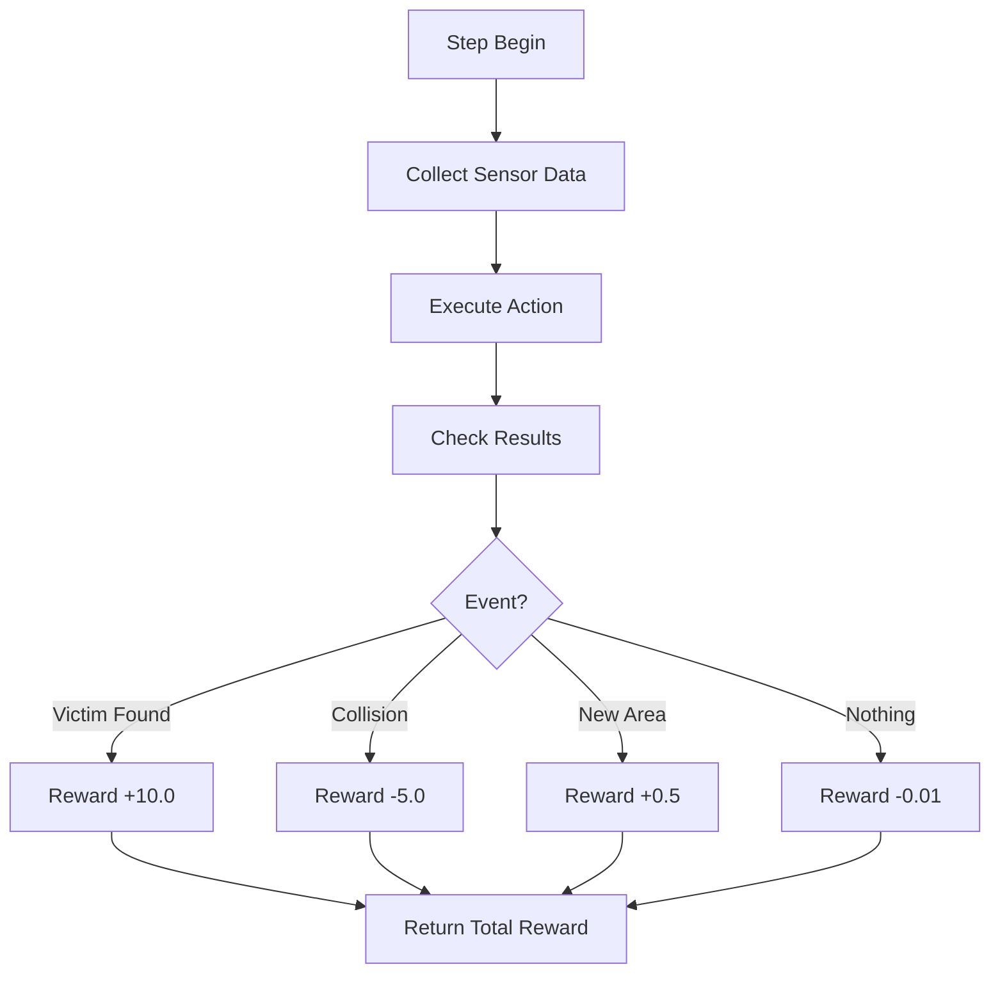

# 10 - Reward System

---

## Overview

The Reward System is the feedback mechanism that teaches the drone what behaviors are desirable. It is the most critical component for training success.

---

## Reward Design Philosophy

### Principles

1. **Sparse vs Dense Balance** — Provide enough signal without overwhelming
2. **Shaping Rewards** — Guide learning with intermediate rewards
3. **Penalty Design** — Discourage unsafe behaviors
4. **Curriculum Learning** — Increase complexity over time

---

## Reward Structure

### Positive Rewards

| Reward | Value | Trigger | Purpose |
|--------|-------|---------|---------|
| Victim Found | +10.0 | Thermal sensor detects victim | Primary objective |
| Victim Rescued | +25.0 | Drone reaches victim | Complete rescue |
| New Area Explored | +0.5 | Visit unvisited position | Encourage exploration |
| Forward Progress | +0.1 | Moving toward unexplored area | Efficient movement |
| Sensor Detection | +1.0 | Vision sensor confirms victim | Multi-sensor agreement |

### Negative Rewards

| Reward | Value | Trigger | Purpose |
|--------|-------|---------|---------|
| Collision | -5.0 | Touch obstacle | Safety |
| Out of Bounds | -10.0 | Leave environment | Boundary respect |
| Time Penalty | -0.01 | Every step | Efficiency |
| Stuck Penalty | -2.0 | No movement for 50 steps | Prevent stagnation |
| Repeated Path | -0.5 | Revisit same location | Efficient exploration |
| Falling | -3.0 | Drop below minimum height | Altitude maintenance |

---

## Reward Calculation Flow



---

## Reward Categories

### 1. Task Rewards (Primary)

The main objective rewards that drive the drone toward completing its mission.

| Reward | Weight | Description |
|--------|--------|-------------|
| Victim Found | 10.0 | First detection of a victim |
| Victim Rescued | 25.0 | Successful rescue operation |

### 2. Exploration Rewards (Secondary)

Rewards that encourage efficient environment coverage.

| Reward | Weight | Description |
|--------|--------|-------------|
| New Area | 0.5 | Visiting previously unexplored positions |
| Forward Progress | 0.1 | Moving toward unexplored regions |

### 3. Safety Rewards (Tertiary)

Penalties that discourage dangerous behaviors.

| Reward | Weight | Description |
|--------|--------|-------------|
| Collision | -5.0 | Impact with obstacles |
| Out of Bounds | -10.0 | Leaving the environment |
| Falling | -3.0 | Dropping too low |

### 4. Efficiency Rewards

Rewards that promote optimal behavior patterns.

| Reward | Weight | Description |
|--------|--------|-------------|
| Time Penalty | -0.01 | Per-step cost |
| Stuck Penalty | -2.0 | No movement penalty |
| Repeated Path | -0.5 | Redundant exploration |

---

## Reward Function Implementation

```csharp
// Pseudocode for reward calculation
float CalculateReward(DroneState state, Action action)
{
    float reward = 0.0f;

    // Task rewards
    if (state.VictimDetected && !state.VictimPreviouslyDetected)
        reward += 10.0f;

    if (state.VictimRescued)
        reward += 25.0f;

    // Exploration rewards
    if (state.IsNewPosition)
        reward += 0.5f;

    if (state.MovingTowardUnexplored)
        reward += 0.1f;

    // Safety penalties
    if (state.CollisionOccurred)
        reward -= 5.0f;

    if (state.IsOutOfBounds)
        reward -= 10.0f;

    // Efficiency penalties
    reward -= 0.01f; // Time penalty

    if (state.IsStuck)
        reward -= 2.0f;

    if (state.RepeatedPath)
        reward -= 0.5f;

    return reward;
}
```

---

## Curriculum Learning

Training difficulty increases over time:

| Stage | Environments | Max Steps | Complexity |
|-------|--------------|-----------|------------|
| 1 | Empty room | 500 | Basic navigation |
| 2 | Simple obstacles | 1000 | Obstacle avoidance |
| 3 | Multiple victims | 2000 | Victim detection |
| 4 | Complex disaster | 3000 | Full scenario |
| 5 | All disaster types | 5000 | Generalization |

---

## Reward Monitoring

### TensorBoard Metrics

| Metric | Description |
|--------|-------------|
| Episode/Reward | Total reward per episode |
| Reward/VictimFound | Victim detection frequency |
| Reward/Collisions | Collision frequency |
| Reward/Exploration | New area discovery rate |
| Episode/Length | Steps per episode |

### Success Criteria

| Metric | Target | Description |
|--------|--------|-------------|
| Average Reward | > 50 | Consistent positive rewards |
| Victim Detection | > 80% | Find most victims |
| Collision Rate | < 10% | Safe navigation |
| Episode Length | > 1000 | Sustained operation |

---

## Navigation

| Document | Description |
|----------|-------------|
| [06_AI_SYSTEM](06_AI_SYSTEM.md) | AI system overview |
| [11_TRAINING_PIPELINE](11_TRAINING_PIPELINE.md) | Training workflow |
| [12_DATA_FLOW](12_DATA_FLOW.md) | Data flow diagrams |

---

*Last updated: July 2026*
