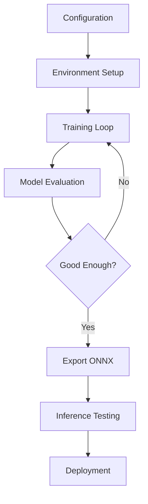
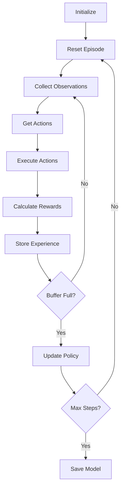

# 11 - Training Pipeline

---

## Overview

The Training Pipeline manages the complete lifecycle of training the PPO model, from configuration to deployment.

---

## Pipeline Architecture



---

## Pipeline Stages

### Stage 1: Configuration

Define training parameters and environment settings.

**Configuration File:**
```yaml
# drone_training.yaml
behaviors:
  DroneBehavior:
    trainer_type: ppo
    hyperparameters:
      batch_size: 1024
      buffer_size: 10240
      learning_rate: 0.0003
      beta: 0.005
      epsilon: 0.2
      lambd: 0.95
      num_epoch: 3
    network_settings:
      normalize: true
      hidden_units: 256
      num_layers: 2
    reward_signals:
      extrinsic:
        gamma: 0.99
        strength: 1.0
    max_steps: 5000000
    time_horizon: 64
    summary_freq: 10000
    keep_checkpoints: 5
```

### Stage 2: Environment Setup

Prepare Unity environment for training.

**Steps:**
1. Launch Unity in training mode
2. Initialize multiple environment instances
3. Configure parallel training
4. Set random seeds for reproducibility

### Stage 3: Training Loop



### Stage 4: Model Evaluation

Assess model performance on held-out environments.

**Metrics:**
| Metric | Target | Description |
|--------|--------|-------------|
| Mean Reward | > 50 | Average episode reward |
| Success Rate | > 80% | Episodes with rescue |
| Collision Rate | < 10% | Safe operation |
| Episode Length | > 1000 | Sustained behavior |

### Stage 5: Export

Convert trained model to ONNX format.

```bash
# Export command
mlagents-learn config.yaml --run-id=drone_v1 --env=UnityEnvironment

# Output
results/drone_v1/Drone.onnx
```

### Stage 6: Inference Testing

Test the exported model in Unity without training.

**Tests:**
1. Single environment test
2. Multiple disaster types
3. Edge cases
4. Performance measurement

---

## Training Commands

### Start Training

```bash
# Basic training
mlagents-learn config/drone_training.yaml --run-id=drone_v1

# With Unity environment
mlagents-learn config/drone_training.yaml --run-id=drone_v1 --env=./build/ADRL-Rescue

# Headless mode (no graphics)
mlagents-learn config/drone_training.yaml --run-id=drone_v1 --no-graphics
```

### Monitor Training

```bash
# TensorBoard
tensorboard --logdir=results

# Open browser to http://localhost:6006
```

### Resume Training

```bash
# Continue from checkpoint
mlagents-learn config/drone_training.yaml --run-id=drone_v1 --initialize-from=drone_v1
```

---

## Parallel Training

### Why Parallel?

| Benefit | Description |
|---------|-------------|
| Faster data collection | Multiple environments generate experience simultaneously |
| Better generalization | Diverse experiences per training step |
| Stable training | More diverse samples in each batch |

### Configuration

```yaml
environment_settings:
  num_envs: 4  # Run 4 environments in parallel
```

---

## Hyperparameter Tuning

### Key Parameters

| Parameter | Default | Range | Impact |
|-----------|---------|-------|--------|
| learning_rate | 0.0003 | 1e-5 to 1e-3 | Speed vs stability |
| batch_size | 1024 | 128 to 4096 | Memory vs stability |
| buffer_size | 10240 | 1024 to 100000 | Data diversity |
| gamma | 0.99 | 0.9 to 0.999 | Future reward importance |
| hidden_units | 256 | 64 to 1024 | Model capacity |

### Tuning Strategy

1. Start with defaults
2. Train for 100k steps
3. Check TensorBoard metrics
4. Adjust one parameter at a time
5. Repeat until satisfactory

---

## Training Infrastructure

### Hardware Requirements

| Component | Minimum | Recommended |
|-----------|---------|-------------|
| CPU | 4 cores | 8+ cores |
| RAM | 8 GB | 16+ GB |
| GPU | GTX 1060 | RTX 3060+ |
| Storage | 10 GB | 50+ GB |

### Software Requirements

| Software | Version | Purpose |
|----------|---------|---------|
| Python | 3.8+ | Training scripts |
| Unity | 2022.3 LTS | Environment |
| ML-Agents | 1.0+ | RL framework |
| PyTorch | 2.0+ | Deep learning |
| TensorBoard | 2.10+ | Monitoring |

---

## Navigation

| Document | Description |
|----------|-------------|
| [06_AI_SYSTEM](06_AI_SYSTEM.md) | AI system details |
| [10_REWARD_SYSTEM](10_REWARD_SYSTEM.md) | Reward function |
| [12_DATA_FLOW](12_DATA_FLOW.md) | Data flow |

---

*Last updated: July 2026*
