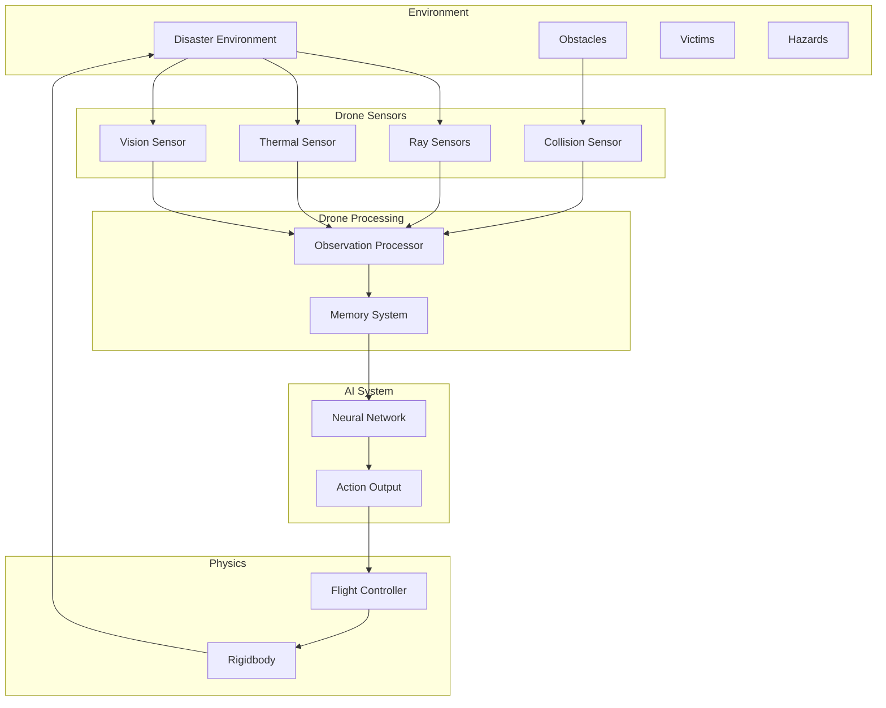
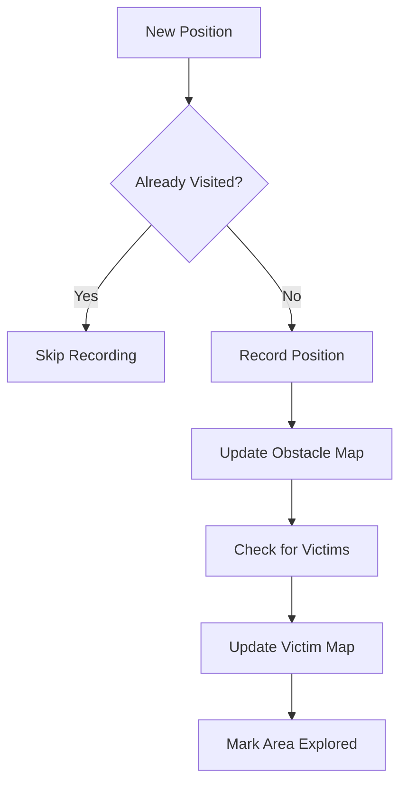

# 12 - Data Flow

---

## Overview

This document describes how data flows through the ADRL-Rescue system, from sensor input to action output.

---

## High-Level Data Flow



---

## Step-by-Step Data Flow

### Step 1: Environment Observation

```
Environment State
├── Obstacle positions
├── Victim positions
├── Hazard locations
└── Terrain data
```

### Step 2: Sensor Collection

```
Raw Sensor Data
├── Ray Sensors: [13 float distances]
├── Thermal Sensor: [1 float strength]
├── Vision Sensor: [1 float detection]
├── Collision Sensor: [bool impact]
└── Physics: [position, velocity, rotation]
```

### Step 3: Observation Processing

```
Processed Observations
├── Normalize all values to [-1, 1] or [0, 1]
├── Combine into single vector
├── Handle missing data
└── Output: float[44] observation vector
```

### Step 4: Memory Update

```
Memory Update
├── Record current position
├── Update obstacle map
├── Update victim locations
├── Mark area as explored
└── Query nearest unexplored area
```

### Step 5: AI Decision

```
Neural Network
├── Input: float[44] observations
├── Hidden Layer 1: 256 neurons (ReLU)
├── Hidden Layer 2: 256 neurons (ReLU)
├── Output: float[4] actions
└── Actions: [MoveX, MoveY, MoveZ, RotateY]
```

### Step 6: Physics Execution

```
Flight Controller
├── Receive action vector
├── Apply forces to rigidbody
├── Apply rotation
├── Enforce limits
└── Update transform
```

### Step 7: Reward Calculation

```
Reward Signal
├── Check for events
├── Calculate reward components
├── Sum total reward
└── Return to training system
```

---

## Data Formats

### Observation Vector

```csharp
float[] observations = new float[44]
{
    // Position (3)
    position.x, position.y, position.z,
    
    // Velocity (3)
    velocity.x, velocity.y, velocity.z,
    
    // Forward Direction (3)
    transform.forward.x, transform.forward.y, transform.forward.z,
    
    // Up Direction (3)
    transform.up.x, transform.up.y, transform.up.z,
    
    // Ray Sensors - Distances (13)
    ray0Dist, ray1Dist, ray2Dist, ... ray12Dist,
    
    // Ray Sensors - Hits (13)
    ray0Hit, ray1Hit, ray2Hit, ... ray12Hit,
    
    // Thermal (1)
    thermalStrength,
    
    // Vision (1)
    visionDetection,
    
    // Speed (1)
    currentSpeed,
    
    // Target Direction (3)
    targetDir.x, targetDir.y, targetDir.z
};
```

### Action Vector

```csharp
float[] actions = new float[4]
{
    moveX,    // [-1, 1] Left/Right
    moveY,    // [-1, 1] Up/Down
    moveZ,    // [-1, 1] Forward/Back
    rotateY   // [-1, 1] Yaw rotation
};
```

### Reward Signal

```csharp
float reward = 0.0f;

// Task rewards
if (victimDetected) reward += 10.0f;
if (victimRescued) reward += 25.0f;

// Exploration rewards
if (newArea) reward += 0.5f;

// Safety penalties
if (collision) reward -= 5.0f;
if (outOfBounds) reward -= 10.0f;

// Efficiency penalties
reward -= 0.01f; // Time penalty
```

---

## Data Timing

| Phase | Frequency | Description |
|-------|-----------|-------------|
| Sensor Update | Every FixedUpdate (50Hz) | Collect sensor data |
| Observation | Every FixedUpdate (50Hz) | Process observations |
| Decision | Every FixedUpdate (50Hz) | Get AI actions |
| Physics | Every FixedUpdate (50Hz) | Apply forces |
| Reward | Every step | Calculate rewards |
| Training | Every N steps | Update policy |

---

## Memory Flow



---

## Navigation

| Document | Description |
|----------|-------------|
| [02_PROJECT_ARCHITECTURE](02_PROJECT_ARCHITECTURE.md) | System architecture |
| [06_AI_SYSTEM](06_AI_SYSTEM.md) | AI system details |
| [09_SENSOR_SYSTEM](09_SENSOR_SYSTEM.md) | Sensor details |

---

*Last updated: July 2026*
