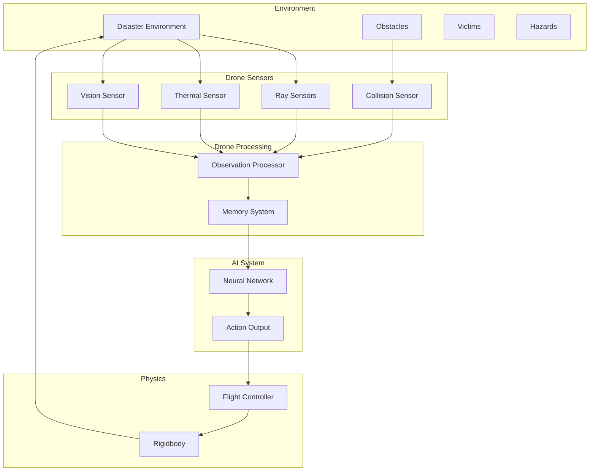
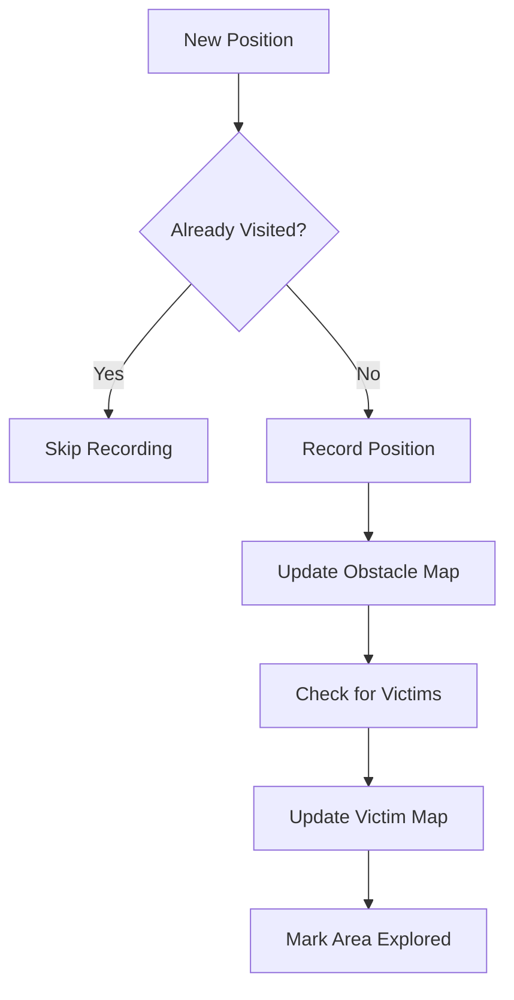

# 12 - Data Flow

---

## Overview

This document describes how data flows through the ADRL-Rescue system, from sensor input to action output.

---

## High-Level Data Flow


```mermaid
graph TD
    subgraph "Environment"
        ENV[Disaster Environment]
        OBS[Obstacles]
        VIC[Victims]
        HAZ[Hazards]
    end
    
    subgraph "Drone Sensors"
        RS[Ray Sensors]
        TS[Thermal Sensor]
        VS[Vision Sensor]
        CS[Collision Sensor]
    end
    
    subgraph "Drone Processing"
        OP[Observation Processor]
        MEM[Memory System]
    end
    
    subgraph "AI System"
        NN[Neural Network]
        ACT[Action Output]
    end
    
    subgraph "Physics"
        FC[Flight Controller]
        RB[Rigidbody]
    end
    
    ENV --> RS
    ENV --> TS
    ENV --> VS
    OBS --> CS
    
    RS --> OP
    TS --> OP
    VS --> OP
    CS --> OP
    
    OP --> MEM
    MEM --> NN
    NN --> ACT
    ACT --> FC
    FC --> RB
    RB --> ENV
```

---

## Step-by-Step Data Flow

### Step 1: Environment Observation

```
Environment State
├── Obstacle positions
├── Victim positions
├── Hazard locations
└── Terrain data
```

### Step 2: Sensor Collection

```
Raw Sensor Data
├── Ray Sensors: [13 float distances]
├── Thermal Sensor: [1 float strength]
├── Vision Sensor: [1 float detection]
├── Collision Sensor: [bool impact]
└── Physics: [position, velocity, rotation]
```

### Step 3: Observation Processing

```
Processed Observations
├── Normalize all values to [-1, 1] or [0, 1]
├── Combine into single vector
├── Handle missing data
└── Output: float[28] observation vector
```

### Step 4: Memory Update

```
Memory Update
├── Record current position
├── Update obstacle map
├── Update victim locations
├── Mark area as explored
└── Query nearest unexplored area
```

### Step 5: AI Decision

```
Neural Network
├── Input: float[28] observations
├── Hidden Layer 1: 256 neurons (ReLU)
├── Hidden Layer 2: 256 neurons (ReLU)
├── Output: float[4] actions
└── Actions: [MoveX, MoveY, MoveZ, RotateY]
```

### Step 6: Physics Execution

```
Flight Controller
├── Receive action vector
├── Apply forces to rigidbody
├── Apply rotation
├── Enforce limits
└── Update transform
```

### Step 7: Reward Calculation

```
Reward Signal
├── Check for events
├── Calculate reward components
├── Sum total reward
└── Return to training system
```

---

## Data Formats

### Observation Vector

```csharp
float[] observations = new float[28]
{
    // Ray Sensors - Proximity (12)
    ray0Prox, ray1Prox, ray2Prox, ... ray11Prox,

    // Ray Sensors - Victim Flag (12)
    ray0Victim, ray1Victim, ray2Victim, ... ray11Victim,

    // Thermal (2)
    thermalPresence, thermalProximity,

    // Energy (1)
    currentEnergy,

    // Health (1)
    currentHealth
};
```

### Action Vector

```csharp
float[] actions = new float[4]
{
    moveX,    // [-1, 1] Left/Right
    moveY,    // [-1, 1] Up/Down
    moveZ,    // [-1, 1] Forward/Back
    rotateY   // [-1, 1] Yaw rotation
};
```

### Reward Signal

Continuous rewards are accumulated per step in `RewardEvaluator.UpdateStep`, then
scaled and clipped before reaching the `IRewardSink`. Terminal rewards arrive via
`EventBus` subscriptions (filtered by drone id) and are granted verbatim.

```csharp
// Continuous path — per step (RewardEvaluator.UpdateStep)
float reward = 0.0f;

reward += _config.TimePenalty * dt;              // -0.01/s time cost

if (visitedCells.Add(CellOf(position)))          // novelty per new cell (2 m)
    reward += _config.NoveltyBonus;              // +0.05 per cell

if (shapingEnabled)                              // potential shaping
    reward += _config.ShapingScale * (_config.ShapingGamma * newCount - oldCount);

if (stuck) reward += _config.StuckPenalty;       // -0.5 over 2 s window
if (oscillating) reward += _config.OscillationPenalty; // -0.5 over 2 s window

reward = reward * _config.RewardScale;           // scale
if (reward < _config.MinStepReward) reward = _config.MinStepReward; // clip

// Terminal path — EventBus events (verbatim)
// VictimFound +10.0 | VictimRescued +20.0 | Collision -5.0
// OutOfBounds -10.0 | EnergyDepleted -15.0 | Success +50.0
```

---

## Data Timing

| Phase | Frequency | Description |
|-------|-----------|-------------|
| Sensor Update | Every FixedUpdate (50Hz) | Collect sensor data |
| Observation | Every FixedUpdate (50Hz) | Process observations |
| Decision | Every FixedUpdate (50Hz) | Get AI actions |
| Physics | Every FixedUpdate (50Hz) | Apply forces |
| Reward | Every step | Calculate rewards |
| Training | Every N steps | Update policy |

---

## Memory Flow


```mermaid
graph TD
    A[New Position] --> B{Already Visited?}
    B -->|Yes| C[Skip Recording]
    B -->|No| D[Record Position]
    D --> E[Update Obstacle Map]
    E --> F[Check for Victims]
    F --> G[Update Victim Map]
    G --> H[Mark Area Explored]
```

---

## Navigation

| Document | Description |
|----------|-------------|
| [02_PROJECT_ARCHITECTURE](02_PROJECT_ARCHITECTURE.md) | System architecture |
| [06_AI_SYSTEM](06_AI_SYSTEM.md) | AI system details |
| [09_SENSOR_SYSTEM](09_SENSOR_SYSTEM.md) | Sensor details |

---

*Last updated: July 2026*
