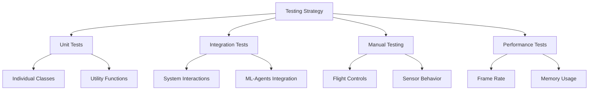

# 15 - Testing Guide

---

## Overview

This document describes the testing strategy and procedures for ADRL-Rescue.

---

## Testing Strategy


```mermaid
graph TD
    A[Testing Strategy] --> B[Unit Tests]
    A --> C[Integration Tests]
    A --> D[Manual Testing]
    A --> E[Performance Tests]
    
    B --> B1[Individual Classes]
    B --> B2[Utility Functions]
    
    C --> C1[System Interactions]
    C --> C2[ML-Agents Integration]
    
    D --> D1[Flight Controls]
    D --> D2[Sensor Behavior]
    
    E --> E1[Frame Rate]
    E --> E2[Memory Usage]
```

---

## Test Types

### 1. Unit Tests

Test individual components in isolation.

**Examples:**
| Component | Test | Expected |
|-----------|------|----------|
| RewardEvaluator | UpdateStep continuous rewards | Scaled, clipped, pushed to sink |
| RewardEvaluator | Collision event terminal reward | Returns -5.0 |
| DroneRaySensor | Raycast proximity reading | Clamped distance in [0, 1] |
| DroneThermalSensor | Victim presence + proximity | Two-value reading |
| SensorFusionProvider | Concatenate provider readings | Combined 26-dim vector |

**Framework:** NUnit (Unity Test Framework)

```csharp
[Test]
public void VictimFound_Event_GrantsReward()
{
    // Arrange
    using var harness = new TestHarness(droneId: 0);
    
    // Act
    harness.EventBus.Publish(new VictimFoundEvent(victimId: 1));
    
    // Assert
    Assert.AreEqual(10.0f, harness.Evaluator.EpisodeReward, 1e-6f);
}
```

### 2. Integration Tests

Test how components work together.

**Examples:**
| Test | Components | Expected |
|------|-----------|----------|
| Sensor → Fusion | DroneRaySensor + DroneThermalSensor + SensorFusionProvider | Valid fused observation vector |
| Fusion → Agent | SensorFusionProvider + DroneAgent | 28-dim observation collected |
| Action → Locomotion | DroneActionResolver + DroneController | Drone moves correctly |

### 3. Manual Testing

Human verification of behavior.

**Checklist:**
- [ ] Drone hovers stably
- [ ] Drone responds to controls
- [ ] Sensors detect obstacles
- [ ] Thermal sensor detects victims
- [ ] Collision detection works
- [ ] Environments generate correctly
- [ ] Victims spawn properly

### 4. Performance Tests

Measure system performance.

**Metrics:**
| Metric | Target | Measurement |
|--------|--------|-------------|
| Frame Rate | > 30 FPS | Unity Profiler |
| Memory | < 2 GB | Task Manager |
| Training Speed | > 1000 steps/sec | ML-Agents stats |
| Model Inference | < 10ms | Profiler |

---

## Test Environment Setup

### Unity Test Runner

1. Open Window > General > Test Runner
2. Select EditMode or PlayMode
3. Click Run All

### Python Tests

```bash
# Run all tests
python -m pytest tests/

# Run with coverage
python -m pytest tests/ --cov=src

# Run specific test
python -m pytest tests/test_reward.py
```

---

## Test Cases

### Drone System

| ID | Test Case | Expected Result |
|----|-----------|-----------------|
| D01 | Drone stays still with no input | Position unchanged |
| D02 | Apply upward force | Drone rises |
| D03 | Apply forward force | Drone moves forward |
| D04 | Apply rotation | Drone rotates |
| D05 | Stabilization enabled | Drone stays level |

### Sensor System

| ID | Test Case | Expected Result |
|----|-----------|-----------------|
| S01 | Ray hits obstacle | Distance returned |
| S02 | Ray hits nothing | Max distance returned |
| S03 | Thermal near victim | High value returned |
| S04 | Thermal far from victim | Low value returned |
| S05 | Vision sees victim | 1.0 returned |
| S06 | Vision blocked | 0.0 returned |
| S07 | Collision detected | Event triggered |

### Reward System

| ID | Test Case | Expected Result |
|----|-----------|-----------------|
| R01 | Victim found | +10.0 reward |
| R02 | Victim rescued | +20.0 reward |
| R03 | Collision | -5.0 reward |
| R04 | Out of bounds | -10.0 reward |
| R05 | New cell explored | +0.05 reward |
| R06 | Time penalty | -0.01/s reward |
| R07 | Energy depleted | -15.0 reward |
| R08 | Mission success | +50.0 reward |
| R09 | Stuck detection | -0.5 reward |
| R10 | Oscillation detection | -0.5 reward |

### Environment System

| ID | Test Case | Expected Result |
|----|-----------|-----------------|
| E01 | Generate terrain | Terrain created |
| E02 | Place obstacles | No overlaps |
| E03 | Spawn victims | Victims in valid positions |
| E04 | Random seed | Different layouts |
| E05 | Same seed | Same layout |

---

## Test Reporting

### Coverage Report

```bash
# Generate coverage
python -m pytest tests/ --cov=src --cov-report=html

# Open htmlcov/index.html
```

### Test Results

- All tests must pass before merge
- Coverage should be > 80%
- Performance tests should meet targets

---

## Continuous Integration

### GitHub Actions Workflow

```yaml
name: Tests
on: [push, pull_request]
jobs:
  test:
    runs-on: ubuntu-latest
    steps:
      - checkout
      - setup-python
      - install-dependencies
      - run-unit-tests
      - run-integration-tests
      - upload-coverage
```

---

## Navigation

| Document | Description |
|----------|-------------|
| [13_CODING_STANDARDS](13_CODING_STANDARDS.md) | Coding conventions |
| [14_GITHUB_WORKFLOW](14_GITHUB_WORKFLOW.md) | Git workflow |

---

*Last updated: July 2026*
