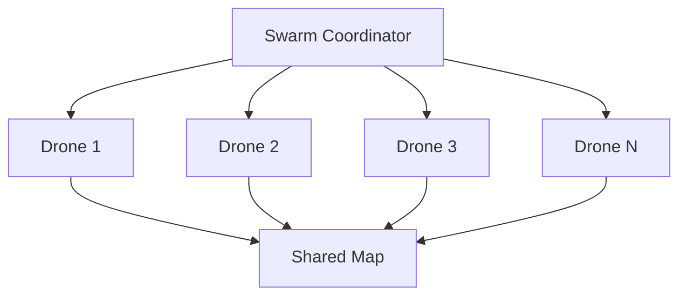

# 16 - Future Scope

---

## Overview

This document outlines potential future features and research directions for ADRL-Rescue. These features are intentionally postponed until the core project is complete.

> **Note:** These features are documentation-only. They will be implemented after the core project reaches v1.0.0.

---

## Planned Features

### 1. Multi-Agent Swarm Intelligence

**Status:** Planned

**Description:** Multiple drones working together to cover larger areas and complete missions faster.

**Benefits:**
- Faster search coverage
- Distributed workload
- Redundancy
- Collaborative mapping

**Challenges:**
- Inter-drone communication
- Coordination algorithms
- Collision avoidance between agents
- Increased training complexity

---

### 2. Battery System

**Status:** Planned

**Description:** Simulate realistic battery constraints that limit flight time and require recharging.

**Features:**
- Battery level tracking
- Power consumption based on actions
- Low battery warnings
- Return-to-base behavior
- Charging stations

**Impact:**
- Adds resource management complexity
- More realistic simulation
- Requires strategic planning

---

### 3. Weather Simulation

**Status:** Planned

**Description:** Dynamic weather conditions that affect drone performance.

**Weather Types:**
| Weather | Effect |
|---------|--------|
| Rain | Reduced sensor accuracy |
| Snow | Reduced visibility |
| Fog | Limited range |
| Night | No visual sensor |

**Features:**
- Dynamic weather changes
- Weather-specific challenges
- Adaptive behavior requirements

---

### 4. Wind Physics

**Status:** Planned

**Description:** Realistic wind simulation affecting drone flight.

**Features:**
- Variable wind speed and direction
- Turbulence modeling
- Wind resistance
- Updraft/downdraft simulation

**Impact:**
- More realistic flight dynamics
- Requires wind-aware navigation
- Adds environmental challenge

---

### 5. GPS Errors

**Status:** Planned

**Description:** Simulate GPS inaccuracy and signal loss.

**Features:**
- Position drift
- Signal multipath
- Complete signal loss
- Accuracy degradation near structures

**Impact:**
- Tests robustness
- Requires alternative localization
- More realistic scenario

---

### 6. Computer Vision (YOLO)

**Status:** Planned

**Description:** Real-time object detection using camera input.

**Features:**
- Victim detection via camera
- Object classification
- Damage assessment
- Visual SLAM

**Requirements:**
- YOLO model integration
- Camera sensor implementation
- Image processing pipeline

---

### 7. Google Maps Terrain

**Status:** Planned

**Description:** Import real-world terrain data for realistic environments.

**Features:**
- Real terrain generation
- Actual building layouts
- Geographic accuracy
- Real disaster scenarios

**Requirements:**
- Google Maps API integration
- Terrain data processing
- Building data parsing

---

### 8. ROS Integration

**Status:** Planned

**Description:** Integration with Robot Operating System for real-world deployment.

**Features:**
- ROS topic publishing
- ROS service calls
- Message format compatibility
- Real drone communication

**Benefits:**
- Bridge to real hardware
- Industry standard
- Community support

---

## Research Directions

### 1. Advanced RL Algorithms

| Algorithm | Advantage | Status |
|-----------|-----------|--------|
| SAC | Better exploration | Research |
| TD3 | Stable training | Research |
| HER | Sparse rewards | Research |
| MAPPO | Multi-agent | Research |

### 2. Transfer Learning

**Goal:** Train on one disaster type, transfer to others.

**Approach:**
- Shared feature extraction
- Domain adaptation
- Fine-tuning strategies

### 3. Curriculum Learning

**Goal:** Gradually increase difficulty during training.

**Stages:**
1. Empty environment
2. Simple obstacles
3. Multiple victims
4. Complex disaster
5. All disaster types

### 4. Meta-Learning

**Goal:** Learn to quickly adapt to new environments.

**Approach:**
- MAML algorithm
- Fast adaptation
- Few-shot learning

---

## Hardware Expansion

### Real Drone Integration

| Component | Purpose | Status |
|-----------|---------|--------|
| Pixhawk Flight Controller | Real flight control | Planned |
| LiDAR Sensor | 3D mapping | Planned |
| Thermal Camera | Victim detection | Planned |
| Jetson Nano | Onboard compute | Planned |

### Simulation to Reality (Sim2Real)

**Goal:** Transfer learned policies to real drones.

**Challenges:**
- Physics gap
- Sensor noise
- Environmental differences
- Safety concerns

---

## Community Features

### 1. Custom Environments

Allow users to create and share custom disaster environments.

### 2. Model Marketplace

Share trained models for different scenarios.

### 3. Benchmark System

Standardized evaluation metrics for comparison.

### 4. Plugin System

Extensible architecture for community contributions.

---

## Version Roadmap

| Version | Features |
|---------|----------|
| v1.0.0 | Core project complete |
| v1.1.0 | Battery system |
| v1.2.0 | Weather simulation |
| v2.0.0 | Multi-agent swarm |
| v2.1.0 | Computer vision |
| v3.0.0 | ROS integration |
| v3.1.0 | Real drone support |

---

## Navigation

| Document | Description |
|----------|-------------|
| [04_DEVELOPMENT_ROADMAP](04_DEVELOPMENT_ROADMAP.md) | Current development plan |
| [01_PROJECT_VISION](01_PROJECT_VISION.md) | Project goals |
| [README](../README.md) | Project overview |

---

*Last updated: July 2026*
