# 17 - Software Design Specification (SDS)

> **The implementation blueprint for every C# script in the ADRL-Rescue project.**

---

| Field | Value |
|:------|:------|
| **Document ID** | `DOC-017` |
| **Version** | `1.0.0` |
| **Status** | `ACTIVE` |
| **Author** | Nihaal Gharat |
| **Effective Date** | 2026-07-20 |
| **Authority** | Derived from [00_PROJECT_CHARTER.md](00_PROJECT_CHARTER.md) |

> ⚠️ **Purpose**
> This Software Design Specification (SDS) is the single source of truth for all implementation decisions. Every C# script, every class, every method must conform to this document. No gameplay code exists here — only design.

---

## Table of Contents

| # | Section | Description |
|:--|:--------|:------------|
| 1 | [Overview](#1-overview) | Purpose and relationship to charter |
| 2 | [High Level Software Architecture](#2-high-level-software-architecture) | System diagrams and relationships |
| 3 | [Folder Structure](#3-folder-structure) | Script organization |
| 4 | [Script Inventory](#4-script-inventory) | Complete list of every planned script |
| 5 | [Script Specifications](#5-script-specifications) | Detailed design for each script |
| 6 | [Interfaces](#6-interfaces) | Interface contracts |
| 7 | [Event System](#7-event-system) | Event-driven communication |
| 8 | [Data Models](#8-data-models) | ScriptableObjects and containers |
| 9 | [Manager Architecture](#9-manager-architecture) | All manager classes |
| 10 | [AI System Design](#10-ai-system-design) | Observation, action, reward flows |
| 11 | [Environment System](#11-environment-system) | Terrain, disasters, spawning |
| 12 | [Drone System](#12-drone-system) | Flight, sensors, memory |
| 13 | [Dependency Diagram](#13-dependency-diagram) | Script dependencies |
| 14 | [Initialization Order](#14-initialization-order) | Startup sequence |
| 15 | [Error Handling](#15-error-handling) | Error strategy |
| 16 | [Performance Strategy](#16-performance-strategy) | Optimization plan |
| 17 | [Coding Standards](#17-coding-standards) | C# conventions |
| 18 | [Testing Strategy](#18-testing-strategy) | Test approach |
| 19 | [Implementation Order](#19-implementation-order) | Build sequence |
| 20 | [Definition of Done](#20-definition-of-done) | Completion criteria |
| 21 | [Future Expandability](#21-future-expandability) | Architecture flexibility |

---

# 1. Overview

## 1.1 Purpose

This Software Design Specification translates the architectural vision defined in the [Project Charter](00_PROJECT_CHARTER.md) and [System Design](03_SYSTEM_DESIGN.md) into a concrete, implementable blueprint. It describes every script, every interface, every data flow, and every dependency that will exist in the final Unity project.

## 1.2 Relationship to Other Documents

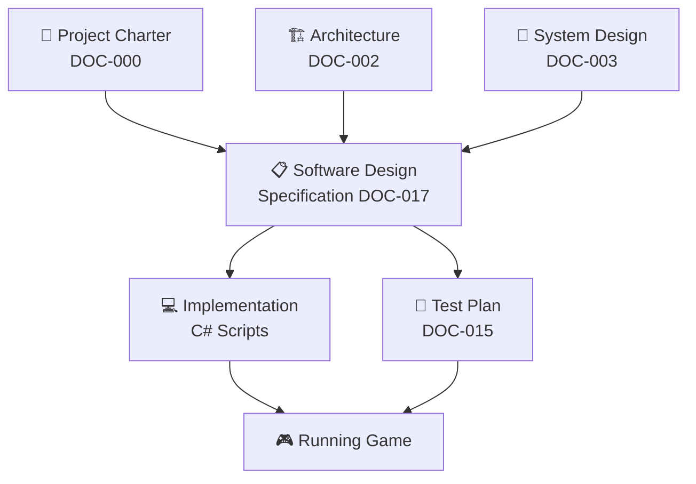

## 1.3 Design Principles

| Principle | Application |
|:----------|:------------|
| **SOLID** | Every class follows all five principles |
| **Clean Architecture** | Dependencies point inward toward core logic |
| **Composition** | Prefer composition over inheritance |
| **Loose Coupling** | Systems communicate through interfaces and events |
| **High Cohesion** | Related functionality stays together |
| **Single Responsibility** | Each class does exactly one thing |

---

# 2. High Level Software Architecture

## 2.1 Game Flow

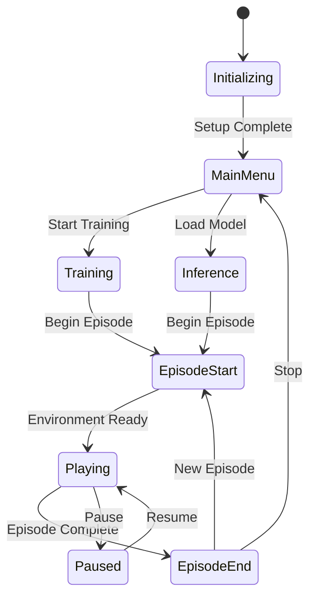

## 2.2 Manager Relationships

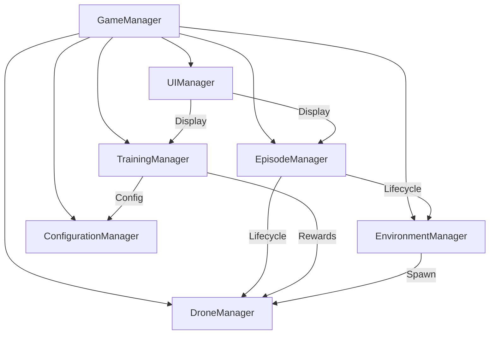

## 2.3 Drone System Diagram

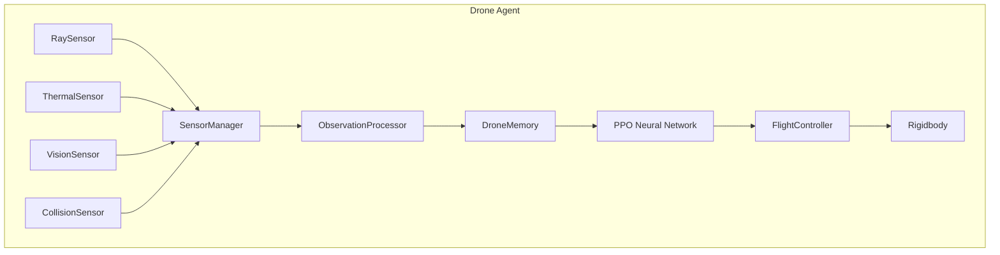

## 2.4 Environment System Diagram

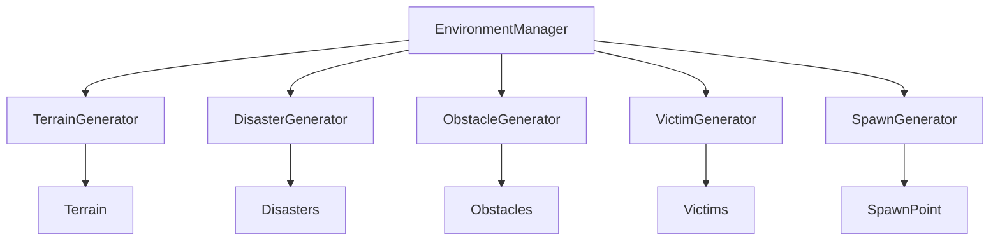

## 2.5 Training Pipeline Diagram

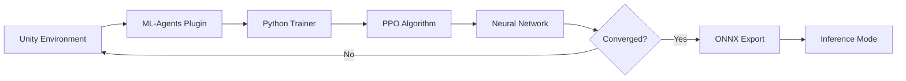

## 2.6 Data Flow Diagram

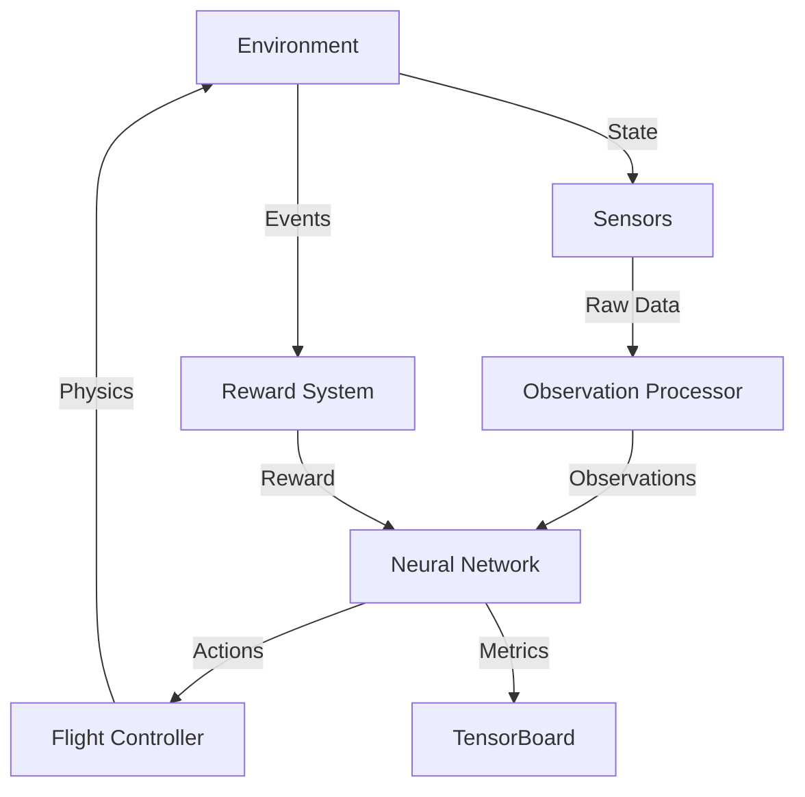

## 2.7 Script Dependency Graph

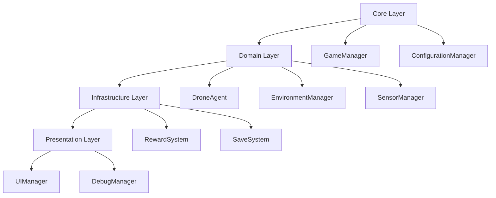

---

# 3. Folder Structure

## 3.1 Script Organization

```
Assets/
├── Scripts/
│   ├── Core/                    # Central game logic
│   │   ├── GameManager.cs
│   │   ├── EpisodeManager.cs
│   │   ├── ConfigurationManager.cs
│   │   └── SaveSystem.cs
│   │
│   ├── AI/                      # Machine learning components
│   │   ├── DroneAgent.cs
│   │   ├── ObservationProcessor.cs
│   │   ├── RewardSystem.cs
│   │   ├── TrainingManager.cs
│   │   └── Memory/
│   │       └── DroneMemory.cs
│   │
│   ├── Drone/                   # Drone behavior and physics
│   │   ├── FlightController.cs
│   │   ├── DroneManager.cs
│   │   └── DroneStabilizer.cs
│   │
│   ├── Environment/             # World generation
│   │   ├── EnvironmentManager.cs
│   │   ├── TerrainGenerator.cs
│   │   ├── DisasterGenerator.cs
│   │   ├── ObstacleGenerator.cs
│   │   ├── VictimGenerator.cs
│   │   └── SpawnGenerator.cs
│   │
│   ├── Sensors/                 # Sensor implementations
│   │   ├── SensorManager.cs
│   │   ├── RaySensor.cs
│   │   ├── ThermalSensor.cs
│   │   ├── VisionSensor.cs
│   │   └── CollisionSensor.cs
│   │
│   ├── Managers/                # Additional managers
│   │   └── PerformanceMonitor.cs
│   │
│   ├── UI/                      # User interface
│   │   ├── UIManager.cs
│   │   ├── HUDController.cs
│   │   └── DebugOverlay.cs
│   │
│   ├── Interfaces/              # Interface contracts
│   │   ├── ISensor.cs
│   │   ├── IManager.cs
│   │   ├── IResettable.cs
│   │   ├── IDetectable.cs
│   │   └── IConfigurable.cs
│   │
│   ├── Events/                  # Event definitions
│   │   └── GameEvents.cs
│   │
│   ├── Data/                    # ScriptableObjects
│   │   ├── RewardConfig.cs
│   │   ├── TrainingConfig.cs
│   │   ├── EnvironmentConfig.cs
│   │   ├── DroneConfig.cs
│   │   └── SensorConfig.cs
│   │
│   └── Utilities/               # Helper classes
│       ├── MathHelper.cs
│       ├── DebugHelper.cs
│       └── ObjectPool.cs
```

## 3.2 Folder Responsibilities

| Folder | Responsibility | Key Classes |
|:-------|:---------------|:------------|
| `Core/` | Central game orchestration | GameManager, EpisodeManager |
| `AI/` | ML integration and learning | DroneAgent, RewardSystem |
| `Drone/` | Physical drone behavior | FlightController, DroneManager |
| `Environment/` | World generation | TerrainGenerator, DisasterGenerator |
| `Sensors/` | Perception systems | SensorManager, RaySensor |
| `Managers/` | Cross-cutting concerns | PerformanceMonitor |
| `UI/` | User interface | UIManager, HUDController |
| `Interfaces/` | Contracts | ISensor, IManager |
| `Events/` | Event definitions | GameEvents |
| `Data/` | Configuration data | RewardConfig, DroneConfig |
| `Utilities/` | Helper functions | MathHelper, ObjectPool |

---

# 4. Script Inventory

## 4.1 Complete Script Table

| # | Script | Folder | Priority | Dependencies | Status |
|:--|:-------|:-------|:---------|:-------------|:-------|
| 1 | GameManager.cs | Core | 🔴 Critical | EpisodeManager, EnvironmentManager, DroneManager | 🔲 Planned |
| 2 | EpisodeManager.cs | Core | 🔴 Critical | GameManager, RewardSystem | 🔲 Planned |
| 3 | ConfigurationManager.cs | Core | 🔴 Critical | ScriptableObjects | 🔲 Planned |
| 4 | SaveSystem.cs | Core | 🟡 High | None | 🔲 Planned |
| 5 | DroneAgent.cs | AI | 🔴 Critical | FlightController, SensorManager, RewardSystem, DroneMemory | 🔲 Planned |
| 6 | ObservationProcessor.cs | AI | 🔴 Critical | SensorManager, DroneMemory | 🔲 Planned |
| 7 | RewardSystem.cs | AI | 🔴 Critical | DroneAgent, EpisodeManager | 🔲 Planned |
| 8 | TrainingManager.cs | AI | 🔴 Critical | DroneAgent, ConfigurationManager | 🔲 Planned |
| 9 | DroneMemory.cs | AI/Memory | 🔴 Critical | None | 🔲 Planned |
| 10 | FlightController.cs | Drone | 🔴 Critical | Rigidbody | 🔲 Planned |
| 11 | DroneManager.cs | Drone | 🔴 Critical | DroneAgent, FlightController | 🔲 Planned |
| 12 | DroneStabilizer.cs | Drone | 🟡 High | Rigidbody | 🔲 Planned |
| 13 | EnvironmentManager.cs | Environment | 🔴 Critical | TerrainGenerator, DisasterGenerator, VictimGenerator | 🔲 Planned |
| 14 | TerrainGenerator.cs | Environment | 🔴 Critical | EnvironmentConfig | 🔲 Planned |
| 15 | DisasterGenerator.cs | Environment | 🔴 Critical | EnvironmentConfig | 🔲 Planned |
| 16 | ObstacleGenerator.cs | Environment | 🔴 Critical | EnvironmentConfig | 🔲 Planned |
| 17 | VictimGenerator.cs | Environment | 🔴 Critical | EnvironmentConfig | 🔲 Planned |
| 18 | SpawnGenerator.cs | Environment | 🔴 Critical | EnvironmentConfig | 🔲 Planned |
| 19 | SensorManager.cs | Sensors | 🔴 Critical | ISensor implementations | 🔲 Planned |
| 20 | RaySensor.cs | Sensors | 🔴 Critical | None | 🔲 Planned |
| 21 | ThermalSensor.cs | Sensors | 🔴 Critical | None | 🔲 Planned |
| 22 | VisionSensor.cs | Sensors | 🔴 Critical | None | 🔲 Planned |
| 23 | CollisionSensor.cs | Sensors | 🔴 Critical | None | 🔲 Planned |
| 24 | UIManager.cs | UI | 🟡 High | EpisodeManager, TrainingManager | 🔲 Planned |
| 25 | HUDController.cs | UI | 🟡 High | UIManager | 🔲 Planned |
| 26 | DebugOverlay.cs | UI | 🟢 Medium | SensorManager, DroneMemory | 🔲 Planned |
| 27 | PerformanceMonitor.cs | Managers | 🟢 Medium | None | 🔲 Planned |
| 28 | GameEvents.cs | Events | 🔴 Critical | None | 🔲 Planned |
| 29 | RewardConfig.cs | Data | 🔴 Critical | None | 🔲 Planned |
| 30 | TrainingConfig.cs | Data | 🔴 Critical | None | 🔲 Planned |
| 31 | EnvironmentConfig.cs | Data | 🔴 Critical | None | 🔲 Planned |
| 32 | DroneConfig.cs | Data | 🔴 Critical | None | 🔲 Planned |
| 33 | SensorConfig.cs | Data | 🔴 Critical | None | 🔲 Planned |
| 34 | MathHelper.cs | Utilities | 🟢 Medium | None | 🔲 Planned |
| 35 | DebugHelper.cs | Utilities | 🟢 Medium | None | 🔲 Planned |
| 36 | ObjectPool.cs | Utilities | 🟡 High | None | 🔲 Planned |

---

# 5. Script Specifications

---

## GameManager.cs

**Folder:** `Core/`
**Purpose:** Central orchestrator for the entire simulation lifecycle.

**Responsibilities:**
- Initialize all systems in correct order
- Start and stop simulation
- Coordinate between managers
- Track global game state
- Handle application lifecycle

**Dependencies:**
- EpisodeManager
- EnvironmentManager
- DroneManager
- ConfigurationManager
- UIManager

**Public Methods:**
```
Initialize()
StartSimulation()
StopSimulation()
PauseSimulation()
ResumeSimulation()
GetGameState() → GameState
```

**Private Methods:**
```
InitializeSystems()
RegisterEvents()
CleanupSystems()
```

**Events:**
- `OnGameStarted`
- `OnGamePaused`
- `OnGameResumed`
- `OnGameStopped`

**Future Extensions:**
- Save/Load game state
- Multiple difficulty levels
- Replay system

---

## EpisodeManager.cs

**Folder:** `Core/`
**Purpose:** Manages the lifecycle of training episodes.

**Responsibilities:**
- Track current episode number
- Start/end episodes
- Reset environment between episodes
- Track episode statistics
- Enforce maximum episode length

**Dependencies:**
- GameManager
- EnvironmentManager
- DroneManager
- RewardSystem

**Public Methods:**
```
StartEpisode()
EndEpisode()
ResetEpisode()
GetCurrentEpisode() → int
GetEpisodeLength() → int
IsEpisodeActive() → bool
```

**Private Methods:**
```
IncrementEpisodeCounter()
RecordEpisodeStats()
NotifyEpisodeEnd()
```

**Events:**
- `OnEpisodeStarted(int episodeNumber)`
- `OnEpisodeEnded(EpisodeStats stats)`
- `OnMaxStepsReached()`

**Future Extensions:**
- Curriculum learning stages
- Episode replay
- Episode filtering

---

## ConfigurationManager.cs

**Folder:** `Core/`
**Purpose:** Centralized access to all configuration data.

**Responsibilities:**
- Load ScriptableObject configurations
- Provide typed access to configs
- Runtime configuration updates
- Configuration validation

**Dependencies:**
- All ScriptableObject configs

**Public Methods:**
```
GetDroneConfig() → DroneConfig
GetRewardConfig() → RewardConfig
GetTrainingConfig() → TrainingConfig
GetEnvironmentConfig() → EnvironmentConfig
GetSensorConfig() → SensorConfig
ValidateAll() → bool
```

**Private Methods:**
```
LoadConfigs()
ValidateConfig(config)
```

**Events:**
- `OnConfigChanged(string configName)`

**Future Extensions:**
- Runtime config editing UI
- Config presets
- Config versioning

---

## DroneAgent.cs

**Folder:** `AI/`
**Purpose:** Bridge between Unity and ML-Agents. The core agent class.

**Responsibilities:**
- Collect observations from sensors
- Process observations into vector
- Receive actions from neural network
- Apply actions to flight controller
- Assign rewards
- Handle episode begin/end

**Dependencies:**
- SensorManager
- ObservationProcessor
- FlightController
- DroneMemory
- RewardSystem
- EpisodeManager

**Public Methods:**
```
Initialize()
CollectObservations() → float[]
OnActionReceived(float[] actions)
Heuristic(float[] actionsOut)
OnEpisodeBegin()
OnEpisodeEnd()
```

**Private Methods:**
```
GatherSensorData()
ProcessObservations()
ApplyActions(float[] actions)
CalculateAndAssignReward()
```

**Events:**
- `OnVictimFound`
- `OnCollision`
- `OnEpisodeCompleted`

**Future Extensions:**
- Multi-agent support
- Different observation spaces
- Action masks

---

## FlightController.cs

**Folder:** `Drone/`
**Purpose:** Translates AI decisions into physics-based movement.

**Responsibilities:**
- Apply movement forces
- Apply rotation
- Maintain stability
- Enforce speed limits
- Handle physics interpolation

**Dependencies:**
- Rigidbody
- DroneConfig

**Public Methods:**
```
ApplyMovement(float x, float y, float z)
ApplyRotation(float yaw)
GetCurrentSpeed() → float
GetVelocity() → Vector3
ResetPhysics()
```

**Private Methods:**
```
ClampVelocity()
ApplyStabilization()
LimitSpeed()
```

**Events:**
- `OnSpeedChanged(float speed)`

**Future Extensions:**
- Wind effects
- Battery drain affecting power
- Different drone models

---

## DroneStabilizer.cs

**Folder:** `Drone/`
**Purpose:** Maintains drone in upright orientation.

**Responsibilities:**
- Apply corrective torque
- Counter external forces
- Smooth angular movement
- Maintain hover altitude

**Dependencies:**
- Rigidbody
- DroneConfig

**Public Methods:**
```
Enable()
Disable()
SetStabilizationForce(float force)
```

**Private Methods:**
```
CalculateUprightTorque()
ApplyCorrectiveForce()
```

**Events:** None

**Future Extensions:**
- Different stability profiles
- Adaptive stabilization

---

## DroneMemory.cs

**Folder:** `AI/Memory/`
**Purpose:** Stores environmental knowledge over time.

**Responsibilities:**
- Track visited positions
- Record obstacle locations
- Store victim detections
- Maintain exploration map
- Limit memory capacity
- Query nearest unexplored area

**Dependencies:**
- DroneConfig

**Public Methods:**
```
RecordPosition(Vector3 pos)
RecordObstacle(Vector3 pos, float distance)
RecordVictim(Vector3 pos)
IsPositionVisited(Vector3 pos) → bool
GetNearestUnexplored() → Vector3
GetExploredPercentage() → float
ClearMemory()
GetVictimLocations() → List<Vector3>
```

**Private Methods:**
```
AddToVisited(Vector3 pos)
PruneOldEntries()
CalculateExplorationScore(Vector3 pos)
```

**Events:**
- `OnNewAreaExplored`
- `OnVictimRecorded`

**Future Extensions:**
- Spatial hashing for faster lookups
- Memory visualization
- Persistent memory across episodes

---

## ObservationProcessor.cs

**Folder:** `AI/`
**Purpose:** Transforms raw sensor data into normalized observation vector.

**Responsibilities:**
- Collect data from all sensors
- Normalize values to expected ranges
- Combine into single vector
- Handle missing data
- Validate observation dimensions

**Dependencies:**
- SensorManager
- DroneMemory

**Public Methods:**
```
ProcessObservations() → float[]
GetObservationSize() → int
ValidateObservations(float[] obs) → bool
```

**Private Methods:**
```
NormalizePosition(Vector3 pos)
NormalizeVelocity(Vector3 vel)
CombineRayData(float[] distances)
CombineRayHits(bool[] hits)
CalculateTargetDirection()
```

**Events:** None

**Future Extensions:**
- Different observation spaces
- Observation compression
- Attention mechanisms

---

## RewardSystem.cs

**Folder:** `AI/`
**Purpose:** Calculates and assigns rewards to the agent.

**Responsibilities:**
- Calculate rewards for each step
- Track reward components
- Apply reward shaping
- Provide reward breakdown for logging
- Reset between episodes

**Dependencies:**
- RewardConfig
- DroneAgent
- EpisodeManager

**Public Methods:**
```
CalculateReward(DroneState state) → float
GetRewardBreakdown() → RewardBreakdown
Reset()
GetTotalReward() → float
```

**Private Methods:**
```
CalculateTaskReward(DroneState state)
CalculateExplorationReward(DroneState state)
CalculateSafetyReward(DroneState state)
CalculateEfficiencyReward(DroneState state)
```

**Events:**
- `OnRewardCalculated(float reward, string reason)`

**Future Extensions:**
- Curriculum-based rewards
- Reward normalization
- Reward distribution visualization

---

## TrainingManager.cs

**Folder:** `AI/`
**Purpose:** Orchestrates the ML-Agents training pipeline.

**Responsibilities:**
- Configure ML-Agents parameters
- Start/stop training
- Monitor training progress
- Log metrics to TensorBoard
- Export trained models

**Dependencies:**
- DroneAgent
- ConfigurationManager
- TrainingConfig

**Public Methods:**
```
StartTraining()
StopTraining()
PauseTraining()
ResumeTraining()
ExportModel(string path)
GetTrainingStats() → TrainingStats
```

**Private Methods:**
```
ConfigureMLAgents()
MonitorProgress()
LogMetrics()
SaveCheckpoint()
```

**Events:**
- `OnTrainingStarted`
- `OnTrainingStopped`
- `OnModelExported(string path)`
- `OnMilestoneReached(string milestone)`

**Future Extensions:**
- Distributed training
- Hyperparameter optimization
- Automated training scheduling

---

## TerrainGenerator.cs

**Folder:** `Environment/`
**Purpose:** Procedurally generates terrain heightmaps.

**Responsibilities:**
- Generate Perlin noise heightmaps
- Apply disaster-specific modifications
- Create walkable areas
- Set terrain textures
- Validate terrain

**Dependencies:**
- EnvironmentConfig
- TerrainData

**Public Methods:**
```
GenerateTerrain(int seed) → TerrainData
ApplyDisasterModification(DisasterType type)
ValidateTerrain() → bool
GetTerrainHeight(Vector3 pos) → float
```

**Private Methods:**
```
GenerateHeightmap(int seed)
ApplyEarthquakeDamage()
ApplyFloodLeveling()
ApplyLandslideSlopes()
ApplyCollapseDebris()
```

**Events:**
- `OnTerrainGenerated`

**Future Extensions:**
- LOD terrain
- Real-world terrain import
- Dynamic terrain modification

---

## DisasterGenerator.cs

**Folder:** `Environment/`
**Purpose:** Creates disaster-specific environmental features.

**Responsibilities:**
- Generate fire effects
- Create water bodies
- Place debris
- Set lighting conditions
- Apply atmospheric effects

**Dependencies:**
- EnvironmentConfig
- DisasterType

**Public Methods:**
```
GenerateDisaster(DisasterType type)
ClearDisaster()
GetActiveDisasters() → List<DisasterEffect>
```

**Private Methods:**
```
GenerateFire(Vector3 area)
GenerateWater(Vector3 area, float level)
GenerateDebris(Vector3 center, float radius)
SetAtmosphere(DisasterType type)
```

**Events:**
- `OnDisasterGenerated(DisasterType type)`

**Future Extensions:**
- Dynamic disasters
- Weather system
- Time-based disaster progression

---

## ObstacleGenerator.cs

**Folder:** `Environment/`
**Purpose:** Places obstacles in the environment.

**Responsibilities:**
- Spawn obstacle prefabs
- Ensure no overlaps
- Randomize rotations
- Maintain navigation paths
- Track obstacle count

**Dependencies:**
- EnvironmentConfig
- ObstaclePool

**Public Methods:**
```
GenerateObstacles(int count)
ClearObstacles()
GetObstacles() → List<GameObject>
IsPositionBlocked(Vector3 pos) → bool
```

**Private Methods:**
```
FindValidPosition()
CheckOverlap(Vector3 pos, float radius)
RandomizeObstacle(GameObject obstacle)
```

**Events:**
- `OnObstaclePlaced(Vector3 position)`

**Future Extensions:**
- Physics-based obstacle placement
- Destructible obstacles
- Obstacle clustering

---

## VictimGenerator.cs

**Folder:** `Environment/`
**Purpose:** Spawns victims at valid positions.

**Responsibilities:**
- Place victims at random positions
- Ensure valid placement (not inside obstacles)
- Assign victim properties
- Track victim count
- Handle victim rescue

**Dependencies:**
- EnvironmentConfig
- VictimConfig

**Public Methods:**
```
GenerateVictims(int count)
ClearVictims()
GetVictims() → List<Victim>
GetRescuedCount() → int
RescueVictim(Victim victim)
```

**Private Methods:**
```
FindValidVictimPosition()
AssignVictimProperties(Victim victim)
ValidatePlacement(Vector3 pos)
```

**Events:**
- `OnVictimSpawned(Victim victim)`
- `OnVictimRescued(Victim victim)`

**Future Extensions:**
- Victim AI behavior
- Multiple victim types
- Victim priority system

---

## SpawnGenerator.cs

**Folder:** `Environment/`
**Purpose:** Determines valid spawn positions for the drone.

**Responsibilities:**
- Find valid spawn positions
- Avoid obstacle overlap
- Ensure safe height
- Randomize spawn point each episode
- Validate spawn position

**Dependencies:**
- EnvironmentConfig
- ObstacleGenerator

**Public Methods:**
```
GetSpawnPosition() → Vector3
GetSpawnRotation() → Quaternion
ValidateSpawn(Vector3 pos) → bool
```

**Private Methods:**
```
FindSafePosition()
CheckHeightClearance()
CheckObstacleClearance()
```

**Events:**
- `OnSpawnPositionDetermined(Vector3 pos)`

**Future Extensions:**
- Multiple spawn points
- Spawn zones
- Dynamic respawning

---

## SensorManager.cs

**Folder:** `Sensors/`
**Purpose:** Collects and aggregates data from all sensors.

**Responsibilities:**
- Initialize all sensors
- Collect readings each frame
- Aggregate sensor data
- Handle sensor failures
- Provide unified sensor interface

**Dependencies:**
- ISensor implementations
- SensorConfig

**Public Methods:**
```
Initialize()
CollectAll() → SensorData
GetRayData() → float[]
GetThermalData() → float
GetVisionData() → float
IsCollision() → bool
Enable()
Disable()
```

**Private Methods:**
```
InitializeSensors()
CollectRayData()
CollectThermalData()
CollectVisionData()
CheckCollisions()
```

**Events:**
- `OnSensorDataCollected(SensorData data)`
- `OnSensorError(string sensorName, string error)`

**Future Extensions:**
- Sensor failure simulation
- Dynamic sensor addition
- Sensor quality degradation

---

## RaySensor.cs

**Folder:** `Sensors/`
**Purpose:** Casts rays to detect obstacles.

**Responsibilities:**
- Cast rays in fan pattern
- Measure distances to obstacles
- Identify hit objects
- Return normalized distances

**Dependencies:**
- SensorConfig
- Physics

**Public Methods:**
```
CastRays() → RayData
GetDistances() → float[]
GetHits() → bool[]
GetMaxDistance() → float
```

**Private Methods:**
```
CastSingleRay(Vector3 direction)
NormalizeDistance(float distance)
IdentifyHitObject(RaycastHit hit)
```

**Events:**
- `OnObstacleDetected(Vector3 position, float distance)`

**Future Extensions:**
- Variable ray count
- Adaptive ray placement
- Ray visualization

---

## ThermalSensor.cs

**Folder:** `Sensors/`
**Purpose:** Detects heat signatures from victims.

**Responsibilities:**
- Scan for thermal sources
- Calculate heat intensity
- Return detection strength
- Handle multiple sources

**Dependencies:**
- SensorConfig

**Public Methods:**
```
Scan() → float
GetStrongestSignal() → float
GetSignalDirection() → Vector3
IsVictimInRange() → bool
```

**Private Methods:**
```
CalculateHeatIntensity(float distance)
FindNearestHeatSource()
NormalizeSignal(float signal)
```

**Events:**
- `OnThermalDetected(float strength)`

**Future Extensions:**
- Thermal imaging visualization
- Heat source tracking
- Temperature gradients

---

## VisionSensor.cs

**Folder:** `Sensors/`
**Purpose:** Detects victims within field of view.

**Responsibilities:**
- Check if victim is in FOV
- Confirm detection
- Return binary result
- Handle occlusion

**Dependencies:**
- SensorConfig

**Public Methods:**
```
Scan() → float
IsVictimVisible() → bool
GetVisibleVictims() → List<Victim>
```

**Private Methods:**
```
IsInFieldOfView(Vector3 target)
CheckLineOfSight(Vector3 target)
```

**Events:**
- `OnVictimSighted(Victim victim)`

**Future Extensions:**
- Visual recognition
- Object classification
- Camera feed display

---

## CollisionSensor.cs

**Folder:** `Sensors/`
**Purpose:** Detects impacts with obstacles.

**Responsibilities:**
- Detect collision events
- Record collision data
- Trigger collision response
- Track collision count

**Dependencies:**
- Unity Physics

**Public Methods:**
```
IsColliding() → bool
GetCollisionCount() → int
GetLastCollision() → CollisionData
Reset()
```

**Private Methods:**
```
OnCollisionEnter(Collision collision)
OnCollisionStay(Collision collision)
OnCollisionExit(Collision collision)
```

**Events:**
- `OnDroneCollision(CollisionData data)`

**Future Extensions:**
- Collision severity
- Impact direction
- Damage simulation

---

## UIManager.cs

**Folder:** `UI/`
**Purpose:** Manages all user interface elements.

**Responsibilities:**
- Initialize UI panels
- Update HUD display
- Handle UI events
- Toggle debug overlay
- Show training progress

**Dependencies:**
- EpisodeManager
- TrainingManager
- SensorManager
- DroneMemory

**Public Methods:**
```
Initialize()
ShowHUD()
HideHUD()
ShowDebugOverlay()
HideDebugOverlay()
UpdateHUD(HUDData data)
```

**Private Methods:**
```
InitializePanels()
UpdateTrainingDisplay()
UpdateDroneDisplay()
```

**Events:**
- `OnUIToggled(string panelName, bool visible)`

**Future Extensions:**
- Settings menu
- Replay viewer
- Training graphs

---

## HUDController.cs

**Folder:** `UI/`
**Purpose:** Displays heads-up information during simulation.

**Responsibilities:**
- Show drone speed
- Show altitude
- Show victim count
- Show episode info
- Show reward

**Dependencies:**
- UIManager
- DroneAgent
- EpisodeManager

**Public Methods:**
```
UpdateDisplay(HUDData data)
Show()
Hide()
```

**Private Methods:**
```
UpdateSpeedDisplay()
UpdateAltitudeDisplay()
UpdateVictimDisplay()
UpdateRewardDisplay()
```

**Events:** None

**Future Extensions:**
- Customizable HUD
- Multiple display modes
- HUD recording

---

## DebugOverlay.cs

**Folder:** `UI/`
**Purpose:** Displays debug information for development.

**Responsibilities:**
- Show sensor readings
- Show memory visualization
- Show reward breakdown
- Show performance metrics

**Dependencies:**
- SensorManager
- DroneMemory
- RewardSystem
- PerformanceMonitor

**Public Methods:**
```
Toggle()
Show()
Hide()
SetVisibility(bool visible)
```

**Private Methods:**
```
DrawSensorInfo()
DrawMemoryInfo()
DrawRewardInfo()
DrawPerformanceInfo()
```

**Events:** None

**Future Extensions:**
- Interactive debug
- Custom debug views
- Debug recording

---

## PerformanceMonitor.cs

**Folder:** `Managers/`
**Purpose:** Tracks and reports performance metrics.

**Responsibilities:**
- Measure frame rate
- Track memory usage
- Monitor CPU usage
- Log performance data
- Alert on performance issues

**Dependencies:**
- None

**Public Methods:**
```
Initialize()
GetFrameRate() → float
GetMemoryUsage() → long
GetCPUsage() → float
GetPerformanceReport() → PerformanceReport
```

**Private Methods:**
```
MeasureFrameRate()
TrackMemory()
LogPerformance()
```

**Events:**
- `OnPerformanceWarning(string message)`

**Future Extensions:**
- Performance graphs
- Automatic optimization
- Performance budgets

---

## GameEvents.cs

**Folder:** `Events/`
**Purpose:** Centralized event definitions.

**Responsibilities:**
- Define all game events
- Provide event structs
- Maintain event registry

**Dependencies:** None

**Public Methods:**
```
Static event definitions
```

**Events:** (All defined here - see Section 7)

**Future Extensions:**
- Event filtering
- Event replay
- Event analytics

---

## Data Config Classes

### RewardConfig.cs

**Folder:** `Data/`
**Purpose:** Configuration for reward system.

```
Fields:
├── victimFoundReward: float = 10.0f
├── victimRescuedReward: float = 25.0f
├── newAreaReward: float = 0.5f
├── forwardProgressReward: float = 0.1f
├── sensorDetectionReward: float = 1.0f
├── collisionPenalty: float = -5.0f
├── outOfBoundsPenalty: float = -10.0f
├── timePenalty: float = -0.01f
├── stuckPenalty: float = -2.0f
├── repeatedPathPenalty: float = -0.5f
└── fallingPenalty: float = -3.0f
```

### TrainingConfig.cs

**Folder:** `Data/`
**Purpose:** Configuration for ML-Agents training.

```
Fields:
├── trainerType: string = "ppo"
├── batchSize: int = 1024
├── bufferSize: int = 10240
├── learningRate: float = 0.0003f
├── beta: float = 0.005f
├── epsilon: float = 0.2f
├── lambda: float = 0.95f
├── numEpochs: int = 3
├── hiddenUnits: int = 256
├── numLayers: int = 2
├── gamma: float = 0.99f
├── maxSteps: int = 5000000
├── timeHorizon: int = 64
└── summaryFreq: int = 10000
```

### EnvironmentConfig.cs

**Folder:** `Data/`
**Purpose:** Configuration for environment generation.

```
Fields:
├── disasterType: DisasterType
├── terrainSize: int = 100
├── terrainResolution: int = 129
├── obstacleCount: int = 50
├── victimCount: int = 5
├── randomSeed: int = 0
├── useRandomSeed: bool = true
├── buildingDensity: float = 0.3f
├── treeDensity: float = 0.2f
└── debrisDensity: float = 0.15f
```

### DroneConfig.cs

**Folder:** `Data/`
**Purpose:** Configuration for drone behavior.

```
Fields:
├── mass: float = 2.0f
├── drag: float = 3.0f
├── angularDrag: float = 5.0f
├── moveForce: float = 5.0f
├── rotationSpeed: float = 90.0f
├── maxSpeed: float = 10.0f
├── stabilizationForce: float = 50.0f
├── verticalDamping: float = 2.0f
├── maxTiltAngle: float = 45.0f
└── minHeight: float = 1.0f
```

### SensorConfig.cs

**Folder:** `Data/`
**Purpose:** Configuration for sensors.

```
Fields:
├── rayCount: int = 13
├── rayMaxDistance: float = 10.0f
├── raySpreadAngle: float = 180.0f
├── thermalRange: float = 15.0f
├── thermalFOV: float = 120.0f
├── thermalSensitivity: float = 0.7f
├── visionRange: float = 20.0f
├── visionFOV: float = 90.0f
├── collisionRadius: float = 0.5f
└── sensorUpdateFrequency: int = 10
```

---

# 6. Interfaces

## 6.1 Interface Definitions

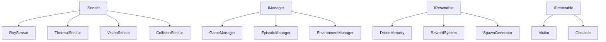

## 6.2 Interface Specifications

### ISensor

**Purpose:** Contract for all sensor types.

```
Interface ISensor
├── Initialize()
├── CollectData() → SensorReading
├── Enable()
├── Disable()
├── IsEnabled() → bool
└── GetSensorType() → SensorType
```

**Why exists:** Allows SensorManager to treat all sensors uniformly. New sensors can be added without modifying SensorManager.

### IManager

**Purpose:** Contract for all manager classes.

```
Interface IManager
├── Initialize()
├── Shutdown()
├── GetStatus() → ManagerStatus
└── GetName() → string
```

**Why exists:** Ensures all managers follow consistent lifecycle. GameManager can manage all managers uniformly.

### IResettable

**Purpose:** Contract for objects that reset between episodes.

```
Interface IResettable
├── Reset()
├── IsReset() → bool
└── GetResetState() → ResetState
```

**Why exists:** EpisodeManager can reset all systems uniformly. Ensures clean state between episodes.

### IDetectable

**Purpose:** Contract for objects that can be detected by sensors.

```
Interface IDetectable
├── GetPosition() → Vector3
├── IsDetectable() → bool
├── GetDetectionStrength() → float
└── GetDetectionType() → DetectionType
```

**Why exists:** Sensors can detect any object implementing this interface. New detectable objects don't require sensor changes.

### IConfigurable

**Purpose:** Contract for objects that use configuration data.

```
Interface IConfigurable
├── Configure(ScriptableObject config)
├── ValidateConfig() → bool
├── GetConfig() → ScriptableObject
└── OnConfigChanged()
```

**Why exists:** Ensures all configurable objects follow the same pattern. ConfigurationManager can update them uniformly.

---

# 7. Event System

## 7.1 Event Architecture

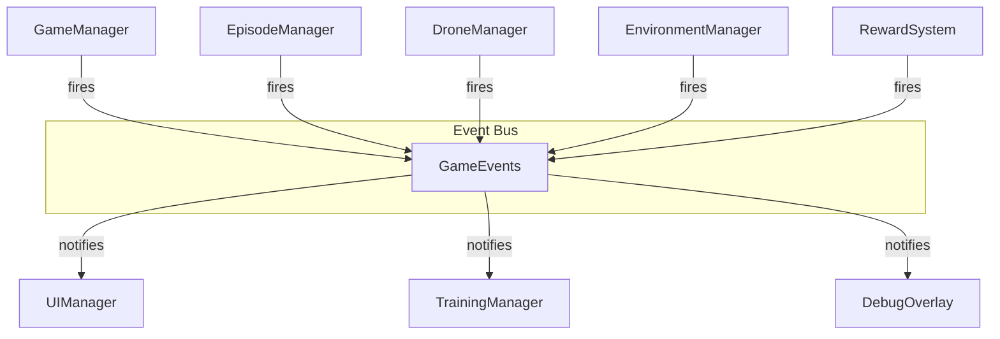

## 7.2 Event Definitions

### Core Events

| Event | Parameters | Fired By | Handled By |
|:------|:-----------|:---------|:-----------|
| `OnGameStarted` | — | GameManager | UIManager |
| `OnGamePaused` | — | GameManager | UIManager |
| `OnGameResumed` | — | GameManager | UIManager |
| `OnGameStopped` | — | GameManager | UIManager |

### Episode Events

| Event | Parameters | Fired By | Handled By |
|:------|:-----------|:---------|:-----------|
| `OnEpisodeStarted` | `int episode` | EpisodeManager | UIManager, TrainingManager |
| `OnEpisodeEnded` | `EpisodeStats stats` | EpisodeManager | UIManager, TrainingManager |
| `OnMaxStepsReached` | — | EpisodeManager | DroneAgent |

### Drone Events

| Event | Parameters | Fired By | Handled By |
|:------|:-----------|:---------|:-----------|
| `OnVictimFound` | `Vector3 position` | DroneAgent | UIManager, RewardSystem |
| `OnVictimRescued` | `Victim victim` | DroneAgent | UIManager, RewardSystem |
| `OnDroneCollision` | `CollisionData data` | CollisionSensor | RewardSystem, UIManager |
| `OnDroneOutOfBounds` | — | DroneAgent | RewardSystem, EpisodeManager |
| `OnNewAreaExplored` | `Vector3 position` | DroneMemory | RewardSystem |

### Environment Events

| Event | Parameters | Fired By | Handled By |
|:------|:-----------|:---------|:-----------|
| `OnEnvironmentGenerated` | `EnvironmentData data` | EnvironmentManager | GameManager |
| `OnTerrainGenerated` | `TerrainData terrain` | TerrainGenerator | EnvironmentManager |
| `OnDisasterGenerated` | `DisasterType type` | DisasterGenerator | EnvironmentManager |

### Training Events

| Event | Parameters | Fired By | Handled By |
|:------|:-----------|:---------|:-----------|
| `OnTrainingStarted` | — | TrainingManager | UIManager |
| `OnTrainingStopped` | — | TrainingManager | UIManager |
| `OnModelExported` | `string path` | TrainingManager | UIManager |
| `OnRewardCalculated` | `float reward, string reason` | RewardSystem | DebugOverlay |

---

# 8. Data Models

## 8.1 ScriptableObject Hierarchy

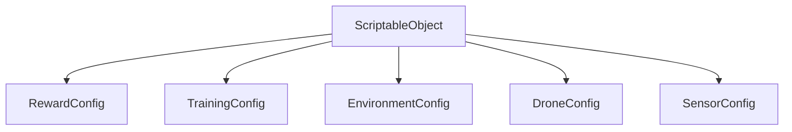

## 8.2 Data Structures

### DroneState

```csharp
struct DroneState
{
    Vector3 position;
    Vector3 velocity;
    Vector3 forward;
    Vector3 up;
    float speed;
    bool collisionOccurred;
    bool isOutOfBounds;
    bool victimDetected;
    bool victimRescued;
    bool isNewPosition;
    bool isStuck;
    bool repeatedPath;
    Vector3 nearestVictimDirection;
}
```

### SensorData

```csharp
struct SensorData
{
    float[] rayDistances;
    bool[] rayHits;
    float thermalStrength;
    float visionDetection;
    bool collisionDetected;
}
```

### EpisodeStats

```csharp
struct EpisodeStats
{
    int episodeNumber;
    float totalReward;
    int stepsTaken;
    int victimsFound;
    int victimsRescued;
    float explorationPercentage;
    int collisions;
    float episodeTime;
}
```

### RewardBreakdown

```csharp
struct RewardBreakdown
{
    float victimFoundReward;
    float victimRescuedReward;
    float explorationReward;
    float efficiencyReward;
    float safetyPenalty;
    float timePenalty;
    float totalReward;
}
```

### Victim

```csharp
class Victim
{
    Vector3 position;
    float health;
    float thermalSignature;
    bool isAlive;
    bool isRescued;
    bool isDetected;
}
```

### PerformanceReport

```csharp
struct PerformanceReport
{
    float averageFrameRate;
    float minFrameRate;
    float maxFrameRate;
    long memoryUsage;
    float cpuUsage;
    int activeObjects;
}
```

---

# 9. Manager Architecture

## 9.1 Manager Hierarchy

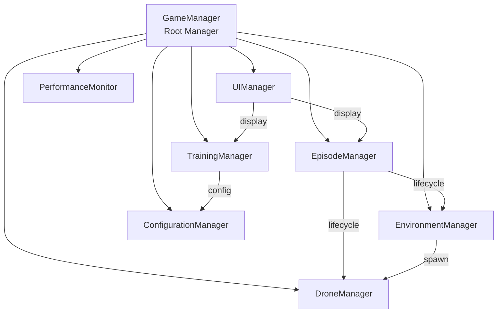

## 9.2 Manager Responsibilities

### GameManager

**Role:** Root orchestrator. Owns the application lifecycle.

**Responsibilities:**
- Initialize all managers in correct order
- Coordinate system shutdown
- Handle application quit
- Maintain global state

### EpisodeManager

**Role:** Controls episode lifecycle.

**Responsibilities:**
- Start/stop episodes
- Track episode count
- Enforce max steps
- Record episode statistics
- Trigger environment reset

### EnvironmentManager

**Role:** Generates and manages disaster environments.

**Responsibilities:**
- Coordinate terrain generation
- Trigger disaster effects
- Place obstacles and victims
- Provide spawn positions
- Clear environment between episodes

### DroneManager

**Role:** Manages the drone agent.

**Responsibilities:**
- Initialize drone systems
- Coordinate sensor collection
- Apply AI decisions
- Handle drone respawn
- Track drone state

### TrainingManager

**Role:** Manages ML-Agents training pipeline.

**Responsibilities:**
- Configure ML-Agents
- Start/stop training
- Monitor progress
- Export models
- Log to TensorBoard

### UIManager

**Role:** Manages user interface.

**Responsibilities:**
- Update HUD
- Handle input
- Toggle debug overlay
- Display training progress
- Show notifications

### ConfigurationManager

**Role:** Centralized configuration access.

**Responsibilities:**
- Load ScriptableObjects
- Provide typed access
- Validate configurations
- Handle config changes

### PerformanceMonitor

**Role:** Tracks performance metrics.

**Responsibilities:**
- Measure frame rate
- Track memory usage
- Monitor CPU usage
- Alert on issues
- Generate reports

---

# 10. AI System Design

## 10.1 Observation Flow

```mermaid
graph TD
    SENSORS[All Sensors] -->|Raw Data| SM[SensorManager]
    SM -->|Aggregated| OP[ObservationProcessor]
    OP -->|Normalize| OP
    OP -->|Combine| OP
    OP -->|Vector [44]| DA[DroneAgent]
    DA -->|To ML-Agents| NN[Neural Network]
```

## 10.2 Action Flow

```mermaid
graph TD
    NN[Neural Network] -->|Actions [4]| DA[DroneAgent]
    DA -->|Unpack| DA
    DA -->|MoveX, MoveY, MoveZ| FC[FlightController]
    DA -->|RotateY| FC
    FC -->|Forces| RB[Rigidbody]
    RB -->|Physics| UNITY[Unity Physics]
```

## 10.3 Reward Flow

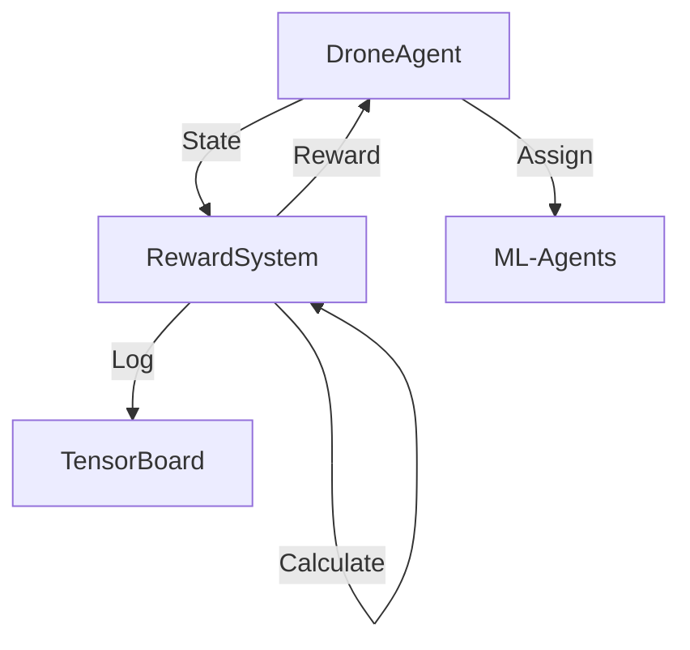

## 10.4 Training Flow

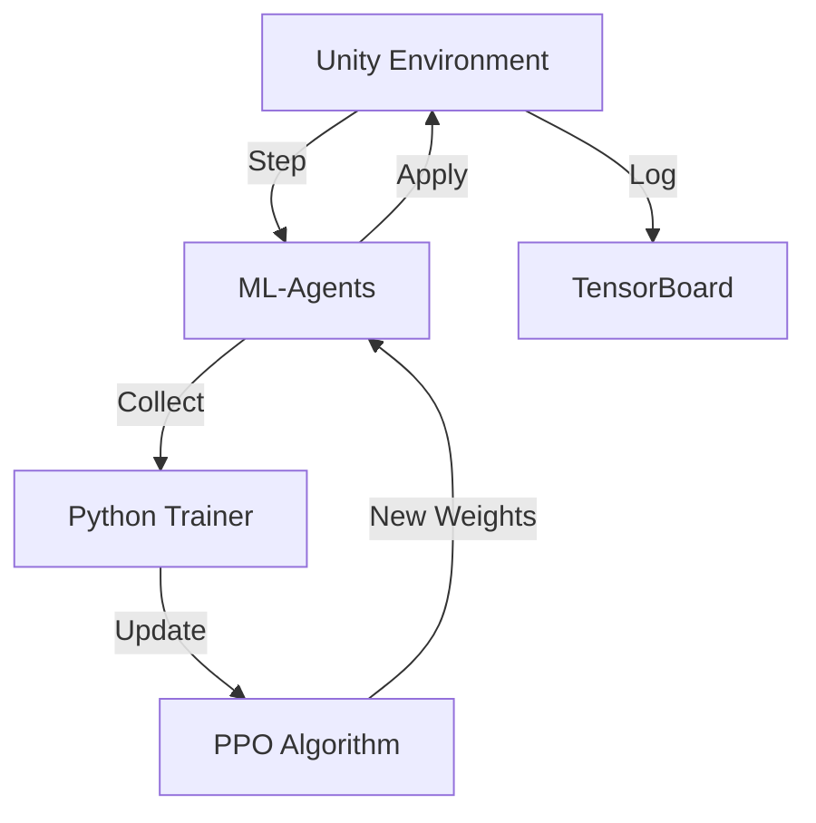

## 10.5 Inference Flow

```merrmaid
graph TD
    A[Unity Environment] -->|Observations| B[ONNX Model]
    B -->|Actions| A
    A -->|No Training| B
```

## 10.6 Memory System

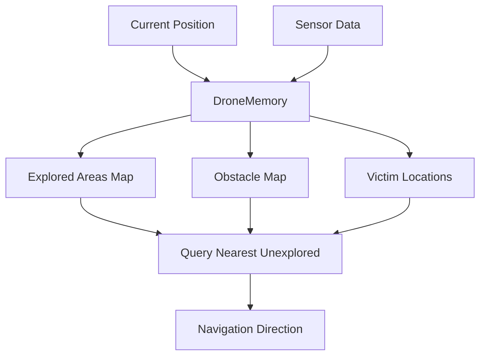

## 10.7 Sensor Fusion

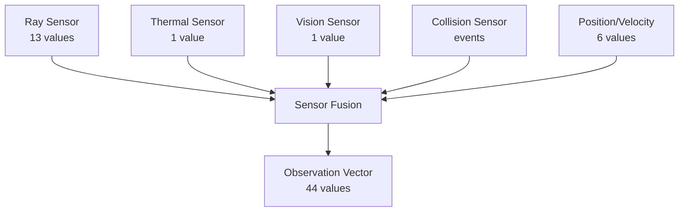

---

# 11. Environment System

## 11.1 Terrain Generation

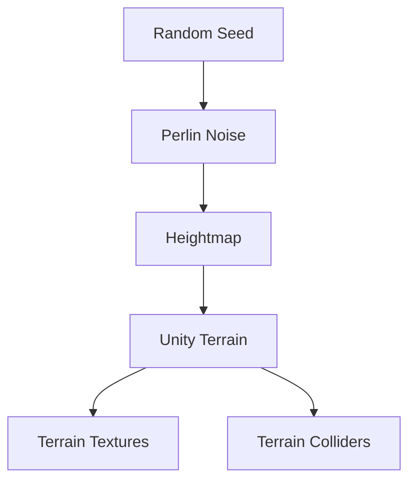

## 11.2 Disaster Generation

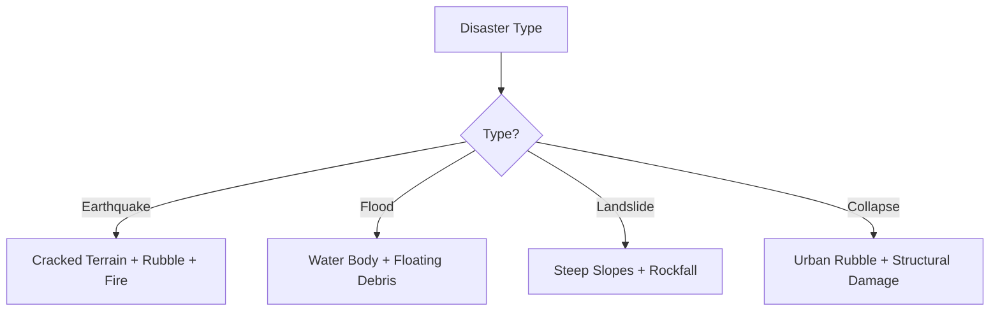

## 11.3 Obstacle Placement Algorithm

```
1. Define no-fly zones (spawn point, boundaries)
2. For each obstacle to place:
   a. Generate random position within bounds
   b. Check against no-fly zones
   c. Check for overlaps with existing obstacles
   d. Ensure navigation path exists
   e. If valid: place obstacle with random rotation
   f. If invalid: retry (max 10 attempts)
```

## 11.4 Victim Placement Algorithm

```
1. For each victim to place:
   a. Generate random position
   b. Check not inside obstacles
   c. Check not too close to spawn
   d. Check minimum distance from other victims
   e. Assign random properties (health, thermal signature)
   f. If valid: place victim
   g. If invalid: retry (max 10 attempts)
```

## 11.5 Spawn Logic

```
1. Generate candidate position
2. Check height above terrain
3. Check clearance from obstacles
4. Check within environment bounds
5. Validate with Physics.CheckSphere
6. Return position if valid, else retry
```

## 11.6 Domain Randomization

| Parameter | Range | Purpose |
|:----------|:------|:--------|
| Terrain seed | 0–999999 | Different terrain layouts |
| Obstacle count | 30–70 | Varying density |
| Victim count | 3–8 | Different challenge levels |
| Building density | 0.2–0.5 | Urban vs rural |
| Debris density | 0.1–0.3 | Different clutter levels |

---

# 12. Drone System

## 12.1 Flight Controller Design

```mermaid
graph TD
    AI[AI Actions] --> FC[FlightController]
    FC --> FORCE[Apply Force]
    FC --> ROTATION[Apply Rotation]
    FORCE --> RB[Rigidbody]
    ROTATION --> RB
    RB --> STABILIZER[DroneStabilizer]
    STABILIZER --> RB
```

## 12.2 Physics Model

| Component | Formula | Description |
|:----------|:--------|:------------|
| Movement | `F = mass × acceleration` | Newton's second law |
| Drag | `Fd = drag × v²` | Air resistance |
| Stabilization | `τ = k × (target - current)` | Proportional control |
| Speed limit | `v = clamp(v, 0, maxSpeed)` | Velocity capping |

## 12.3 Navigation Strategy

The drone uses a simple but effective exploration strategy:

1. **Explore unexplored areas** — Move toward nearest unvisited position
2. **Follow sensor readings** — Avoid detected obstacles
3. **Respond to thermal signals** — Move toward heat sources
4. **Maintain altitude** — Stay above minimum height

## 12.4 Sensor Integration

All sensors feed into SensorManager, which aggregates data for the ObservationProcessor.

```mermaid
graph LR
    RS[Ray Sensor] --> SM[Sensor Manager]
    TS[Thermal] --> SM
    VS[Vision] --> SM
    CS[Collision] --> SM
    SM --> OP[Observation Processor]
```

## 12.5 Memory Integration

DroneMemory stores exploration data that influences navigation decisions.

```mermaid
graph LR
    POS[Position] --> MEM[Memory]
    SENSORS[Sensor Data] --> MEM
    MEM --> NAV[Navigation Direction]
    NAV --> FC[Flight Controller]
```

---

# 13. Dependency Diagram

## 13.1 Dependency Rules

```
┌─────────────────────────────────────────────────┐
│              DEPENDENCY RULES                     │
├─────────────────────────────────────────────────┤
│                                                   │
│  ✅  Core → Domain → Infrastructure → UI         │
│                                                   │
│  ✅  Depend on interfaces, not implementations    │
│                                                   │
│  ✅  Use events for cross-system communication    │
│                                                   │
│  ❌  No circular dependencies                     │
│                                                   │
│  ❌  No UI depending on AI                        │
│                                                   │
│  ❌  No Utilities depending on Core               │
│                                                   │
└─────────────────────────────────────────────────┘
```

## 13.2 Dependency Matrix

| Script | Depends On | Depended By |
|:-------|:-----------|:------------|
| GameManager | EpisodeManager, EnvironmentManager, DroneManager, UIManager | — |
| EpisodeManager | GameManager, RewardSystem | GameManager |
| DroneAgent | SensorManager, ObservationProcessor, FlightController, DroneMemory, RewardSystem | EpisodeManager |
| FlightController | Rigidbody, DroneConfig | DroneAgent, DroneManager |
| SensorManager | ISensor implementations | DroneAgent, ObservationProcessor |
| ObservationProcessor | SensorManager, DroneMemory | DroneAgent |
| RewardSystem | RewardConfig, DroneAgent | DroneAgent, EpisodeManager |
| EnvironmentManager | TerrainGenerator, DisasterGenerator, VictimGenerator, ObstacleGenerator | GameManager |
| UIManager | EpisodeManager, TrainingManager, DroneAgent | GameManager |

---

# 14. Initialization Order

## 14.1 Startup Sequence

```mermaid
graph TD
    A[Application Start] --> B[ConfigurationManager]
    B --> C[GameManager]
    C --> D[PerformanceMonitor]
    C --> E[EpisodeManager]
    C --> F[EnvironmentManager]
    C --> G[DroneManager]
    C --> H[TrainingManager]
    C --> I[UIManager]
    I --> J[All Systems Ready]
    J --> K[Start Simulation]
```

## 14.2 Detailed Initialization

| Order | Manager | Action | Dependencies |
|:------|:--------|:-------|:-------------|
| 1 | ConfigurationManager | Load all ScriptableObjects | None |
| 2 | GameManager | Initialize root | ConfigurationManager |
| 3 | PerformanceMonitor | Start monitoring | None |
| 4 | EpisodeManager | Initialize | GameManager |
| 5 | EnvironmentManager | Load terrain prefabs | ConfigurationManager |
| 6 | DroneManager | Initialize drone systems | ConfigurationManager |
| 7 | TrainingManager | Configure ML-Agents | ConfigurationManager |
| 8 | UIManager | Initialize UI elements | EpisodeManager, TrainingManager |
| 9 | GameManager | Start first episode | All managers |

## 14.3 Episode Start Sequence

```mermaid
graph TD
    A[Episode Start] --> B[EnvironmentManager.GenerateEnvironment]
    B --> C[SpawnGenerator.GetSpawnPosition]
    C --> D[DroneManager.RespawnDrone]
    D --> E[DroneMemory.ClearMemory]
    E --> F[RewardSystem.Reset]
    F --> G[EpisodeManager.BeginTracking]
    G --> H[Episode Active]
```

## 14.4 Dependency Injection

Dependencies are resolved through:

1. **ScriptableObject references** — Set in Unity Inspector
2. **GetComponent calls** — For same-GameObject components
3. **FindObjectOfType** — For manager lookups (limited use)
4. **Events** — For decoupled communication

---

# 15. Error Handling

## 15.1 Error Strategy

| Error Type | Handling | Example |
|:-----------|:---------|:--------|
| Null Reference | Log error, return default | Missing component reference |
| Configuration | Log warning, use defaults | Invalid config value |
| Physics | Log warning, continue | Simulation glitch |
| ML-Agents | Log error, pause training | Training crash |
| File I/O | Log error, retry | Save/load failure |

## 15.2 Logging Levels

```mermaid
graph LR
    DEBUG[Debug] --> INFO[Info]
    INFO --> WARNING[Warning]
    WARNING --> ERROR[Error]
    ERROR --> CRITICAL[Critical]
```

| Level | Usage | When to Use |
|:------|:------|:------------|
| Debug | Development info | Only in dev builds |
| Info | General information | Normal operation |
| Warning | Potential issues | Recoverable problems |
| Error | Failures | Something went wrong |
| Critical | Fatal errors | Cannot continue |

## 15.3 Assertions

```csharp
// Use Unity assertions for development checks
Debug.Assert(sensorManager != null, "SensorManager not assigned");
Debug.Assert(observation.Length == 44, "Invalid observation size");
```

## 15.4 Null Checks

Always validate references before use:

```csharp
if (flightController == null)
{
    Debug.LogError("FlightController not assigned to DroneAgent");
    return;
}
```

## 15.5 Debug Mode

In development builds:
- Verbose logging
- Visual debug overlays
- Performance metrics
- Sensor visualization

In release builds:
- Minimal logging
- No debug overlays
- Optimized performance

---

# 16. Performance Strategy

## 16.1 Target Hardware

| Component | Specification |
|:----------|:-------------|
| CPU | Intel Core i5 |
| RAM | 16 GB |
| GPU | RTX 3050 Laptop |
| VRAM | 4 GB |
| Storage | SSD |

## 16.2 Performance Targets

| Metric | Target | Measurement |
|:-------|:-------|:------------|
| Frame Rate | > 30 FPS | Unity Profiler |
| Memory | < 2 GB | Task Manager |
| Training Speed | > 1000 steps/sec | ML-Agents stats |
| Model Inference | < 10ms | Profiler |

## 16.3 Optimization Techniques

### Object Pooling

```mermaid
graph TD
    REQUEST[Request Object] --> POOL{Pool Has Object?}
    POOL -->|Yes| GET[Get from Pool]
    POOL -->|No| CREATE[Create New]
    GET --> USE[Use Object]
    CREATE --> USE
    USE --> RETURN[Return to Pool]
    RETURN --> POOL
```

**Apply to:**
- Obstacles
- Victims
- Particle effects
- Debug visualizations

### Physics Optimization

| Technique | Description |
|:----------|:------------|
| Fixed Timestep | Use 0.02s (50Hz) for physics |
| Layer Collision Matrix | Disable unnecessary collisions |
| Simplified Colliders | Use primitive colliders where possible |
| Rigidbody Sleep | Allow idle rigidbodies to sleep |

### Memory Management

| Technique | Description |
|:----------|:------------|
| Avoid allocations | Reuse arrays and lists |
| Struct over class | For small data containers |
| Pool strings | For frequently created strings |
| Limit LINQ | Avoid in update loops |

### Update Optimization

| Technique | Description |
|:----------|:------------|
| Fixed vs Update | Use FixedUpdate for physics |
| Caching | Cache component references |
| Distance culling | Skip far objects |
| Frequency limiting | Update some systems less often |

### Rendering Optimization

| Technique | Description |
|:----------|:------------|
| Occlusion culling | Don't render hidden objects |
| LOD | Use lower detail at distance |
| Batching | Combine static geometry |
| Texture atlasing | Reduce draw calls |

### Training Performance

| Technique | Description |
|:----------|:------------|
| Parallel environments | Run 4+ environments |
| Headless mode | Disable rendering during training |
| Efficient observations | Minimize observation vector size |
| Batch processing | Process experiences in batches |

---

# 17. Coding Standards

## 17.1 Naming Conventions

### Files

| Type | Convention | Example |
|:-----|:-----------|:--------|
| Classes | PascalCase | `DroneAgent.cs` |
| Interfaces | I + PascalCase | `ISensor.cs` |
| ScriptableObjects | PascalCase + Config | `DroneConfig.cs` |
| Enums | PascalCase | `DisasterType.cs` |

### Variables

| Context | Convention | Example |
|:--------|:-----------|:--------|
| Public field | PascalCase | `public float Speed` |
| Private field | _camelCase | `private float _speed` |
| Local variable | camelCase | `float currentSpeed` |
| Parameter | camelCase | `float targetSpeed` |
| Constant | UPPER_SNAKE | `MAX_SPEED` |

### Methods

| Context | Convention | Example |
|:--------|:-----------|:--------|
| Public | PascalCase | `public void Move()` |
| Private | PascalCase | `private void ApplyForce()` |
| Property | PascalCase | `public float Speed { get; }` |

## 17.2 Namespaces

```csharp
namespace ADRL Rescue.Core { }
namespace ADRLRescue.AI { }
namespace ADRLRescue.Drone { }
namespace ADRLRescue.Environment { }
namespace ADRLRescue.Sensors { }
namespace ADRLRescue.UI { }
namespace ADRLRescue.Data { }
namespace ADRLRescue.Events { }
namespace ADRLRescue.Utilities { }
namespace ADRLRescue.Interfaces { }
```

## 17.3 File Organization

```csharp
// 1. Using statements
using UnityEngine;
using ADRLRescue.Interfaces;

// 2. Namespace
namespace ADRLRescue.Core
{
    // 3. Class declaration
    public class GameManager : MonoBehaviour
    {
        // 4. Constants
        private const int MAX_EPISODES = 1000;
        
        // 5. Serialized fields
        [SerializeField] private EpisodeManager _episodeManager;
        
        // 6. Private fields
        private bool _isRunning;
        
        // 7. Properties
        public bool IsRunning => _isRunning;
        
        // 8. Unity lifecycle
        private void Awake() { }
        private void Start() { }
        private void Update() { }
        private void OnDestroy() { }
        
        // 9. Public methods
        public void StartSimulation() { }
        
        // 10. Private methods
        private void InitializeSystems() { }
    }
}
```

## 17.4 Comments

- Add XML documentation for public methods
- Explain complex algorithms
- Don't state the obvious
- Use TODO for future work
- Use FIXME for known issues

## 17.5 Regions

Use regions to group related code:

```csharp
#region Unity Lifecycle
private void Awake() { }
private void Start() { }
#endregion

#region Public Methods
public void StartSimulation() { }
public void StopSimulation() { }
#endregion

#region Private Methods
private void InitializeSystems() { }
private void CleanupSystems() { }
#endregion
```

---

# 18. Testing Strategy

## 18.1 Test Types

| Type | Scope | Tool | Frequency |
|:-----|:------|:-----|:----------|
| Unit | Individual classes | NUnit | Every commit |
| Integration | System interactions | NUnit | Every feature |
| Manual | User experience | Unity Play Mode | Before commits |
| Performance | Speed and memory | Unity Profiler | Before releases |

## 18.2 Test Categories

### Core System Tests

| Test | Validates |
|:-----|:----------|
| GameManager initializes | All managers start correctly |
| EpisodeManager cycles | Episodes start and end |
| ConfigurationManager loads | Configs load without error |

### Drone System Tests

| Test | Validates |
|:-----|:----------|
| FlightController applies force | Drone moves correctly |
| DroneStabilizer corrects tilt | Drone stays level |
| DroneMemory records positions | Memory works |

### Sensor Tests

| Test | Validates |
|:-----|:----------|
| RaySensor detects obstacles | Rays hit objects |
| ThermalSensor detects heat | Victims detected |
| CollisionSensor triggers | Collisions recorded |

### AI System Tests

| Test | Validates |
|:-----|:----------|
| ObservationProcessor normalizes | Values in range |
| RewardSystem calculates correctly | Rewards match expectations |
| DroneAgent collects observations | Correct vector size |

### Environment Tests

| Test | Validates |
|:-----|:----------|
| TerrainGenerator creates terrain | Terrain exists |
| ObstacleGenerator places obstacles | No overlaps |
| VictimGenerator spawns victims | Valid positions |

## 18.3 Test-Driven Development

```
1. Write failing test
2. Write minimal code to pass
3. Refactor while keeping tests green
4. Repeat
```

---

# 19. Implementation Order

## 19.1 Phase Sequence

```mermaid
graph TD
    P1[Phase 1: Core Managers] --> P2[Phase 2: Data Models]
    P2 --> P3[Phase 3: Event System]
    P3 --> P4[Phase 4: Drone Physics]
    P4 --> P5[Phase 5: Sensors]
    P5 --> P6[Phase 6: Environment]
    P6 --> P7[Phase 7: AI System]
    P7 --> P8[Phase 8: Training]
    P8 --> P9[Phase 9: UI]
    P9 --> P10[Phase 10: Optimization]
```

## 19.2 Detailed Implementation Order

| Phase | Scripts | Why This Order |
|:------|:--------|:---------------|
| **1. Core Managers** | GameManager, EpisodeManager, ConfigurationManager | Foundation for everything |
| **2. Data Models** | All ScriptableObjects | Configs needed by all systems |
| **3. Event System** | GameEvents | Communication backbone |
| **4. Drone Physics** | FlightController, DroneStabilizer, DroneManager | Need working drone before sensors |
| **5. Sensors** | SensorManager, RaySensor, ThermalSensor, VisionSensor, CollisionSensor | Sensors feed into AI |
| **6. Environment** | EnvironmentManager, TerrainGenerator, DisasterGenerator, ObstacleGenerator, VictimGenerator, SpawnGenerator | Need environment for testing |
| **7. AI System** | DroneAgent, ObservationProcessor, DroneMemory, RewardSystem | Core intelligence |
| **8. Training** | TrainingManager, ONNX export | Training pipeline |
| **9. UI** | UIManager, HUDController, DebugOverlay | User interface |
| **10. Optimization** | ObjectPool, PerformanceMonitor, DebugHelper | Polish and performance |

## 19.3 Why This Order

Each phase builds on the previous:

1. **Core Managers** → Foundation for lifecycle
2. **Data Models** → Configuration for all systems
3. **Event System** → Communication between systems
4. **Drone Physics** → Physical drone behavior
5. **Sensors** → Perception for AI
6. **Environment** → World for drone to navigate
7. **AI System** → Intelligence layer
8. **Training** → Learning pipeline
9. **UI** → User interface
10. **Optimization** → Performance polish

---

# 20. Definition of Done

## 20.1 Script Completion Criteria

A script is considered **complete** when:

- [ ] Compiles without errors
- [ ] Compiles without warnings
- [ ] Follows naming conventions
- [ ] Has XML documentation for public methods
- [ ] Has no null reference risks
- [ ] Handles edge cases
- [ ] Uses appropriate logging
- [ ] Follows single responsibility
- [ ] Has no circular dependencies
- [ ] Passes code review
- [ ] Is integrated with other systems
- [ ] Has unit tests (where applicable)
- [ ] Is documented in SDS
- [ ] Performs within targets

## 20.2 Feature Completion Criteria

A feature is considered **complete** when:

- [ ] All related scripts are complete
- [ ] Integration tests pass
- [ ] Manual testing completed
- [ ] Documentation updated
- [ ] No regression in existing features
- [ ] Performance meets targets
- [ ] Code reviewed
- [ ] Commit follows convention

## 20.2 Phase Completion Criteria

A phase is considered **complete** when:

- [ ] All scripts in phase are complete
- [ ] All tests pass
- [ ] Integration with previous phases works
- [ ] Documentation updated
- [ ] Performance baseline established
- [ ] Phase review completed

---

# 21. Future Expandability

## 21.1 Architecture Flexibility

The modular architecture supports future features without major refactoring:

```mermaid
graph TD
    CORE[Current Architecture] --> F1[Multi-Agent Swarm]
    CORE --> F2[Battery System]
    CORE --> F3[Weather Effects]
    CORE --> F4[ROS Integration]
    CORE --> F5[Computer Vision]
    CORE --> F6[Cloud Training]
    CORE --> F7[Google Maps]
```

## 21.2 Extension Points

| Future Feature | Extension Point | Required Changes |
|:---------------|:----------------|:-----------------|
| **Multi-Agent Swarm** | DroneManager | Add agent spawning, communication layer |
| **Battery System** | DroneConfig, FlightController | Add battery drain, charging logic |
| **Weather Effects** | EnvironmentManager | Add weather generator, physics modifiers |
| **ROS Integration** | SensorManager | Add ROS bridge, message converters |
| **Computer Vision** | SensorManager | Add camera sensor, YOLO integration |
| **Cloud Training** | TrainingManager | Add distributed training, cloud API |
| **Google Maps** | TerrainGenerator | Add GIS data loader, terrain importer |

## 21.3 Design Patterns for Extensibility

| Pattern | Application | Benefit |
|:--------|:------------|:--------|
| **Strategy** | Disaster generation | Easy to add new disaster types |
| **Observer** | Event system | Loose coupling between systems |
| **Factory** | Sensor creation | Dynamic sensor addition |
| **Object Pool** | Obstacle/ victim spawning | Efficient instantiation |
| **Command** | Action system | Action recording and replay |

## 21.4 Interface-Based Design

All major systems communicate through interfaces, making it easy to:
- Swap implementations
- Add new systems
- Test in isolation
- Mock for unit tests

---

## Document Control

| Property | Value |
|:---------|:------|
| Document ID | DOC-017 |
| Version | 1.0.0 |
| Author | Nihaal Gharat |
| Created | 2026-07-20 |
| Last Modified | 2026-07-20 |
| Next Review | Before Phase 1 implementation |
| Status | ✅ ACTIVE |

---

## Navigation

| Document | Description | Link |
|:---------|:------------|:-----|
| Project Charter | Highest authority | [00_PROJECT_CHARTER.md](00_PROJECT_CHARTER.md) |
| Architecture | System architecture | [02_PROJECT_ARCHITECTURE.md](02_PROJECT_ARCHITECTURE.md) |
| System Design | Detailed design | [03_SYSTEM_DESIGN.md](03_SYSTEM_DESIGN.md) |
| AI System | AI details | [06_AI_SYSTEM.md](06_AI_SYSTEM.md) |
| Drone System | Drone details | [07_DRONE_SYSTEM.md](07_DRONE_SYSTEM.md) |
| Sensor System | Sensor specs | [09_SENSOR_SYSTEM.md](09_SENSOR_SYSTEM.md) |
| Coding Standards | Code conventions | [13_CODING_STANDARDS.md](13_CODING_STANDARDS.md) |
| Testing Guide | Testing procedures | [15_TESTING_GUIDE.md](15_TESTING_GUIDE.md) |

---

*This Software Design Specification was established on 2026-07-20.*
*All implementation must conform to this document.*
*No code should be written without first being designed here.*
