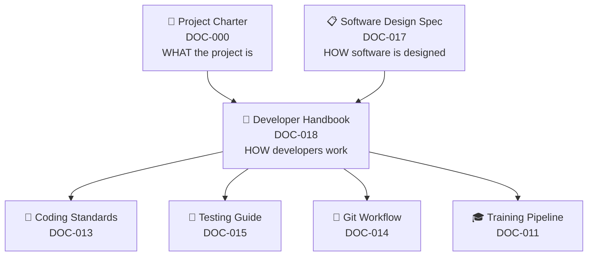
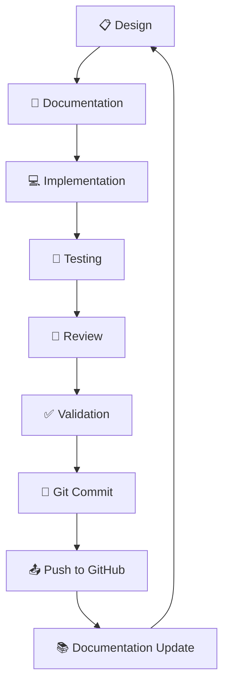
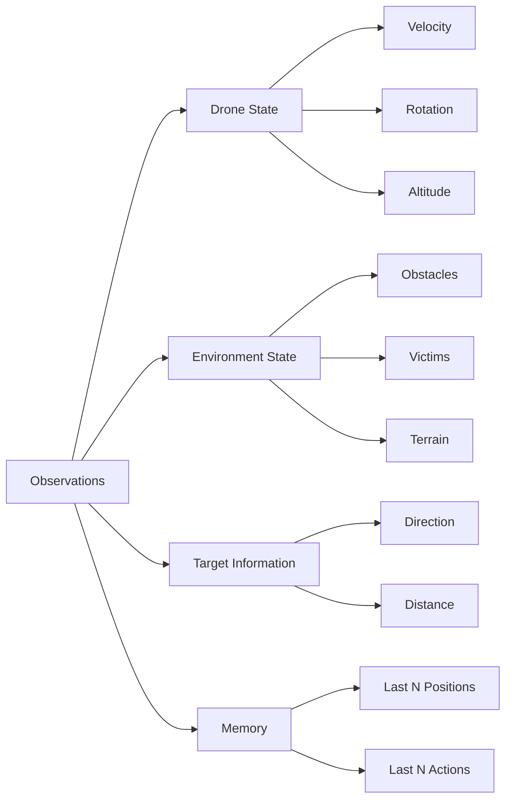
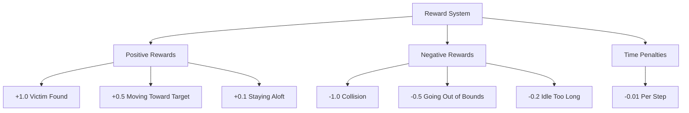
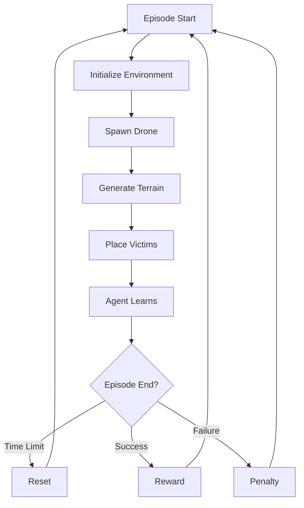
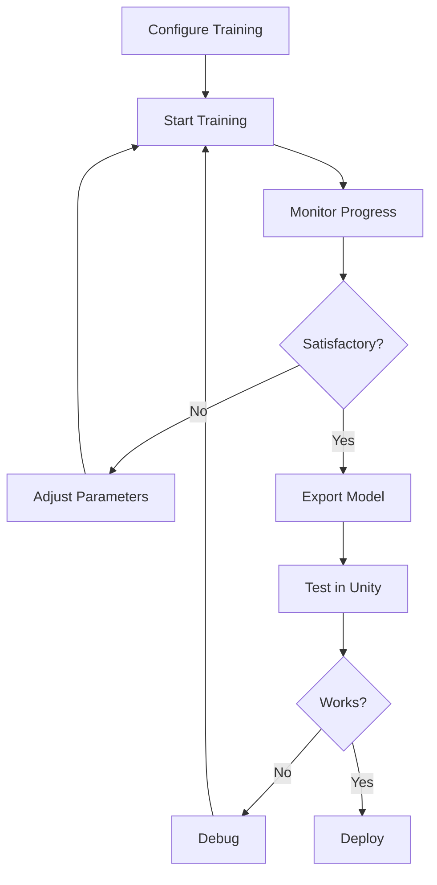
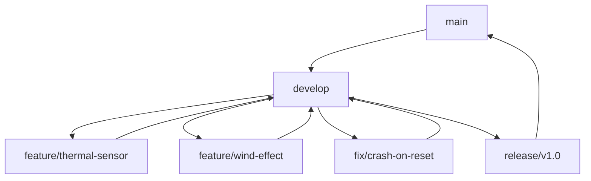

# 18 - Developer Handbook

> **The practical guide for anyone working on ADRL-Rescue.**

---

| Field | Value |
|:------|:------|
| **Document ID** | `DOC-018` |
| **Version** | `1.0.0` |
| **Status** | `ACTIVE` |
| **Author** | Nihaal Gharat (Project Founder), Bhavya Damani (Co-Developer) |
| **Effective Date** | 2026-07-20 |
| **Authority** | Derived from [00_PROJECT_CHARTER.md](00_PROJECT_CHARTER.md) |

> 📘 **Purpose**
> This Developer Handbook is the operational guide for all future development of ADRL-Rescue. It explains not only what the project is, but also how to work with it, extend it, debug it, test it, and maintain it. After reading this handbook, a new developer should be able to set up the project, understand the architecture, follow coding standards, add new features correctly, debug common issues, train AI models, and contribute confidently.

---

## Table of Contents

| # | Section | Description |
|:--|:--------|:------------|
| 1 | [Introduction](#1-introduction) | Purpose, audience, and relationship to other documents |
| 2 | [Getting Started](#2-getting-started) | Prerequisites, installation, first launch |
| 3 | [Repository Overview](#3-repository-overview) | Folder structure and file organization |
| 4 | [Project Workflow](#4-project-workflow) | Development lifecycle |
| 5 | [Coding Guidelines](#5-coding-guidelines) | C# conventions and standards |
| 6 | [Unity Development Guidelines](#6-unity-development-guidelines) | Unity-specific best practices |
| 7 | [AI Development Guidelines](#7-ai-development-guidelines) | ML-Agents and RL best practices |
| 8 | [Adding New Features](#8-adding-new-features) | Step-by-step feature guides |
| 9 | [Training Workflow](#9-training-workflow) | Training lifecycle and management |
| 10 | [Testing Workflow](#10-testing-workflow) | Testing strategies and procedures |
| 11 | [Debugging Guide](#11-debugging-guide) | Common issues and solutions |
| 12 | [Performance Guidelines](#12-performance-guidelines) | Optimization strategies |
| 13 | [Git Workflow](#13-git-workflow) | Git conventions and practices |
| 14 | [Documentation Workflow](#14-documentation-workflow) | Documentation maintenance |
| 15 | [Common Mistakes](#15-common-mistakes) | Beginner pitfalls and how to avoid them |
| 16 | [Frequently Asked Questions](#16-frequently-asked-questions-faq) | Practical FAQ |
| 17 | [Troubleshooting](#17-troubleshooting) | Problem-solution table |
| 18 | [Best Practices](#18-best-practices) | Summary of key practices |
| 19 | [Contributor Checklist](#19-contributor-checklist) | Pre-commit verification |
| 20 | [Developer Philosophy](#20-developer-philosophy) | Project values and vision |

---

# 1. Introduction

## 1.1 Purpose of the Handbook

This handbook is the **practical guide** for anyone working on ADRL-Rescue. It bridges the gap between high-level documentation (Project Charter, Software Design Specification) and the day-to-day work of developing, testing, debugging, and maintaining the project.

## 1.2 Who Should Read This

| Audience | Why Read This |
|:---------|:-------------|
| **New Contributors** | Understand how to set up, work on, and contribute to the project |
| **Unity Developers** | Learn Unity-specific conventions and best practices |
| **AI/ML Engineers** | Understand the ML-Agents integration and training workflow |
| **Maintainers** | Reference standards for code review and quality assurance |
| **Students** | Learn professional software engineering practices |

## 1.3 Relationship to Other Documents



| Document | Purpose | Read This For |
|:---------|:--------|:-------------|
| [Project Charter](00_PROJECT_CHARTER.md) | WHAT the project is | Vision, scope, architecture, rules |
| [Software Design Specification](17_SOFTWARE_DESIGN_SPECIFICATION.md) | HOW software is designed | Script specifications, interfaces, data flows |
| **This Handbook** | HOW developers work | Day-to-day practices, workflows, debugging |
| [Coding Standards](13_CODING_STANDARDS.md) | Code conventions | Naming, formatting, organization |
| [Testing Guide](15_TESTING_GUIDE.md) | Testing procedures | Test strategies, validation |
| [Git Workflow](14_GITHUB_WORKFLOW.md) | Git conventions | Branches, commits, PRs |
| [Training Pipeline](11_TRAINING_PIPELINE.md) | Training procedures | PPO configuration, monitoring |

---

# 2. Getting Started

## 2.1 Prerequisites

Before you begin, ensure you have the following installed:

| Software | Version | Purpose | Download |
|:---------|:--------|:--------|:---------|
| **Unity** | 2022.3.62f3 LTS | Game engine | [unity.com](https://unity.com/) |
| **Unity Hub** | Latest | Project management | [unity.com](https://unity.com/) |
| **Python** | 3.8+ | ML training | [python.org](https://www.python.org/) |
| **Git** | Latest | Version control | [git-scm.com](https://git-scm.com/) |
| **GitHub Account** | Free | Repository access | [github.com](https://github.com/) |
| **Code Editor** | Latest | Code editing | VS Code or Visual Studio |

> ⚠️ **Important**
> Use **Unity 2022.3 LTS** specifically. Other versions may cause compatibility issues with ML-Agents.

## 2.2 Unity Installation

1. Download and install **Unity Hub** from [unity.com](https://unity.com/)
2. Open Unity Hub
3. Go to **Installs** → **Install Editor**
4. Search for **2022.3.62f3 LTS**
5. Click **Install**
6. Add the following modules during installation:
   - **Microsoft Visual Studio Community** (or your preferred IDE)
   - **Android Build Support** (if targeting Android)
   - **iOS Build Support** (if targeting iOS)

## 2.3 Python Installation

### Windows

```bash
# Download Python from python.org
# During installation, check "Add Python to PATH"
# Verify installation
python --version
pip --version
```

### macOS

```bash
# Using Homebrew
brew install python@3.10
python3 --version
pip3 --version
```

### Linux

```bash
# Using apt (Ubuntu/Debian)
sudo apt update
sudo apt install python3 python3-pip
python3 --version
pip3 --version
```

## 2.4 ML-Agents Installation

### Unity Side

1. Open Unity Hub
2. Open the ADRL-Rescue project
3. Go to **Window** → **Package Manager**
4. Click **+** → **Add package from git URL**
5. Enter: `com.unity.ml-agents`
6. Click **Add**

### Python Side

```bash
# Navigate to Python directory
cd ADRL-Rescue/Python

# Create virtual environment (recommended)
python -m venv venv

# Activate virtual environment
# Windows:
venv\Scripts\activate
# macOS/Linux:
source venv/bin/activate

# Install dependencies
pip install -r requirements.txt
```

## 2.5 Git Installation

```bash
# Verify Git installation
git --version

# Configure Git (if not already done)
git config --global user.name "Your Name"
git config --global user.email "your.email@example.com"
```

## 2.6 Repository Cloning

```bash
# Clone the repository
git clone https://github.com/NihaalGharat/ADRL-Rescue.git

# Navigate to project directory
cd ADRL-Rescue
```

## 2.7 Opening the Unity Project

1. Open **Unity Hub**
2. Click **Open** → **Add project from disk**
3. Navigate to `ADRL-Rescue/UnityProject/`
4. Select the folder and click **Open**
5. Wait for Unity to import all assets (may take several minutes on first open)

## 2.8 First Launch Checklist

After opening the project for the first time, verify:

| # | Check | Expected Result | Status |
|:--|:------|:----------------|:-------|
| 1 | Unity opens without errors | No error messages in Console | ⬜ |
| 2 | Project compiles | No compilation errors | ⬜ |
| 3 | ML-Agents package installed | Package Manager shows ML-Agents | ⬜ |
| 4 | Scenes load correctly | No missing references | ⬜ |
| 5 | Python environment ready | `pip list` shows mlagents | ⬜ |
| 6 | Git configured | `git status` works | ⬜ |

## 2.9 Common Setup Mistakes

| Mistake | Symptom | Solution |
|:--------|:--------|:---------|
| Wrong Unity version | Compilation errors | Install Unity 2022.3.62f3 LTS |
| ML-Agents not installed | Missing package errors | Add package via Package Manager |
| Python not in PATH | `python` command not found | Reinstall Python with "Add to PATH" |
| Virtual env not activated | `mlagents-learn` not found | Activate virtual environment |
| Git not configured | Commit author issues | Run `git config` commands |
| Project opened from wrong folder | Missing assets | Open `UnityProject/` folder |

---

# 3. Repository Overview

## 3.1 Root Structure

```
ADRL-Rescue/
│
├── 📂 UnityProject/          # Unity game project
├── 📂 Python/                # Training scripts and configs
├── 📂 Documentation/         # Project documentation
├── 📂 Assets/                # Static assets (icons, banners)
├── 📂 Media/                 # Screenshots, videos, GIFs
├── 📂 Research/              # Papers, notes, references
│
├── 📄 README.md              # Project landing page
├── 📄 CHANGELOG.md           # Version history
├── 📄 CONTRIBUTING.md        # Contribution guidelines
├── 📄 CODE_OF_CONDUCT.md     # Community standards
├── 📄 SECURITY.md            # Security policy
├── 📄 LICENSE                # MIT License
├── 📄 CITATION.cff           # Citation metadata
└── 📄 .gitignore             # Git ignore rules
```

## 3.2 Folder Purposes

| Folder | Purpose | Where to Place Files |
|:-------|:--------|:---------------------|
| `UnityProject/` | Main Unity project with all game logic | Unity scripts, scenes, prefabs, materials |
| `Python/` | Training scripts and configurations | Python scripts, YAML configs, ONNX models |
| `Documentation/` | All project documentation | Numbered guides, glossary, handbooks |
| `Assets/` | Static assets for README and docs | Icons, banners, logos |
| `Media/` | Screenshots, videos, GIFs | Demo videos, training graphs |
| `Research/` | Academic papers and references | Research papers, notes |

## 3.3 UnityProject Structure

```
UnityProject/
│
├── 📂 Assets/
│   ├── 📂 Scripts/
│   │   ├── 📂 Core/              # Game manager, utilities
│   │   ├── 📂 AI/                # ML-Agents, decision making
│   │   ├── 📂 Drone/             # Drone behavior, flight control
│   │   ├── 📂 Environment/       # Procedural generation
│   │   ├── 📂 Sensors/           # Ray, thermal, vision sensors
│   │   ├── 📂 Training/          # Reward system, training config
│   │   ├── 📂 Utilities/         # Helper functions, extensions
│   │   └── 📂 UI/                # HUD, debug overlay
│   │
│   ├── 📂 Prefabs/               # Reusable GameObjects
│   ├── 📂 Materials/             # Physics materials, shaders
│   ├── 📂 Textures/              # Texture assets
│   ├── 📂 Models/                # 3D models
│   ├── 📂 Animations/            # Animation controllers
│   ├── 📂 Scenes/                # Unity scenes
│   ├── 📂 Settings/              # Quality, input settings
│   └── 📂 Plugins/               # Third-party plugins
│
├── 📂 ProjectSettings/           # Unity project settings
└── 📂 Packages/                  # Package manifest
```

## 3.4 Python Structure

```
Python/
│
├── 📂 configs/              # Training YAML configurations
├── 📂 scripts/              # Python training scripts
├── 📂 results/              # Training results
├── 📂 logs/                 # TensorBoard logs
└── 📂 models/               # Exported ONNX models
```

## 3.5 Documentation Structure

```
Documentation/
│
├── 📄 00_PROJECT_CHARTER.md         # Master project document
├── 📄 01_PROJECT_VISION.md          # Vision and mission
├── 📄 02_PROJECT_ARCHITECTURE.md    # System architecture
├── 📄 03_SYSTEM_DESIGN.md           # System design
├── 📄 04_DEVELOPMENT_ROADMAP.md     # Development phases
├── 📄 05_FOLDER_STRUCTURE.md        # File organization
├── 📄 06_AI_SYSTEM.md               # AI system design
├── 📄 07_DRONE_SYSTEM.md            # Drone system design
├── 📄 08_ENVIRONMENT_SYSTEM.md      # Environment design
├── 📄 09_SENSOR_SYSTEM.md           # Sensor design
├── 📄 10_REWARD_SYSTEM.md           # Reward system design
├── 📄 11_TRAINING_PIPELINE.md       # Training procedures
├── 📄 12_DATA_FLOW.md               # Data flow design
├── 📄 13_CODING_STANDARDS.md        # Coding conventions
├── 📄 14_GITHUB_WORKFLOW.md         # Git workflow
├── 📄 15_TESTING_GUIDE.md           # Testing procedures
├── 📄 16_FUTURE_SCOPE.md            # Future features
├── 📄 17_SOFTWARE_DESIGN_SPECIFICATION.md  # Implementation blueprint
├── 📄 18_DEVELOPER_HANDBOOK.md      # This document
├── 📄 PROJECT_GLOSSARY.md           # Terminology reference
├── 📄 README.md                     # Documentation index
└── 📄 TEMPLATE.md                   # Document template
```

## 3.6 Where to Place New Files

| File Type | Location | Naming Convention |
|:----------|:---------|:------------------|
| C# Scripts | `UnityProject/Assets/Scripts/[Category]/` | `PascalCase.cs` |
| Prefabs | `UnityProject/Assets/Prefabs/` | `PascalCase.prefab` |
| Materials | `UnityProject/Assets/Materials/` | `PascalCase.mat` |
| Scenes | `UnityProject/Assets/Scenes/` | `PascalCase.unity` |
| Python Scripts | `Python/scripts/` | `snake_case.py` |
| Configs | `Python/configs/` | `snake_case.yaml` |
| Documentation | `Documentation/` | `##_TOPIC.md` |
| Media | `Media/` | Descriptive filenames |

---

# 4. Project Workflow

## 4.1 Development Lifecycle

The ADRL-Rescue project follows a structured development workflow:



## 4.2 Workflow Steps

| Step | Activity | Tools | Output |
|:-----|:---------|:------|:-------|
| 1. Design | Plan the feature, write architecture | Diagrams, documentation | Design document |
| 2. Documentation | Update relevant documentation | Markdown | Updated docs |
| 3. Implementation | Write C# or Python code | Unity, VS Code | Working code |
| 4. Testing | Verify functionality works | Unity Play Mode, tests | Test results |
| 5. Review | Code review and quality check | Manual review | Feedback |
| 6. Validation | Ensure all checks pass | Compiler, linter | Clean build |
| 7. Git Commit | Commit with proper message | Git | Commit hash |
| 8. Push | Push to GitHub | Git | Remote update |
| 9. Documentation Update | Update changelog, docs | Markdown | Updated docs |

## 4.3 Detailed Step Explanations

### Step 1: Design

Before writing any code:

1. **Understand the requirement** — What problem are you solving?
2. **Research existing solutions** — How do others solve this?
3. **Create diagrams** — How will your solution fit into the architecture?
4. **Document the design** — Write a brief design document

### Step 2: Documentation

Update the relevant documentation:

- If adding a new system → Update architecture docs
- If changing behavior → Update system design
- If adding commands → Update training pipeline
- If changing setup → Update getting started guide

### Step 3: Implementation

Write the code following:

- [Coding Standards](13_CODING_STANDARDS.md)
- [Unity Guidelines](#6-unity-development-guidelines)
- [AI Guidelines](#7-ai-development-guidelines)

### Step 4: Testing

Verify your implementation:

- [ ] Unit tests pass (if applicable)
- [ ] Manual testing completed
- [ ] No compiler errors
- [ ] No console warnings
- [ ] Performance acceptable

### Step 5: Review

Self-review your code:

- [ ] Code follows naming conventions
- [ ] Code is well-documented
- [ ] No hardcoded values
- [ ] Error handling is appropriate
- [ ] No circular dependencies

### Step 6: Validation

Run all validation checks:

```bash
# Unity: Check for compilation errors
# Open Unity → Console → Check for errors

# Python: Run tests (if applicable)
cd Python
python -m pytest tests/

# Git: Check status
git status
git diff
```

### Step 7: Git Commit

Commit with a proper message:

```bash
# Stage changes
git add .

# Commit with descriptive message
git commit -m "feat: add thermal sensor implementation"

# Follow commit convention:
# feat: new feature
# fix: bug fix
# docs: documentation
# refactor: code refactoring
# test: adding tests
# chore: maintenance
```

### Step 8: Push

Push to GitHub:

```bash
# Push to your fork
git push origin feature/thermal-sensor

# Create Pull Request on GitHub
```

### Step 9: Documentation Update

After merging:

- Update CHANGELOG.md
- Update relevant documentation
- Add screenshots if UI changed
- Update training docs if AI changed

---

# 5. Coding Guidelines

## 5.1 Naming Conventions

### Files

| Type | Convention | Example |
|:-----|:-----------|:--------|
| Classes | PascalCase | `DroneAgent.cs` |
| Interfaces | I + PascalCase | `ISensor.cs` |
| Enums | PascalCase | `DisasterType.cs` |
| Scripts | PascalCase | `FlightController.cs` |

### Variables

| Type | Convention | Example |
|:-----|:-----------|:--------|
| Public fields | PascalCase | `public float speed;` |
| Private fields | _camelCase | `private float _speed;` |
| Local variables | camelCase | `float currentSpeed;` |
| Parameters | camelCase | `float targetSpeed` |
| Constants | UPPER_SNAKE | `MAX_SPEED` |

### Methods

| Type | Convention | Example |
|:-----|:-----------|:--------|
| Public methods | PascalCase | `public void Move()` |
| Private methods | PascalCase | `private void ApplyForce()` |
| Properties | PascalCase | `public float Speed { get; }` |

## 5.2 Code Structure

### Class Organization

```csharp
public class DroneAgent : Agent
{
    // 1. Constants
    private const float MAX_SPEED = 10.0f;
    
    // 2. Serialized Fields
    [SerializeField] private float _moveForce = 5.0f;
    
    // 3. Private Fields
    private Rigidbody _rigidbody;
    private float _currentSpeed;
    
    // 4. Properties
    public float CurrentSpeed => _currentSpeed;
    
    // 5. Unity Lifecycle Methods
    private void Awake() { }
    private void Start() { }
    private void FixedUpdate() { }
    
    // 6. Public Methods
    public void ApplyMovement(float x, float y, float z) { }
    
    // 7. Private Methods
    private void ApplyForce(Vector3 force) { }
}
```

### Method Ordering

1. **Awake** — Initialize references
2. **Start** — Initialize values
3. **OnEnable** — Subscribe to events
4. **FixedUpdate** — Physics updates
5. **Update** — Frame updates
6. **LateUpdate** — Post-frame updates
7. **OnDisable** — Unsubscribe from events
8. **OnDestroy** — Cleanup

## 5.3 Namespace Conventions

```csharp
namespace ADRLRescue.Core
{
    public class GameManager : MonoBehaviour
    {
        // ...
    }
}
```

| Namespace | Purpose |
|:----------|:--------|
| `ADRLRescue.Core` | Core managers and utilities |
| `ADRLRescue.Drone` | Drone-related scripts |
| `ADRLRescue.AI` | AI and ML-Agents scripts |
| `ADRLRescue.Environment` | Environment generation |
| `ADRLRescue.Sensors` | Sensor implementations |
| `ADRLRescue.Training` | Training and rewards |
| `ADRLRescue.UI` | User interface |

## 5.4 SOLID Principles

| Principle | Description | Example |
|:----------|:-----------|:--------|
| **S**ingle Responsibility | Each class does one thing | `DroneAgent` handles drone AI only |
| **O**pen/Closed | Open for extension, closed for modification | Use interfaces for new sensors |
| **L**iskov Substitution | Subtypes must be substitutable | Any `ISensor` works anywhere |
| **I**nterface Segregation | Many specific interfaces | Separate `ISensor`, `IMovable` |
| **D**ependency Inversion | Depend on abstractions | Use `IManager` not `GameManager` |

## 5.5 Comments

### When to Comment

```csharp
// GOOD: Explain WHY, not WHAT
// We use 0.5f to prevent the drone from getting too close to obstacles
private const float MIN_SAFE_DISTANCE = 0.5f;

// BAD: Don't state the obvious
float speed = 10f; // Set speed to 10
```

### Documentation Comments

```csharp
/// <summary>
/// Calculates the optimal flight path to the target position.
/// Uses A* pathfinding with obstacle avoidance.
/// </summary>
/// <param name="target">Target position to reach</param>
/// <returns>Optimal path as Vector3 array</returns>
public Vector3[] CalculatePath(Vector3 target)
{
    // Implementation
}
```

## 5.6 Error Handling

```csharp
// Use try-catch for operations that might fail
try
{
    string json = File.ReadAllText(configPath);
    Config config = JsonUtility.FromJson<Config>(json);
}
catch (FileNotFoundException e)
{
    Debug.LogError($"Config file not found: {e.Message}");
}
catch (JsonException e)
{
    Debug.LogError($"Invalid JSON format: {e.Message}");
}

// Use null checks
if (_droneAgent == null)
{
    Debug.LogError("DroneAgent not assigned!");
    return;
}
```

---

# 6. Unity Development Guidelines

## 6.1 Scenes

### Scene Organization

| Scene | Purpose | When to Use |
|:------|:--------|:-----------|
| `MainMenu` | Start screen | App launch |
| `Training` | AI training environment | Training sessions |
| `Evaluation` | Performance testing | Evaluation runs |
| `Sandbox` | Development testing | Development |

### Scene Management

```csharp
// Load scene asynchronously
SceneManager.LoadSceneAsync("Training");

// Load scene with progress
async void LoadScene(string sceneName)
{
    AsyncOperation asyncLoad = SceneManager.LoadSceneAsync(sceneName);
    
    while (!asyncLoad.isDone)
    {
        float progress = Mathf.Clamp01(asyncLoad.progress / 0.9f);
        // Update progress bar
        yield return null;
    }
}
```

## 6.2 Prefabs

### Prefab Organization

```
Prefabs/
├── 📂 Core/
│   ├── GameManager.prefab
│   └── EventSystem.prefab
├── 📂 Drone/
│   ├── DroneAgent.prefab
│   └── DroneSensors.prefab
├── 📂 Environment/
│   ├── Terrain.prefab
│   ├── Building.prefab
│   └── Victim.prefab
├── 📂 UI/
│   ├── HUD.prefab
│   └── Menu.prefab
└── 📂 Effects/
    ├── Explosion.prefab
    └── Smoke.prefab
```

### Prefab Best Practices

| Practice | Description |
|:---------|:-----------|
| **Variants** | Use prefab variants for variations |
| **Nesting** | Nest prefabs for complex objects |
| **Scripts** | Keep scripts on root objects |
| **Transforms** | Reset transforms before saving |
| **Naming** | Use descriptive names |

## 6.3 ScriptableObjects

### ScriptableObject Usage

```csharp
[CreateAssetMenu(fileName = "NewDroneConfig", menuName = "ADRL-Rescue/Drone Config")]
public class DroneConfig : ScriptableObject
{
    public float maxSpeed = 10f;
    public float acceleration = 5f;
    public float turnSpeed = 2f;
}
```

### ScriptableObject Organization

| Type | Purpose | Example |
|:-----|:--------|:--------|
| **Configuration** | Store settings | `DroneConfig`, `EnvironmentConfig` |
| **Data** | Store game data | `DisasterData`, `VictimData` |
| **Events** | Event channels | `GameEvent`, `FloatEvent` |

## 6.4 Physics

### Physics Settings

| Setting | Recommended Value | Reason |
|:--------|:------------------|:-------|
| **Fixed Timestep** | 0.02s (50Hz) | Stable physics |
| **Gravity** | (0, -9.81, 0) | Earth gravity |
| **Default Material** | None | Avoid friction issues |

### Physics Layers

| Layer | Purpose |
|:------|:--------|
| 0 | Default |
| 6 | Drone |
| 7 | Obstacle |
| 8 | Victim |
| 9 | Sensor Ray |

### Rigidbody Setup

```csharp
// Optimal Rigidbody settings for drone
_rigidbody = GetComponent<Rigidbody>();
_rigidbody.mass = 1.0f;
_rigidbody.drag = 0.5f;
_rigidbody.angularDrag = 0.5f;
_rigidbody.useGravity = true;
_rigidbody.interpolation = RigidbodyInterpolation.Interpolate;
_rigidbody.collisionDetectionMode = CollisionDetectionMode.Continuous;
```

## 6.5 Tags and Layers

### Tags

| Tag | Usage |
|:----|:------|
| `Drone` | Drone GameObjects |
| `Victim` | Victim GameObjects |
| `Obstacle` | Obstacle GameObjects |
| `Sensor` | Sensor GameObjects |

## 6.6 Packages

### Required Packages

| Package | Version | Purpose |
|:--------|:--------|:--------|
| `com.unity.ml-agents` | Latest | ML-Agents framework |
| `com.unity.textmeshpro` | Latest | Text rendering |
| `com.unity.inputsystem` | Latest | Input handling |

### Installing Packages

1. Open **Window** → **Package Manager**
2. Click **+** → **Add package from git URL**
3. Enter package URL or name
4. Click **Add**

## 6.7 Project Settings

### Quality Settings

| Setting | Value | Reason |
|:--------|:------|:-------|
| **V Sync Count** | Don't Sync | Maximize FPS |
| **Anti Aliasing** | 2x | Balance quality/performance |
| **Shadow Resolution** | Medium | Performance |

### Time Settings

| Setting | Value | Reason |
|:--------|:------|:-------|
| **Fixed Timestep** | 0.02 | Stable physics |
| **Maximum Allowed Timestep** | 0.1 | Prevent spiral of death |

---

# 7. AI Development Guidelines

## 7.1 Observations

### Observation Best Practices

| Practice | Description |
|:---------|:-----------|
| **Normalization** | Normalize all observations to [0, 1] or [-1, 1] |
| **Relevance** | Only include relevant information |
| **Consistency** | Keep observation order consistent |
| **Completeness** | Include all necessary information |

### Observation Categories



### Example Observations

```csharp
public override void CollectObservations(VectorSensor sensor)
{
    // Drone state (3 values)
    sensor.AddObservation(transform.position.normalized);
    
    // Velocity (3 values)
    sensor.AddObservation(_rigidbody.velocity.normalized);
    
    // Rotation (3 values)
    sensor.AddObservation(transform.forward);
    
    // Sensor readings (variable)
    sensor.AddObservation(_sensorArray.GetObstacleDistances());
    
    // Target direction (3 values)
    sensor.AddObservation((_target.position - transform.position).normalized);
}
```

## 7.2 Actions

### Action Space Design

| Action Type | Description | Example |
|:------------|:-----------|:--------|
| **Continuous** | Real-valued actions | Force, torque, speed |
| **Discrete** | Integer actions | Direction, mode |

### Action Best Practices

| Practice | Description |
|:---------|:-----------|
| **Bounded** | Keep actions within physical limits |
| **Intuitive** | Actions should make physical sense |
| **Minimal** | Use fewest actions necessary |
| **Independent** | Actions should be independent |

### Example Actions

```csharp
public override void OnActionReceived(ActionBuffers actions)
{
    // Continuous actions
    float moveX = actions.ContinuousActions[0];
    float moveY = actions.ContinuousActions[1];
    float moveZ = actions.ContinuousActions[2];
    
    // Apply movement
    Vector3 force = new Vector3(moveX, moveY, moveZ) * _moveForce;
    _rigidbody.AddForce(force);
}
```

## 7.3 Rewards

### Reward Design Principles

| Principle | Description |
|:----------|:-----------|
| **Dense** | Provide frequent feedback |
| **Shaped** | Guide learning with intermediate rewards |
| **Balanced** | Positive and negative rewards |
| **Aligned** | Rewards match objectives |

### Reward Categories



### Reward Implementation

```csharp
private void CalculateReward()
{
    float reward = 0f;
    
    // Time penalty
    reward -= 0.01f;
    
    // Height bonus
    if (transform.position.y > _minHeight)
        reward += 0.1f;
    
    // Collision penalty
    if (_hasCollided)
        reward -= 1.0f;
    
    // Victim found bonus
    if (_victimFound)
        reward += 1.0f;
    
    AddReward(reward);
}
```

## 7.4 Episode Management

### Episode Lifecycle



### Reset Logic

```csharp
public override void OnEpisodeBegin()
{
    // Reset drone position
    transform.position = _spawnPoint.position;
    transform.rotation = _spawnPoint.rotation;
    
    // Reset velocity
    _rigidbody.velocity = Vector3.zero;
    _rigidbody.angularVelocity = Vector3.zero;
    
    // Reset environment
    _environmentManager.ResetEnvironment();
    
    // Reset internal state
    _hasCollided = false;
    _victimFound = false;
    _stepCount = 0;
}
```

## 7.5 Training

### Training Best Practices

| Practice | Description |
|:---------|:-----------|
| **Start Simple** | Begin with simple environments |
| **Incremental** | Add complexity gradually |
| **Monitor** | Watch TensorBoard during training |
| **Checkpoint** | Save models regularly |
| **Evaluate** | Test models frequently |

### Training Configuration

```yaml
# training_config.yaml
behaviors:
  DroneAgent:
    trainer_type: ppo
    hyperparameters:
      batch_size: 128
      buffer_size: 2048
      learning_rate: 3.0e-4
      beta: 5.0e-3
      epsilon: 0.2
      lambd: 0.95
      num_epoch: 3
      learning_rate_schedule: linear
    network_settings:
      normalize: true
      hidden_units: 256
      num_layers: 2
    reward_signals:
      extrinsic:
        gamma: 0.99
        strength: 1.0
    max_steps: 5000000
    time_horizon: 64
    summary_freq: 10000
```

## 7.6 Inference

### Inference Setup

1. **Export ONNX model** after training
2. **Import model** into Unity project
3. **Configure Behavior Parameters** to use inference
4. **Test in Play Mode**
5. **Validate performance**

### Inference Configuration

```csharp
// Set model for inference
_behaviorParameters.Model = trainedModel;
_behaviorParameters.BehaviorType = BehaviorType.InferenceOnly;
```

## 7.7 Generalization

### Generalization Strategies

| Strategy | Description |
|:---------|:-----------|
| **Domain Randomization** | Vary environment parameters |
| **Curriculum Learning** | Start simple, increase difficulty |
| **Multi-Environment** | Train in multiple environments |
| **Data Augmentation** | Vary observations |

## 7.8 Domain Randomization

### Randomization Parameters

```csharp
public class DomainRandomizer : MonoBehaviour
{
    [SerializeField] private float _gravityRange = 0.5f;
    [SerializeField] private float _droneMassRange = 0.2f;
    [SerializeField] private float _windStrengthRange = 1.0f;
    
    public void RandomizeEnvironment()
    {
        // Randomize gravity
        Physics.gravity = new Vector3(
            0,
            -9.81f + Random.Range(-_gravityRange, _gravityRange),
            0
        );
        
        // Randomize drone mass
        _droneRigidbody.mass = 1.0f + Random.Range(-_droneMassRange, _droneMassRange);
        
        // Apply wind
        _windForce = new Vector3(
            Random.Range(-_windStrengthRange, _windStrengthRange),
            0,
            Random.Range(-_windStrengthRange, _windStrengthRange)
        );
    }
}
```

---

# 8. Adding New Features

## 8.1 Add a New Sensor

### Step-by-Step Guide

1. **Create sensor script**
   ```
   UnityProject/Assets/Scripts/Sensors/NewSensor.cs
   ```

2. **Implement ISensor interface**
   ```csharp
   namespace ADRLRescue.Sensors
   {
       public class NewSensor : MonoBehaviour, ISensor
       {
           [SerializeField] private float _range = 10f;
           
           public float[] GetSensorData()
           {
               // Return sensor readings
               return new float[] { 0f };
           }
           
           public int GetSensorSize()
           {
               return 1;
           }
       }
   }
   ```

3. **Add to drone prefab**
   - Open `DroneAgent.prefab`
   - Add new sensor component
   - Configure parameters

4. **Update observations**
   ```csharp
   public override void CollectObservations(VectorSensor sensor)
   {
       // Add new sensor data
       sensor.AddObservation(_newSensor.GetSensorData());
   }
   ```

5. **Update documentation**
   - Update `09_SENSOR_SYSTEM.md`
   - Update SDS if needed

## 8.2 Add a New Disaster Type

### Step-by-Step Guide

1. **Add to DisasterType enum**
   ```csharp
   public enum DisasterType
   {
       Earthquake,
       Flood,
       Landslide,
       BuildingCollapse,
       NewDisaster  // Add here
   }
   ```

2. **Create disaster script**
   ```
   UnityProject/Assets/Scripts/Environment/Disasters/NewDisaster.cs
   ```

3. **Implement disaster behavior**
   ```csharp
   namespace ADRLRescue.Environment.Disasters
   {
       public class NewDisaster : MonoBehaviour
       {
           public void Initialize(DisasterConfig config)
           {
               // Setup disaster
           }
           
           public void ApplyDisasterEffect()
           {
               // Apply disaster effects
           }
       }
   }
   ```

4. **Update EnvironmentGenerator**
   ```csharp
   private void SpawnDisaster(DisasterType type)
   {
       switch (type)
       {
           case DisasterType.NewDisaster:
               SpawnNewDisaster();
               break;
       }
   }
   ```

5. **Create ScriptableObject configuration**
   ```csharp
   [CreateAssetMenu(fileName = "NewDisasterConfig", menuName = "ADRL-Rescue/Disaster Config")]
   public class NewDisasterConfig : ScriptableObject
   {
       public float intensity = 1.0f;
       public float duration = 30f;
   }
   ```

6. **Update documentation**
   - Update `08_ENVIRONMENT_SYSTEM.md`
   - Update SDS

## 8.3 Add a New Environment

### Step-by-Step Guide

1. **Create environment script**
   ```
   UnityProject/Assets/Scripts/Environment/Environments/NewEnvironment.cs
   ```

2. **Implement environment generation**
   ```csharp
   namespace ADRLRescue.Environment.Environments
   {
       public class NewEnvironment : MonoBehaviour
       {
           [SerializeField] private EnvironmentConfig _config;
           
           public void GenerateEnvironment()
           {
               // Generate terrain
               // Spawn buildings
               // Place obstacles
               // Add victims
           }
           
           public void ClearEnvironment()
           {
               // Remove all objects
           }
       }
   }
   ```

3. **Create environment configuration**
   ```csharp
   [CreateAssetMenu(fileName = "NewEnvironmentConfig", menuName = "ADRL-Rescue/Environment Config")]
   public class NewEnvironmentConfig : ScriptableObject
   {
       public int gridSize = 10;
       public float buildingDensity = 0.3f;
       public int victimCount = 5;
   }
   ```

4. **Register with EnvironmentManager**
   ```csharp
   public class EnvironmentManager : MonoBehaviour
   {
       [SerializeField] private NewEnvironment _newEnvironmentPrefab;
       
       public void GenerateEnvironment(EnvironmentType type)
       {
           switch (type)
           {
               case EnvironmentType.NewEnvironment:
                   Instantiate(_newEnvironmentPrefab);
                   break;
           }
       }
   }
   ```

5. **Update documentation**
   - Update `08_ENVIRONMENT_SYSTEM.md`
   - Update SDS

## 8.4 Add a New Reward

### Step-by-Step Guide

1. **Define reward in RewardConfig**
   ```csharp
   [CreateAssetMenu(fileName = "NewRewardConfig", menuName = "ADRL-Rescue/Reward Config")]
   public class NewRewardConfig : ScriptableObject
   {
       public float rewardValue = 0.5f;
       public string rewardName = "New Reward";
   }
   ```

2. **Implement reward logic**
   ```csharp
   public class RewardSystem : MonoBehaviour
   {
       [SerializeField] private NewRewardConfig _newRewardConfig;
       
       private void CalculateReward()
       {
           // Check condition
           if (/* condition */)
           {
               AddReward(_newRewardConfig.rewardValue);
           }
       }
   }
   ```

3. **Add reward to training config**
   ```yaml
   reward_signals:
     extrinsic:
       gamma: 0.99
       strength: 1.0
     # Add custom reward signal if needed
   ```

4. **Test reward**
   - Run training
   - Monitor TensorBoard
   - Verify reward is being applied

5. **Update documentation**
   - Update `10_REWARD_SYSTEM.md`
   - Update training docs

## 8.5 Add a New Manager

### Step-by-Step Guide

1. **Create manager script**
   ```
   UnityProject/Assets/Scripts/Core/NewManager.cs
   ```

2. **Implement singleton pattern**
   ```csharp
   namespace ADRLRescue.Core
   {
       public class NewManager : MonoBehaviour
       {
           public static NewManager Instance { get; private set; }
           
           private void Awake()
           {
               if (Instance == null)
               {
                   Instance = this;
                   DontDestroyOnLoad(gameObject);
               }
               else
               {
                   Destroy(gameObject);
               }
           }
       }
   }
   ```

3. **Add to GameManager**
   ```csharp
   public class GameManager : MonoBehaviour
   {
       [SerializeField] private NewManager _newManager;
       
       private void Start()
       {
           _newManager.Initialize();
       }
   }
   ```

4. **Initialize in correct order**
   - Follow initialization order from SDS
   - Ensure dependencies are met

5. **Update documentation**
   - Update architecture docs
   - Update SDS

## 8.6 Add a New ScriptableObject

### Step-by-Step Guide

1. **Create ScriptableObject class**
   ```csharp
   using UnityEngine;
   
   namespace ADRLRescue.Data
   {
       [CreateAssetMenu(fileName = "NewData", menuName = "ADRL-Rescue/New Data")]
       public class NewData : ScriptableObject
       {
           public string dataName;
           public float value;
           public Sprite icon;
       }
   }
   ```

2. **Create asset**
   - Right-click in Project window
   - Create → ADRL-Rescue → New Data
   - Name the asset
   - Configure values

3. **Use in scripts**
   ```csharp
   public class Consumer : MonoBehaviour
   {
       [SerializeField] private NewData _data;
       
       private void UseData()
       {
           Debug.Log(_data.dataName);
       }
   }
   ```

## 8.7 Add a New UI Screen

### Step-by-Step Guide

1. **Create UI prefab**
   ```
   UnityProject/Assets/Prefabs/UI/NewScreen.prefab
   ```

2. **Create UI script**
   ```
   UnityProject/Assets/Scripts/UI/NewScreen.cs
   ```

3. **Implement UI logic**
   ```csharp
   namespace ADRLRescue.UI
   {
       public class NewScreen : MonoBehaviour
       {
           [SerializeField] private GameObject _panel;
           
           public void Show()
           {
               _panel.SetActive(true);
           }
           
           public void Hide()
           {
               _panel.SetActive(false);
           }
       }
   }
   ```

4. **Add to UI Manager**
   ```csharp
   public class UIManager : MonoBehaviour
   {
       [SerializeField] private NewScreen _newScreen;
       
       public void ShowNewScreen()
       {
           _newScreen.Show();
       }
   }
   ```

5. **Update documentation**
   - Update UI documentation
   - Add screenshots

## 8.8 Add a New Drone Capability

### Step-by-Step Guide

1. **Create capability script**
   ```
   UnityProject/Assets/Scripts/Drone/Capabilities/NewCapability.cs
   ```

2. **Implement capability**
   ```csharp
   namespace ADRLRescue.Drone.Capabilities
   {
       public class NewCapability : MonoBehaviour
       {
           [SerializeField] private float _parameter = 1.0f;
           
           public void Execute()
           {
               // Implement capability
           }
           
           public void SetParameter(float value)
           {
               _parameter = value;
           }
       }
   }
   ```

3. **Integrate with DroneAgent**
   ```csharp
   public class DroneAgent : Agent
   {
       [SerializeField] private NewCapability _newCapability;
       
       public override void OnActionReceived(ActionBuffers actions)
       {
           // Use capability based on actions
           if (actions.DiscreteActions[0] == 1)
           {
               _newCapability.Execute();
           }
       }
   }
   ```

4. **Update observations**
   - Add capability state to observations if needed

5. **Update documentation**
   - Update `07_DRONE_SYSTEM.md`
   - Update SDS

---

# 9. Training Workflow

## 9.1 Training Lifecycle



## 9.2 Running Training

### Start Training

```bash
# Navigate to Python directory
cd Python

# Activate virtual environment
# Windows:
venv\Scripts\activate
# macOS/Linux:
source venv/bin/activate

# Start training
mlagents-learn config/training_config.yaml --run-id=experiment_01

# In Unity, press Play
```

### Training Commands

| Command | Description |
|:--------|:-----------|
| `mlagents-learn` | Start training |
| `--run-id=ID` | Unique experiment identifier |
| `--env=PATH` | Path to Unity environment |
| `--num-envs=N` | Number of parallel environments |
| `--seed=N` | Random seed |
| `--load` | Load existing model |

## 9.3 Monitoring Training

### TensorBoard

```bash
# Start TensorBoard
tensorboard --logdir=results

# Open browser to http://localhost:6006
```

### Key Metrics

| Metric | What It Means | Good Value |
|:-------|:-------------|:-----------|
| **Reward** | Agent's score | Increasing trend |
| **Loss** | Learning error | Decreasing trend |
| **Entropy** | Exploration rate | Decreasing slowly |
| **Value Loss** | Value function error | Stable |
| **Policy Loss** | Policy gradient error | Stable |

### Monitoring Checklist

| # | Check | Frequency |
|:--|:------|:----------|
| 1 | Reward increasing | Every 10k steps |
| 2 | Loss decreasing | Every 10k steps |
| 3 | No NaN values | Continuous |
| 4 | Memory usage stable | Every 50k steps |
| 5 | FPS acceptable | Continuous |

## 9.4 Exporting ONNX

```bash
# Export model to ONNX
mlagents-learn config/training_config.yaml --run-id=experiment_01 --env=UnityEnvironment

# Model will be saved to:
# results/experiment_01/DroneAgent.onnx
```

## 9.5 Replacing Trained Models

1. **Copy ONNX file**
   ```
   results/experiment_01/DroneAgent.onnx
   → UnityProject/Assets/Models/DroneAgent.onnx
   ```

2. **Update BehaviorParameters**
   - Open DroneAgent prefab
   - Drag ONNX model to Model field
   - Set Behavior Type to Inference Only

3. **Test inference**
   - Enter Play Mode
   - Verify agent uses trained model

## 9.6 Versioning Trained Models

| Version | Description | File Name |
|:--------|:-----------|:----------|
| v1.0 | Initial training | `DroneAgent_v1.0.onnx` |
| v1.1 | Improved rewards | `DroneAgent_v1.1.onnx` |
| v2.0 | New environment | `DroneAgent_v2.0.onnx` |

## 9.7 Training Logs

### Log Structure

```
results/
├── experiment_01/
│   ├── events.out.tfevents.1234567890
│   ├── DroneAgent.onnx
│   └── checkpoint/
│       ├── model_100000.pt
│       ├── model_200000.pt
│       └── ...
```

### Log Management

- **Keep TensorBoard logs** for comparison
- **Export ONNX** for deployment
- **Delete old checkpoints** to save space
- **Document experiment parameters**

---

# 10. Testing Workflow

## 10.1 Testing Types

| Type | Purpose | Tools |
|:-----|:--------|:------|
| **Manual Testing** | Verify functionality | Unity Play Mode |
| **Unit Testing** | Test individual components | Unity Test Framework |
| **Integration Testing** | Test system interactions | Unity Test Framework |
| **AI Validation** | Test trained models | Python, TensorBoard |
| **Performance Testing** | Measure performance | Unity Profiler |
| **Regression Testing** | Ensure no regressions | Manual + automated |

## 10.2 Manual Testing

### Test Procedure

1. **Open Unity project**
2. **Enter Play Mode**
3. **Perform test scenarios**
4. **Observe behavior**
5. **Check Console for errors**
6. **Record results**

### Test Scenarios

| Scenario | Expected Result | Status |
|:---------|:---------------|:-------|
| Drone takes off | Drone rises smoothly | ⬜ |
| Drone hovers | Drone maintains altitude | ⬜ |
| Drone moves to target | Drone navigates correctly | ⬜ |
| Obstacles detected | Drone avoids obstacles | ⬜ |
| Victims detected | Drone identifies victims | ⬜ |
| Episode resets | Environment resets properly | ⬜ |

## 10.3 AI Validation

### Validation Procedure

1. **Run inference** with trained model
2. **Monitor performance** metrics
3. **Test edge cases** (extreme positions, obstacles)
4. **Compare to training performance**
5. **Document results**

### Validation Checklist

| # | Check | Expected | Status |
|:--|:------|:---------|:-------|
| 1 | Model loads without errors | Clean load | ⬜ |
| 2 | Agent responds to observations | Correct actions | ⬜ |
| 3 | Performance matches training | Similar reward | ⬜ |
| 4 | No crashes or freezes | Stable execution | ⬜ |
| 5 | Acceptable FPS | >30 FPS | ⬜ |

## 10.4 Performance Testing

### Performance Metrics

| Metric | Target | How to Measure |
|:-------|:-------|:---------------|
| **FPS** | >30 FPS | Unity Stats window |
| **Memory** | <2GB | Unity Profiler |
| **CPU** | <80% | Unity Profiler |
| **GPU** | <80% | Unity Profiler |
| **Load Time** | <5s | Manual timing |

### Profiling Steps

1. Open **Window** → **Analysis** → **Profiler**
2. Enter Play Mode
3. Observe performance graphs
4. Identify bottlenecks
5. Optimize accordingly

## 10.5 Regression Testing

### When to Perform

- After major changes
- Before merging branches
- Before releases
- After bug fixes

### Regression Test Cases

| # | Test Case | Previous Result | Current Result | Status |
|:--|:----------|:---------------|:---------------|:-------|
| 1 | Basic flight | Works | | ⬜ |
| 2 | Obstacle avoidance | Works | | ⬜ |
| 3 | Victim detection | Works | | ⬜ |
| 4 | Episode reset | Works | | ⬜ |
| 5 | Training convergence | Works | | ⬜ |

## 10.6 Definition of Done

### Feature Complete When:

- [ ] Code compiles without errors
- [ ] All tests pass
- [ ] No console warnings
- [ ] Performance meets targets
- [ ] Documentation updated
- [ ] Code reviewed
- [ ] Edge cases handled
- [ ] Error handling implemented

---

# 11. Debugging Guide

## 11.1 Common Unity Errors

### NullReferenceException

**Symptom:** `NullReferenceException: Object reference not set to an instance of an object`

**Causes:**
- Unassigned field in Inspector
- Object destroyed before access
- Object not instantiated yet

**Solutions:**
```csharp
// Option 1: Null check
if (_myObject != null)
{
    _myObject.DoSomething();
}

// Option 2: Null conditional
_myObject?.DoSomething();

// Option 3: Initialize in Awake
private void Awake()
{
    _myObject = GetComponent<MyComponent>();
}
```

### MissingReferenceException

**Symptom:** `MissingReferenceException: The object of type 'GameObject' has been destroyed`

**Causes:**
- Accessing destroyed object
- Event referencing destroyed object

**Solutions:**
```csharp
// Check if object exists before access
if (gameObject != null)
{
    // Safe to access
}
```

### IndexOutOfRangeException

**Symptom:** `IndexOutOfRangeException: Index was outside the bounds of the array`

**Causes:**
- Array access with invalid index
- Array not initialized

**Solutions:**
```csharp
// Check bounds
if (index >= 0 && index < array.Length)
{
    // Safe to access
}

// Initialize array
private void Start()
{
    _array = new float[_size];
}
```

## 11.2 ML-Agent Issues

### Agent Not Learning

**Symptoms:**
- Reward not increasing
- Agent not taking actions
- Episode not ending

**Solutions:**
1. Check observations are being collected
2. Verify actions are being applied
3. Check reward is being added
4. Verify episode is ending
5. Check training configuration

### Agent Crashing

**Symptoms:**
- Agent goes out of bounds
- Agent spins uncontrollably
- Agent stops responding

**Solutions:**
1. Check action bounds
2. Verify physics settings
3. Check for NaN values in observations
4. Add episode termination conditions

### Agent Forgetting

**Symptoms:**
- Performance degrades after training
- Agent behaves randomly after good performance

**Solutions:**
1. Reduce learning rate
2. Increase buffer size
3. Add more training steps
4. Check for overfitting

## 11.3 Python Issues

### ModuleNotFoundError

**Symptom:** `ModuleNotFoundError: No module named 'mlagents'`

**Solution:**
```bash
# Activate virtual environment
# Windows:
venv\Scripts\activate
# macOS/Linux:
source venv/bin/activate

# Install mlagents
pip install mlagents
```

### CUDA Errors

**Symptom:** CUDA-related errors during training

**Solutions:**
1. Install correct CUDA version
2. Install cuDNN
3. Use CPU training if GPU unavailable

## 11.4 Training Crashes

### Out of Memory

**Solutions:**
1. Reduce batch size
2. Reduce buffer size
3. Close other applications
4. Use smaller model

### NaN Values

**Solutions:**
1. Reduce learning rate
2. Normalize observations
3. Clip actions
4. Add exploration noise

## 11.5 Performance Bottlenecks

### Low FPS

**Diagnosis:**
1. Open Unity Profiler
2. Check CPU usage
3. Check GPU usage
4. Identify bottleneck

**Solutions:**
- **CPU bound:** Optimize scripts, reduce physics
- **GPU bound:** Reduce quality, optimize shaders
- **Memory bound:** Object pooling, reduce allocations

## 11.6 Debugging Tools

| Tool | Purpose | Access |
|:-----|:--------|:-------|
| **Console** | View logs and errors | Window → General → Console |
| **Profiler** | Performance analysis | Window → Analysis → Profiler |
| **Frame Debugger** | Frame-by-frame rendering | Window → Analysis → Frame Debugger |
| **Physics Debugger** | Physics visualization | Window → Analysis → Physics Debugger |

## 11.7 Debug Logging

```csharp
// Basic logging
Debug.Log("Information message");
Debug.LogWarning("Warning message");
Debug.LogError("Error message");

// Conditional logging
#if UNITY_EDITOR
Debug.Log("Editor-only log");
#endif

// Structured logging
Debug.Log($"Drone position: {transform.position}, Velocity: {_rigidbody.velocity}");
```

---

# 12. Performance Guidelines

## 12.1 Target Hardware

| Component | Minimum | Recommended |
|:----------|:--------|:------------|
| **CPU** | Intel i5 | Intel i7 or better |
| **RAM** | 8GB | 16GB or more |
| **GPU** | GTX 1050 | RTX 3050 or better |
| **Storage** | SSD | NVMe SSD |

## 12.2 Performance Targets

| Metric | Target | Notes |
|:-------|:-------|:------|
| **FPS** | >30 FPS | Minimum acceptable |
| **FPS (Training)** | >60 FPS | During training |
| **Memory** | <2GB | Unity process |
| **Load Time** | <5s | Scene load time |
| **GC Allocation** | <1KB/frame | Avoid garbage collection |

## 12.3 Object Pooling

### Implementation

```csharp
public class ObjectPool : MonoBehaviour
{
    [SerializeField] private GameObject _prefab;
    [SerializeField] private int _initialSize = 10;
    
    private Queue<GameObject> _pool = new Queue<GameObject>();
    
    private void Start()
    {
        // Initialize pool
        for (int i = 0; i < _initialSize; i++)
        {
            GameObject obj = Instantiate(_prefab);
            obj.SetActive(false);
            _pool.Enqueue(obj);
        }
    }
    
    public GameObject GetObject()
    {
        if (_pool.Count > 0)
        {
            GameObject obj = _pool.Dequeue();
            obj.SetActive(true);
            return obj;
        }
        return Instantiate(_prefab);
    }
    
    public void ReturnObject(GameObject obj)
    {
        obj.SetActive(false);
        _pool.Enqueue(obj);
    }
}
```

### When to Use Object Pooling

| Object | Pool Size | Reason |
|:-------|:----------|:-------|
| **Projectiles** | 50-100 | Frequent instantiation |
| **Particles** | 20-50 | Frequent instantiation |
| **Obstacles** | 100-200 | Procedural generation |
| **Victims** | 50-100 | Procedural generation |

## 12.4 Memory Optimization

### Best Practices

| Practice | Description |
|:---------|:-----------|
| **Avoid allocations** | Reuse arrays, lists |
| **Use structs** | Value types for small data |
| **Pool objects** | Reuse GameObjects |
| **Compress textures** | Reduce texture sizes |
| **Unload unused** | Addressables for large assets |

### Allocation-Free Code

```csharp
// BAD: Allocates memory
void Update()
{
    Vector3 direction = target.position - transform.position; // Allocation
}

// GOOD: No allocation
private Vector3 _direction;
void Update()
{
    Vector3.Subtract(target.position, transform.position, out _direction); // No allocation
}
```

## 12.5 Garbage Collection

### Minimize GC Spikes

| Strategy | Description |
|:---------|:-----------|
| **Reuse objects** | Object pooling |
| **Avoid string concatenation** | Use StringBuilder |
| **Cache components** | GetComponent in Awake |
| **Avoid LINQ** | Use loops instead |
| **Pre-allocate collections** | Set capacity upfront |

## 12.6 Physics Optimization

### Best Practices

| Practice | Description |
|:---------|:-----------|
| **Use primitive colliders** | Box, Sphere, Capsule |
| **Avoid mesh colliders** | Use compound colliders |
| **Layer collision matrix** | Disable unnecessary collisions |
| **Fixed timestep** | 0.02s (50Hz) |
| **Rigidbody settings** | Appropriate mass, drag |

### Layer Collision Matrix

| Layer | 0 | 6 | 7 | 8 | 9 |
|:------|:-:|:-:|:-:|:-:|:-:|
| **0 (Default)** | ✓ | ✓ | ✓ | ✓ | ✓ |
| **6 (Drone)** | ✓ | ✗ | ✓ | ✓ | ✓ |
| **7 (Obstacle)** | ✓ | ✓ | ✗ | ✗ | ✓ |
| **8 (Victim)** | ✓ | ✓ | ✗ | ✗ | ✓ |
| **9 (Sensor)** | ✓ | ✓ | ✓ | ✓ | ✗ |

## 12.7 Rendering Optimization

### Best Practices

| Practice | Description |
|:---------|:-----------|
| **Static batching** | Mark static objects |
| **GPU instancing** | For similar objects |
| **Occlusion culling** | Hide hidden objects |
| **LOD** | Level of detail for distant objects |
| **Texture compression** | Reduce memory usage |

## 12.8 Profiling

### Profiling Steps

1. **Open Profiler**
   - Window → Analysis → Profiler

2. **Record Play Mode**
   - Enter Play Mode
   - Let profiler record

3. **Analyze Results**
   - CPU Usage: Find expensive scripts
   - GPU Usage: Find expensive rendering
   - Memory: Find large allocations

4. **Optimize**
   - Focus on biggest bottlenecks
   - Re-test after optimization

### Profiler Modules

| Module | What It Shows |
|:-------|:-------------|
| **CPU Usage** | Script execution time |
| **GPU Usage** | Rendering time |
| **Memory** | Memory allocations |
| **Audio** | Audio playback |
| **Physics** | Physics calculations |

---

# 13. Git Workflow

## 13.1 Branch Strategy



### Branch Types

| Branch | Purpose | Lifetime |
|:-------|:--------|:---------|
| `main` | Production-ready code | Permanent |
| `develop` | Integration branch | Permanent |
| `feature/*` | New features | Temporary |
| `fix/*` | Bug fixes | Temporary |
| `release/*` | Release preparation | Temporary |
| `hotfix/*` | Critical fixes | Temporary |

## 13.2 Commit Message Convention

### Format

```
<type>(<scope>): <subject>

<body>

<footer>
```

### Types

| Type | Description | Example |
|:-----|:-----------|:--------|
| `feat` | New feature | `feat(sensor): add thermal sensor` |
| `fix` | Bug fix | `fix(drone): fix collision detection` |
| `docs` | Documentation | `docs(readme): update installation` |
| `style` | Code style | `style(core): format code` |
| `refactor` | Refactoring | `refactor(ai): simplify observations` |
| `test` | Tests | `test(reward): add unit tests` |
| `chore` | Maintenance | `chore(deps): update dependencies` |

### Examples

```bash
# Feature
git commit -m "feat(sensor): implement thermal sensor for victim detection"

# Bug fix
git commit -m "fix(drone): fix out-of-bounds crash on episode reset"

# Documentation
git commit -m "docs(training): add TensorBoard monitoring guide"

# Breaking change
git commit -m "feat(api)!: change observation interface

BREAKING CHANGE: CollectObservations now requires VectorSensor parameter"
```

## 13.3 Semantic Versioning

### Format

```
MAJOR.MINOR.PATCH
```

| Component | When to Increment | Example |
|:----------|:------------------|:--------|
| **MAJOR** | Breaking changes | 1.0.0 → 2.0.0 |
| **MINOR** | New features | 1.0.0 → 1.1.0 |
| **PATCH** | Bug fixes | 1.0.0 → 1.0.1 |

### Examples

| Version | Description |
|:--------|:-----------|
| `0.1.0` | Initial release |
| `0.2.0` | Added thermal sensor |
| `0.2.1` | Fixed sensor bug |
| `0.3.0` | Added wind effect |
| `1.0.0` | First stable release |

## 13.4 Pull Requests

### PR Template

```markdown
## Description
Brief description of changes

## Type of Change
- [ ] Bug fix
- [ ] New feature
- [ ] Breaking change
- [ ] Documentation update

## Testing
- [ ] Unit tests pass
- [ ] Manual testing completed
- [ ] No console errors

## Checklist
- [ ] Code follows style guidelines
- [ ] Self-review completed
- [ ] Documentation updated
- [ ] No new warnings
```

### PR Process

1. **Create branch** from `develop`
2. **Make changes**
3. **Commit** with proper message
4. **Push** to fork
5. **Create PR** to `develop`
6. **Wait for review**
7. **Address feedback**
8. **Merge** after approval

## 13.5 Releases

### Release Process

1. **Create release branch** from `develop`
2. **Update version** in project
3. **Update CHANGELOG.md**
4. **Test thoroughly**
5. **Create PR** to `main`
6. **Merge** after approval
7. **Tag release** with version
8. **Merge** back to `develop`

### Tag Format

```bash
# Create tag
git tag -a v0.1.0 -m "Initial release"

# Push tag
git push origin v0.1.0
```

## 13.6 GitHub Issues

### Issue Templates

| Type | When to Use |
|:-----|:-----------|
| **Bug Report** | Found a bug |
| **Feature Request** | Want a new feature |
| **Question** | Have a question |
| **Documentation** | Doc improvement |

### Issue Format

```markdown
## Bug Report

### Description
What happened?

### Steps to Reproduce
1. Step 1
2. Step 2
3. Step 3

### Expected Behavior
What should happen?

### Actual Behavior
What actually happened?

### Environment
- Unity version:
- OS:
- ML-Agents version:
```

## 13.7 Project Boards

### Board Columns

| Column | Purpose |
|:-------|:--------|
| **Backlog** | Future tasks |
| **To Do** | Tasks for current sprint |
| **In Progress** | Currently working on |
| **Review** | Under code review |
| **Done** | Completed tasks |

## 13.8 Milestones

### Milestone Planning

| Milestone | Target Date | Focus |
|:----------|:------------|:------|
| `v0.1.0` | Month 1 | Core architecture |
| `v0.2.0` | Month 2 | Drone system |
| `v0.3.0` | Month 3 | Environment system |
| `v0.4.0` | Month 4 | Training pipeline |
| `v1.0.0` | Month 6 | Stable release |

---

# 14. Documentation Workflow

## 14.1 When to Update Documentation

| Event | Documentation to Update |
|:------|:-----------------------|
| **Add new feature** | System docs, SDS |
| **Change behavior** | System docs, changelog |
| **Fix bug** | Changelog |
| **Add command** | Training pipeline |
| **Change setup** | Getting started |
| **Add API** | SDS, API docs |
| **Release** | Changelog, release notes |

## 14.2 Which Document to Update

| Change Type | Primary Document | Secondary Document |
|:------------|:----------------|:------------------|
| **New script** | SDS | System design |
| **New system** | Architecture docs | SDS |
| **New sensor** | Sensor system docs | SDS |
| **New disaster** | Environment docs | SDS |
| **Training change** | Training pipeline | SDS |
| **UI change** | UI docs | SDS |
| **Git workflow** | Git workflow docs | Contributing |

## 14.3 Documentation Standards

### File Naming

| Type | Convention | Example |
|:-----|:-----------|:--------|
| **Main docs** | `##_TOPIC.md` | `06_AI_SYSTEM.md` |
| **Subdocs** | `##_TOPIC_SUBTOPIC.md` | `06a_OBSERVATIONS.md` |
| **Guides** | `##_GUIDE.md` | `18_DEVELOPER_HANDBOOK.md` |

### Document Structure

```markdown
# [Number] - [Title]

> **[Purpose statement]**

---

| Field | Value |
|:------|:------|
| **Document ID** | `DOC-XXX` |
| **Version** | `X.0.0` |
| **Status** | `ACTIVE` |
| **Author** | Name |
| **Effective Date** | YYYY-MM-DD |

---

## Table of Contents

| # | Section | Description |
|:--|:--------|:------------|
| 1 | [Section 1](#1-section-1) | Description |

---

# 1. Section 1

Content...
```

## 14.4 Cross-Referencing Rules

### Link Format

```markdown
[Link Text](relative/path/to/file.md)
```

### Cross-Reference Examples

```markdown
# Reference another document
See [Software Design Specification](17_SOFTWARE_DESIGN_SPECIFICATION.md) for details.

# Reference specific section
See [Observations](06_AI_SYSTEM.md#61-observations) section.

# Reference multiple documents
For architecture details, see [Architecture](02_PROJECT_ARCHITECTURE.md) and [System Design](03_SYSTEM_DESIGN.md).
```

## 14.5 Documentation Review

### Review Checklist

| # | Check | Status |
|:--|:------|:-------|
| 1 | Links work correctly | ⬜ |
| 2 | Tables are formatted | ⬜ |
| 3 | Mermaid diagrams render | ⬜ |
| 4 | Spelling is correct | ⬜ |
| 5 | Content is accurate | ⬜ |
| 6 | Cross-references are valid | ⬜ |
| 7 | Version is updated | ⬜ |

---

# 15. Common Mistakes

## 15.1 Beginner Mistakes

### 1. Hardcoded References

**Mistake:**
```csharp
// BAD: Hardcoded reference
GameObject drone = GameObject.Find("Drone");
```

**Solution:**
```csharp
// GOOD: Serialized reference
[SerializeField] private GameObject _drone;

// Or use tag
GameObject drone = GameObject.FindGameObjectWithTag("Drone");
```

### 2. Large Scripts

**Mistake:**
```csharp
// BAD: 1000+ line script doing everything
public class GameManager : MonoBehaviour
{
    // 50+ methods
    // Multiple responsibilities
}
```

**Solution:**
```csharp
// GOOD: Single responsibility
public class DroneMovement : MonoBehaviour { }
public class DroneSensors : MonoBehaviour { }
public class DroneAI : MonoBehaviour { }
```

### 3. Circular Dependencies

**Mistake:**
```csharp
// BAD: Scripts depend on each other
public class A : MonoBehaviour
{
    private B _b;
}
public class B : MonoBehaviour
{
    private A _a;
}
```

**Solution:**
```csharp
// GOOD: Use events or interfaces
public class A : MonoBehaviour
{
    public event Action OnSomething;
}
public class B : MonoBehaviour
{
    private void OnEnable() => A.OnSomething += HandleSomething;
}
```

### 4. Using FindObjectOfType

**Mistake:**
```csharp
// BAD: Finding objects every frame
void Update()
{
    GameManager manager = FindObjectOfType<GameManager>();
    // ...
}
```

**Solution:**
```csharp
// GOOD: Cache reference
private GameManager _manager;
void Start() => _manager = FindObjectOfType<GameManager>();
void Update() => _manager.DoSomething();
```

### 5. Ignoring Documentation

**Mistake:**
- Not updating docs when changing code
- Not reading docs before contributing

**Solution:**
- Always update relevant docs
- Read CONTRIBUTING.md before starting

### 6. Skipping Testing

**Mistake:**
- Not testing after changes
- Assuming code works

**Solution:**
- Always test after changes
- Follow testing workflow

## 15.2 Unity Mistakes

### 1. Not Using Prefabs

**Mistake:**
- Creating objects directly in scene
- Duplicating objects manually

**Solution:**
- Create prefabs for reusable objects
- Instantiate prefabs at runtime

### 2. Ignoring Physics Layers

**Mistake:**
- All objects on same layer
- Unnecessary collision checks

**Solution:**
- Use appropriate layers
- Configure collision matrix

### 3. Not Pooling Objects

**Mistake:**
- Instantiating/destroying frequently
- Causing garbage collection spikes

**Solution:**
- Use object pooling
- Reuse objects

## 15.3 AI Mistakes

### 1. Complex Initial Environment

**Mistake:**
- Starting with complex environments
- Too many variables

**Solution:**
- Start simple
- Add complexity gradually

### 2. Poor Reward Design

**Mistake:**
- Sparse rewards
- Conflicting rewards

**Solution:**
- Dense rewards
- Clear objectives

### 3. Not Normalizing Observations

**Mistake:**
- Raw values in observations
- Different scales

**Solution:**
- Normalize all values
- Consistent scales

---

# 16. Frequently Asked Questions (FAQ)

## 16.1 General

### Q: How do I add a new disaster?

**A:**
1. Add enum value to `DisasterType`
2. Create disaster script in `Environment/Disasters/`
3. Create configuration ScriptableObject
4. Update `EnvironmentGenerator`
5. Update documentation

### Q: Where should I place new scripts?

**A:**
- Core managers: `Scripts/Core/`
- Drone-related: `Scripts/Drone/`
- AI-related: `Scripts/AI/`
- Environment: `Scripts/Environment/`
- Sensors: `Scripts/Sensors/`
- Training: `Scripts/Training/`
- UI: `Scripts/UI/`

### Q: How do I train a new PPO model?

**A:**
1. Configure training YAML
2. Run `mlagents-learn config.yaml`
3. Press Play in Unity
4. Monitor TensorBoard
5. Export ONNX when satisfied

### Q: How do I reset the environment?

**A:**
- Call `EndEpisode()` on the agent
- The `OnEpisodeBegin()` method will be called automatically
- Reset logic should be in `OnEpisodeBegin()`

### Q: How do I add a new sensor?

**A:**
1. Create sensor script implementing `ISensor`
2. Add to drone prefab
3. Update observations in `DroneAgent`
4. Update documentation

## 16.2 Training

### Q: How long does training take?

**A:**
- Simple tasks: 30 minutes to 1 hour
- Complex tasks: Several hours
- Full training: 1-2 days

### Q: How do I know when training is done?

**A:**
- Reward plateaus
- Loss stabilizes
- Agent behavior is consistent

### Q: Can I resume training?

**A:**
Yes, use the `--load` flag:
```bash
mlagents-learn config.yaml --run-id=experiment_01 --load
```

### Q: How do I use TensorBoard?

**A:**
```bash
tensorboard --logdir=results
```
Open http://localhost:6006 in browser.

## 16.3 Development

### Q: How do I debug ML-Agents?

**A:**
1. Use `Debug.Log()` for observations and actions
2. Check Console for errors
3. Use Unity Profiler for performance
4. Monitor TensorBoard for training

### Q: How do I add a new feature?

**A:**
See [Section 8: Adding New Features](#8-adding-new-features)

### Q: How do I run tests?

**A:**
1. Open Test Runner window
2. Select tests to run
3. Click Run

### Q: How do I profile performance?

**A:**
1. Open Profiler window
2. Enter Play Mode
3. Analyze results
4. Optimize bottlenecks

## 16.4 Git

### Q: How do I create a branch?

**A:**
```bash
git checkout -b feature/my-feature
```

### Q: How do I create a PR?

**A:**
1. Push branch to fork
2. Go to GitHub repository
3. Click "New Pull Request"
4. Select branches
5. Fill template
6. Submit

### Q: How do I resolve merge conflicts?

**A:**
1. Pull latest changes
2. Merge into your branch
3. Resolve conflicts
4. Commit resolution

---

# 17. Troubleshooting

## 17.1 Unity Issues

| Problem | Possible Cause | Solution |
|:--------|:---------------|:---------|
| Unity won't open | Corrupted Library | Delete Library folder, reopen |
| Project won't compile | Missing package | Install missing packages |
| Console full of errors | Script errors | Fix compilation errors |
| Scene won't load | Missing references | Reassign references |
| Play Mode crashes | Script error | Check Console for errors |
| Slow editor | Too many assets | Close unused windows |

## 17.2 ML-Agents Issues

| Problem | Possible Cause | Solution |
|:--------|:---------------|:---------|
| Agent not learning | Poor observations | Normalize observations |
| Agent crashing | Action out of bounds | Clamp actions |
| Training too slow | Small batch size | Increase batch size |
| Model not improving | Poor rewards | Redesign reward system |
| ONNX not loading | Wrong format | Re-export model |

## 17.3 Python Issues

| Problem | Possible Cause | Solution |
|:--------|:---------------|:---------|
| `mlagents` not found | Virtual env not activated | Activate virtual env |
| CUDA error | Wrong CUDA version | Install correct CUDA |
| Out of memory | Large batch size | Reduce batch size |
| Training crashes | NaN values | Reduce learning rate |

## 17.4 Git Issues

| Problem | Possible Cause | Solution |
|:--------|:---------------|:---------|
| Push rejected | Remote changes | Pull first, then push |
| Merge conflict | Diverged branches | Resolve conflicts |
| Branch not found | Typo in branch name | Check branch name |
| Detached HEAD | Checked out commit | Create branch |

## 17.5 Performance Issues

| Problem | Possible Cause | Solution |
|:--------|:---------------|:---------|
| Low FPS | Too many objects | Object pooling |
| High memory | Large textures | Compress textures |
| GC spikes | Allocations in Update | Avoid allocations |
| Slow physics | Too many colliders | Simplify colliders |

---

# 18. Best Practices

## 18.1 Architecture

| Practice | Description |
|:---------|:-----------|
| **Single Responsibility** | Each class does one thing |
| **Loose Coupling** | Minimize dependencies |
| **Event-Driven** | Use events for communication |
| **Composition** | Prefer composition over inheritance |
| **Abstractions** | Depend on interfaces, not implementations |

## 18.2 AI Development

| Practice | Description |
|:---------|:-----------|
| **Start Simple** | Begin with basic environments |
| **Normalize** | Normalize all observations |
| **Dense Rewards** | Provide frequent feedback |
| **Monitor** | Watch TensorBoard during training |
| **Version Models** | Keep versioned copies of models |

## 18.3 Unity Development

| Practice | Description |
|:---------|:-----------|
| **Use Prefabs** | Create prefabs for reusable objects |
| **Pool Objects** | Reuse objects instead of instantiating |
| **Cache References** | Store component references |
| **Use Events** | Decouple systems with events |
| **Profile Regularly** | Check performance often |

## 18.4 Git

| Practice | Description |
|:---------|:-----------|
| **Commit Often** | Small, focused commits |
| **Write Good Messages** | Follow commit convention |
| **Review Code** | Self-review before PR |
| **Keep History Clean** | Squash when appropriate |
| **Tag Releases** | Use semantic versioning |

## 18.5 Documentation

| Practice | Description |
|:---------|:-----------|
| **Document As You Go** | Update docs with code |
| **Keep Docs Current** | Outdated docs are worse than none |
| **Use Cross-References** | Link related documents |
| **Include Examples** | Show, don't just tell |
| **Review Docs** | Proofread before committing |

## 18.6 Performance

| Practice | Description |
|:---------|:-----------|
| **Profile First** | Identify bottlenecks before optimizing |
| **Pool Objects** | Reuse GameObjects |
| **Avoid Allocations** | Minimize garbage collection |
| **Optimize Physics** | Use simple colliders |
| **Compress Assets** | Reduce memory usage |

## 18.7 Testing

| Practice | Description |
|:---------|:-----------|
| **Test Early** | Test as you develop |
| **Test Often** | Run tests frequently |
| **Test Edge Cases** | Test unusual scenarios |
| **Document Tests** | Record test results |
| **Automate When Possible** | Write automated tests |

---

# 19. Contributor Checklist

## Before Every Commit

Use this checklist before committing any changes:

### Code Quality

| # | Check | Status |
|:--|:------|:-------|
| 1 | Code compiles without errors | ⬜ |
| 2 | No compiler warnings | ⬜ |
| 3 | Code follows naming conventions | ⬜ |
| 4 | Code is properly formatted | ⬜ |
| 5 | No hardcoded values | ⬜ |

### Functionality

| # | Check | Status |
|:--|:------|:-------|
| 6 | Feature works as expected | ⬜ |
| 7 | No regressions | ⬜ |
| 8 | Edge cases handled | ⬜ |
| 9 | Error handling implemented | ⬜ |
| 10 | Performance acceptable | ⬜ |

### Documentation

| # | Check | Status |
|:--|:------|:-------|
| 11 | Code is documented | ⬜ |
| 12 | Relevant docs updated | ⬜ |
| 13 | Changelog updated | ⬜ |
| 14 | README updated if needed | ⬜ |
| 15 | Cross-references valid | ⬜ |

### Testing

| # | Check | Status |
|:--|:------|:-------|
| 16 | Manual testing completed | ⬜ |
| 17 | Unit tests added (if applicable) | ⬜ |
| 18 | No console errors | ⬜ |
| 19 | No console warnings | ⬜ |
| 20 | Edge cases tested | ⬜ |

### Git

| # | Check | Status |
|:--|:------|:-------|
| 21 | Commit message follows convention | ⬜ |
| 22 | Changes are focused | ⬜ |
| 23 | No unintended files changed | ⬜ |
| 24 | Secrets not committed | ⬜ |
| 25 | Branch is up to date | ⬜ |

## Before Creating PR

| # | Check | Status |
|:--|:------|:-------|
| 26 | All tests pass | ⬜ |
| 27 | Documentation complete | ⬜ |
| 28 | PR template filled | ⬜ |
| 29 | Self-review completed | ⬜ |
| 30 | Ready for review | ⬜ |

---

# 20. Developer Philosophy

## 20.1 Our Values

ADRL-Rescue is more than a project — it is a **learning journey**. We value:

### Learning

> *"The drone learns by trying. So do we."*

We embrace the process of learning through experimentation. Just as the drone learns through trial and error, we learn through building, failing, and improving.

### Maintainability

> *"Code is read more than it is written."*

We write code that others can understand, modify, and extend. Clean, well-documented code is a gift to future developers — including ourselves.

### Clean Engineering

> *"Simplicity is the ultimate sophistication."*

We prefer simple, elegant solutions over complex ones. Good engineering is about making complex things simple, not simple things complex.

### Research

> *"The best way to predict the future is to invent it."*

We contribute to the field of AI and robotics. Our work may inspire others, build upon existing knowledge, and push the boundaries of what is possible.

### Teamwork

> *"Alone we can do so little; together we can do so much."*

We believe in the power of collaboration. Every contribution matters, every perspective is valuable, and every voice is heard.

### Continuous Improvement

> *"Progress, not perfection."*

We iterate, we improve, we evolve. Every commit, every PR, every discussion is an opportunity to make the project better.

## 20.2 Our Promise

To every contributor, user, and future developer:

1. **We will maintain quality** — Every merge meets our standards
2. **We will document everything** — Knowledge is shared, not hoarded
3. **We will welcome contributions** — Every PR is reviewed with respect
4. **We will keep learning** — We grow with every challenge
5. **We will build together** — This is a community project

## 20.3 Your Impact

When you contribute to ADRL-Rescue:

- You help advance **AI research**
- You build your **portfolio**
- You learn **professional practices**
- You join a **global community**
- You make a **real difference**

## 20.4 Join Us

The journey of ADRL-Rescue is just beginning. Every line of code, every documentation update, every test, and every idea brings us closer to our vision:

> **"The drone should not be programmed to rescue people. It should learn how to rescue people."**

Welcome to ADRL-Rescue. Welcome to the future of autonomous disaster response.

---

*Document generated with professional engineering standards.*
*This handbook is a living document — updated as the project evolves.*

---

**Document ID:** `DOC-018`
**Version:** `1.0.0`
**Status:** `ACTIVE`
**Last Updated:** 2026-07-20
