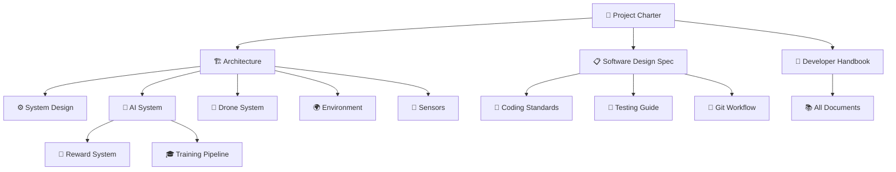

# ADRL-Rescue Documentation

> **Complete documentation suite for the ADRL-Rescue project.**

---

## Documentation Index

| # | Document | Description |
|:--|:---------|:------------|
| 00 | [Project Charter](00_PROJECT_CHARTER.md) | Master project document — vision, scope, architecture, rules |
| 01 | [Project Vision](01_PROJECT_VISION.md) | Goals, mission, and vision statement |
| 02 | [Project Architecture](02_PROJECT_ARCHITECTURE.md) | System architecture and component relationships |
| 03 | [System Design](03_SYSTEM_DESIGN.md) | Detailed system design and specifications |
| 04 | [Development Roadmap](04_DEVELOPMENT_ROADMAP.md) | Development phases and timeline |
| 05 | [Folder Structure](05_FOLDER_STRUCTURE.md) | Repository organization and file placement |
| 06 | [AI System](06_AI_SYSTEM.md) | AI/ML system design and PPO configuration |
| 07 | [Drone System](07_DRONE_SYSTEM.md) | Drone components, flight controller, sensors |
| 08 | [Environment System](08_ENVIRONMENT_SYSTEM.md) | Procedural generation and disaster types |
| 09 | [Sensor System](09_SENSOR_SYSTEM.md) | Sensor specifications and implementations |
| 10 | [Reward System](10_REWARD_SYSTEM.md) | Reward function design and shaping |
| 11 | [Training Pipeline](11_TRAINING_PIPELINE.md) | Training workflow and procedures |
| 12 | [Data Flow](12_DATA_FLOW.md) | Data flow diagrams and system communication |
| 13 | [Coding Standards](13_CODING_STANDARDS.md) | C# conventions and coding guidelines |
| 14 | [GitHub Workflow](14_GITHUB_WORKFLOW.md) | Git workflow and PR process |
| 15 | [Testing Guide](15_TESTING_GUIDE.md) | Testing strategies and procedures |
| 16 | [Future Scope](16_FUTURE_SCOPE.md) | Future features and roadmap |
| 17 | [Software Design Specification](17_SOFTWARE_DESIGN_SPECIFICATION.md) | Implementation blueprint for all C# scripts |
| 18 | [Developer Handbook](18_DEVELOPER_HANDBOOK.md) | Practical guide for developers |
| — | [Project Glossary](PROJECT_GLOSSARY.md) | Terminology reference |
| — | [Roadmap Source](ROADMAP_SOURCE.md) | Original roadmap source document |

---

## Quick Links

| Resource | Link |
|:---------|:-----|
| **README** | [Project Home](../README.md) |
| **Contributing** | [CONTRIBUTING.md](../CONTRIBUTING.md) |
| **Changelog** | [CHANGELOG.md](../CHANGELOG.md) |
| **License** | [LICENSE](../LICENSE) |
| **Citation** | [CITATION.cff](../CITATION.cff) |

---

## Document Relationships

---

*This documentation index is maintained as part of the ADRL-Rescue project.*
