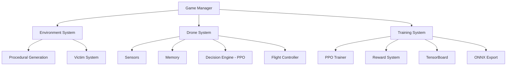
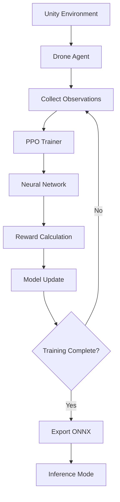

# ADRL-Rescue

### Autonomous Disaster Response Drone using Reinforcement Learning

[](https://opensource.org/licenses/MIT)
[](https://unity.com/)
[](https://github.com/Unity-Technologies/ml-agents)
[](https://www.python.org/)
[](https://github.com/NihaalGharat/ADRL-Rescue/releases)

---

## Project Vision

> **"The drone should not be programmed to rescue people. It should learn how to rescue people."**

ADRL-Rescue is an AI research project that develops an autonomous drone capable of performing **Search & Rescue (SAR) operations** inside procedurally generated disaster environments.

The drone learns its behavior entirely through **Reinforcement Learning (PPO)** — no hardcoded paths, no scripted responses. The AI discovers optimal strategies through trial and error in simulated environments.

---

## Project Status

🚧 **Version v0.2.0 — Unity Foundation**

ADRL-Rescue is currently in active development.

Version v0.2.0 implements the core framework, resource management, drone framework, environment framework, procedural generation, and scenario systems.

**Sensors, AI, ML-Agents, and training begin in Phase 7.**

| Milestone | Status |
|:----------|:-------|
| Repository Foundation | ✅ Complete |
| Core Framework | ✅ Complete (Bootstrap, Config, Events, Services) |
| Resource Management | ✅ Complete (Registries, Validation, AssetProvider) |
| Drone Framework | ✅ Complete (Controller, Motor, Health, Energy) |
| Environment Framework | ✅ Complete (Hazards, Obstacles, Victims, Scenarios) |
| Procedural Generation | ✅ Complete (3 rule types, placement utility) |
| Sensor Implementation | 🔲 Pending (Phase 7) |
| ML-Agents / AI | 🔲 Pending (Phase 7) |
| Training Pipeline | 🔲 Pending (Phase 7) |
| UI / Polish | 🔲 Pending (Phase 7) |
| Stable Release | 🔲 Pending (v1.0.0) |

---

## Key Features

| Feature | Description |
|---------|-------------|
| **Autonomous Navigation** | Drone navigates without pre-programmed paths |
| **Victim Detection** | Thermal and vision sensors locate survivors |
| **Obstacle Avoidance** | AI learns to safely maneuver around debris |
| **Procedural Generation** | Different environment every episode |
| **Multi-Disaster Support** | Works across earthquake, flood, landslide, and collapse scenarios |
| **Modular Architecture** | Each system is independent and replaceable |

---

## Architecture Overview



---

## Tech Stack

| Technology | Purpose |
|------------|---------|
| **Unity 2022.3 LTS** | Simulation engine |
| **C#** | Game logic and behavior |
| **Unity ML-Agents** | Reinforcement learning framework |
| **Python** | Model training |
| **PPO** | Learning algorithm |
| **ONNX** | Trained model format |
| **TensorBoard** | Training visualization |

---

## Repository Structure

```
ADRL-Rescue/
│
├── 📂 Assets/
│   ├── ADRL/
│   │   ├── Scripts/          # C# source code
│   │   │   ├── Core/         # Bootstrap, config, events, services, resources
│   │   │   ├── AI/           # Empty (Phase 7)
│   │   │   ├── Drone/        # Drone controller, motor, health, energy
│   │   │   ├── Environment/  # Hazards, obstacles, victims, procedural, scenarios
│   │   │   ├── Sensors/      # Empty (Phase 7)
│   │   │   ├── Training/     # Empty (Phase 7)
│   │   │   ├── Editor/       # Editor validators, menu items
│   │   │   └── UI/           # Empty (Phase 7)
│   │   ├── Prefabs/          # Empty (Phase 6+)
│   │   ├── Materials/        # Empty (Phase 6+)
│   │   ├── Scenes/           # Main.unity (starter)
│   │   ├── ScriptableObjects/# Config assets (Phase 6+)
│   │   └── Settings/         # Project settings
│   └── ProjectSettings/
│
├── 📂 Python/                # Training scripts
│   ├── configs/              # Training configurations
│   ├── scripts/              # Python scripts
│   ├── results/              # Training results
│   ├── logs/                 # TensorBoard logs
│   └── models/               # Exported ONNX models
│
├── 📂 Documentation/         # Project documentation
│   ├── 00_PROJECT_CHARTER.md
│   ├── 01_PROJECT_VISION.md
│   ├── ... (20 documentation files)
│   └── README.md             # Documentation index
│
├── 📂 Assets/                # Static assets
├── 📂 Media/                 # Screenshots, videos
├── 📂 Research/              # Papers, notes
│
├── 📄 README.md              # This file
├── 📄 CHANGELOG.md           # Version history
├── 📄 CONTRIBUTING.md        # Contribution guidelines
├── 📄 CODE_OF_CONDUCT.md     # Community standards
├── 📄 SECURITY.md            # Security policy
├── 📄 LICENSE                # MIT License
└── 📄 CITATION.cff           # Citation metadata
```

---

## Documentation

### Core Documents

| Document | Description |
|----------|-------------|
| [Project Charter](Documentation/00_PROJECT_CHARTER.md) | Master project document — vision, scope, architecture, rules |
| [Software Design Specification](Documentation/17_SOFTWARE_DESIGN_SPECIFICATION.md) | Implementation blueprint for all C# scripts |
| [Developer Handbook](Documentation/18_DEVELOPER_HANDBOOK.md) | Practical guide for developers |

### System Documentation

| Document | Description |
|----------|-------------|
| [Project Vision](Documentation/01_PROJECT_VISION.md) | Goals and vision |
| [Architecture](Documentation/02_PROJECT_ARCHITECTURE.md) | System architecture |
| [System Design](Documentation/03_SYSTEM_DESIGN.md) | Detailed design |
| [AI System](Documentation/06_AI_SYSTEM.md) | AI/ML details |
| [Drone System](Documentation/07_DRONE_SYSTEM.md) | Drone components |
| [Environment System](Documentation/08_ENVIRONMENT_SYSTEM.md) | Environment generation |
| [Sensor System](Documentation/09_SENSOR_SYSTEM.md) | Sensor specifications |
| [Reward System](Documentation/10_REWARD_SYSTEM.md) | Reward function |
| [Data Flow](Documentation/12_DATA_FLOW.md) | Data flow diagrams |

### Development Documents

| Document | Description |
|----------|-------------|
| [Development Roadmap](Documentation/04_DEVELOPMENT_ROADMAP.md) | Development timeline |
| [Folder Structure](Documentation/05_FOLDER_STRUCTURE.md) | Repository organization |
| [Coding Standards](Documentation/13_CODING_STANDARDS.md) | Coding conventions |
| [GitHub Workflow](Documentation/14_GITHUB_WORKFLOW.md) | Git workflow |
| [Testing Guide](Documentation/15_TESTING_GUIDE.md) | Testing procedures |
| [Training Pipeline](Documentation/11_TRAINING_PIPELINE.md) | Training workflow |
| [Future Scope](Documentation/16_FUTURE_SCOPE.md) | Future features |
| [Glossary](Documentation/PROJECT_GLOSSARY.md) | Terminology reference |

> See [Documentation/README.md](Documentation/README.md) for the complete documentation index.

---

## Getting Started

### Prerequisites

- Unity 2022.3 LTS or later
- Python 3.8 or later
- Git

### Installation

1. **Clone the repository**
   ```bash
   git clone https://github.com/NihaalGharat/ADRL-Rescue.git
   cd ADRL-Rescue
   ```

2. **Open Unity Project**
   - Open Unity Hub
   - Click "Open" → Navigate to the repository root (contains `Assets/`)
   - Select Unity 2022.3 LTS

3. **Install ML-Agents (Phase 7)**
   - ML-Agents is not yet installed. When Phase 7 begins:
   - Open Window → Package Manager
   - Click "+" → "Add package from git URL"
   - Enter: `com.unity.ml-agents`

4. **Install Python Dependencies**
   ```bash
   cd Python
   pip install -r requirements.txt
   ```

---

## Training Pipeline



---

## Disaster Environments

| Environment | Characteristics |
|-------------|-----------------|
| **Earthquake** | Cracked terrain, collapsed buildings, debris |
| **Flood** | Water bodies, floating debris, limited altitude |
| **Landslide** | Steep slopes, rockfall, narrow passages |
| **Building Collapse** | Urban rubble, structural damage, confined spaces |

---

## Development Roadmap

| Phase | Version | Description | Status |
|-------|---------|-------------|--------|
| Foundation | v0.1.0 | Repository architecture and documentation | ✅ Complete |
| Unity Foundation | v0.2.0 | Core managers, drone physics, basic flight | 🔲 Pending |
| Sensors & AI | v0.3.0 | Sensor implementations, ML-Agents integration | 🔲 Pending |
| Environment | v0.4.0 | Procedural generation, disaster types | 🔲 Pending |
| Training | v0.5.0 | Reward system, PPO training pipeline | 🔲 Pending |
| Polish | v0.6.0 | UI, performance, final documentation | 🔲 Pending |
| Release | v1.0.0 | Full stable release | 🔲 Pending |

---

## Future Scope

- Multi-Agent Swarm Intelligence
- Battery Simulation
- Weather & Wind Physics
- Computer Vision (YOLO)
- Google Maps Terrain Integration
- ROS Compatibility
- Real Drone Deployment

See [Future Scope](Documentation/16_FUTURE_SCOPE.md) for details.

---

## Screenshots

> Screenshots and videos will be added as development progresses.

<!-- 


-->

---

## Contributing

Contributions are welcome! Please read the [Contributing Guidelines](CONTRIBUTING.md) before submitting a pull request.

---

## License

This project is licensed under the MIT License - see the [LICENSE](LICENSE) file for details.

---

## Citation

If you use this project in your research, please cite:

```bibtex
@software{gharat2026adrl,
  author = {Nihaal Gharat and Bhavya Damani},
  title = {ADRL-Rescue: Autonomous Disaster Response Drone using Reinforcement Learning},
  year = {2026},
  version = {0.1.0},
  url = {https://github.com/NihaalGharat/ADRL-Rescue}
}
```

---

## Acknowledgements

- [Unity ML-Agents](https://github.com/Unity-Technologies/ml-agents) - RL framework
- [Unity Technologies](https://unity.com/) - Game engine
- [OpenAI](https://openai.com/) - PPO algorithm research

---

## Authors

| Name | Role | GitHub |
|:-----|:-----|:-------|
| **Nihaal Gharat** | Project Founder & Lead Software Architect | [NihaalGharat](https://github.com/NihaalGharat) |
| **Bhavya Damani** | Co-Developer & Unity Developer | [Bhavya031205](https://github.com/Bhavya031205) |

---

## Contact

**Nihaal Gharat** — Project Founder
- GitHub: [NihaalGharat](https://github.com/NihaalGharat)
- Project: [ADRL-Rescue](https://github.com/NihaalGharat/ADRL-Rescue)

**Bhavya Damani** — Co-Developer
- GitHub: [Bhavya031205](https://github.com/Bhavya031205)

---

*Built with passion for AI and disaster response.*
