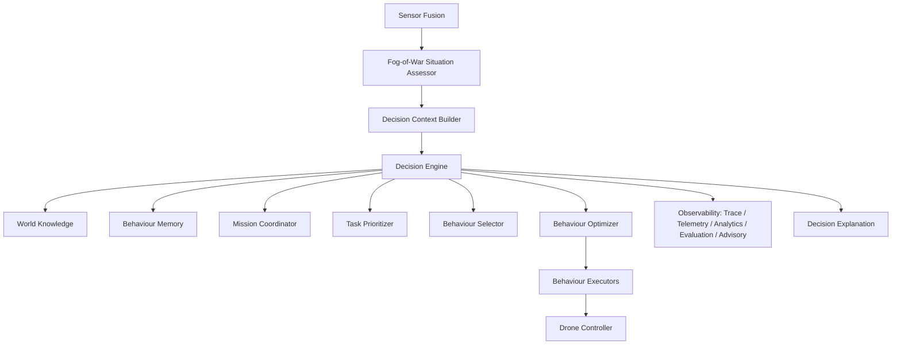
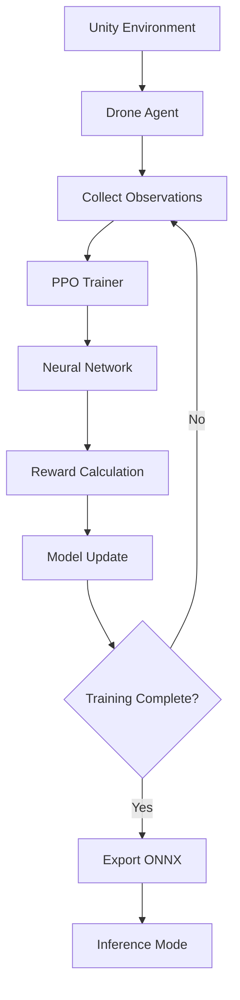

# ADRL-Rescue

### Autonomous Disaster Response Drone Simulation & Decision Framework

[](https://opensource.org/licenses/MIT)
[](https://unity.com/)
[](https://github.com/Unity-Technologies/ml-agents)
[](https://www.python.org/)
[](https://github.com/NihaalGharat/ADRL-Rescue/releases)

---

## Project Vision

> **"The drone should not be programmed to rescue people. It should learn how to rescue people."**

ADRL-Rescue is an AI research project that develops an autonomous drone capable of performing **Search & Rescue (SAR) operations** inside procedurally generated disaster environments.

**Current implementation (v1.0.0):** the drone operates through a deterministic, rule-based **autonomous decision engine** — an explicit pipeline of situation assessment, behaviour memory, mission coordination, task prioritization, behaviour selection, execution, and self-diagnostics (telemetry, analytics, quality evaluation, advisory). Behavior is *not* learned at runtime; it is produced by a fully deterministic, testable decision framework. There are no hardcoded flight paths — decisions are computed from live sensor fusion, world knowledge, and mission state.

**Future work / research direction:** Reinforcement Learning (PPO) is the intended *learning* layer that will eventually train the decision policies. The ML-Agents integration surface exists (agent base classes, action resolver, reward evaluator), but **no PPO model is trained or wired into runtime yet** — see [Project Status](#project-status) and [Development Roadmap](#development-roadmap).

---

## Project Status

✅ **Version v1.0.0 — Autonomous Decision Framework Release**

ADRL-Rescue v1.0.0 is the first stable release of the autonomous decision framework. Runtime behavior is produced by the deterministic **Decision Engine** — the single runtime decision authority — layered with knowledge, mission, behaviour, optimization, execution, explainability, trace, telemetry, analytics, quality evaluation, and advisory subsystems.

| Milestone | Status |
|:----------|:-------|
| Repository Foundation | ✅ Complete |
| Core Framework | ✅ Complete (Bootstrap, Config, Events, Services) |
| Resource Management | ✅ Complete (Registries, Validation, AssetProvider) |
| Drone Framework | ✅ Complete (Controller, Motor, Health, Energy) |
| Environment Framework | ✅ Complete (Hazards, Obstacles, Victims, Scenarios) |
| Procedural Generation | ✅ Complete (heightmap algorithms, placement rules) |
| Runtime Framework | ✅ Complete (Spawn, Lifecycle, Pooling, Diagnostics, Validation, Persistence) |
| Sensor Implementation | ✅ Complete (Ray, Thermal, Fusion) |
| ML-Agents / AI | ✅ Complete (Agent base classes, Action Resolver, Reward Evaluator) |
| Reward System | ✅ Complete (Event-driven evaluator, breakdown, config) |
| Autonomous Decision Framework | ✅ Complete (Phases 8.1–10.0: Decision, Context, Knowledge, Mission, Prioritization, Behaviour, Optimization, Execution, Explainability, Trace, Telemetry, Analytics, Evaluation, Advisory) |
| RL Training Pipeline (PPO) | 🔲 Future work |
| UI / Polish | 🔲 Pending |
| Multi-Agent Swarm | 🔲 Future work |

**Documentation Status:** ✅ In Sync with verified implementation (v1.0.0)

> **Note on "RL":** this release ships the deterministic decision engine described above. Reinforcement Learning with PPO is a **planned future phase** of this research platform, not part of v1.0.0. See [06_AI_SYSTEM.md](Documentation/06_AI_SYSTEM.md) and the [Development Roadmap](#development-roadmap).

---

## Key Features

| Feature | Description |
|---------|-------------|
| **Autonomous Decision Engine** | Deterministic, testable runtime decision authority — single owner of every decision |
| **Situation Assessment** | Fog-of-war assessor fuses live sensor data into an immutable per-step situation snapshot |
| **Behaviour Memory** | Short-term continuity-based behaviour selection |
| **Mission Coordination** | Task coordinator with deterministic transition rules |
| **Task Prioritization** | Objective arbitration with deterministic priority scoring |
| **Behaviour Execution** | Factory-based executors translate decisions into drone commands |
| **Victim Detection** | Thermal and ray sensors locate survivors |
| **Obstacle Avoidance** | Decision engine selects avoidance behaviour from live hazard data |
| **Procedural Generation** | Different environment every episode |
| **Self-Diagnostics** | Trace, telemetry, analytics, quality evaluation, and operator advisory |
| **Multi-Disaster Support** | Works across earthquake, flood, landslide, and collapse scenarios |
| **Modular Architecture** | Each system is independent and replaceable |

---

## Architecture Overview


```mermaid
graph TD
    A[Sensor Fusion] --> B[Fog-of-War Situation Assessor]
    B --> C[Decision Context Builder]
    C --> D[Decision Engine]
    D --> D1[World Knowledge]
    D --> D2[Behaviour Memory]
    D --> D3[Mission Coordinator]
    D --> D4[Task Prioritizer]
    D --> D5[Behaviour Selector]
    D --> D6[Behaviour Optimizer]
    D6 --> E[Behaviour Executors]
    E --> F[Drone Controller]
    D --> G[Observability: Trace / Telemetry / Analytics / Evaluation / Advisory]
    D --> H[Decision Explanation]
```

> The **Decision Engine** (`ADRL.AI.Decision`) is the single runtime decision authority. It is deterministic, immutable-snapshot based, and fully unit-tested (321 EditMode tests). Reinforcement-Learning training (PPO) is a future research phase layered on top of this framework.

---

## Tech Stack

| Technology | Purpose |
|------------|---------|
| **Unity 2022.3 LTS** | Simulation engine |
| **C#** | Game logic and behavior |
| **Unity ML-Agents** | RL framework (integration surface present; training not yet wired) |
| **Python** | Model training *(future work)* |
| **PPO** | Learning algorithm *(future work)* |
| **ONNX** | Trained model format *(future work)* |
| **TensorBoard** | Training visualization *(future work)* |

---

## Repository Structure

```
ADRL-Rescue/
│
├── 📂 Assets/
│   ├── ADRL/
│   │   ├── Scripts/          # C# source code
│   │   │   ├── Core/         # Bootstrap, config, events, services, resources
│   │   │   ├── AI/           # Decision framework, agents, interaction, rewards
│   │   │   │   └── Decision/ # Decision Engine + Knowledge, Mission, Behaviour, Optimization,
│   │   │   │                  #   Execution, Context, Explainability, Trace, Telemetry,
│   │   │   │                  #   Analytics, Evaluation, Advisory (Phases 8.1–10.0)
│   │   │   ├── Drone/        # Controllers, components, core subsystem, events, interfaces, utilities
│   │   │   ├── Environment/  # Hazards, obstacles, victims, procedural, terrain, scenarios, spawning
│   │   │   ├── Sensors/      # Raycasting, detection, fusion, interfaces
│   │   │   ├── Training/     # Runtime orchestration, smoke test
│   │   │   ├── Editor/       # Editor validators, batch smoke test runner, config asset generator
│   │   │   └── UI/           # Empty (reserved)
│   │   ├── Prefabs/          # Resources/Prefabs hold the Drone prefab; category folders reserved
│   │   ├── Scenes/           # Main.unity (starter scene, registered in Build Settings)
│   │   ├── ScriptableObjects/# Config assets (Configurations, Drone, Environment, Rewards, Sensors)
│   │   └── Tests/            # EditMode test assembly (ADRL.Tests.Editor)
│   └── ProjectSettings/
│
├── 📂 Python/                # Training scripts
│   ├── configs/              # Training configurations
│   ├── scripts/              # Python scripts
│   ├── results/              # Training results
│   ├── logs/                 # TensorBoard logs
│   └── models/               # Exported ONNX models
│
├── 📂 Documentation/         # Project documentation
│   ├── 00_PROJECT_CHARTER.md
│   ├── 01_PROJECT_VISION.md
│   ├── ... (23 documentation files)
│   └── README.md             # Documentation index
│
├── 📂 Assets/                # Static assets
├── 📂 Media/                 # Screenshots, videos
├── 📂 Research/              # Papers, notes
│
├── 📄 README.md              # This file
├── 📄 CHANGELOG.md           # Version history
├── 📄 CONTRIBUTING.md        # Contribution guidelines
├── 📄 CODE_OF_CONDUCT.md     # Community standards
├── 📄 SECURITY.md            # Security policy
├── 📄 LICENSE                # MIT License
└── 📄 CITATION.cff           # Citation metadata
```

---

## Documentation

### Core Documents

| Document | Description |
|----------|-------------|
| [Project Charter](Documentation/00_PROJECT_CHARTER.md) | Master project document — vision, scope, architecture, rules |
| [Software Design Specification](Documentation/17_SOFTWARE_DESIGN_SPECIFICATION.md) | Implementation blueprint for all C# scripts |
| [Developer Handbook](Documentation/18_DEVELOPER_HANDBOOK.md) | Practical guide for developers |

### System Documentation

| Document | Description |
|----------|-------------|
| [Project Vision](Documentation/01_PROJECT_VISION.md) | Goals and vision |
| [Architecture](Documentation/02_PROJECT_ARCHITECTURE.md) | System architecture |
| [System Design](Documentation/03_SYSTEM_DESIGN.md) | Detailed design |
| [AI System](Documentation/06_AI_SYSTEM.md) | AI/ML details |
| [Drone System](Documentation/07_DRONE_SYSTEM.md) | Drone components |
| [Environment System](Documentation/08_ENVIRONMENT_SYSTEM.md) | Environment generation |
| [Sensor System](Documentation/09_SENSOR_SYSTEM.md) | Sensor specifications |
| [Reward System](Documentation/10_REWARD_SYSTEM.md) | Reward function |
| [Decision Framework](Documentation/19_DECISION_FRAMEWORK.md) | Autonomous decision engine architecture (canonical) |
| [Data Flow](Documentation/12_DATA_FLOW.md) | Data flow diagrams |

### Development Documents

| Document | Description |
|----------|-------------|
| [Development Roadmap](Documentation/04_DEVELOPMENT_ROADMAP.md) | Development timeline |
| [Folder Structure](Documentation/05_FOLDER_STRUCTURE.md) | Repository organization |
| [Coding Standards](Documentation/13_CODING_STANDARDS.md) | Coding conventions |
| [GitHub Workflow](Documentation/14_GITHUB_WORKFLOW.md) | Git workflow |
| [Testing Guide](Documentation/15_TESTING_GUIDE.md) | Testing procedures |
| [Training Pipeline](Documentation/11_TRAINING_PIPELINE.md) | Training workflow |
| [Future Scope](Documentation/16_FUTURE_SCOPE.md) | Future features |
| [Glossary](Documentation/PROJECT_GLOSSARY.md) | Terminology reference |

> See [Documentation/README.md](Documentation/README.md) for the complete documentation index.

---

## Getting Started

### Prerequisites

- Unity 2022.3 LTS or later
- Python 3.8 or later
- Git

### Installation

1. **Clone the repository**
   ```bash
   git clone https://github.com/NihaalGharat/ADRL-Rescue.git
   cd ADRL-Rescue
   ```

2. **Open Unity Project**
   - Open Unity Hub
   - Click "Open" → Navigate to the repository root (contains `Assets/`)
   - Select Unity 2022.3 LTS

3. **ML-Agents**
   - ML-Agents **2.0.2** is installed via `Packages/manifest.json` (with Barracuda 3.0.0).
   - No manual package installation is required.

4. **Python (Training Pipeline — pending)**
   No Python setup is required at this time. The `Python/` directory currently contains placeholder folders only (`configs/`, `scripts/`, `results/`, `logs/`, `models/`); the training scripts and any `requirements.txt` will be added with the Training Pipeline phase (see [Development Roadmap](Documentation/04_DEVELOPMENT_ROADMAP.md)).

---

## RL Training Pipeline — Future Work

The following Reinforcement Learning (PPO) pipeline is the **planned research direction** for v1.1+. It is **not implemented** in v1.0.0: runtime decisions are produced by the deterministic Decision Engine, not by a trained policy.


```mermaid
graph TD
    A[Unity Environment] --> B[Drone Agent]
    B --> C[Collect Observations]
    C --> D[PPO Trainer]
    D --> E[Neural Network]
    E --> F[Reward Calculation]
    F --> G[Model Update]
    G --> H{Training Complete?}
    H -->|No| C
    H -->|Yes| I[Export ONNX]
    I --> J[Inference Mode]
```

> The reward system (`RewardEvaluator`, `RewardBreakdown`, `IRewardSink`) is **already implemented and tested** (v0.8.1). Training the policies with PPO, and selecting behaviours via trained policies instead of the deterministic selector, is future work — see [11_TRAINING_PIPELINE.md](Documentation/11_TRAINING_PIPELINE.md) and [16_FUTURE_SCOPE.md](Documentation/16_FUTURE_SCOPE.md).

---

## Disaster Environments

| Environment | Characteristics |
|-------------|-----------------|
| **Earthquake** | Cracked terrain, collapsed buildings, debris |
| **Flood** | Water bodies, floating debris, limited altitude |
| **Landslide** | Steep slopes, rockfall, narrow passages |
| **Building Collapse** | Urban rubble, structural damage, confined spaces |

---

## Development Roadmap

| Phase | Version | Description | Status |
|-------|---------|-------------|--------|
| Foundation | v0.1.0 | Repository architecture and documentation | ✅ Complete |
| Unity Foundation | v0.2.0 | Core framework, resource management, drone framework | ✅ Complete |
| Environment | v0.3.0 | Environment framework, terrain generation, procedural rules | ✅ Complete |
| Runtime Framework | v0.4.0–v0.7.0 | Drone spawning, lifecycle, persistence, object pooling, diagnostics | ✅ Complete |
| Sensors & AI | v0.8.0 | Sensor implementations, ML-Agents integration surface | ✅ Complete (Phase 7) |
| Reward System | v0.8.1 | Event-driven reward evaluator, breakdown, config | ✅ Complete (Phase 7.3) |
| Autonomous Decision | v0.8.2–v0.15.0 | Decision engine + context, knowledge, mission, behaviour, optimization, execution, explainability, trace, telemetry, analytics, evaluation (Phases 8.1–9.5) | ✅ Complete |
| Decision Advisory | v1.0.0 | Autonomous decision advisory layer (Phase 10.0) — first stable release | ✅ Complete |
| RL Training (PPO) | v1.1.0 | PPO training pipeline | 🔲 Future work |
| Multi-Agent / Polish | — | Swarm, UI | 🔲 Future work |

See the [full version roadmap](Documentation/04_DEVELOPMENT_ROADMAP.md#version-milestones).

---

## Future Scope

- Multi-Agent Swarm Intelligence
- Battery Simulation
- Weather & Wind Physics
- Computer Vision (YOLO)
- Google Maps Terrain Integration
- ROS Compatibility
- Real Drone Deployment

See [Future Scope](Documentation/16_FUTURE_SCOPE.md) for details.

---

## Screenshots

> Screenshots and videos will be added as development progresses.

<!-- 


-->

---

## Contributing

Contributions are welcome! Please read the [Contributing Guidelines](CONTRIBUTING.md) before submitting a pull request.

---

## License

This project is licensed under the MIT License - see the [LICENSE](LICENSE) file for details.

---

## Citation

If you use this project in your research, please cite:

```bibtex
@software{gharat2026adrl,
  author = {Nihaal Gharat and Bhavya Damani},
  title = {ADRL-Rescue: Autonomous Disaster Response Drone using Reinforcement Learning},
  year = {2026},
  version = {1.0.0},
  url = {https://github.com/NihaalGharat/ADRL-Rescue}
}
```

---

## Acknowledgements

- [Unity ML-Agents](https://github.com/Unity-Technologies/ml-agents) - RL framework
- [Unity Technologies](https://unity.com/) - Game engine
- [OpenAI](https://openai.com/) - PPO algorithm research

---

## Authors

| Name | Role | GitHub |
|:-----|:-----|:-------|
| **Nihaal Gharat** | Project Founder & Lead Software Architect | [NihaalGharat](https://github.com/NihaalGharat) |
| **Bhavya Damani** | Co-Developer & Unity Developer | [Bhavya031205](https://github.com/Bhavya031205) |

---

## Contact

**Nihaal Gharat** — Project Founder
- GitHub: [NihaalGharat](https://github.com/NihaalGharat)
- Project: [ADRL-Rescue](https://github.com/NihaalGharat/ADRL-Rescue)

**Bhavya Damani** — Co-Developer
- GitHub: [Bhavya031205](https://github.com/Bhavya031205)

---

*Built with passion for AI and disaster response.*
